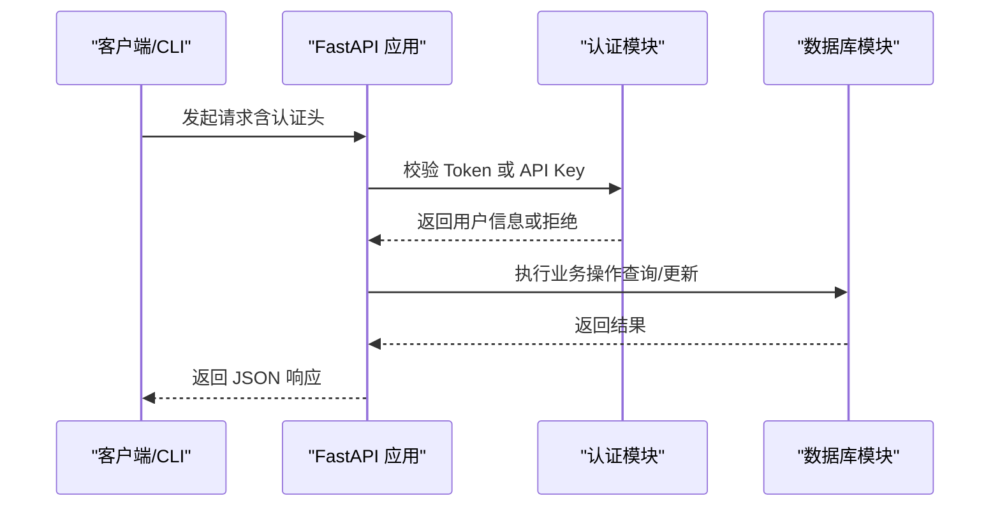
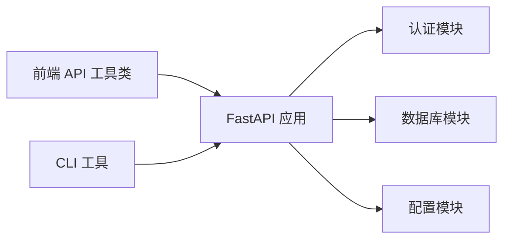

# API 参考文档

<cite>
**本文档引用的文件**
- [backend/main.py](file://backend/main.py)
- [backend/admin/auth.py](file://backend/admin/auth.py)
- [backend/admin/db.py](file://backend/admin/db.py)
- [backend/config.py](file://backend/config.py)
- [frontend/src/utils/api.js](file://frontend/src/utils/api.js)
- [frontend/src/views/Downloads.vue](file://frontend/src/views/Downloads.vue)
- [frontend/src/views/FilesManager.vue](file://frontend/src/views/FilesManager.vue)
- [cli/bosco.py](file://cli/bosco.py)
- [BoscoTsang.toml](file://BoscoTsang.toml)
</cite>

## 目录
1. [简介](#简介)
2. [项目结构](#项目结构)
3. [核心组件](#核心组件)
4. [架构概览](#架构概览)
5. [详细组件分析](#详细组件分析)
6. [依赖分析](#依赖分析)
7. [性能考虑](#性能考虑)
8. [故障排除指南](#故障排除指南)
9. [结论](#结论)
10. [附录](#附录)

## 简介
本文件为 BoscoTsang 项目的 API 参考文档，覆盖所有 RESTful 接口的 HTTP 方法、URL 模式、请求参数与响应格式；说明认证方式（JWT Bearer Token 与 API Key），并提供错误码与状态码说明。文档同时包含下载相关接口、用户管理接口、订阅管理接口与文件管理接口的使用示例、SDK 开发指南与客户端集成方法，并涵盖 API 版本管理、速率限制与安全考虑。

## 项目结构
后端基于 FastAPI 构建，采用模块化设计：
- 主应用入口负责路由注册、中间件与生命周期管理
- 认证模块支持 Bearer Token 与 API Key 两种认证方式
- 数据库模块封装 SQLite 存储，提供用户、下载任务、历史、订阅、API Key、统计等表操作
- 配置模块负责读取与应用配置（如代理设置）
- 前端通过统一的 API 工具类调用后端接口
- CLI 提供命令行工具，便于自动化与脚本集成

```mermaid
graph TB
subgraph "后端"
FastAPI["FastAPI 应用<br/>路由与中间件"]
Auth["认证模块<br/>Token/Key 管理"]
DB["数据库模块<br/>SQLite 操作"]
Config["配置模块<br/>代理与设置"]
end
subgraph "前端"
APIJS["API 工具类<br/>/frontend/src/utils/api.js"]
Views["视图组件<br/>Downloads.vue / FilesManager.vue"]
end
subgraph "CLI"
CLI["命令行工具<br/>/cli/bosco.py"]
end
APIJS --> FastAPI
Views --> APIJS
CLI --> FastAPI
FastAPI --> Auth
FastAPI --> DB
FastAPI --> Config
```

**图表来源**
- [backend/main.py:133-146](file://backend/main.py#L133-L146)
- [backend/admin/auth.py:16-61](file://backend/admin/auth.py#L16-L61)
- [backend/admin/db.py:29-213](file://backend/admin/db.py#L29-L213)
- [backend/config.py:29-134](file://backend/config.py#L29-L134)
- [frontend/src/utils/api.js:5-35](file://frontend/src/utils/api.js#L5-L35)
- [cli/bosco.py:14-41](file://cli/bosco.py#L14-L41)

**章节来源**
- [backend/main.py:133-146](file://backend/main.py#L133-L146)
- [backend/admin/auth.py:16-61](file://backend/admin/auth.py#L16-L61)
- [backend/admin/db.py:29-213](file://backend/admin/db.py#L29-L213)
- [backend/config.py:29-134](file://backend/config.py#L29-L134)
- [frontend/src/utils/api.js:5-35](file://frontend/src/utils/api.js#L5-L35)
- [cli/bosco.py:14-41](file://cli/bosco.py#L14-L41)

## 核心组件
- 认证与授权
  - 支持 Bearer Token 与 X-API-Key 头部认证
  - require_auth 与 require_admin 装饰器自动校验权限
- 数据持久化
  - SQLite 表结构覆盖用户、下载任务/历史、订阅、API Key、统计、设置、Telegram 绑定等
- 配置管理
  - 通过 BoscoTsang.toml 控制代理模式与下载目录等运行时选项
- 前端与 CLI
  - 统一的 API 工具类封装请求与错误处理
  - CLI 提供登录、下载、历史、订阅、监控与日志查看等命令

**章节来源**
- [backend/admin/auth.py:110-168](file://backend/admin/auth.py#L110-L168)
- [backend/admin/db.py:34-213](file://backend/admin/db.py#L34-L213)
- [backend/config.py:29-134](file://backend/config.py#L29-L134)
- [frontend/src/utils/api.js:37-273](file://frontend/src/utils/api.js#L37-L273)
- [cli/bosco.py:43-327](file://cli/bosco.py#L43-L327)

## 架构概览
下图展示客户端（浏览器/CLI）与后端服务之间的交互流程，以及认证与数据库层的关系。



**图表来源**
- [backend/main.py:336-353](file://backend/main.py#L336-L353)
- [backend/admin/auth.py:27-61](file://backend/admin/auth.py#L27-L61)
- [backend/admin/db.py:217-271](file://backend/admin/db.py#L217-L271)

## 详细组件分析

### 认证与授权接口
- 登录
  - 方法与路径：POST /api/admin/login
  - 请求体：用户名与密码
  - 成功响应：返回 token、用户名、角色与头像
  - 失败响应：401 账户名或密码错误
- 注册
  - 方法与路径：POST /api/admin/register
  - 请求体：用户名、密码、邀请码（可选）
  - 成功响应：注册成功提示
  - 失败响应：400 邀请码无效
- 获取当前用户
  - 方法与路径：GET /api/admin/me
  - 认证：Bearer Token 或 X-API-Key
  - 成功响应：用户信息
  - 失败响应：404 用户不存在
- 修改密码
  - 方法与路径：POST /api/admin/password
  - 请求体：旧密码、新密码
  - 成功响应：密码修改成功
  - 失败响应：400 当前密码错误
- 上传头像
  - 方法与路径：POST /api/admin/avatar
  - 请求体：multipart/form-data，字段 avatar
  - 成功响应：成功标记
  - 失败响应：400/500 文件读取或格式错误

- Telegram 登录相关
  - 获取登录 URL：GET /api/admin/telegram/login-url
  - Telegram 登录：POST /api/admin/telegram/login
  - 绑定账号：POST /api/admin/telegram/bind

认证方式说明
- Bearer Token：Authorization: Bearer <token>
- API Key：X-API-Key: <key>
- 也可通过查询参数 token=<key_or_token>（不推荐）

**章节来源**
- [backend/main.py:336-353](file://backend/main.py#L336-L353)
- [backend/main.py:355-361](file://backend/main.py#L355-L361)
- [backend/main.py:363-371](file://backend/main.py#L363-L371)
- [backend/main.py:373-381](file://backend/main.py#L373-L381)
- [backend/main.py:383-413](file://backend/main.py#L383-L413)
- [backend/main.py:417-432](file://backend/main.py#L417-L432)
- [backend/main.py:434-497](file://backend/main.py#L434-L497)
- [backend/main.py:499-531](file://backend/main.py#L499-L531)
- [backend/admin/auth.py:16-61](file://backend/admin/auth.py#L16-L61)

### 用户管理接口
- 获取用户列表
  - 方法与路径：GET /api/admin/users
  - 认证：管理员
  - 成功响应：用户数组
- 创建用户（管理员）
  - 方法与路径：POST /api/admin/users
  - 请求体：用户名、密码、角色、是否激活
  - 成功响应：成功标记
- 更新用户信息（管理员）
  - 方法与路径：PUT /api/admin/users/{user_id}
  - 请求体：角色、是否激活
  - 成功响应：成功标记
- 删除用户（管理员）
  - 方法与路径：DELETE /api/admin/users/{user_id}
  - 成功响应：成功标记
  - 特殊：禁止删除默认管理员

**章节来源**
- [backend/main.py:535-540](file://backend/main.py#L535-L540)
- [backend/main.py:542-549](file://backend/main.py#L542-L549)
- [backend/main.py:551-558](file://backend/main.py#L551-L558)
- [backend/main.py:560-569](file://backend/main.py#L560-L569)

### 邀请码接口
- 获取邀请码列表
  - 方法与路径：GET /api/admin/invite-codes
  - 认证：管理员
- 生成邀请码
  - 方法与路径：POST /api/admin/invite-codes
  - 认证：管理员

**章节来源**
- [backend/main.py:571-577](file://backend/main.py#L571-L577)
- [backend/main.py:579-586](file://backend/main.py#L579-L586)

### API 密钥接口
- 获取密钥列表
  - 方法与路径：GET /api/admin/api-keys
  - 认证：Bearer Token 或 X-API-Key
- 创建密钥
  - 方法与路径：POST /api/admin/api-keys
  - 请求体：备注、作用域、有效期（天）、每分钟速率限制
- 更新密钥状态
  - 方法与路径：PUT /api/admin/api-keys/{key_id}/status?status=active|disabled
- 更新密钥设置
  - 方法与路径：PUT /api/admin/api-keys/{key_id}
  - 请求体：备注、作用域、有效期、速率限制
- 删除密钥
  - 方法与路径：DELETE /api/admin/api-keys/{key_id}

API Key 验证逻辑
- 校验状态与过期时间
- 检查每分钟速率限制
- 更新使用统计与最近使用 IP

**章节来源**
- [backend/main.py:589-596](file://backend/main.py#L589-L596)
- [backend/main.py:598-611](file://backend/main.py#L598-L611)
- [backend/main.py:613-625](file://backend/main.py#L613-L625)
- [backend/main.py:627-650](file://backend/main.py#L627-L650)
- [backend/main.py:652-665](file://backend/main.py#L652-L665)
- [backend/admin/db.py:649-751](file://backend/admin/db.py#L649-L751)

### 下载相关接口
- 普通下载
  - 方法与路径：POST /api/download
  - 请求体：URL、质量（best/audio/mp3/m4a/1080p/720p/mp4/webm/image/jpg/png）
  - 成功响应：任务 ID、平台等
- 快速下载
  - 方法与路径：POST /api/quick-download
  - 请求体：URL、质量
- iOS 快捷指令下载
  - 方法与路径：POST /api/shortcuts/download
  - 请求体：URL、质量
- 下载任务列表
  - 方法与路径：GET /api/downloads?status=&platform=&resource_type=&search=&limit=&offset=
  - 认证：Bearer Token 或 X-API-Key
- 任务进度
  - 方法与路径：GET /api/progress/{task_id}
- 删除任务
  - 方法与路径：DELETE /api/tasks/{task_id}
- 重命名任务
  - 方法与路径：POST /api/tasks/{task_id}/rename
  - 请求体：新标题

下载流程与进度
- 后台使用 yt-dlp 执行下载，进度通过回调更新数据库
- 支持多种质量与后处理（如提取音频为 mp3/m4a）

**章节来源**
- [backend/main.py:981-1008](file://backend/main.py#L981-L1008)
- [backend/main.py:1009-1038](file://backend/main.py#L1009-L1038)
- [backend/main.py:1039-1075](file://backend/main.py#L1039-L1075)
- [backend/main.py:1076-1082](file://backend/main.py#L1076-L1082)
- [backend/main.py:1083-1102](file://backend/main.py#L1083-L1102)
- [backend/main.py:1103-1108](file://backend/main.py#L1103-L1108)
- [backend/main.py:170-188](file://backend/main.py#L170-L188)
- [backend/admin/db.py:359-483](file://backend/admin/db.py#L359-L483)

### 订阅管理接口
- 获取订阅列表
  - 方法与路径：GET /api/subscriptions?platform=&status=
  - 认证：Bearer Token 或 X-API-Key
- 添加订阅
  - 方法与路径：POST /api/subscriptions
  - 请求体：URL、平台、频道名、轮询间隔
- 更新订阅
  - 方法与路径：PUT /api/subscriptions/{sub_id}
  - 请求体：状态
- 删除订阅
  - 方法与路径：DELETE /api/subscriptions/{sub_id}

**章节来源**
- [backend/main.py:1110-1130](file://backend/main.py#L1110-L1130)
- [backend/main.py:1132-1148](file://backend/main.py#L1132-L1148)
- [backend/main.py:1150-1156](file://backend/main.py#L1150-L1156)
- [backend/main.py:1158-1164](file://backend/main.py#L1158-L1164)
- [backend/admin/db.py:544-626](file://backend/admin/db.py#L544-L626)

### 文件管理接口
- 文件列表
  - 方法与路径：GET /api/files
  - 认证：Bearer Token 或 X-API-Key
- 下载文件
  - 方法与路径：GET /api/files/{filename}?token=...
  - 认证：Authorization + token 查询参数
- 流式播放
  - 方法与路径：GET /api/files/stream/{filename}?token=...
  - 认证：Authorization + token 查询参数
- 删除文件
  - 方法与路径：DELETE /api/files/{filename}
- 重命名文件
  - 方法与路径：POST /api/files/rename
  - 请求体：旧文件名、新文件名

前端与 CLI 的调用示例
- 前端通过 api.js 统一封装请求与错误处理
- CLI 通过 requests 库调用登录与下载接口

**章节来源**
- [frontend/src/utils/api.js:108-148](file://frontend/src/utils/api.js#L108-L148)
- [frontend/src/views/FilesManager.vue:138-240](file://frontend/src/views/FilesManager.vue#L138-L240)
- [cli/bosco.py:43-100](file://cli/bosco.py#L43-L100)
- [cli/bosco.py:111-132](file://cli/bosco.py#L111-L132)

### 统计与设置接口
- 统计数据
  - 方法与路径：GET /api/statistics?days=30
  - 认证：Bearer Token 或 X-API-Key
- 设置
  - 方法与路径：GET /api/settings
  - 方法与路径：POST /api/settings
  - 认证：管理员（部分操作）

**章节来源**
- [frontend/src/utils/api.js:170-181](file://frontend/src/utils/api.js#L170-L181)
- [frontend/src/utils/api.js:175-205](file://frontend/src/utils/api.js#L175-L205)

### 错误码与状态码说明
- 通用错误响应
  - 字段：status、detail（或其他业务字段）
  - 示例：{"status":"error","detail":"账户名或密码错误"}
- 常见 HTTP 状态码
  - 200 OK：请求成功
  - 400 Bad Request：参数错误或业务失败
  - 401 Unauthorized：未认证或认证失败
  - 403 Forbidden：权限不足
  - 404 Not Found：资源不存在
  - 500 Internal Server Error：服务器内部错误

**章节来源**
- [backend/main.py:340-342](file://backend/main.py#L340-L342)
- [backend/main.py:377-381](file://backend/main.py#L377-L381)
- [backend/main.py:454-461](file://backend/main.py#L454-L461)
- [frontend/src/utils/api.js:24-34](file://frontend/src/utils/api.js#L24-L34)

### API 使用示例
- 前端调用示例
  - 登录：调用 /api/admin/login，保存 token 并在后续请求头中携带
  - 下载：调用 /api/download，传入 URL 与质量
  - 文件管理：调用 /api/files 列表、流式播放与下载
- CLI 调用示例
  - 登录：bosco login -u <username> -p <password>
  - 下载：bosco url <url> [-q best|1080p|720p|audio]
  - 历史：bosco his list [-n 20]
  - 订阅：bosco sub
  - 监控：bosco mon
  - 日志：bosco log [--date YYYY-MM-DD --level INFO|WARNING|ERROR -n 50]

**章节来源**
- [frontend/src/utils/api.js:37-65](file://frontend/src/utils/api.js#L37-L65)
- [frontend/src/utils/api.js:67-91](file://frontend/src/utils/api.js#L67-L91)
- [frontend/src/utils/api.js:108-148](file://frontend/src/utils/api.js#L108-L148)
- [cli/bosco.py:258-327](file://cli/bosco.py#L258-L327)

### SDK 开发指南与客户端集成
- 认证集成
  - 优先使用 X-API-Key 头部，其次 Authorization: Bearer
  - 通过 /api/admin/login 获取 token，或通过 /api/admin/api-keys 创建 API Key
- 请求封装
  - 统一在请求头中加入 Content-Type: application/json 与认证头
  - 对 403 做登出处理（移除本地 token）
- 错误处理
  - 捕获非 2xx 响应，解析 detail 字段作为用户可见错误消息
- 速率限制
  - API Key 支持每分钟速率限制配置，超出将被拒绝
- 代理与网络
  - 通过 BoscoTsang.toml 配置代理模式（global/none/auto）
  - auto 模式下对国内域名直连，国外域名使用代理

**章节来源**
- [backend/admin/auth.py:70-107](file://backend/admin/auth.py#L70-L107)
- [frontend/src/utils/api.js:7-13](file://frontend/src/utils/api.js#L7-L13)
- [frontend/src/utils/api.js:24-34](file://frontend/src/utils/api.js#L24-L34)
- [backend/admin/db.py:690-751](file://backend/admin/db.py#L690-L751)
- [backend/config.py:100-132](file://backend/config.py#L100-L132)
- [BoscoTsang.toml:4-28](file://BoscoTsang.toml#L4-L28)

## 依赖分析
- 组件耦合
  - FastAPI 应用依赖认证与数据库模块
  - 前端与 CLI 通过统一 API 与后端交互
- 外部依赖
  - FastAPI、yt-dlp、sqlite3、requests（CLI）
- 潜在循环依赖
  - 模块间通过导入关系解耦，未发现循环依赖



**图表来源**
- [backend/main.py:30-49](file://backend/main.py#L30-L49)
- [frontend/src/utils/api.js:5-35](file://frontend/src/utils/api.js#L5-L35)
- [cli/bosco.py:14-41](file://cli/bosco.py#L14-L41)

**章节来源**
- [backend/main.py:30-49](file://backend/main.py#L30-L49)
- [frontend/src/utils/api.js:5-35](file://frontend/src/utils/api.js#L5-L35)
- [cli/bosco.py:14-41](file://cli/bosco.py#L14-L41)

## 性能考虑
- 代理策略
  - auto 模式下对国内域名直连，减少不必要的代理开销
- 速率限制
  - API Key 支持每分钟请求限制，避免滥用
- 下载并发
  - 后台使用 yt-dlp 异步下载，进度通过回调更新数据库
- 前端轮询
  - 下载任务列表页面每 5 秒轮询一次，可根据实际需求调整频率

**章节来源**
- [backend/config.py:100-132](file://backend/config.py#L100-L132)
- [backend/admin/db.py:690-751](file://backend/admin/db.py#L690-L751)
- [frontend/src/views/Downloads.vue:251-258](file://frontend/src/views/Downloads.vue#L251-L258)

## 故障排除指南
- 认证失败
  - 检查 Authorization 头是否正确（Bearer 或 X-API-Key）
  - 确认 API Key 未过期且状态为 active
- 下载失败
  - 查看任务状态与错误信息
  - 检查代理配置与网络连通性
- 文件下载/播放异常
  - 确认 token 查询参数与 Authorization 头同时提供
  - 检查文件是否存在与权限

**章节来源**
- [backend/admin/auth.py:130-139](file://backend/admin/auth.py#L130-L139)
- [backend/admin/db.py:690-751](file://backend/admin/db.py#L690-L751)
- [frontend/src/utils/api.js:112-139](file://frontend/src/utils/api.js#L112-L139)

## 结论
本文档提供了 BoscoTsang 项目的完整 API 参考，涵盖认证、用户管理、下载、订阅、文件管理、统计与设置等接口。通过统一的认证方式与配置管理，系统支持多客户端集成与扩展。建议在生产环境中优先使用 API Key 并合理设置速率限制，结合代理配置优化网络性能。

## 附录
- API 版本管理
  - 应用版本在 FastAPI 应用中声明，可用于客户端兼容性检查
- 速率限制
  - API Key 支持每分钟请求限制配置，超出将被拒绝
- 安全建议
  - 使用 HTTPS 传输，避免明文泄露
  - 定期轮换 API Key，限制最小权限作用域
  - 对外暴露的 API Key 仅授予必要权限

**章节来源**
- [backend/main.py:133-138](file://backend/main.py#L133-L138)
- [backend/admin/db.py:690-751](file://backend/admin/db.py#L690-L751)