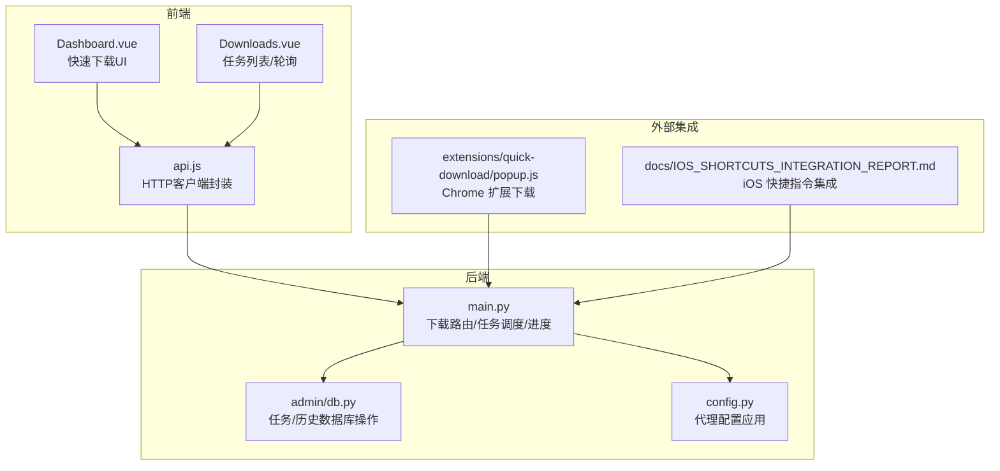
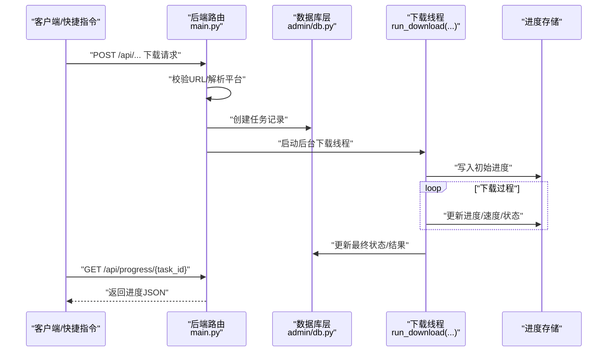
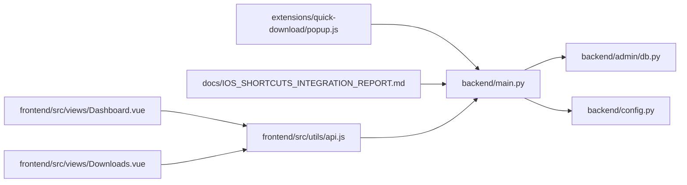

# 下载接口

<cite>
**本文引用的文件**
- [backend/main.py](file://backend/main.py)
- [backend/admin/db.py](file://backend/admin/db.py)
- [backend/config.py](file://backend/config.py)
- [BoscoTsang.toml](file://BoscoTsang.toml)
- [frontend/src/views/Dashboard.vue](file://frontend/src/views/Dashboard.vue)
- [frontend/src/views/Downloads.vue](file://frontend/src/views/Downloads.vue)
- [frontend/src/utils/api.js](file://frontend/src/utils/api.js)
- [extensions/quick-download/popup.js](file://extensions/quick-download/popup.js)
- [docs/IOS_SHORTCUTS_INTEGRATION_REPORT.md](file://docs/IOS_SHORTCUTS_INTEGRATION_REPORT.md)
- [USAGE_MANUAL.md](file://USAGE_MANUAL.md)
</cite>

## 目录
1. [简介](#简介)
2. [项目结构](#项目结构)
3. [核心组件](#核心组件)
4. [架构总览](#架构总览)
5. [详细组件分析](#详细组件分析)
6. [依赖关系分析](#依赖关系分析)
7. [性能与并发特性](#性能与并发特性)
8. [故障排除指南](#故障排除指南)
9. [结论](#结论)
10. [附录](#附录)

## 简介
本文件面向后端与前端开发者及运维人员，系统化梳理下载接口体系，覆盖单个下载、批量下载与快捷指令下载三类入口；明确支持平台、下载质量选项与进度跟踪机制；阐述任务管理、状态查询与进度回调处理流程；并提供平台检测逻辑、Cookies 配置与代理设置说明，以及完整的 API 示例与故障排除建议。

## 项目结构
围绕下载能力的关键模块分布如下：
- 后端主程序与路由：负责下载接口、任务调度、进度存储与数据库交互
- 数据库适配层：提供任务与历史记录的增删改查
- 前端视图与工具：提供快速下载 UI、任务列表与轮询刷新、文件管理等
- 快捷下载扩展与 iOS 快捷指令：提供外部触发下载的轻量通道
- 配置与部署文档：代理、Cookies、平台配置与常见问题

图表来源
- [backend/main.py](file://backend/main.py)
- [backend/admin/db.py](file://backend/admin/db.py)
- [backend/config.py](file://backend/config.py)
- [frontend/src/views/Dashboard.vue](file://frontend/src/views/Dashboard.vue)
- [frontend/src/views/Downloads.vue](file://frontend/src/views/Downloads.vue)
- [frontend/src/utils/api.js](file://frontend/src/utils/api.js)
- [extensions/quick-download/popup.js](file://extensions/quick-download/popup.js)
- [docs/IOS_SHORTCUTS_INTEGRATION_REPORT.md](file://docs/IOS_SHORTCUTS_INTEGRATION_REPORT.md)

章节来源
- [backend/main.py](file://backend/main.py)
- [backend/admin/db.py](file://backend/admin/db.py)
- [frontend/src/views/Dashboard.vue](file://frontend/src/views/Dashboard.vue)
- [frontend/src/views/Downloads.vue](file://frontend/src/views/Downloads.vue)
- [frontend/src/utils/api.js](file://frontend/src/utils/api.js)
- [extensions/quick-download/popup.js](file://extensions/quick-download/popup.js)
- [docs/IOS_SHORTCUTS_INTEGRATION_REPORT.md](file://docs/IOS_SHORTCUTS_INTEGRATION_REPORT.md)

## 核心组件
- 下载接口族
  - 单个下载：/api/download（鉴权）
  - 快速下载（浏览器扩展）：/api/quick-download（鉴权）
  - iOS 快捷指令：/api/shortcuts/download（API Key）
- 进度与任务管理
  - 进度查询：/api/progress/{task_id}
  - 任务列表：/api/downloads（支持过滤）
  - 历史记录：/api/history（分页）
  - 任务重命名：/api/rename（鉴权）
- 平台检测与 Cookies
  - 平台检测：detect_platform
  - Cookies 文件：按平台选择对应 cookies 文件
- 代理与配置
  - 应用级代理开关与模式：全局/禁用/自动
  - TOML 配置项：proxy.enabled、proxy.mode、proxy.http/https、bypass_cidrs

章节来源
- [backend/main.py](file://backend/main.py)
- [backend/admin/db.py](file://backend/admin/db.py)
- [BoscoTsang.toml](file://BoscoTsang.toml)
- [backend/config.py](file://backend/config.py)

## 架构总览
下图展示从浏览器/快捷指令到后端的任务创建、异步执行与进度反馈的端到端流程。

图表来源
- [backend/main.py](file://backend/main.py)
- [backend/admin/db.py](file://backend/admin/db.py)

## 详细组件分析

### 单个下载接口（/api/download）
- 请求方式与鉴权
  - 方法：POST
  - 鉴权：Authorization 头部（令牌）
- 请求体字段
  - url：目标资源链接（必填）
  - quality：可选，质量参数（如 best、1080p、720p、audio、mp3 等）
- 处理流程
  - 解析并清洗 URL
  - 平台检测
  - 生成任务 ID，创建任务记录
  - 选择对应平台的 cookies 文件
  - 启动下载线程 run_download(...)
  - 返回任务 ID 与平台信息
- 前端使用
  - Dashboard.vue 提供质量下拉框，支持多种质量选项
  - 下载完成后可在 Downloads.vue 查看任务与进度

章节来源
- [backend/main.py](file://backend/main.py)
- [frontend/src/views/Dashboard.vue](file://frontend/src/views/Dashboard.vue)
- [frontend/src/views/Downloads.vue](file://frontend/src/views/Downloads.vue)

### 快速下载接口（/api/quick-download）
- 请求方式与鉴权
  - 方法：POST
  - 鉴权：Authorization 头部（令牌）
- 请求体字段
  - url：目标链接
  - quality：可选
- 特点
  - 与单个下载一致的处理流程，适合浏览器扩展触发
  - 前端扩展通过 fetch 调用，携带 x-api-key 与 JSON 负载

章节来源
- [backend/main.py](file://backend/main.py)
- [extensions/quick-download/popup.js](file://extensions/quick-download/popup.js)

### iOS 快捷指令下载接口（/api/shortcuts/download）
- 请求方式与鉴权
  - 方法：POST
  - 鉴权：X-API-Key 头部
- 请求体字段
  - url：目标链接
  - quality：可选，默认 best
- 返回值
  - success、task_id、platform、message、progress_url
- 进度查询
  - progress_url 指向 /api/progress/{task_id}

章节来源
- [backend/main.py](file://backend/main.py)
- [docs/IOS_SHORTCUTS_INTEGRATION_REPORT.md](file://docs/IOS_SHORTCUTS_INTEGRATION_REPORT.md)

### 进度跟踪与状态查询
- 进度查询
  - GET /api/progress/{task_id}
  - 返回结构包含状态与错误信息（若失败）
- 任务列表
  - GET /api/downloads
  - 支持按 status、platform、resource_type、search 过滤
  - 前端每 5 秒轮询刷新
- 历史记录
  - GET /api/history
  - 支持分页与多维过滤

章节来源
- [backend/main.py](file://backend/main.py)
- [frontend/src/views/Downloads.vue](file://frontend/src/views/Downloads.vue)

### 任务管理与重命名
- 重命名
  - PUT /api/rename（鉴权）
  - 参数：task_id、new_title
- 删除
  - DELETE /api/downloads（鉴权），支持批量删除
- 历史清理
  - DELETE /api/history（鉴权）

章节来源
- [backend/main.py](file://backend/main.py)
- [backend/admin/db.py](file://backend/admin/db.py)

### 平台检测与质量选项
- 平台检测
  - detect_platform(url)：根据 URL 推断平台类型
- 质量选项
  - 前端 Dashboard.vue 提供多种质量选项（如 best、1080p、720p、audio、mp3、m4a、mp4、webm、image、jpg、png 等）
  - 后端接收 quality 字段并传入下载线程

章节来源
- [backend/main.py](file://backend/main.py)
- [frontend/src/views/Dashboard.vue](file://frontend/src/views/Dashboard.vue)

### Cookies 配置与平台差异
- Cookies 文件选择
  - 按平台选择对应的 cookies 文件，用于访问受限内容
- 平台配置要点
  - X/Twitter：必须配置 Cookies，否则无法下载私密内容
  - YouTube：可选 Cookies，用于解锁会员内容与规避限流
  - Bilibili：系统自动处理防盗链，无需额外配置
- 前端设置页支持代理与平台相关开关

章节来源
- [backend/main.py](file://backend/main.py)
- [USAGE_MANUAL.md](file://USAGE_MANUAL.md)
- [frontend/src/views/Settings.vue](file://frontend/src/views/Settings.vue)

### 代理设置与网络策略
- 配置来源
  - TOML：proxy.enabled、proxy.mode、proxy.http、proxy.https、bypass_cidrs
- 应用方式
  - config.py 中 apply_proxy_from_config 可将代理配置写入环境变量（HTTP_PROXY/HTTPS_PROXY）
  - 支持三种模式：global（全局）、none（禁用）、auto（按需）
- 建议
  - auto 模式需在应用中实现“国外站点”判定逻辑（例如基于域名或 CIDR 判断）

章节来源
- [BoscoTsang.toml](file://BoscoTsang.toml)
- [backend/config.py](file://backend/config.py)

## 依赖关系分析

图表来源
- [frontend/src/views/Dashboard.vue](file://frontend/src/views/Dashboard.vue)
- [frontend/src/views/Downloads.vue](file://frontend/src/views/Downloads.vue)
- [frontend/src/utils/api.js](file://frontend/src/utils/api.js)
- [extensions/quick-download/popup.js](file://extensions/quick-download/popup.js)
- [docs/IOS_SHORTCUTS_INTEGRATION_REPORT.md](file://docs/IOS_SHORTCUTS_INTEGRATION_REPORT.md)
- [backend/main.py](file://backend/main.py)
- [backend/admin/db.py](file://backend/admin/db.py)
- [backend/config.py](file://backend/config.py)

章节来源
- [frontend/src/views/Dashboard.vue](file://frontend/src/views/Dashboard.vue)
- [frontend/src/views/Downloads.vue](file://frontend/src/views/Downloads.vue)
- [frontend/src/utils/api.js](file://frontend/src/utils/api.js)
- [extensions/quick-download/popup.js](file://extensions/quick-download/popup.js)
- [docs/IOS_SHORTCUTS_INTEGRATION_REPORT.md](file://docs/IOS_SHORTCUTS_INTEGRATION_REPORT.md)
- [backend/main.py](file://backend/main.py)
- [backend/admin/db.py](file://backend/admin/db.py)
- [backend/config.py](file://backend/config.py)

## 性能与并发特性
- 异步下载
  - 下载任务以线程方式启动，避免阻塞 API 响应
- 进度存储
  - 使用内存字典保存任务进度，便于快速查询
- 前端轮询
  - 任务列表页面以固定间隔轮询刷新，确保进度及时呈现
- 并发与资源
  - 建议根据服务器资源限制并发数，并为下载线程设置合理的超时与重试策略

[本节为通用性能讨论，不直接分析具体文件]

## 故障排除指南
- 常见问题清单
  - 链接无效或格式不被识别
  - 未提供有效鉴权信息（Authorization 或 X-API-Key）
  - 平台需要 Cookies（如 X/Twitter）但未配置
  - 磁盘空间不足或权限问题
  - 网络异常或代理配置不当
- 建议排查步骤
  - 检查后端日志输出（容器日志）
  - 确认代理模式与目标站点是否匹配
  - 更新并验证 Cookies
  - 重试下载或查看历史记录定位失败原因
- 相关文档指引
  - 平台配置与 Cookies 获取方法
  - 代理配置与 bypass 列表说明

章节来源
- [USAGE_MANUAL.md](file://USAGE_MANUAL.md)
- [BoscoTsang.toml](file://BoscoTsang.toml)
- [backend/config.py](file://backend/config.py)

## 结论
本下载接口体系以清晰的路由分层、完善的任务与进度管理、灵活的质量与平台支持为核心，配合前端 UI 与外部扩展/快捷指令入口，形成从触发到反馈的闭环。建议在生产环境中结合代理策略、Cookies 管理与日志监控，持续优化并发与稳定性。

[本节为总结性内容，不直接分析具体文件]

## 附录

### API 示例（路径与要点）
- 单个下载
  - POST /api/download
  - 鉴权：Authorization
  - 请求体：{ url, quality? }
  - 返回：{ status, task_id, platform }
- 快速下载（浏览器扩展）
  - POST /api/quick-download
  - 鉴权：Authorization
  - 请求体：{ url, quality? }
  - 返回：{ status, task_id, platform }
- iOS 快捷指令
  - POST /api/shortcuts/download
  - 鉴权：X-API-Key
  - 请求体：{ url, quality? }
  - 返回：{ success, task_id, platform, message, progress_url }
- 进度查询
  - GET /api/progress/{task_id}
  - 返回：进度与状态对象
- 任务列表
  - GET /api/downloads?status=&platform=&resource_type=&search=
  - 返回：任务数组与计数
- 历史记录
  - GET /api/history?limit=&offset=&status=&platform=&resource_type=&search=
  - 返回：历史数组与计数
- 任务重命名
  - PUT /api/rename
  - 鉴权：Authorization
  - 请求体：{ task_id, new_title }
  - 返回：{ status, task_id, title }

章节来源
- [backend/main.py](file://backend/main.py)
- [docs/IOS_SHORTCUTS_INTEGRATION_REPORT.md](file://docs/IOS_SHORTCUTS_INTEGRATION_REPORT.md)

### 支持平台与质量选项
- 支持平台（示例）
  - YouTube、X（Twitter）、QQ音乐、小红书、微博、抖音、Bilibili、快手等
- 质量选项（示例）
  - best、1080p、720p、audio、mp3、m4a、mp4、webm、image、jpg、png 等

章节来源
- [frontend/src/views/Dashboard.vue](file://frontend/src/views/Dashboard.vue)
- [backend/main.py](file://backend/main.py)

### 平台检测逻辑与 Cookies 配置
- 平台检测
  - detect_platform(url)：根据 URL 推断平台类型
- Cookies
  - 按平台选择 cookies 文件
  - X/Twitter 必须配置；YouTube 可选；Bilibili 自动处理防盗链

章节来源
- [backend/main.py](file://backend/main.py)
- [USAGE_MANUAL.md](file://USAGE_MANUAL.md)

### 代理设置说明
- 配置项
  - enabled、mode、http、https、bypass_cidrs
- 应用方式
  - 写入 HTTP_PROXY/HTTPS_PROXY 环境变量（取决于模式）
- 模式说明
  - global：全局走代理
  - none：禁用代理
  - auto：按需（需在应用中实现“国外站点”判定）

章节来源
- [BoscoTsang.toml](file://BoscoTsang.toml)
- [backend/config.py](file://backend/config.py)