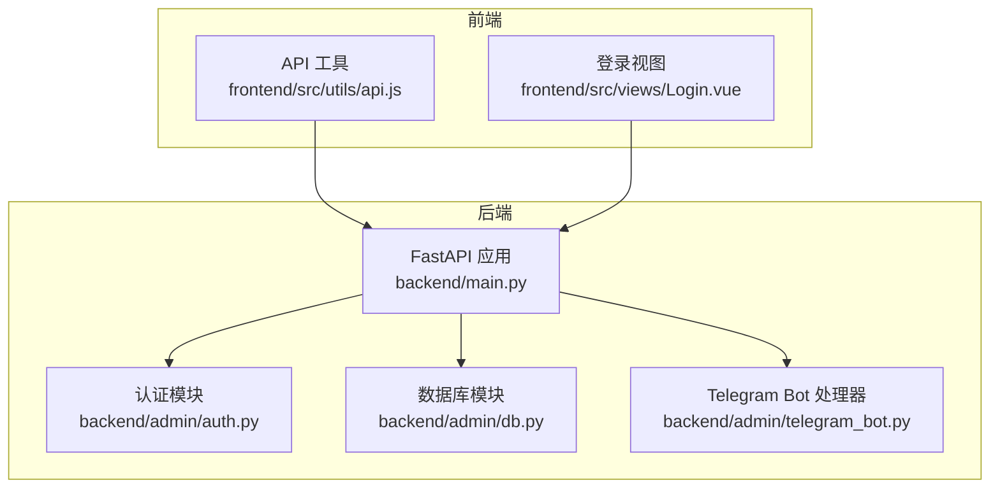
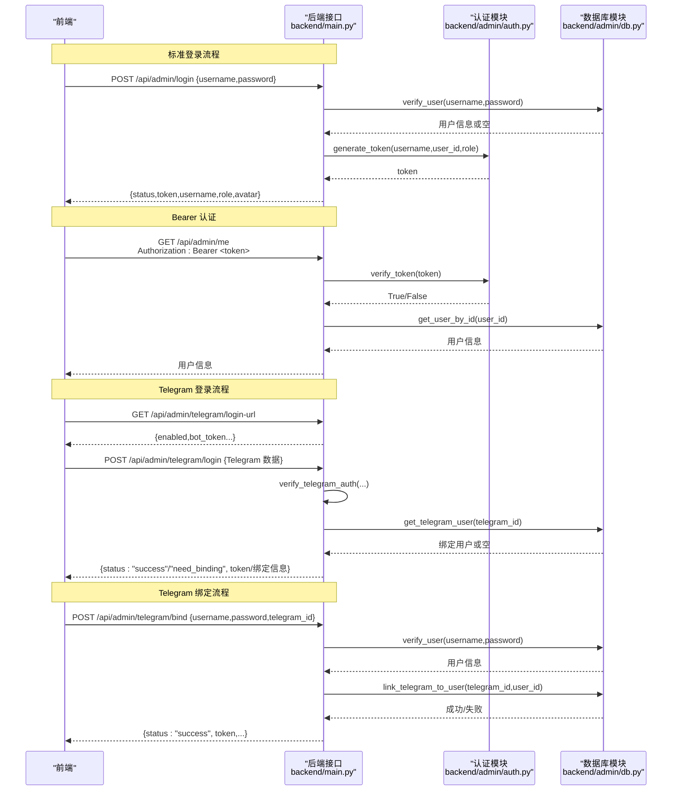
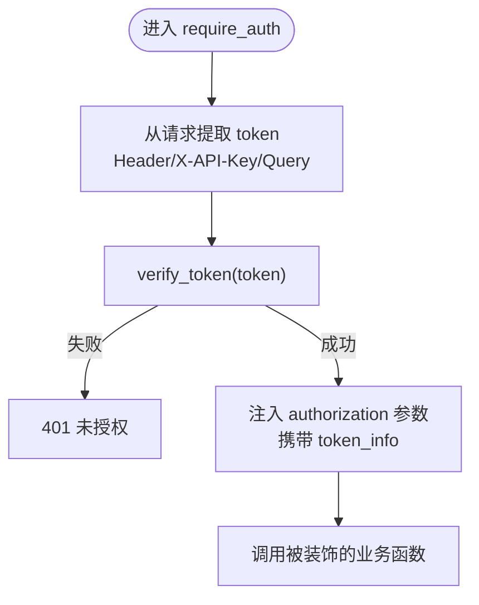
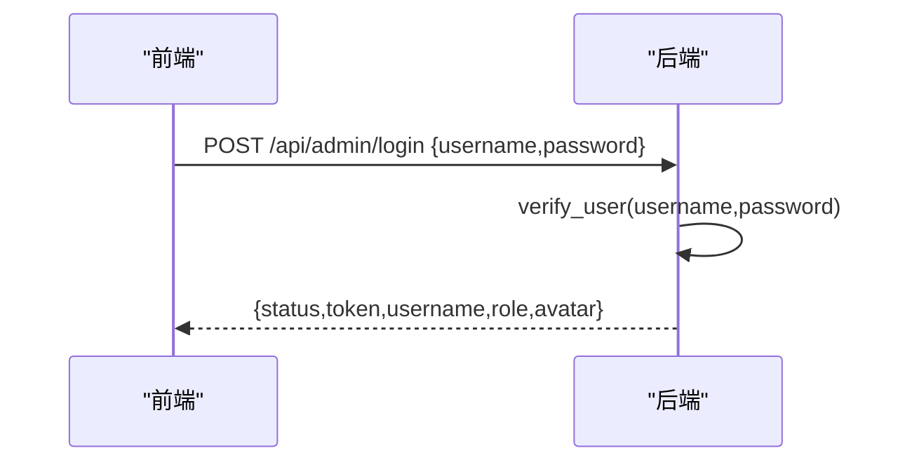
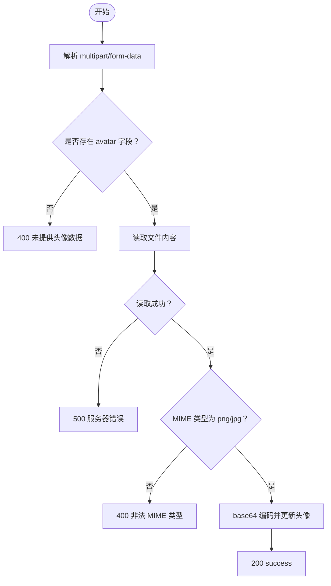
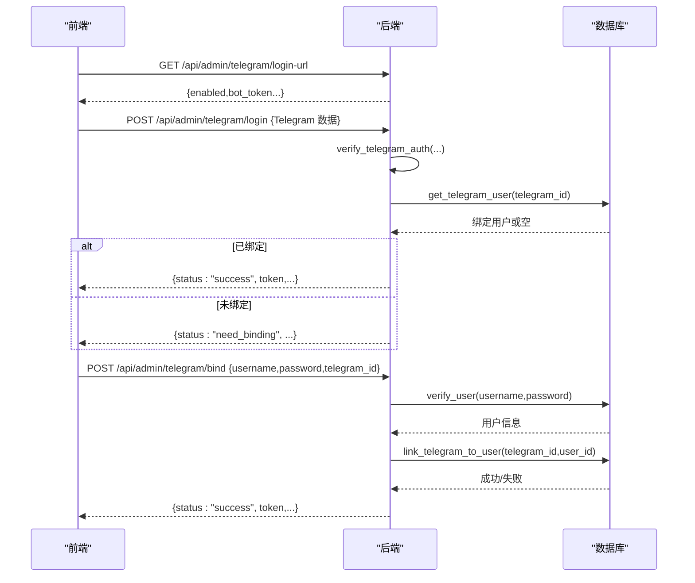
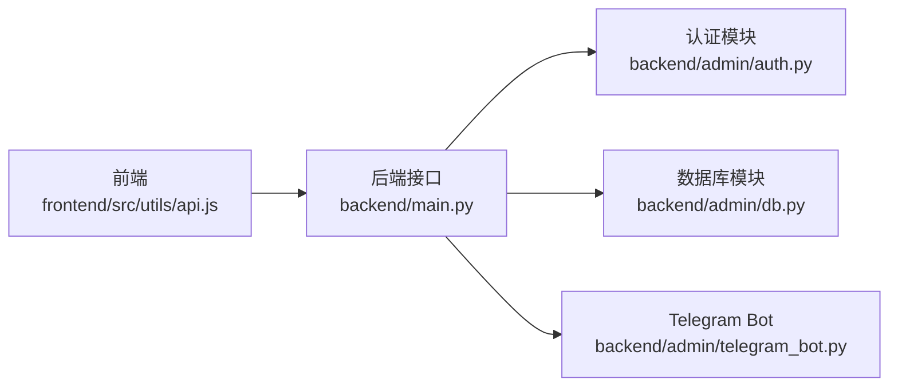

# 认证接口

<cite>
**本文引用的文件**
- [backend/main.py](file://backend/main.py)
- [backend/admin/auth.py](file://backend/admin/auth.py)
- [backend/admin/db.py](file://backend/admin/db.py)
- [backend/admin/telegram_bot.py](file://backend/admin/telegram_bot.py)
- [frontend/src/utils/api.js](file://frontend/src/utils/api.js)
- [frontend/src/views/Login.vue](file://frontend/src/views/Login.vue)
</cite>

## 目录
1. [简介](#简介)
2. [项目结构](#项目结构)
3. [核心组件](#核心组件)
4. [架构总览](#架构总览)
5. [详细组件分析](#详细组件分析)
6. [依赖分析](#依赖分析)
7. [性能考量](#性能考量)
8. [故障排查指南](#故障排查指南)
9. [结论](#结论)
10. [附录](#附录)

## 简介
本文件面向后端与前端开发者，系统性梳理本项目的认证体系与接口规范，覆盖以下主题：
- 用户登录、注册、密码修改、头像上传接口
- JWT 认证机制与 Token 生成/验证流程
- Telegram 登录与账号绑定接口
- 认证头部格式、错误码说明与安全考虑
- 请求/响应示例与常见问题解决方案

## 项目结构
后端采用 FastAPI 构建，认证相关逻辑集中在以下模块：
- 认证与鉴权：backend/admin/auth.py
- 数据访问层：backend/admin/db.py（含用户、API Key、Telegram 绑定等）
- 主应用与接口定义：backend/main.py
- Telegram Bot 处理器：backend/admin/telegram_bot.py
- 前端认证工具与登录页：frontend/src/utils/api.js、frontend/src/views/Login.vue

图表来源
- [backend/main.py:336-532](file://backend/main.py#L336-L532)
- [backend/admin/auth.py:16-169](file://backend/admin/auth.py#L16-L169)
- [backend/admin/db.py:29-214](file://backend/admin/db.py#L29-L214)
- [backend/admin/telegram_bot.py:43-436](file://backend/admin/telegram_bot.py#L43-L436)
- [frontend/src/utils/api.js:1-274](file://frontend/src/utils/api.js#L1-L274)
- [frontend/src/views/Login.vue:1-734](file://frontend/src/views/Login.vue#L1-L734)

章节来源
- [backend/main.py:336-532](file://backend/main.py#L336-L532)
- [backend/admin/auth.py:16-169](file://backend/admin/auth.py#L16-L169)
- [backend/admin/db.py:29-214](file://backend/admin/db.py#L29-L214)
- [backend/admin/telegram_bot.py:43-436](file://backend/admin/telegram_bot.py#L43-L436)
- [frontend/src/utils/api.js:1-274](file://frontend/src/utils/api.js#L1-L274)
- [frontend/src/views/Login.vue:1-734](file://frontend/src/views/Login.vue#L1-L734)

## 核心组件
- 认证与鉴权
  - Token 生成：基于用户名、用户ID、角色与时间戳拼接，并存入内存字典
  - Token 验证：支持 Bearer 前缀去除、内存校验、API Key 校验
  - 装饰器：require_auth、require_admin，统一注入 token_info
- 数据访问层
  - 用户：登录校验、密码修改、头像更新、查询
  - API Key：创建、校验、列表、状态变更、删除
  - Telegram：登录数据校验、用户绑定、查询与更新
- 接口定义
  - 登录、注册、当前用户、密码修改、头像上传
  - Telegram 登录、绑定、登录 URL 获取
- 前端集成
  - 统一通过 Authorization: Bearer <token> 头部传递
  - 登录页集成 Telegram Widget，支持 Telegram 登录与绑定

章节来源
- [backend/admin/auth.py:16-169](file://backend/admin/auth.py#L16-L169)
- [backend/admin/db.py:251-356](file://backend/admin/db.py#L251-L356)
- [backend/admin/db.py:690-751](file://backend/admin/db.py#L690-L751)
- [backend/admin/db.py:996-1072](file://backend/admin/db.py#L996-L1072)
- [backend/main.py:336-532](file://backend/main.py#L336-L532)
- [frontend/src/utils/api.js:7-65](file://frontend/src/utils/api.js#L7-L65)
- [frontend/src/views/Login.vue:177-287](file://frontend/src/views/Login.vue#L177-L287)

## 架构总览
认证流程概览（含 Telegram 登录与绑定）：

图表来源
- [backend/main.py:336-532](file://backend/main.py#L336-L532)
- [backend/main.py:1883-1912](file://backend/main.py#L1883-L1912)
- [backend/admin/auth.py:16-68](file://backend/admin/auth.py#L16-L68)
- [backend/admin/db.py:251-356](file://backend/admin/db.py#L251-L356)
- [backend/admin/db.py:996-1072](file://backend/admin/db.py#L996-L1072)

## 详细组件分析

### 认证头部与 Token 机制
- 头部格式
  - Authorization: Bearer <token>
  - 同时支持自定义 X-API-Key 头部（优先于 Authorization）
  - 亦可通过查询参数 token=... 传递（不推荐）
- Token 生成与存储
  - 生成：generate_token(username, user_id, role)
  - 存储：内存字典 TOKEN_STORE，键为 token，值包含用户信息与创建时间
  - 有效期：当前实现未内置过期控制，建议生产环境迁移到 Redis 并增加过期策略
- Token 验证
  - verify_token(token)：去除 Bearer 前缀，检查内存与 API Key
  - get_token_info(token)：返回用户信息（含 role、api_key_id 等）

图表来源
- [backend/admin/auth.py:70-139](file://backend/admin/auth.py#L70-L139)

章节来源
- [backend/admin/auth.py:16-68](file://backend/admin/auth.py#L16-L68)
- [backend/admin/auth.py:70-139](file://backend/admin/auth.py#L70-L139)

### 用户登录接口
- 接口
  - POST /api/admin/login
- 请求体
  - username: 字符串
  - password: 字符串
- 成功响应
  - status: success
  - token: 访问令牌
  - username: 用户名
  - role: 角色
  - avatar: 头像（可选）
- 错误
  - 401 账户名或密码错误

图表来源
- [backend/main.py:336-353](file://backend/main.py#L336-L353)

章节来源
- [backend/main.py:336-353](file://backend/main.py#L336-L353)

### 用户注册接口
- 接口
  - POST /api/admin/register
- 请求体
  - username: 字符串
  - password: 字符串
  - invite_code: 邀请码（可选）
- 成功响应
  - status: success
  - message: 注册成功提示
- 错误
  - 400 注册失败（邀请码无效）

章节来源
- [backend/main.py:355-361](file://backend/main.py#L355-L361)

### 当前用户信息接口
- 接口
  - GET /api/admin/me
- 认证
  - 需要 Bearer Token 或 X-API-Key
- 成功响应
  - 返回用户对象（含 id、username、role、avatar、created_at、last_login、is_active 等）
- 错误
  - 404 用户不存在
  - 401 未授权

章节来源
- [backend/main.py:363-371](file://backend/main.py#L363-L371)

### 密码修改接口
- 接口
  - POST /api/admin/password
- 请求体
  - old_password: 旧密码
  - new_password: 新密码
- 成功响应
  - status: success
  - message: 密码修改成功
- 错误
  - 400 当前密码错误
  - 401 未授权

章节来源
- [backend/main.py:373-381](file://backend/main.py#L373-L381)

### 头像上传接口
- 接口
  - POST /api/admin/avatar
- 认证
  - 需要 Bearer Token 或 X-API-Key
- 请求体
  - multipart/form-data，字段名为 avatar，值为文件对象
- 成功响应
  - status: success
- 错误
  - 400 未提供头像数据或文件读取失败
  - 400 非法 MIME 类型（仅支持 image/png、image/jpeg）
  - 500 服务器内部错误

图表来源
- [backend/main.py:383-413](file://backend/main.py#L383-L413)

章节来源
- [backend/main.py:383-413](file://backend/main.py#L383-L413)

### Telegram 登录与绑定接口
- 登录 URL 获取
  - GET /api/admin/telegram/login-url
  - 返回 enabled 与 bot_token（调试用途）
- Telegram 登录
  - POST /api/admin/telegram/login
  - 请求体：Telegram Widget 回传的用户数据（id、first_name、last_name、username、photo_url、auth_date、hash）
  - 校验步骤：
    - verify_telegram_auth(data, bot_token)
    - 时间戳校验（auth_date 与当前时间差不超过 300 秒）
    - 查询绑定用户（get_telegram_user）
  - 响应：
    - 已绑定：返回 {status:"success", token, username, role, avatar, telegram_bound:true}
    - 未绑定：返回 {status:"need_binding", telegram_id, telegram_username, first_name, last_name}
- Telegram 绑定
  - POST /api/admin/telegram/bind
  - 请求体：{telegram_id, username, password}
  - 校验系统账户 verify_user，成功后 link_telegram_to_user 并返回 token

图表来源
- [backend/main.py:417-497](file://backend/main.py#L417-L497)
- [backend/main.py:499-531](file://backend/main.py#L499-L531)
- [backend/main.py:1883-1912](file://backend/main.py#L1883-L1912)
- [backend/admin/db.py:996-1072](file://backend/admin/db.py#L996-L1072)

章节来源
- [backend/main.py:417-497](file://backend/main.py#L417-L497)
- [backend/main.py:499-531](file://backend/main.py#L499-L531)
- [backend/main.py:1883-1912](file://backend/main.py#L1883-L1912)
- [backend/admin/db.py:996-1072](file://backend/admin/db.py#L996-L1072)

### 前端集成要点
- 统一认证头
  - api.js 在每个请求中自动附加 Authorization: Bearer <token>
- 登录页
  - 支持标准登录与 Telegram 登录
  - Telegram 登录通过 Telegram Widget 回调 onTelegramAuth 触发 /api/admin/telegram/login
  - 若返回 need_binding，则弹出绑定面板，提交 /api/admin/telegram/bind

章节来源
- [frontend/src/utils/api.js:7-65](file://frontend/src/utils/api.js#L7-L65)
- [frontend/src/views/Login.vue:177-287](file://frontend/src/views/Login.vue#L177-L287)

## 依赖分析
- 模块耦合
  - backend/main.py 依赖 backend/admin/auth.py 与 backend/admin/db.py
  - 前端通过 api.js 与后端接口交互
- 外部依赖
  - Telegram Bot API（用于下载任务推送）
  - FastAPI（路由、依赖注入、异常处理）
  - sqlite3（本地数据存储）

图表来源
- [backend/main.py:336-532](file://backend/main.py#L336-L532)
- [backend/admin/auth.py:16-169](file://backend/admin/auth.py#L16-L169)
- [backend/admin/db.py:29-214](file://backend/admin/db.py#L29-L214)
- [backend/admin/telegram_bot.py:43-436](file://backend/admin/telegram_bot.py#L43-L436)
- [frontend/src/utils/api.js:1-274](file://frontend/src/utils/api.js#L1-L274)

章节来源
- [backend/main.py:336-532](file://backend/main.py#L336-L532)
- [backend/admin/auth.py:16-169](file://backend/admin/auth.py#L16-L169)
- [backend/admin/db.py:29-214](file://backend/admin/db.py#L29-L214)
- [backend/admin/telegram_bot.py:43-436](file://backend/admin/telegram_bot.py#L43-L436)
- [frontend/src/utils/api.js:1-274](file://frontend/src/utils/api.js#L1-L274)

## 性能考量
- Token 存储
  - 当前使用内存字典，适合单实例；多实例需共享缓存（如 Redis），并考虑过期与清理策略
- API Key 校验
  - 每次请求进行哈希匹配与过期/限流检查，建议配合缓存与索引优化
- Telegram Bot
  - 长轮询与并发处理，注意超时与冲突处理（409）及异常重试

## 故障排查指南
- 401 未授权
  - 检查 Authorization 头是否正确（Bearer 前缀）
  - 确认 token 未过期（当前实现未内置过期，建议补充）
  - 确认 X-API-Key 是否有效且未被禁用
- 403 需要管理员权限
  - 当前用户角色非 admin
- Telegram 登录失败
  - verify_telegram_auth 校验失败：确认 bot_token 配置正确
  - 时间戳过期：auth_date 与当前时间差超过 300 秒
  - 未启用 Telegram 登录：检查设置项 telegram_login_enabled
- 头像上传失败
  - 非 PNG/JPG：仅支持 image/png、image/jpeg
  - 文件读取异常：检查文件大小与编码

章节来源
- [backend/admin/auth.py:27-68](file://backend/admin/auth.py#L27-L68)
- [backend/admin/db.py:690-751](file://backend/admin/db.py#L690-L751)
- [backend/main.py:441-461](file://backend/main.py#L441-L461)
- [backend/main.py:383-413](file://backend/main.py#L383-L413)

## 结论
本项目采用轻量级内存 Token 与 API Key 双通道认证方案，结合 Telegram Widget 实现便捷登录与绑定。建议在生产环境中：
- 替换内存 Token 存储为 Redis 并引入过期策略
- 引入刷新 Token 与更细粒度的权限控制
- 对 API Key 增加更严格的速率限制与审计日志
- 前端统一使用 Bearer 头部，避免查询参数泄露

## 附录

### 认证头部格式
- Authorization: Bearer <token>
- X-API-Key: <api_key>（可选，优先于 Authorization）
- ?token=<token>（可选，不推荐）

章节来源
- [backend/admin/auth.py:70-107](file://backend/admin/auth.py#L70-L107)
- [frontend/src/utils/api.js:7-13](file://frontend/src/utils/api.js#L7-L13)

### 错误码说明
- 400：请求参数错误、注册失败、密码错误、头像格式不支持、API Key 更新失败
- 401：账户名或密码错误、Telegram 验证失败、验证已过期、未授权
- 403：Telegram 登录未启用、需要管理员权限
- 404：用户不存在
- 500：服务器内部错误（如头像读取失败）

章节来源
- [backend/main.py:341-342](file://backend/main.py#L341-L342)
- [backend/main.py:441-461](file://backend/main.py#L441-L461)
- [backend/main.py:383-413](file://backend/main.py#L383-L413)

### 安全考虑
- Token 存储：建议迁移到 Redis 并设置过期时间与最大存活数
- API Key：严格限制作用域与过期时间，定期轮换
- 传输安全：建议仅在 HTTPS 下使用，避免明文传输
- Telegram：校验签名与时间戳，避免重放攻击

章节来源
- [backend/admin/auth.py:13-14](file://backend/admin/auth.py#L13-L14)
- [backend/admin/db.py:651-688](file://backend/admin/db.py#L651-L688)
- [backend/main.py:1883-1912](file://backend/main.py#L1883-L1912)