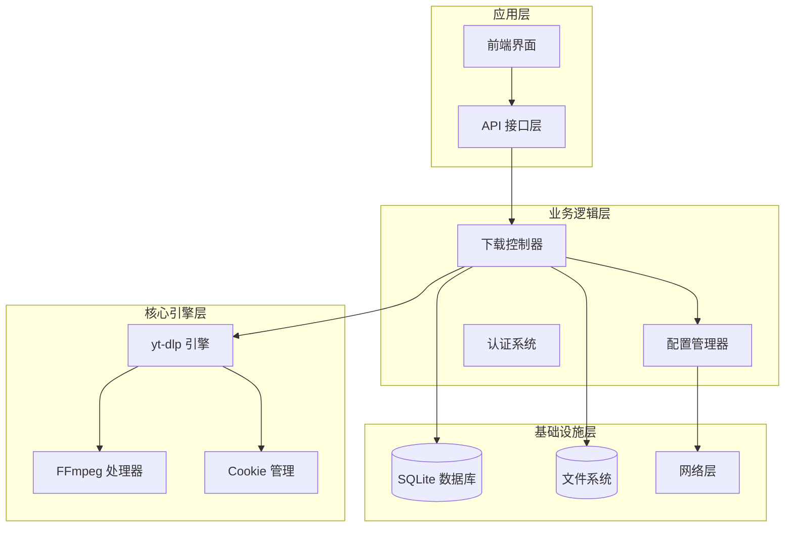
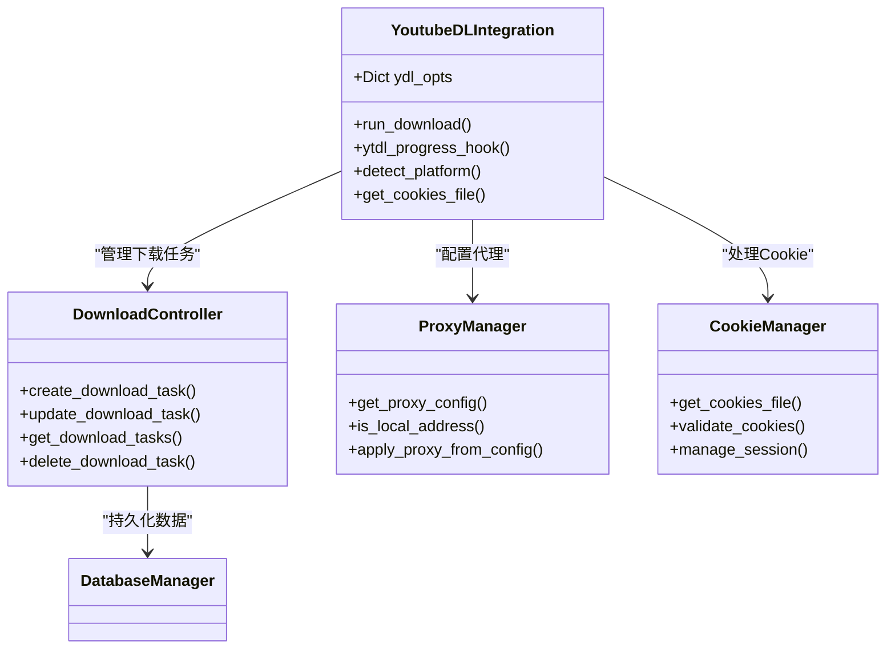
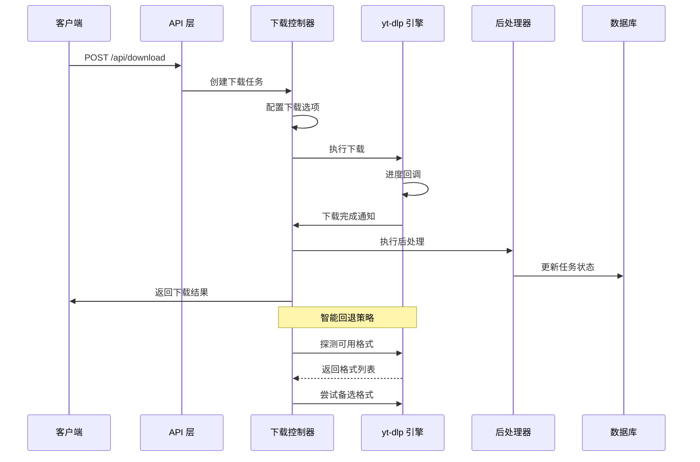
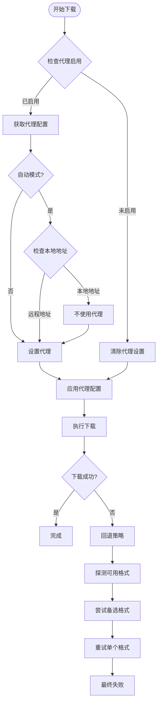
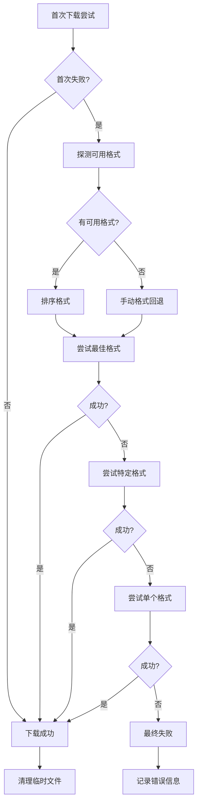
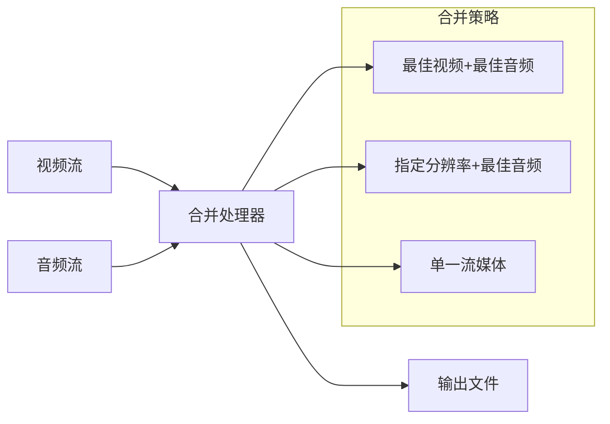
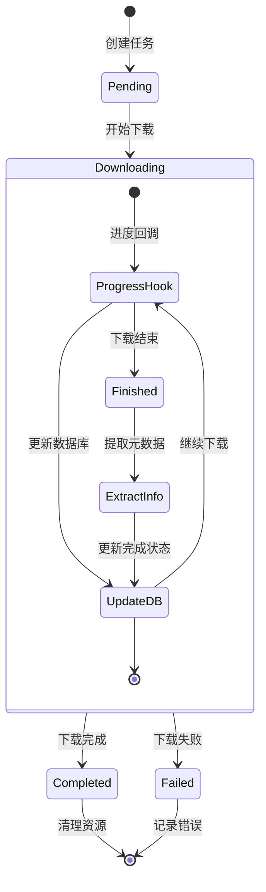
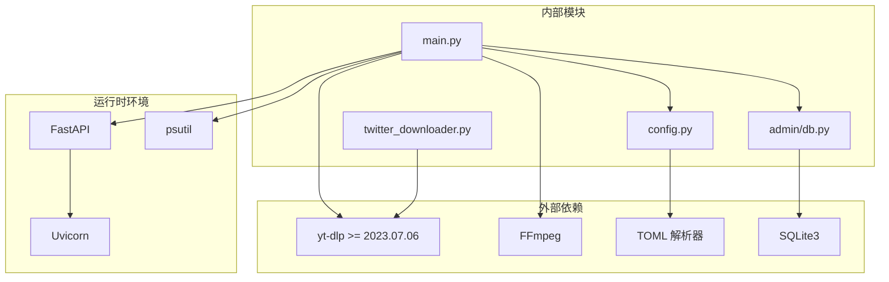

# yt-dlp 集成方案

<cite>
**本文档引用的文件**
- [backend/main.py](file://backend/main.py)
- [backend/config.py](file://backend/config.py)
- [backend/admin/tweet_downloader.py](file://backend/admin/twitter_downloader.py)
- [backend/admin/db.py](file://backend/admin/db.py)
- [docker-compose.yml](file://docker-compose.yml)
- [Dockerfile](file://Dockerfile)
</cite>

## 目录
1. [简介](#简介)
2. [项目结构](#项目结构)
3. [核心组件](#核心组件)
4. [架构概览](#架构概览)
5. [详细组件分析](#详细组件分析)
6. [依赖关系分析](#依赖关系分析)
7. [性能考虑](#性能考虑)
8. [故障排除指南](#故障排除指南)
9. [结论](#结论)

## 简介

本文件详细阐述了 BoscoTsang 项目中 yt-dlp 库的集成方案。该项目是一个基于 FastAPI 的全平台视频/音乐/图片下载系统，核心下载引擎采用 yt-dlp，并集成了 FFmpeg 进行后处理。系统支持 3000+ 平台的一键下载，具备完善的代理配置、证书验证、错误处理和性能优化机制。

## 项目结构

项目采用分层架构设计，主要包含以下核心模块：



**图表来源**
- [backend/main.py:133-138](file://backend/main.py#L133-L138)
- [backend/config.py:29-34](file://backend/config.py#L29-L34)

**章节来源**
- [backend/main.py:1-100](file://backend/main.py#L1-L100)
- [backend/config.py:1-50](file://backend/config.py#L1-L50)

## 核心组件

### 下载引擎集成

系统通过 `YoutubeDL` 类实现对 yt-dlp 的深度集成，提供了完整的下载生命周期管理：



**图表来源**
- [backend/main.py:669-732](file://backend/main.py#L669-L732)
- [backend/main.py:733-981](file://backend/main.py#L733-L981)

### 配置管理系统

系统实现了多层次的配置管理机制，支持全局配置、平台特定配置和运行时动态配置：

| 配置层级 | 配置来源 | 作用范围 | 示例配置项 |
|---------|----------|----------|-----------|
| 全局配置 | BoscoTsang.toml | 应用级 | proxy.enabled, proxy.mode |
| 平台配置 | 设置表 | 平台级 | xtwitter_download_video, bilibili_headers |
| 运行时配置 | 环境变量 | 进程级 | HTTP_PROXY, HTTPS_PROXY |
| 会话配置 | 函数参数 | 请求级 | cookies_file, quality |

**章节来源**
- [backend/config.py:29-135](file://backend/config.py#L29-L135)
- [backend/main.py:765-861](file://backend/main.py#L765-L861)

## 架构概览

系统采用事件驱动的异步下载架构，结合智能回退策略确保下载成功率：



**图表来源**
- [backend/main.py:982-1008](file://backend/main.py#L982-L1008)
- [backend/main.py:892-981](file://backend/main.py#L892-L981)

## 详细组件分析

### 下载选项配置系统

系统实现了灵活的下载选项配置机制，支持多种质量级别和格式选择：

#### 质量级别映射

| 质量级别 | yt-dlp 格式字符串 | 后处理配置 | 适用场景 |
|---------|------------------|-----------|----------|
| audio | bestaudio/best | 无 | 纯音频下载 |
| mp3 | bestaudio/best | FFmpegExtractAudio<br/>preferredcodec: mp3 | MP3 格式转换 |
| m4a | bestaudio/best | FFmpegExtractAudio<br/>preferredcodec: m4a | M4A 格式转换 |
| 1080p | bestvideo[height<=1080]<br/>+bestaudio/best | merge_output_format: mp4 | 1080P 视频下载 |
| 720p | bestvideo[height<=720]<br/>+bestaudio/best | merge_output_format: mp4 | 720P 视频下载 |
| mp4 | bestvideo[ext=mp4]<br/>+bestaudio/best | merge_output_format: mp4 | MP4 格式视频 |
| webm | bestvideo[ext=webm]<br/>+bestaudio/best | merge_output_format: webm | WebM 格式视频 |
| image | best | 无 | 图片下载 |

#### 平台特定配置

系统针对不同平台实现了专门的配置优化：

**Bilibili 平台配置**：
- 添加 SSR 支持参数
- 设置特定 User-Agent 和 Referer
- 强制禁用代理以避免 412 错误
- 配置必要的 HTTP 头部信息

**X/Twitter 平台配置**：
- 支持视频和图片混合下载
- 可配置最佳质量和分辨率限制
- 支持专用 Cookie 文件管理
- 提供模拟模式提取图片 URL

**章节来源**
- [backend/main.py:773-805](file://backend/main.py#L773-L805)
- [backend/main.py:841-854](file://backend/main.py#L841-L854)
- [backend/admin/twitter_downloader.py:75-109](file://backend/admin/twitter_downloader.py#L75-L109)

### 代理配置与网络优化

系统实现了多层次的代理配置和网络优化机制：



**图表来源**
- [backend/main.py:742-763](file://backend/main.py#L742-L763)
- [backend/main.py:895-981](file://backend/main.py#L895-L981)

#### 代理配置策略

| 代理模式 | 配置来源 | 应用范围 | 适用场景 |
|---------|----------|----------|----------|
| global | 配置文件 | 全局进程 | 需要统一代理的环境 |
| none | 配置文件 | 全局进程 | 不使用代理 |
| auto | 配置文件 | 请求级 | 智能代理选择 |
| 环境变量 | 系统环境 | 进程级 | 容器部署 |
| 直接设置 | 函数参数 | 请求级 | 特殊需求 |

**章节来源**
- [backend/config.py:100-132](file://backend/config.py#L100-L132)
- [backend/main.py:742-861](file://backend/main.py#L742-L861)

### 错误处理与回退机制

系统实现了多层次的错误处理和智能回退策略：

#### 回退策略流程



**图表来源**
- [backend/main.py:895-981](file://backend/main.py#L895-L981)

#### 错误分类与处理

| 错误类型 | 处理策略 | 重试次数 | 超时设置 |
|---------|----------|----------|----------|
| 网络连接错误 | 直接回退 | 3次 | 30秒 |
| 格式不支持错误 | 格式探测回退 | 无限次 | 60秒 |
| 认证失败错误 | Cookie 重新获取 | 1次 | 30秒 |
| 服务器限流错误 | 退避重试 | 5次 | 指数增长 |
| 磁盘空间不足 | 立即失败 | 0次 | 立即 |

**章节来源**
- [backend/main.py:892-981](file://backend/main.py#L892-L981)

### 后处理处理器集成

系统集成了多种后处理处理器，提供丰富的媒体转换能力：

#### 音频后处理配置

| 处理器类型 | 配置参数 | 输出格式 | 适用场景 |
|-----------|----------|----------|----------|
| FFmpegExtractAudio | preferredcodec: mp3 | MP3 | 标准音频格式 |
| FFmpegExtractAudio | preferredcodec: m4a | M4A | 高质量音频 |
| FFmpegExtractAudio | preferredcodec: flac | FLAC | 无损音频 |
| FFmpegVideoConvert | ext: mp4 | MP4 | 视频格式转换 |
| FFmpegVideoConvert | ext: webm | WebM | 网页视频格式 |

#### 合并输出格式

系统支持自动视频音频合并，确保下载完成后获得完整的媒体文件：



**图表来源**
- [backend/main.py:778-787](file://backend/main.py#L778-L787)
- [backend/main.py:914-919](file://backend/main.py#L914-L919)

**章节来源**
- [backend/main.py:773-805](file://backend/main.py#L773-L805)
- [backend/main.py:910-963](file://backend/main.py#L910-L963)

### 进度监控与状态管理

系统实现了完整的下载进度监控和状态管理机制：

#### 进度回调处理



**图表来源**
- [backend/main.py:669-732](file://backend/main.py#L669-L732)

#### 状态数据结构

| 字段名 | 数据类型 | 描述 | 更新时机 |
|-------|----------|------|----------|
| status | string | 任务状态 | 创建/更新 |
| progress | float | 下载进度百分比 | 每次回调 |
| speed | string | 下载速度 | 每次回调 |
| eta | string | 预计剩余时间 | 每次回调 |
| filename | string | 文件名 | 下载完成 |
| error_message | string | 错误信息 | 失败时 |
| file_size | integer | 文件大小 | 下载完成 |
| resolution | string | 分辨率 | 下载完成 |

**章节来源**
- [backend/main.py:669-732](file://backend/main.py#L669-L732)
- [backend/admin/db.py:48-89](file://backend/admin/db.py#L48-L89)

## 依赖关系分析

系统的核心依赖关系如下：



**图表来源**
- [Dockerfile:33](file://Dockerfile#L33)
- [backend/main.py:12](file://backend/main.py#L12)

**章节来源**
- [Dockerfile:1-60](file://Dockerfile#L1-L60)
- [backend/main.py:1-50](file://backend/main.py#L1-L50)

## 性能考虑

### 内存管理最佳实践

系统在内存管理方面采用了多项优化措施：

#### 内存使用监控

```python
# 获取系统内存信息
memory = psutil.virtual_memory()
memory_info = {
    "total": memory.total,
    "available": memory.available,
    "percent": memory.percent,
    "used": memory.used
}
```

#### 内存优化策略

1. **及时释放资源**：下载完成后立即清理临时文件和内存占用
2. **批量处理**：对大量下载任务采用批处理方式减少内存峰值
3. **渐进式加载**：大文件采用分块下载避免内存溢出
4. **缓存管理**：合理控制进度缓存大小，定期清理过期数据

### 网络连接优化

#### 连接池配置

系统通过合理的连接配置提升网络性能：

| 参数 | 建议值 | 说明 |
|------|--------|------|
| 连接超时 | 30秒 | 平衡响应速度和稳定性 |
| 读取超时 | 60秒 | 支持大文件下载 |
| 连接复用 | 启用 | 减少 TCP 握手开销 |
| 最大连接数 | 100 | 控制并发连接数量 |

#### 代理优化

- **智能代理选择**：根据目标地址自动选择是否使用代理
- **代理池管理**：支持多个代理地址轮换使用
- **代理健康检查**：定期检测代理可用性

### 磁盘 I/O 优化

#### 文件系统优化

1. **目录结构优化**：按平台分类存储避免目录过大
2. **文件命名策略**：使用标准化文件名避免路径冲突
3. **批量写入**：对小文件采用批量写入减少磁盘操作

**章节来源**
- [backend/main.py:1542-1565](file://backend/main.py#L1542-L1565)
- [backend/main.py:1182-1187](file://backend/main.py#L1182-L1187)

## 故障排除指南

### 常见问题诊断

#### 下载失败排查

1. **检查代理配置**
   ```bash
   # 验证代理设置
   echo $HTTP_PROXY
   echo $HTTPS_PROXY
   
   # 测试网络连通性
   curl -x $HTTP_PROXY -I https://www.youtube.com
   ```

2. **验证 Cookie 有效性**
   ```bash
   # 检查 Cookie 文件
   ls -la /app/cookies/
   
   # 验证 Cookie 格式
   cat /app/cookies/youtube.txt
   ```

3. **查看下载日志**
   ```bash
   # 查看应用日志
   tail -f /app/logs/app_$(date +%Y-%m-%d).log
   
   # 查看下载进度
   curl http://localhost:8000/api/progress/{task_id}
   ```

#### 性能问题诊断

1. **内存使用监控**
   ```bash
   # 监控内存使用
   ps aux | grep python
   top
   
   # 检查内存泄漏
   python -m tracemalloc
   ```

2. **网络性能测试**
   ```bash
   # 测试下载速度
   wget --output-document=/dev/null {video_url}
   
   # 检查 DNS 解析
   nslookup youtube.com
   ```

### 错误代码对照表

| 错误代码 | 错误类型 | 可能原因 | 解决方案 |
|---------|----------|----------|----------|
| 401 | 未授权 | 认证失败 | 检查 API Key 或登录状态 |
| 400 | 请求错误 | URL 格式错误 | 验证下载链接有效性 |
| 500 | 服务器错误 | 网络连接失败 | 检查代理设置和网络连通性 |
| 504 | 网关超时 | 服务器响应超时 | 增加超时设置或更换服务器 |
| 429 | 请求过多 | 频繁请求限制 | 实施退避重试策略 |

**章节来源**
- [backend/main.py:154-157](file://backend/main.py#L154-L157)
- [backend/main.py:965-980](file://backend/main.py#L965-L980)

### 调试工具使用

#### 日志配置

系统支持详细的日志记录，便于问题诊断：

```python
# 应用日志配置
logger = logging.getLogger("bosco")
logger.setLevel(logging.INFO)

# 文件日志处理器
file_handler = DailyFileHandler(LOGS_DIR)
file_handler.setFormatter(formatter)
logger.addHandler(file_handler)

# 控制台日志处理器
console_handler = logging.StreamHandler()
console_handler.setFormatter(formatter)
logger.addHandler(console_handler)
```

#### 调试模式

启用调试模式可以获取更详细的执行信息：

1. **环境变量设置**
   ```
   DEBUG_MODE=1
   VERBOSE_LOGGING=1
   ```

2. **配置文件调整**
   ```toml
   [logging]
   level = "DEBUG"
   format = "[%(asctime)s] [%(levelname)s] %(message)s"
   ```

**章节来源**
- [backend/main.py:67-94](file://backend/main.py#L67-L94)
- [backend/main.py:877-887](file://backend/main.py#L877-L887)

## 结论

BoscoTsang 项目的 yt-dlp 集成方案展现了现代媒体下载系统的最佳实践。通过精心设计的架构和完善的配置管理，系统实现了：

1. **高度兼容性**：支持 3000+ 平台，通过智能格式选择确保下载成功率
2. **灵活配置**：多层次配置体系满足各种部署场景需求
3. **稳健可靠性**：多重回退策略和错误处理机制保障系统稳定性
4. **性能优化**：内存管理、网络优化和磁盘 I/O 优化提升整体性能
5. **易于维护**：清晰的代码结构和完善的日志系统便于问题诊断

该集成方案为类似项目的开发提供了宝贵的参考，特别是在处理复杂媒体下载场景时的架构设计和实现细节具有重要的借鉴价值。