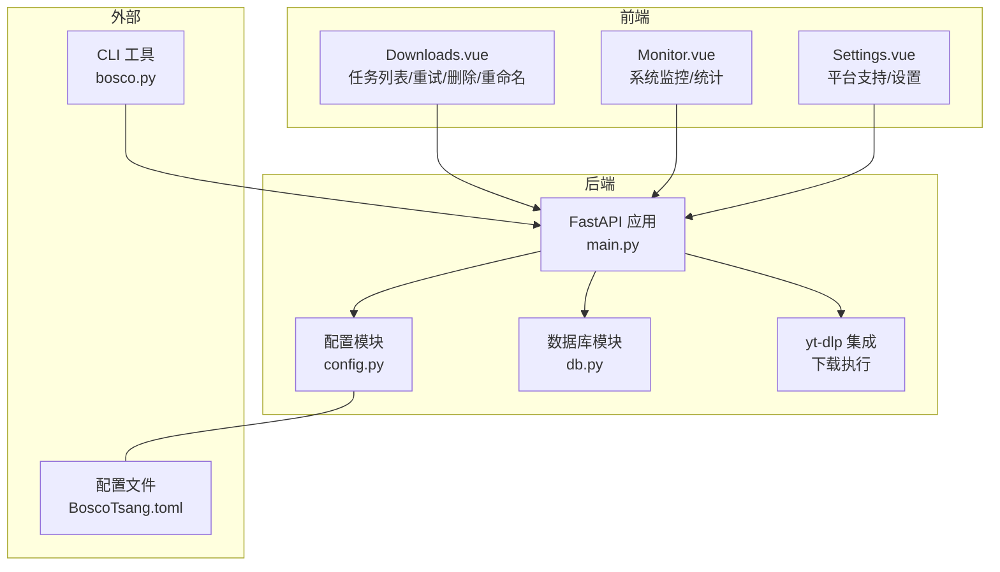
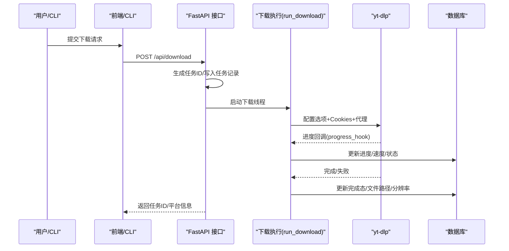
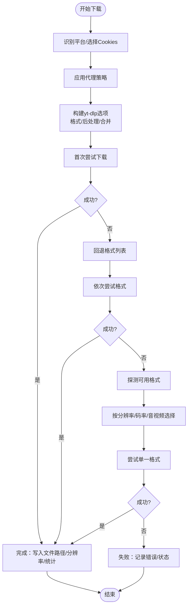
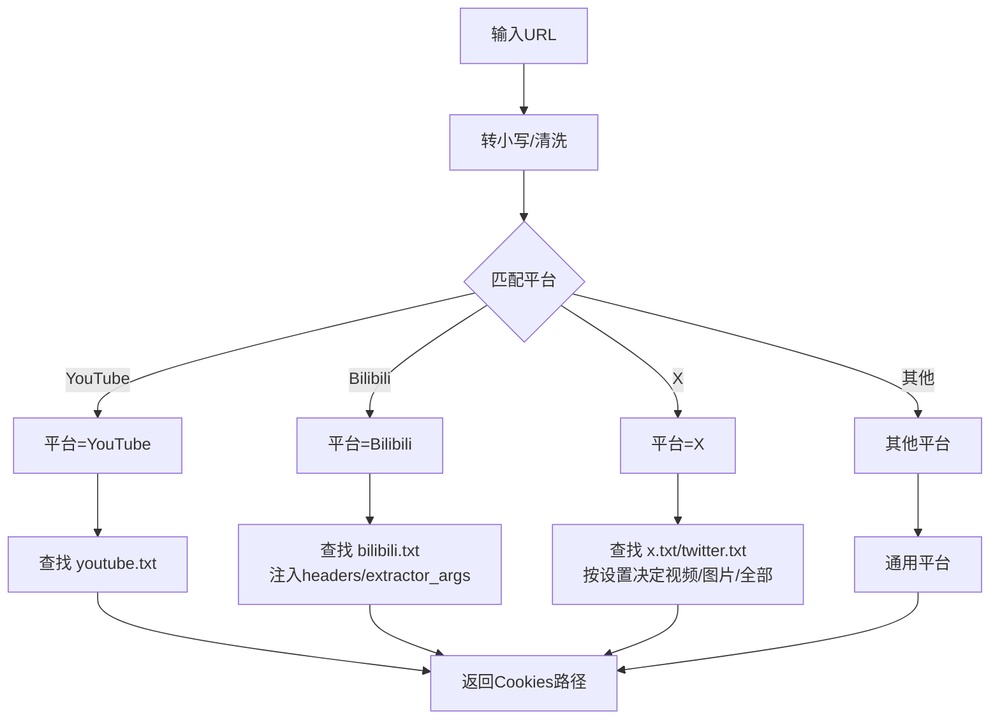
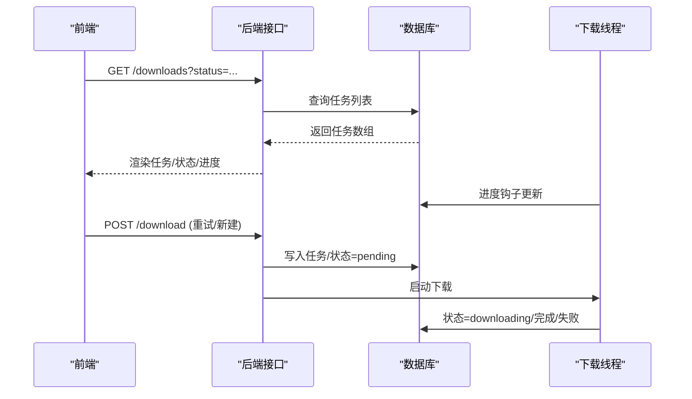
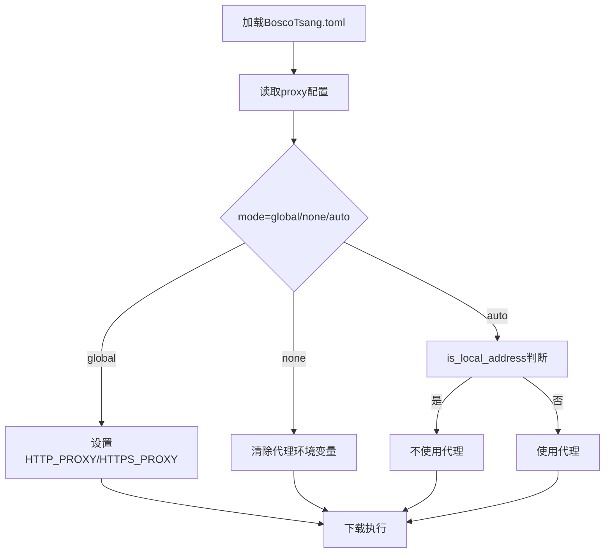
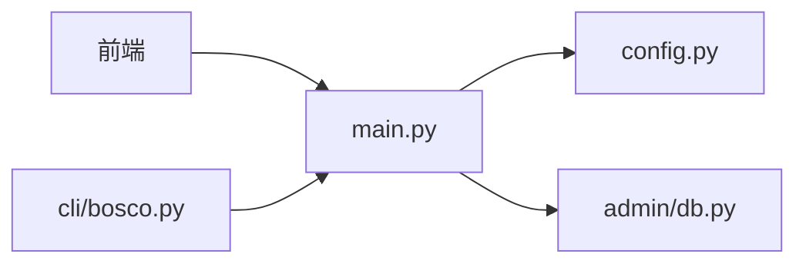

# 下载引擎设计

<cite>
**本文引用的文件**
- [backend/main.py](file://backend/main.py)
- [backend/config.py](file://backend/config.py)
- [backend/admin/db.py](file://backend/admin/db.py)
- [cli/bosco.py](file://cli/bosco.py)
- [frontend/src/views/Downloads.vue](file://frontend/src/views/Downloads.vue)
- [frontend/src/views/Monitor.vue](file://frontend/src/views/Monitor.vue)
- [frontend/src/views/Settings.vue](file://frontend/src/views/Settings.vue)
- [BoscoTsang.toml](file://BoscoTsang.toml)
- [releases/TELEGRAM_DIAGNOSIS.md](file://releases/TELEGRAM_DIAGNOSIS.md)
- [releases/TELEGRAM_BOT_FIX.md](file://releases/TELEGRAM_BOT_FIX.md)
</cite>

## 目录
1. [引言](#引言)
2. [项目结构](#项目结构)
3. [核心组件](#核心组件)
4. [架构总览](#架构总览)
5. [详细组件分析](#详细组件分析)
6. [依赖分析](#依赖分析)
7. [性能考虑](#性能考虑)
8. [故障排查指南](#故障排查指南)
9. [结论](#结论)
10. [附录](#附录)

## 引言
本设计文档面向 BoscoTsang 下载引擎，聚焦于以下主题：
- yt-dlp 集成方案与下载质量控制
- 多平台支持机制与 Cookies 管理
- 下载任务调度、进度跟踪与错误处理
- 代理配置与网络策略
- 并发控制与资源管理
- 平台扩展开发指南与自定义下载处理器实现思路

文档以代码为依据，结合前端界面与配置文件，给出端到端的系统视图，并通过图示展示关键流程。

## 项目结构
项目采用前后端分离与 CLI 协同的架构：
- 后端基于 FastAPI，提供 REST 接口、任务调度、进度跟踪、数据库与配置管理
- 前端 Vue 应用负责任务列表、监控面板、设置与日志查看
- CLI 提供命令行交互能力
- 配置文件集中管理代理、下载目录与日志级别

图表来源
- [backend/main.py:133-146](file://backend/main.py#L133-L146)
- [backend/config.py:29-34](file://backend/config.py#L29-L34)
- [backend/admin/db.py:374-485](file://backend/admin/db.py#L374-L485)
- [cli/bosco.py:14](file://cli/bosco.py#L14)
- [BoscoTsang.toml:1-28](file://BoscoTsang.toml#L1-L28)

章节来源
- [backend/main.py:133-146](file://backend/main.py#L133-L146)
- [backend/config.py:29-34](file://backend/config.py#L29-L34)
- [cli/bosco.py:14](file://cli/bosco.py#L14)
- [BoscoTsang.toml:1-28](file://BoscoTsang.toml#L1-L28)

## 核心组件
- 下载引擎与调度
  - 通过 yt-dlp 执行下载，使用进度钩子与数据库状态同步
  - 任务状态包括 pending、downloading、completed、failed
- 平台识别与 Cookies 管理
  - URL 匹配识别平台，按平台查找对应 Cookies 文件
- 代理与网络策略
  - 支持 auto/global/none 三种模式；自动判断国内/本地直连
- 前端与 CLI
  - 任务列表轮询、监控面板刷新、CLI 提交下载与查看统计

章节来源
- [backend/main.py:253-286](file://backend/main.py#L253-L286)
- [backend/main.py:288-321](file://backend/main.py#L288-L321)
- [backend/config.py:100-132](file://backend/config.py#L100-L132)
- [frontend/src/views/Downloads.vue:202-258](file://frontend/src/views/Downloads.vue#L202-L258)
- [frontend/src/views/Monitor.vue:173-188](file://frontend/src/views/Monitor.vue#L173-L188)
- [cli/bosco.py:79-100](file://cli/bosco.py#L79-L100)

## 架构总览
后端作为统一入口，负责：
- 认证与授权
- 任务创建与调度
- 平台识别与 Cookies 注入
- 代理策略应用
- 进度回调与数据库持久化
- 统计与监控数据聚合

图表来源
- [backend/main.py:669-732](file://backend/main.py#L669-L732)
- [backend/main.py:733-840](file://backend/main.py#L733-L840)
- [backend/admin/db.py:374-417](file://backend/admin/db.py#L374-L417)

## 详细组件分析

### yt-dlp 集成与下载质量控制
- 进度回调
  - 使用进度钩子将百分比、速度、ETA、文件名写入全局进度字典与数据库
- 质量与格式选择
  - 支持 best、audio、mp3、m4a、1080p、720p、mp4、webm、image 等
  - 对特定平台（如 X、Bilibili）追加 headers 与合并参数
- 回退策略
  - 在首次失败时尝试备用格式列表，最终根据可用格式排序择优
- 完成态处理
  - 解析分辨率、更新统计、记录完成时间

图表来源
- [backend/main.py:733-840](file://backend/main.py#L733-L840)
- [backend/main.py:822-950](file://backend/main.py#L822-L950)
- [backend/main.py:669-732](file://backend/main.py#L669-L732)

章节来源
- [backend/main.py:669-732](file://backend/main.py#L669-L732)
- [backend/main.py:733-840](file://backend/main.py#L733-L840)
- [backend/main.py:822-950](file://backend/main.py#L822-L950)

### 平台支持机制与 Cookies 管理
- 平台识别
  - 基于 URL 片段匹配，覆盖 YouTube、Bilibili、X、TikTok、Instagram、QQ 音乐、网易云音乐、微博、小红书、快手、抖音、Telegram、头条、微信视频等
- Cookies 管理
  - 按平台映射 Cookie 文件名，优先从 cookies 目录加载
  - 调试输出便于定位文件是否存在
- 特殊平台处理
  - Bilibili：注入 headers 与 extractor 参数以规避 412
  - X：支持仅视频/仅图片/视频+图片组合下载

图表来源
- [backend/main.py:253-286](file://backend/main.py#L253-L286)
- [backend/main.py:288-321](file://backend/main.py#L288-L321)
- [backend/main.py:841-844](file://backend/main.py#L841-L844)
- [backend/main.py:822-839](file://backend/main.py#L822-L839)

章节来源
- [backend/main.py:253-286](file://backend/main.py#L253-L286)
- [backend/main.py:288-321](file://backend/main.py#L288-L321)
- [backend/main.py:822-844](file://backend/main.py#L822-L844)

### 下载任务调度、进度跟踪与错误处理
- 任务创建
  - 生成任务 ID，写入任务表，初始状态 pending
- 进度跟踪
  - 进度钩子周期性更新数据库与全局进度字典
  - 前端每 5 秒轮询任务列表，实时展示状态
- 完成与失败
  - 完成：写入文件路径、大小、分辨率、完成时间，更新统计
  - 失败：记录错误信息，状态标记 failed
- 错误处理
  - 代理不可用、网络异常、格式不支持等情况均有回退与日志记录

图表来源
- [frontend/src/views/Downloads.vue:202-258](file://frontend/src/views/Downloads.vue#L202-L258)
- [backend/admin/db.py:374-417](file://backend/admin/db.py#L374-L417)
- [backend/main.py:669-732](file://backend/main.py#L669-L732)

章节来源
- [frontend/src/views/Downloads.vue:202-258](file://frontend/src/views/Downloads.vue#L202-L258)
- [backend/admin/db.py:374-417](file://backend/admin/db.py#L374-L417)
- [backend/main.py:669-732](file://backend/main.py#L669-L732)

### 代理配置与网络策略
- 配置来源
  - 读取 BoscoTsang.toml 的 proxy 段，支持 enabled、mode、http、https、bypass_cidrs
- 应用策略
  - global：设置 HTTP_PROXY/HTTPS_PROXY 环境变量
  - none：移除代理环境变量
  - auto：按域名/网段判断直连，否则使用代理
- 运行时代理
  - run_download 中读取设置与环境变量，自动模式下对国内地址清空代理

图表来源
- [BoscoTsang.toml:4-19](file://BoscoTsang.toml#L4-L19)
- [backend/config.py:100-132](file://backend/config.py#L100-L132)
- [backend/config.py:49-97](file://backend/config.py#L49-L97)
- [backend/main.py:742-763](file://backend/main.py#L742-L763)

章节来源
- [BoscoTsang.toml:4-19](file://BoscoTsang.toml#L4-L19)
- [backend/config.py:100-132](file://backend/config.py#L100-L132)
- [backend/config.py:49-97](file://backend/config.py#L49-L97)
- [backend/main.py:742-763](file://backend/main.py#L742-L763)

### 并发控制与资源管理
- 并发模型
  - 每个下载任务在独立线程中执行，避免阻塞 API 主循环
- 资源管理
  - 日志按日切分，避免无限增长
  - 下载目录按平台分层，便于清理与维护
- 前端轮询
  - 任务列表与监控面板定时刷新，降低长连接开销

章节来源
- [backend/main.py:67-82](file://backend/main.py#L67-L82)
- [backend/main.py:733-763](file://backend/main.py#L733-L763)
- [frontend/src/views/Downloads.vue:251-258](file://frontend/src/views/Downloads.vue#L251-L258)
- [frontend/src/views/Monitor.vue:181-188](file://frontend/src/views/Monitor.vue#L181-L188)

### 平台扩展开发指南与自定义处理器
- 新增平台步骤
  - 在平台识别函数中增加 URL 匹配分支
  - 在 Cookies 映射中新增平台文件名
  - 如需特殊参数，在 run_download 中扩展条件分支
- 自定义下载处理器
  - 可在现有 run_download 流程中插入自定义抽取/转换逻辑
  - 保持与进度钩子与数据库更新的契约一致

章节来源
- [backend/main.py:253-286](file://backend/main.py#L253-L286)
- [backend/main.py:288-321](file://backend/main.py#L288-L321)
- [backend/main.py:733-840](file://backend/main.py#L733-L840)

## 依赖分析
后端模块之间的耦合关系如下：
- main.py 依赖 config.py（代理与配置）、admin/db.py（任务与历史）
- 前端通过 API 与后端交互，不直接依赖后端内部实现
- CLI 通过 HTTP 调用后端接口

图表来源
- [backend/main.py:44-52](file://backend/main.py#L44-L52)
- [backend/config.py:12-19](file://backend/config.py#L12-L19)
- [backend/admin/db.py:30-42](file://backend/admin/db.py#L30-L42)
- [cli/bosco.py:14](file://cli/bosco.py#L14)

章节来源
- [backend/main.py:44-52](file://backend/main.py#L44-L52)
- [backend/admin/db.py:30-42](file://backend/admin/db.py#L30-L42)
- [cli/bosco.py:14](file://cli/bosco.py#L14)

## 性能考虑
- 代理策略
  - auto 模式减少不必要的代理开销，提升国内站点访问速度
- 下载质量
  - 优先选择最佳音视频组合并合并，避免二次转码
- 资源隔离
  - 日志按日切分，磁盘占用可控
- 前端轮询
  - 适度的轮询间隔平衡实时性与服务器压力

## 故障排查指南
- Telegram Bot 相关问题
  - 诊断报告指出日志级别与异常处理不足导致错误信息为空
  - 建议开启 DEBUG 日志、增强异常捕获与堆栈记录
- 代理与网络
  - 确认代理模式与环境变量设置，必要时切换 none 模式进行对比
- 下载失败
  - 查看任务历史与错误信息，结合回退策略与可用格式探测结果定位问题

章节来源
- [releases/TELEGRAM_DIAGNOSIS.md:1-66](file://releases/TELEGRAM_DIAGNOSIS.md#L1-L66)
- [releases/TELEGRAM_BOT_FIX.md:278-359](file://releases/TELEGRAM_BOT_FIX.md#L278-L359)
- [backend/main.py:822-950](file://backend/main.py#L822-L950)

## 结论
BoscoTsang 下载引擎以 yt-dlp 为核心，结合平台识别、Cookies 管理、代理策略与完善的进度跟踪，形成稳定高效的跨平台下载体系。通过清晰的任务状态机、回退策略与前端轮询机制，系统在易用性与可靠性之间取得良好平衡。未来可在平台扩展与错误诊断方面进一步完善，以支撑更广泛的平台生态与更稳健的运行保障。

## 附录
- 配置文件关键项
  - proxy.enabled、proxy.mode、proxy.http、proxy.https、proxy.bypass_cidrs
  - download.download_dir
  - logging.level

章节来源
- [BoscoTsang.toml:4-28](file://BoscoTsang.toml#L4-L28)
- [frontend/src/views/Settings.vue:581-613](file://frontend/src/views/Settings.vue#L581-L613)