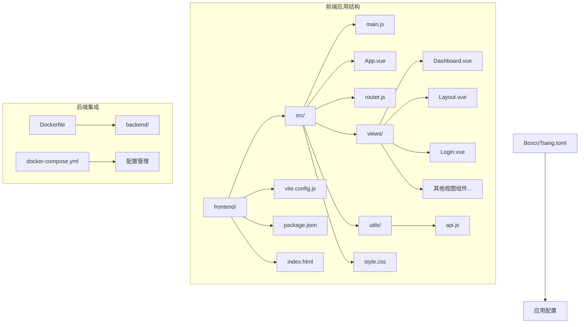
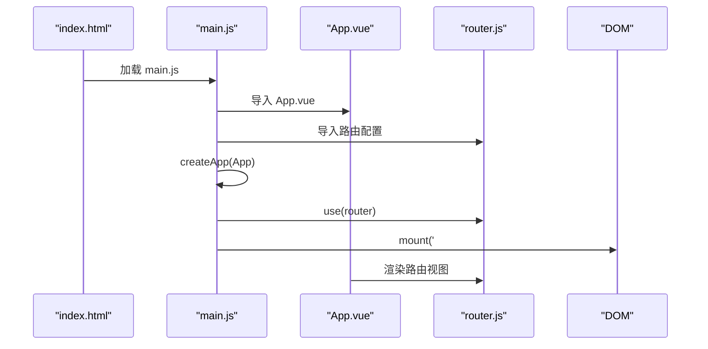
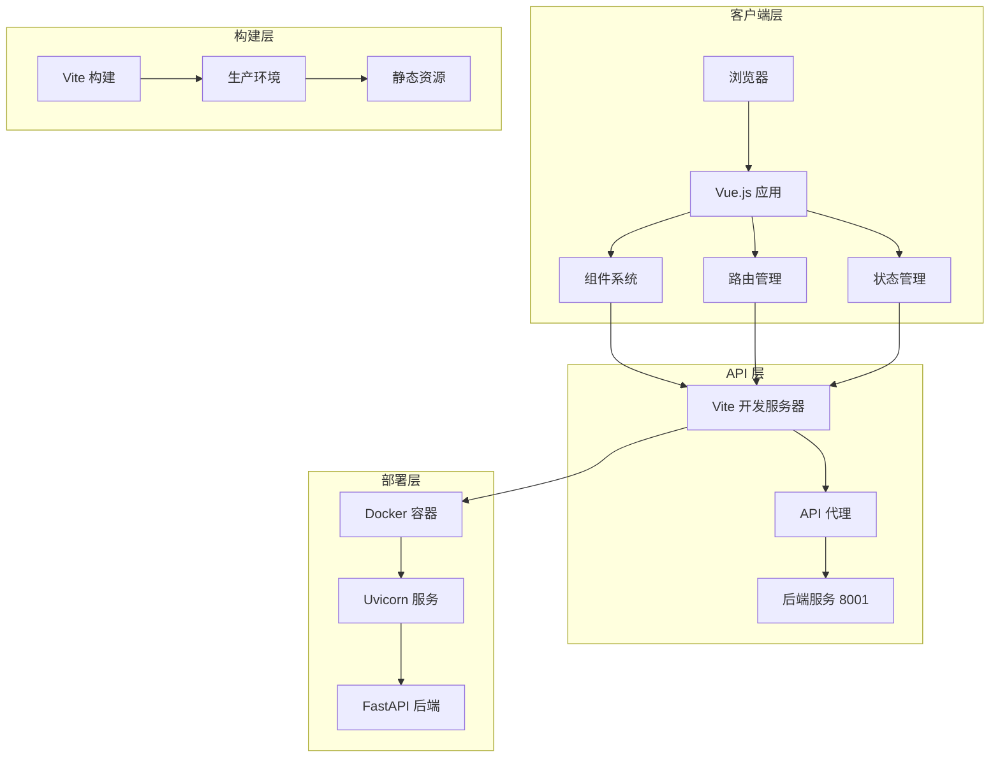
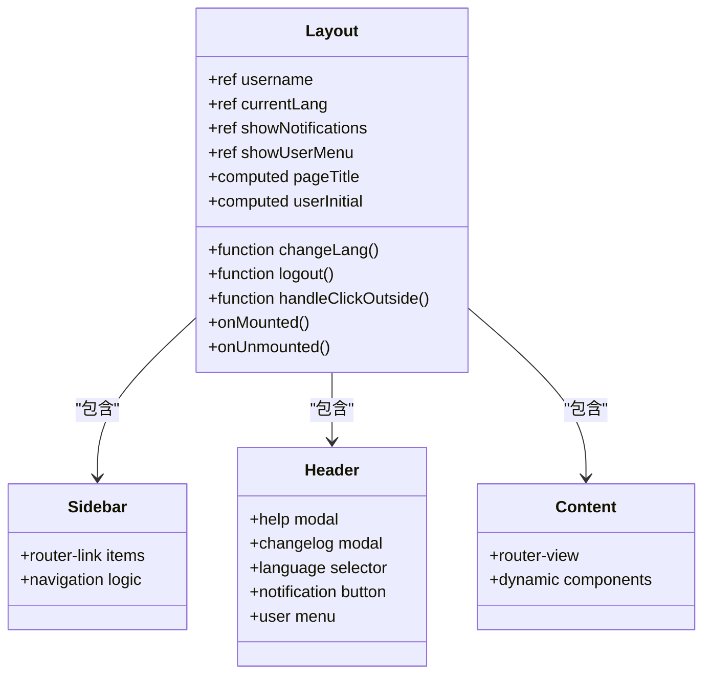
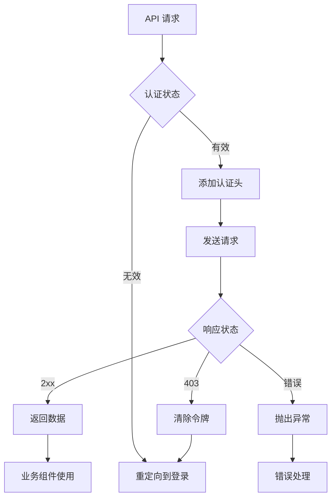
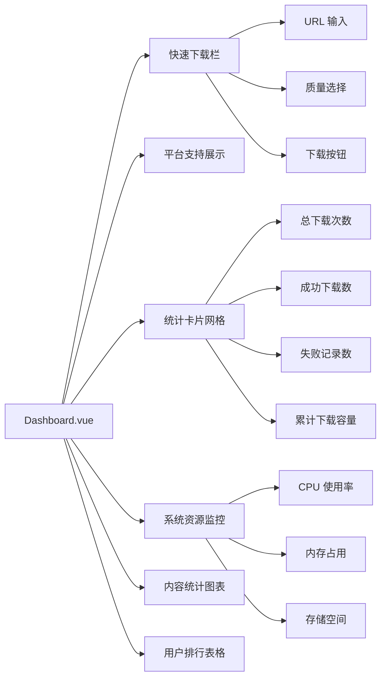
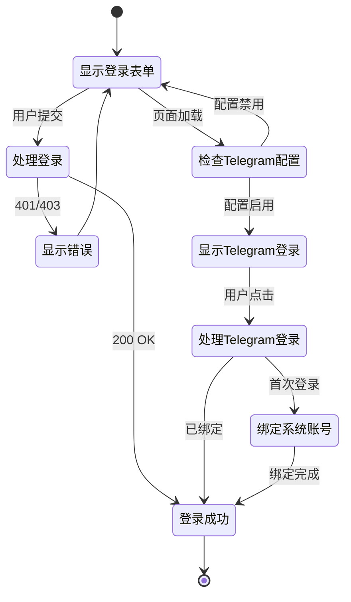

# Vue.js 应用架构

<cite>
**本文档引用的文件**
- [frontend/src/main.js](file://frontend/src/main.js)
- [frontend/src/App.vue](file://frontend/src/App.vue)
- [frontend/src/router.js](file://frontend/src/router.js)
- [frontend/vite.config.js](file://frontend/vite.config.js)
- [frontend/package.json](file://frontend/package.json)
- [frontend/index.html](file://frontend/index.html)
- [frontend/src/views/Layout.vue](file://frontend/src/views/Layout.vue)
- [frontend/src/utils/api.js](file://frontend/src/utils/api.js)
- [frontend/src/style.css](file://frontend/src/style.css)
- [frontend/src/views/Dashboard.vue](file://frontend/src/views/Dashboard.vue)
- [frontend/src/views/Login.vue](file://frontend/src/views/Login.vue)
- [Dockerfile](file://Dockerfile)
- [docker-compose.yml](file://docker-compose.yml)
- [BoscoTsang.toml](file://BoscoTsang.toml)
</cite>

## 目录
1. [引言](#引言)
2. [项目结构](#项目结构)
3. [核心组件](#核心组件)
4. [架构概览](#架构概览)
5. [详细组件分析](#详细组件分析)
6. [依赖关系分析](#依赖关系分析)
7. [性能考虑](#性能考虑)
8. [故障排除指南](#故障排除指南)
9. [结论](#结论)

## 引言

BoscoTsang 是一个基于 Vue.js 的全平台下载管理系统，采用现代化的前端架构设计。该应用集成了视频、音频、图片等多种媒体格式的下载功能，提供了完整的用户界面和后台管理能力。

本架构文档将深入分析该 Vue.js 应用的整体设计，包括应用入口点、组件树结构、模块化组织方式，以及 Vite 构建工具的配置和优化策略。

## 项目结构

该项目采用前后端分离的架构设计，前端部分位于 `frontend` 目录下，采用模块化的组织方式：



**图表来源**
- [frontend/src/main.js:1-7](file://frontend/src/main.js#L1-L7)
- [frontend/src/router.js:1-48](file://frontend/src/router.js#L1-L48)
- [frontend/vite.config.js:1-22](file://frontend/vite.config.js#L1-L22)

**章节来源**
- [frontend/src/main.js:1-7](file://frontend/src/main.js#L1-L7)
- [frontend/src/router.js:1-48](file://frontend/src/router.js#L1-L48)
- [frontend/vite.config.js:1-22](file://frontend/vite.config.js#L1-L22)

## 核心组件

### 应用入口点

应用的启动过程遵循标准的 Vue 3 应用模式：



**图表来源**
- [frontend/index.html:1-14](file://frontend/index.html#L1-L14)
- [frontend/src/main.js:1-7](file://frontend/src/main.js#L1-L7)
- [frontend/src/App.vue:1-7](file://frontend/src/App.vue#L1-L7)

### 路由系统

应用采用嵌套路由设计，提供清晰的导航结构：

```mermaid
graph TD
A[/] --> B[Layout.vue]
B --> C[Dashboard.vue]
B --> D[Downloads.vue]
B --> E[History.vue]
B --> F[Subscriptions.vue]
B --> G[FilesManager.vue]
B --> H[Logs.vue]
B --> I[Monitor.vue]
B --> J[Settings.vue]
K[/login] --> L[Login.vue]
M[API 代理] --> N[后端服务 8001]
O[Vite 开发服务器] --> P[前端应用 3000]
```

**图表来源**
- [frontend/src/router.js:13-29](file://frontend/src/router.js#L13-L29)
- [frontend/vite.config.js:12-20](file://frontend/vite.config.js#L12-L20)

**章节来源**
- [frontend/src/main.js:1-7](file://frontend/src/main.js#L1-L7)
- [frontend/src/App.vue:1-7](file://frontend/src/App.vue#L1-L7)
- [frontend/src/router.js:1-48](file://frontend/src/router.js#L1-L48)

## 架构概览

### 整体架构设计



**图表来源**
- [frontend/vite.config.js:5-21](file://frontend/vite.config.js#L5-L21)
- [Dockerfile:64-74](file://Dockerfile#L64-L74)

### 技术栈选择

该应用采用了现代前端技术栈：

- **Vue.js 3**: 最新版本的响应式框架，提供 Composition API 和更好的性能
- **Vite**: 现代化的构建工具，提供快速的开发体验
- **Vue Router**: 官方路由解决方案，支持嵌套路由和懒加载
- **Chart.js + Vue Chart.js**: 数据可视化解决方案
- **Axios**: HTTP 客户端库

**章节来源**
- [frontend/package.json:11-21](file://frontend/package.json#L11-L21)
- [frontend/vite.config.js:1-22](file://frontend/vite.config.js#L1-22)

## 详细组件分析

### 布局组件 (Layout.vue)

Layout 组件是整个应用的核心布局容器，实现了经典的侧边栏 + 主内容区的设计：



**图表来源**
- [frontend/src/views/Layout.vue:137-191](file://frontend/src/views/Layout.vue#L137-L191)

#### 功能特性

1. **响应式设计**: 使用 CSS 变量实现主题定制
2. **多语言支持**: 内置中英文切换功能
3. **用户管理**: 登录状态管理和权限控制
4. **模态框系统**: 帮助文档和更新日志弹窗
5. **事件处理**: 点击外部关闭等交互逻辑

**章节来源**
- [frontend/src/views/Layout.vue:1-462](file://frontend/src/views/Layout.vue#L1-L462)

### API 通信层

API 工具模块提供了统一的后端通信接口：



**图表来源**
- [frontend/src/utils/api.js:15-35](file://frontend/src/utils/api.js#L15-L35)

#### 模块化设计

API 模块按照功能领域进行组织：

| 功能领域 | 导出对象 | 主要方法 |
|---------|---------|---------|
| 认证 | auth | login, register, getCurrentUser, changePassword, uploadAvatar |
| 下载管理 | downloads | start, quick, list, progress, rename, delete |
| 历史记录 | history | list, delete, clearAll |
| 文件管理 | files | list, download, stream, delete, rename |
| 订阅管理 | subscriptions | list, add, update, delete |
| 统计信息 | statistics | get |
| 设置管理 | settings | get, save, savePlatform |
| 日志管理 | logs | list |
| 用户管理 | users | list, create, update, delete |
| API 密钥 | apiKeys | list, create, toggle, delete |
| 邀请码 | inviteCodes | list, create |
| 插件管理 | plugin | info, download |

**章节来源**
- [frontend/src/utils/api.js:1-274](file://frontend/src/utils/api.js#L1-L274)

### 视图组件

#### 仪表板组件 (Dashboard.vue)

Dashboard 提供了核心的功能展示和操作界面：



**图表来源**
- [frontend/src/views/Dashboard.vue:1-200](file://frontend/src/views/Dashboard.vue#L1-L200)

#### 登录组件 (Login.vue)

Login 组件实现了多种认证方式：



**图表来源**
- [frontend/src/views/Login.vue:153-200](file://frontend/src/views/Login.vue#L153-L200)

**章节来源**
- [frontend/src/views/Dashboard.vue:1-200](file://frontend/src/views/Dashboard.vue#L1-L200)
- [frontend/src/views/Login.vue:1-200](file://frontend/src/views/Login.vue#L1-L200)

## 依赖关系分析

### 构建配置

Vite 配置文件定义了开发和生产环境的关键设置：

```mermaid
graph TB
A[vite.config.js] --> B[Vue 插件]
A --> C[路径别名]
A --> D[开发服务器]
A --> E[代理配置]
C --> F[@ -> src/)
D --> G[端口 3000]
E --> H[/api -> 8001]
I[package.json] --> J[脚本命令]
J --> K[dev: vite]
J --> L[build: vite build]
J --> M[preview: vite preview]
N[依赖管理] --> O[Vue 3.5.34]
N --> P[Vue Router 4.5.0]
N --> Q[Chart.js 4.4.0]
N --> R[Axios 1.7.0]
```

**图表来源**
- [frontend/vite.config.js:5-21](file://frontend/vite.config.js#L5-L21)
- [frontend/package.json:6-10](file://frontend/package.json#L6-L10)

### Docker 部署架构

应用采用多阶段构建策略，优化了镜像大小和构建效率：

```mermaid
graph TB
subgraph "多阶段构建"
A[Node.js 20 基础镜像] --> B[前端构建阶段]
C[Python 3.10 基础镜像] --> D[后端构建阶段]
B --> E[安装依赖]
E --> F[复制源码]
F --> G[执行构建]
D --> H[安装 Python 依赖]
H --> I[复制后端代码]
I --> J[复制配置文件]
end
subgraph "最终镜像"
K[复制前端构建产物] --> L[静态资源]
M[创建工作目录] --> N[/app]
N --> O[数据卷挂载]
end
G --> K
L --> O
```

**图表来源**
- [Dockerfile:6-18](file://Dockerfile#L6-L18)
- [Dockerfile:20-64](file://Dockerfile#L20-L64)

**章节来源**
- [frontend/vite.config.js:1-22](file://frontend/vite.config.js#L1-L22)
- [frontend/package.json:1-23](file://frontend/package.json#L1-L23)
- [Dockerfile:1-74](file://Dockerfile#L1-L74)

## 性能考虑

### 构建优化策略

1. **模块解析优化**: 通过路径别名 `@` 减少相对路径复杂度
2. **开发服务器优化**: 内置热重载和快速编译
3. **代理配置**: 开发环境下的 API 代理减少跨域问题
4. **Docker 多阶段构建**: 减少最终镜像大小

### 运行时性能优化

1. **组件懒加载**: Vue Router 的异步组件加载
2. **CSS 变量**: 通过 CSS 自定义属性实现主题切换
3. **虚拟滚动**: 大列表数据的性能优化
4. **缓存策略**: 本地存储的令牌和用户信息管理

### 部署优化

1. **静态资源优化**: Vite 自动生成优化的静态资源
2. **Docker 缓存层**: 分层构建利用 Docker 缓存机制
3. **健康检查**: Docker Compose 健康检查确保服务可用性
4. **数据持久化**: 通过卷挂载确保数据不丢失

## 故障排除指南

### 常见问题诊断

#### 开发服务器问题

1. **端口冲突**: Vite 默认使用 3000 端口，可通过配置修改
2. **代理配置**: 确保后端服务在 8001 端口正常运行
3. **依赖安装**: 使用 `npm ci` 确保依赖版本一致性

#### 构建问题

1. **Node.js 版本**: 确保使用 Node.js 20+ 版本
2. **包管理器**: 推荐使用 npm 8+
3. **内存限制**: 大型项目可能需要增加 Node.js 内存限制

#### Docker 部署问题

1. **端口映射**: 检查宿主机端口映射配置
2. **卷权限**: 确保数据目录具有正确的读写权限
3. **网络连接**: 验证容器网络配置

**章节来源**
- [frontend/vite.config.js:12-20](file://frontend/vite.config.js#L12-L20)
- [docker-compose.yml:18-21](file://docker-compose.yml#L18-L21)

## 结论

BoscoTsang Vue.js 应用展现了现代前端开发的最佳实践：

### 架构优势

1. **清晰的模块化设计**: 组件按功能领域合理划分
2. **现代化的技术栈**: Vue 3 + Vite 提供优秀的开发体验
3. **完善的路由系统**: 支持嵌套路由和权限控制
4. **容器化部署**: Docker 多阶段构建优化部署流程

### 技术选型理由

1. **Vue.js 3**: 提供更好的性能和 Composition API
2. **Vite**: 快速的开发服务器和构建工具
3. **Docker**: 标准化的容器化部署方案
4. **FastAPI**: 高性能的 Python 后端框架

### 改进建议

1. **状态管理**: 考虑引入 Pinia 进行全局状态管理
2. **测试覆盖**: 添加单元测试和集成测试
3. **国际化**: 扩展多语言支持范围
4. **监控告警**: 集成应用性能监控

该架构为类似媒体下载管理系统的前端开发提供了良好的参考模板，具有良好的可维护性和扩展性。