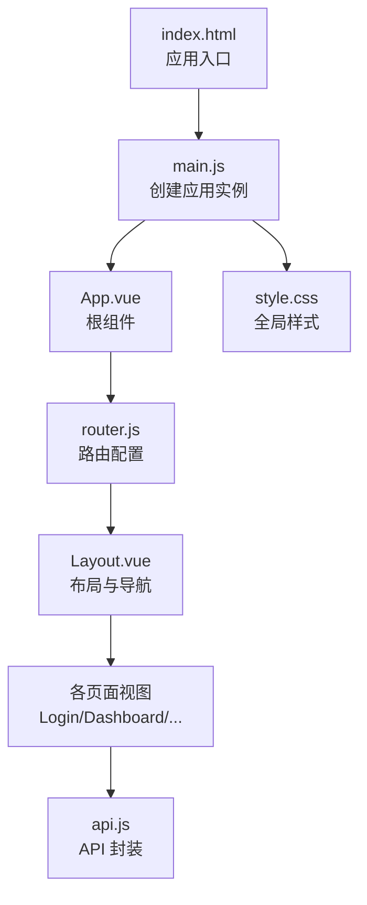
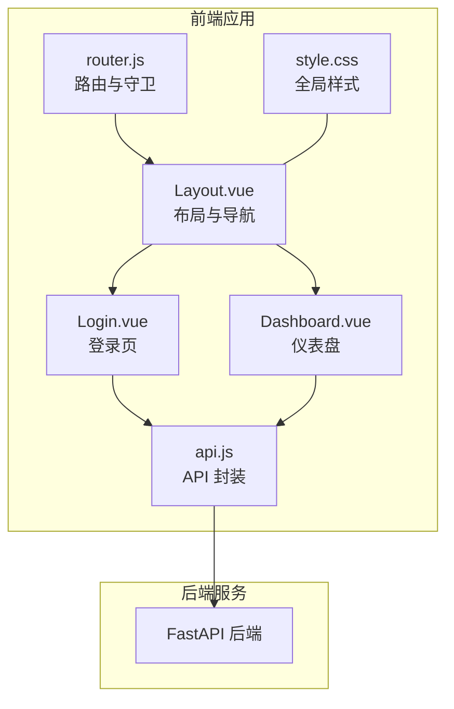
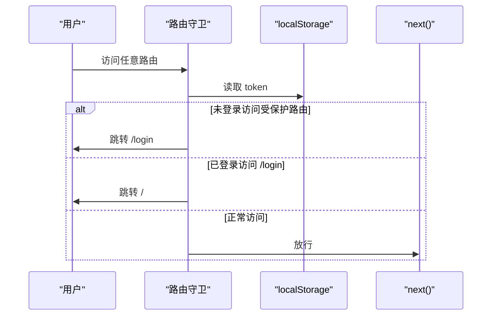
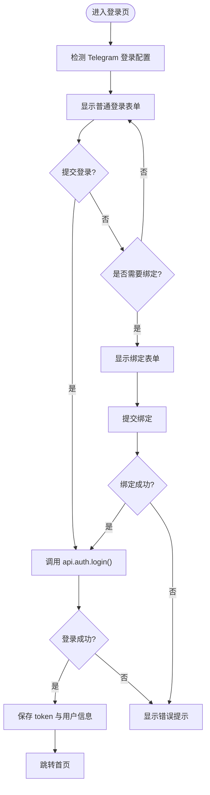
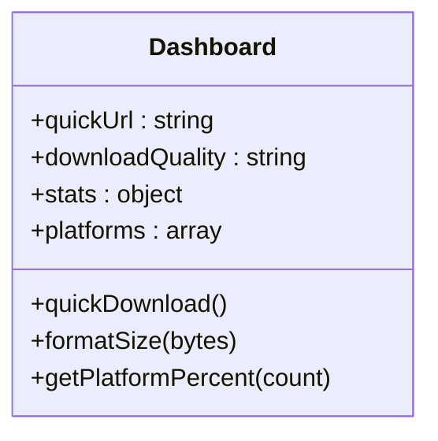
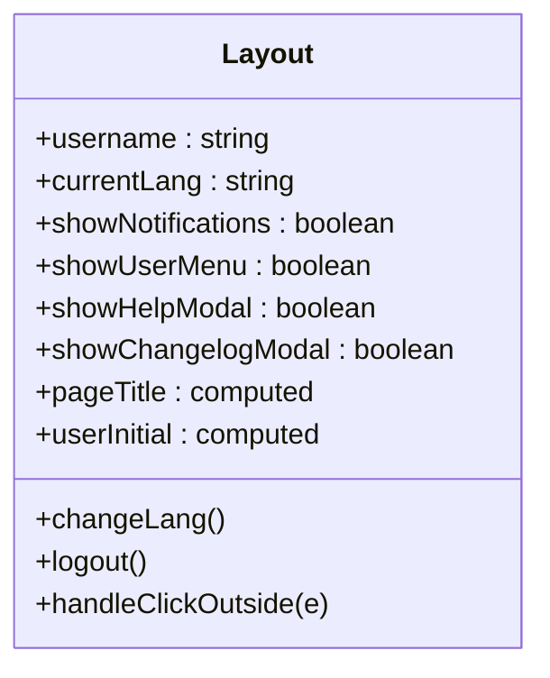
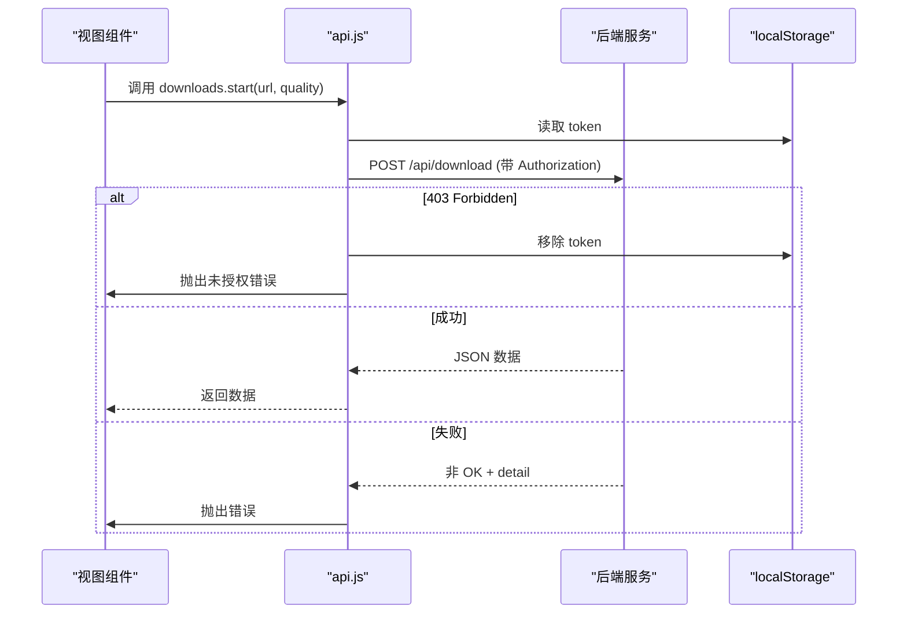
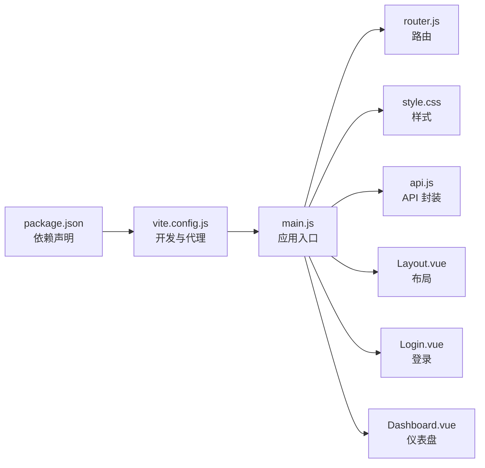

# 前端开发指南

<cite>
**本文引用的文件**
- [frontend/src/main.js](file://frontend/src/main.js)
- [frontend/src/App.vue](file://frontend/src/App.vue)
- [frontend/src/router.js](file://frontend/src/router.js)
- [frontend/src/views/Layout.vue](file://frontend/src/views/Layout.vue)
- [frontend/src/views/Login.vue](file://frontend/src/views/Login.vue)
- [frontend/src/views/Dashboard.vue](file://frontend/src/views/Dashboard.vue)
- [frontend/src/utils/api.js](file://frontend/src/utils/api.js)
- [frontend/src/style.css](file://frontend/src/style.css)
- [frontend/index.html](file://frontend/index.html)
- [frontend/vite.config.js](file://frontend/vite.config.js)
- [frontend/package.json](file://frontend/package.json)
- [Dockerfile](file://Dockerfile)
- [docker-compose.yml](file://docker-compose.yml)
- [docs/DEPLOYMENT.md](file://docs/DEPLOYMENT.md)
- [QUICK_REFERENCE.md](file://QUICK_REFERENCE.md)
</cite>

## 目录
1. [引言](#引言)
2. [项目结构](#项目结构)
3. [核心组件](#核心组件)
4. [架构总览](#架构总览)
5. [详细组件分析](#详细组件分析)
6. [依赖关系分析](#依赖关系分析)
7. [性能考量](#性能考量)
8. [故障排查指南](#故障排查指南)
9. [结论](#结论)
10. [附录](#附录)

## 引言
本指南面向 BoscoTsang 前端开发者，聚焦 Vue.js 3 单页应用的架构设计、组件系统、路由配置与状态管理实践，以及 API 通信封装、错误处理与 UI 设计规范。同时覆盖开发环境配置、构建流程与部署方法，并给出响应式设计、用户体验优化与跨浏览器兼容性的建议。

## 项目结构
前端采用 Vite + Vue 3 + Vue Router 的现代单页应用架构，核心入口在 src/main.js，路由定义于 src/router.js，全局样式位于 src/style.css，API 通信封装在 src/utils/api.js，页面布局与导航在 src/views/Layout.vue，登录页在 src/views/Login.vue，仪表盘在 src/views/Dashboard.vue。

**图表来源**
- [frontend/index.html:1-14](file://frontend/index.html#L1-L14)
- [frontend/src/main.js:1-7](file://frontend/src/main.js#L1-L7)
- [frontend/src/App.vue:1-7](file://frontend/src/App.vue#L1-L7)
- [frontend/src/router.js:1-48](file://frontend/src/router.js#L1-L48)
- [frontend/src/views/Layout.vue:1-462](file://frontend/src/views/Layout.vue#L1-L462)
- [frontend/src/utils/api.js:1-274](file://frontend/src/utils/api.js#L1-L274)
- [frontend/src/style.css:1-350](file://frontend/src/style.css#L1-L350)

**章节来源**
- [frontend/src/main.js:1-7](file://frontend/src/main.js#L1-L7)
- [frontend/src/App.vue:1-7](file://frontend/src/App.vue#L1-L7)
- [frontend/src/router.js:1-48](file://frontend/src/router.js#L1-L48)
- [frontend/src/views/Layout.vue:1-462](file://frontend/src/views/Layout.vue#L1-L462)
- [frontend/src/utils/api.js:1-274](file://frontend/src/utils/api.js#L1-L274)
- [frontend/src/style.css:1-350](file://frontend/src/style.css#L1-L350)
- [frontend/index.html:1-14](file://frontend/index.html#L1-L14)

## 核心组件
- 应用入口与挂载：在 main.js 中创建 Vue 应用实例，挂载路由与全局样式，最终挂载到 index.html 的 #app。
- 根组件：App.vue 作为顶层容器，内部通过 <router-view /> 渲染当前路由对应的视图。
- 路由系统：router.js 定义登录页与主布局的嵌套路由，使用 beforeEach 实现鉴权守卫，未登录跳转至登录页，已登录禁止重复进入登录页。
- 布局与导航：Layout.vue 提供侧边栏导航、顶部工具栏、用户菜单、帮助与更新日志弹窗，使用 CSS 变量统一主题色与尺寸。
- API 通信：api.js 封装统一的请求方法与错误处理，自动注入 Authorization 头，对 403 进行强制登出处理，并按模块划分下载、历史、文件、订阅、统计、设置、日志、用户、API Key、邀请码、插件等接口。
- 全局样式：style.css 定义 CSS 变量、通用组件样式（按钮、卡片、表格、标签、进度条）、空状态、加载动画与媒体查询，适配移动端。

**章节来源**
- [frontend/src/main.js:1-7](file://frontend/src/main.js#L1-L7)
- [frontend/src/App.vue:1-7](file://frontend/src/App.vue#L1-L7)
- [frontend/src/router.js:1-48](file://frontend/src/router.js#L1-L48)
- [frontend/src/views/Layout.vue:1-462](file://frontend/src/views/Layout.vue#L1-L462)
- [frontend/src/utils/api.js:1-274](file://frontend/src/utils/api.js#L1-L274)
- [frontend/src/style.css:1-350](file://frontend/src/style.css#L1-L350)

## 架构总览
前端采用“布局 + 视图”的分层设计，路由负责页面级导航，Layout.vue 负责站点级 UI 与交互，各业务视图负责具体功能。API 层集中处理认证、错误与数据格式化，便于复用与维护。

**图表来源**
- [frontend/src/router.js:1-48](file://frontend/src/router.js#L1-L48)
- [frontend/src/views/Layout.vue:1-462](file://frontend/src/views/Layout.vue#L1-L462)
- [frontend/src/views/Login.vue:1-734](file://frontend/src/views/Login.vue#L1-L734)
- [frontend/src/views/Dashboard.vue:1-599](file://frontend/src/views/Dashboard.vue#L1-L599)
- [frontend/src/utils/api.js:1-274](file://frontend/src/utils/api.js#L1-L274)
- [frontend/src/style.css:1-350](file://frontend/src/style.css#L1-L350)

## 详细组件分析

### 路由与鉴权流程
- 路由定义：登录页与主布局路由，主布局下包含多个子路由；使用 createWebHistory 保证 SPA 路由体验。
- 鉴权守卫：beforeEach 读取 localStorage 中的 token，非登录页且无 token 则跳转登录；登录页且存在 token 则跳转首页；否则放行。
- 登出：Layout.vue 中退出登录会清空本地存储并跳转登录页。

**图表来源**
- [frontend/src/router.js:36-45](file://frontend/src/router.js#L36-L45)
- [frontend/src/views/Layout.vue:173-176](file://frontend/src/views/Layout.vue#L173-L176)

**章节来源**
- [frontend/src/router.js:1-48](file://frontend/src/router.js#L1-L48)
- [frontend/src/views/Layout.vue:173-176](file://frontend/src/views/Layout.vue#L173-L176)

### 登录组件设计模式
- 组件结构：左侧品牌区 + 右侧登录区，支持普通登录与 Telegram 登录两种入口。
- 表单与状态：使用 v-model 双向绑定用户名、密码、记住我、邀请码等；loading、registering、binding 等状态控制按钮禁用与文案。
- 交互细节：密码可见性切换、错误提示气泡、Telegram 登录配置检测与动态加载、首次 Telegram 登录的账号绑定流程。
- API 调用：调用 api.js 中的 auth.login 与 auth.register，登录成功后可持久化 token 与用户信息（由路由守卫与 Layout.vue 配合完成）。

**图表来源**
- [frontend/src/views/Login.vue:153-200](file://frontend/src/views/Login.vue#L153-L200)
- [frontend/src/utils/api.js:38-65](file://frontend/src/utils/api.js#L38-L65)

**章节来源**
- [frontend/src/views/Login.vue:1-734](file://frontend/src/views/Login.vue#L1-L734)
- [frontend/src/utils/api.js:38-65](file://frontend/src/utils/api.js#L38-L65)

### 仪表盘组件与数据绑定
- 快速下载：输入框绑定、质量选择、回车触发下载。
- 平台展示：列表渲染支持平台徽标。
- 统计卡片：使用计算属性与格式化函数展示总任务数、成功率、失败数、累计容量。
- 系统资源：CPU、内存、磁盘使用率与容量，结合进度条展示。
- 内容统计：视频、音频、图片数量统计。
- 趋势图表：使用 vue-chartjs + chart.js 渲染 7 天下载趋势与平台分布柱状图。
- 用户排行：表格展示用户下载排行，支持空状态。

**图表来源**
- [frontend/src/views/Dashboard.vue:1-200](file://frontend/src/views/Dashboard.vue#L1-L200)

**章节来源**
- [frontend/src/views/Dashboard.vue:1-599](file://frontend/src/views/Dashboard.vue#L1-L599)

### 布局组件与主题系统
- 侧边栏导航：使用 router-link 与激活态样式，支持图标与文字。
- 顶部工具栏：帮助、更新日志、语言切换、通知、用户信息与下拉菜单。
- 模态框：帮助与更新日志通过 iframe 加载文档页面，点击遮罩层关闭。
- 主题与响应式：CSS 变量统一颜色与尺寸；媒体查询适配移动端网格布局；滚动条样式定制。

**图表来源**
- [frontend/src/views/Layout.vue:137-191](file://frontend/src/views/Layout.vue#L137-L191)

**章节来源**
- [frontend/src/views/Layout.vue:1-462](file://frontend/src/views/Layout.vue#L1-L462)
- [frontend/src/style.css:1-350](file://frontend/src/style.css#L1-L350)

### API 通信封装与错误处理
- 统一基址：所有请求前缀为 /api。
- 认证头：getAuthHeaders 自动注入 Authorization: Bearer token。
- 错误处理：
  - 403：移除 token 并跳转登录页。
  - 非 OK：抛出包含 detail 的错误。
- 模块化接口：auth、downloads、history、files、subscriptions、statistics、settings、logs、users、apiKeys、inviteCodes、plugin。
- 特殊场景：
  - 文件下载：直接 fetch 返回 blob，创建临时 URL 下载。
  - 设置保存：部分接口需要单独处理 401 并强制登出。
  - 插件下载：返回 Blob 并处理错误消息。

**图表来源**
- [frontend/src/utils/api.js:15-35](file://frontend/src/utils/api.js#L15-L35)
- [frontend/src/views/Dashboard.vue:25-28](file://frontend/src/views/Dashboard.vue#L25-L28)

**章节来源**
- [frontend/src/utils/api.js:1-274](file://frontend/src/utils/api.js#L1-L274)

## 依赖关系分析
- 依赖管理：frontend/package.json 定义 Vue 3、Vue Router、Chart.js、vue-chartjs、Axios 等依赖，Vite 作为构建工具。
- 构建与开发：vite.config.js 配置别名 @ 指向 src，开发服务器端口 3000，代理 /api 到后端 8001。
- 容器化：Dockerfile 分两阶段构建，前端构建产物复制到后端镜像的 /app/static；docker-compose.yml 映射端口 8080:8000，并挂载 downloads、cookies、data、logs 四个目录。

**图表来源**
- [frontend/package.json:1-23](file://frontend/package.json#L1-L23)
- [frontend/vite.config.js:1-22](file://frontend/vite.config.js#L1-L22)
- [frontend/src/main.js:1-7](file://frontend/src/main.js#L1-L7)
- [frontend/src/router.js:1-48](file://frontend/src/router.js#L1-L48)
- [frontend/src/style.css:1-350](file://frontend/src/style.css#L1-L350)
- [frontend/src/utils/api.js:1-274](file://frontend/src/utils/api.js#L1-L274)
- [frontend/src/views/Layout.vue:1-462](file://frontend/src/views/Layout.vue#L1-L462)
- [frontend/src/views/Login.vue:1-734](file://frontend/src/views/Login.vue#L1-L734)
- [frontend/src/views/Dashboard.vue:1-599](file://frontend/src/views/Dashboard.vue#L1-L599)

**章节来源**
- [frontend/package.json:1-23](file://frontend/package.json#L1-L23)
- [frontend/vite.config.js:1-22](file://frontend/vite.config.js#L1-L22)
- [Dockerfile:1-74](file://Dockerfile#L1-L74)
- [docker-compose.yml:1-60](file://docker-compose.yml#L1-L60)

## 性能考量
- 路由懒加载：可在路由层面引入异步组件以减少首屏体积（建议在大型项目中采用）。
- 图表性能：Dashboard 中的图表按需渲染，避免不必要的重绘；合理设置图表选项与数据规模。
- 请求缓存：对历史列表、统计数据等可增加本地缓存策略，降低重复请求。
- 资源压缩：生产构建默认启用压缩；注意避免大体积静态资源。
- 事件解绑：Layout.vue 在 onMounted/onUnmounted 中正确添加/移除全局点击事件监听，防止内存泄漏。

[本节为通用指导，不直接分析具体文件]

## 故障排查指南
- 登录失败或频繁跳转登录：
  - 检查 localStorage 是否存在 token；确认路由守卫逻辑与后端登录接口一致。
  - 参考：[frontend/src/router.js:36-45](file://frontend/src/router.js#L36-L45)，[frontend/src/views/Layout.vue:173-176](file://frontend/src/views/Layout.vue#L173-L176)
- API 请求报错：
  - 检查 /api 代理是否指向正确的后端地址；确认 Authorization 头是否正确注入。
  - 参考：[frontend/vite.config.js:14-19](file://frontend/vite.config.js#L14-L19)，[frontend/src/utils/api.js:7-13](file://frontend/src/utils/api.js#L7-L13)
- 文件下载失败：
  - 确认后端返回 Blob 并正确创建临时 URL；检查 token 参数拼接。
  - 参考：[frontend/src/utils/api.js:112-134](file://frontend/src/utils/api.js#L112-L134)
- 403 未授权：
  - 确认后端返回 403 时前端是否移除 token 并跳转登录。
  - 参考：[frontend/src/utils/api.js:24-28](file://frontend/src/utils/api.js#L24-L28)
- 开发环境无法访问：
  - 确认 Vite 开发服务器端口 3000 未被占用；浏览器访问 http://localhost:3000。
  - 参考：[frontend/vite.config.js:12-20](file://frontend/vite.config.js#L12-L20)
- 容器部署访问异常：
  - 确认 docker-compose 端口映射 8080:8000；查看容器健康状态与日志。
  - 参考：[docker-compose.yml:18-21](file://docker-compose.yml#L18-L21)，[Dockerfile:63-64](file://Dockerfile#L63-L64)

**章节来源**
- [frontend/src/router.js:36-45](file://frontend/src/router.js#L36-L45)
- [frontend/src/views/Layout.vue:173-176](file://frontend/src/views/Layout.vue#L173-L176)
- [frontend/vite.config.js:12-20](file://frontend/vite.config.js#L12-L20)
- [frontend/src/utils/api.js:24-28](file://frontend/src/utils/api.js#L24-L28)
- [docker-compose.yml:18-21](file://docker-compose.yml#L18-L21)
- [Dockerfile:63-64](file://Dockerfile#L63-L64)

## 结论
本指南梳理了 BoscoTsang 前端的架构与实现要点：以 Vue 3 + Router 为核心，配合统一的 API 封装与布局组件，形成清晰的页面导航与交互体系。通过合理的错误处理与主题系统，兼顾可用性与可维护性。结合 Vite 与 Docker 的开发与部署流程，能够高效地进行迭代与上线。

[本节为总结性内容，不直接分析具体文件]

## 附录

### 开发环境配置
- 安装依赖：在 frontend 目录执行安装命令。
- 启动开发：运行 Vite 开发服务器，默认端口 3000。
- 代理配置：/api 请求转发至后端服务（默认 8001），确保后端已启动。
- 默认账号：admin / admin123（用于本地开发与测试）。

**章节来源**
- [frontend/package.json:6-10](file://frontend/package.json#L6-L10)
- [frontend/vite.config.js:12-20](file://frontend/vite.config.js#L12-L20)
- [docs/DEPLOYMENT.md:86-92](file://docs/DEPLOYMENT.md#L86-L92)

### 构建与部署
- 构建：执行构建命令生成 dist 目录。
- 容器化：Dockerfile 分阶段构建前端产物并复制到后端镜像；docker-compose.yml 提供端口映射与数据卷挂载。
- 部署：可使用 docker-compose 一键启动，或自行构建镜像并推送至仓库。

**章节来源**
- [Dockerfile:6-18](file://Dockerfile#L6-L18)
- [Dockerfile:63-64](file://Dockerfile#L63-L64)
- [docker-compose.yml:1-60](file://docker-compose.yml#L1-L60)
- [docs/DEPLOYMENT.md:95-131](file://docs/DEPLOYMENT.md#L95-L131)

### 响应式设计与用户体验
- 响应式断点：在 style.css 中定义移动端网格布局与滚动条样式，提升小屏体验。
- 无障碍与交互：按钮、输入框、表格具备基础焦点与悬停状态；模态框支持遮罩点击关闭。
- 一致性：通过 CSS 变量统一颜色与尺寸，确保主题一致性。

**章节来源**
- [frontend/src/style.css:324-350](file://frontend/src/style.css#L324-L350)

### 跨浏览器兼容性
- 现代浏览器优先：项目依赖 Vue 3、Chart.js、Vite 等现代前端技术栈，建议在主流桌面与移动浏览器上使用。
- 代理与网络：开发环境通过 Vite 代理解决跨域；生产环境由后端统一处理 CORS。
- 降级策略：如需支持较老浏览器，可在构建时引入 polyfill 或调整目标环境（需在 Vite 配置中扩展）。

**章节来源**
- [frontend/vite.config.js:14-19](file://frontend/vite.config.js#L14-L19)
- [frontend/package.json:18-21](file://frontend/package.json#L18-L21)