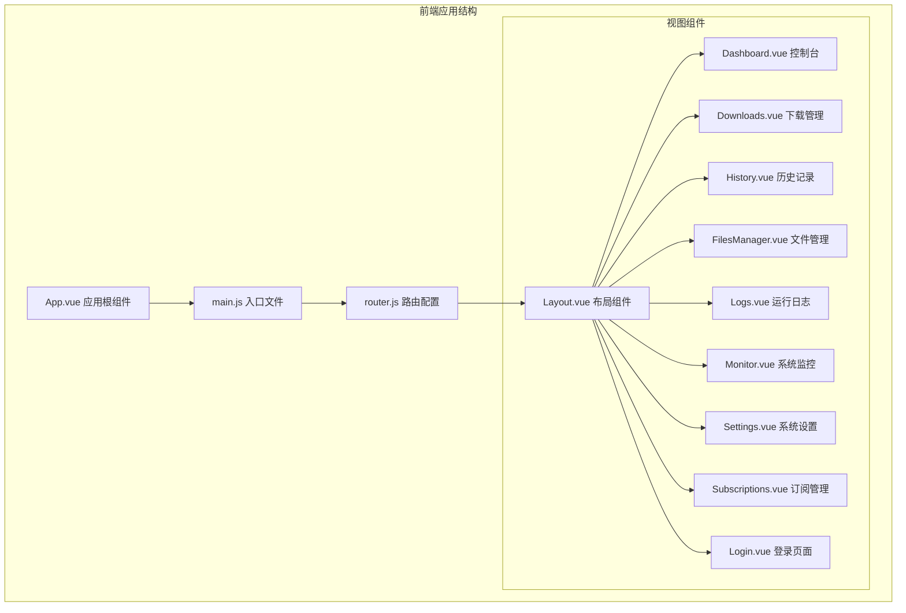
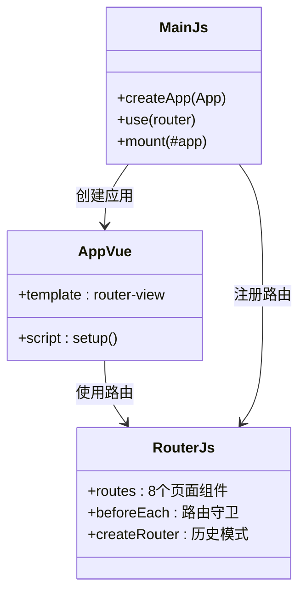
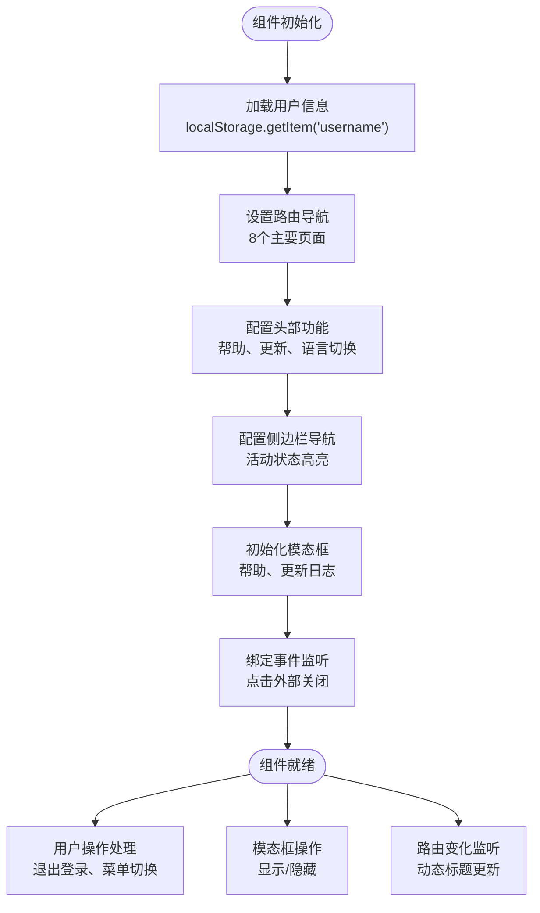
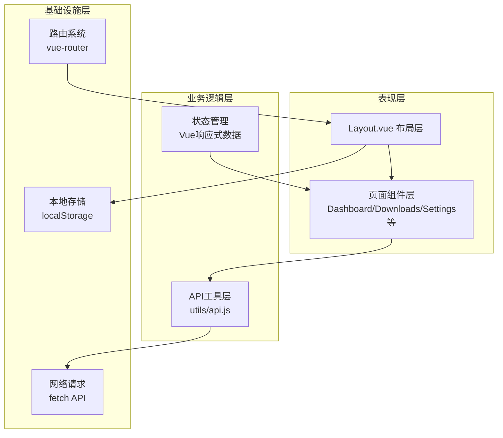
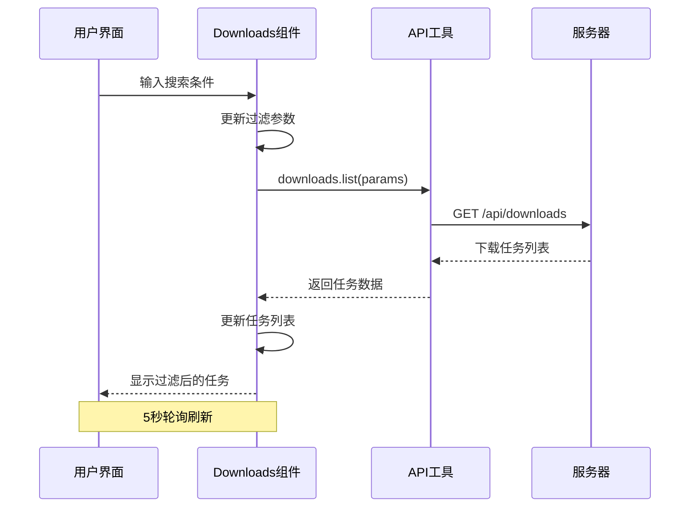
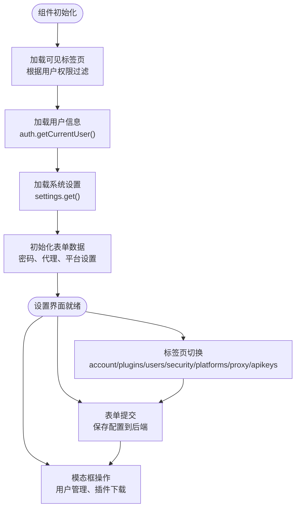
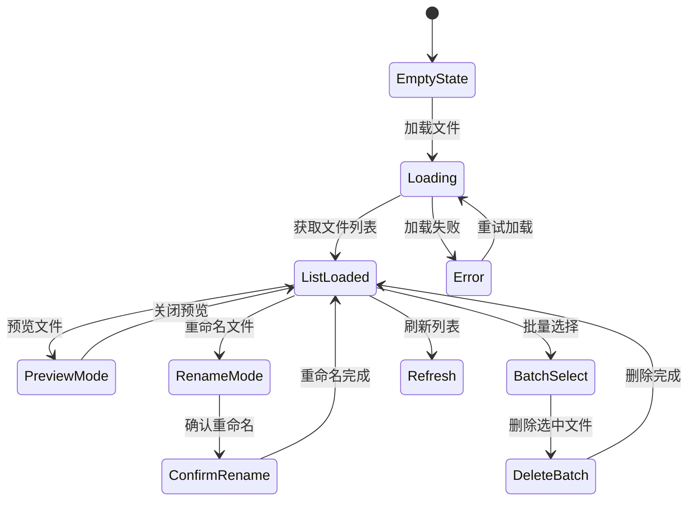
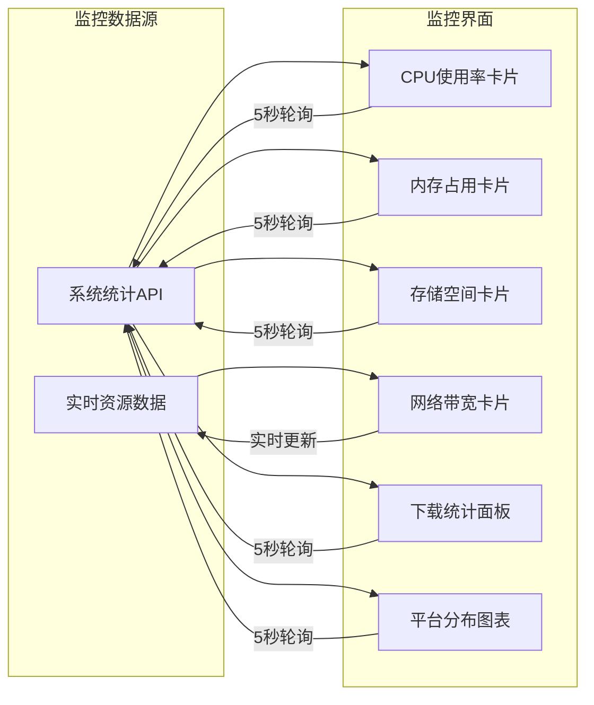

# 组件系统设计

<cite>
**本文档引用的文件**
- [frontend/src/App.vue](file://frontend/src/App.vue)
- [frontend/src/main.js](file://frontend/src/main.js)
- [frontend/src/router.js](file://frontend/src/router.js)
- [frontend/src/views/Layout.vue](file://frontend/src/views/Layout.vue)
- [frontend/src/views/Dashboard.vue](file://frontend/src/views/Dashboard.vue)
- [frontend/src/views/Downloads.vue](file://frontend/src/views/Downloads.vue)
- [frontend/src/views/History.vue](file://frontend/src/views/History.vue)
- [frontend/src/views/FilesManager.vue](file://frontend/src/views/FilesManager.vue)
- [frontend/src/views/Logs.vue](file://frontend/src/views/Logs.vue)
- [frontend/src/views/Monitor.vue](file://frontend/src/views/Monitor.vue)
- [frontend/src/views/Settings.vue](file://frontend/src/views/Settings.vue)
- [frontend/src/views/Subscriptions.vue](file://frontend/src/views/Subscriptions.vue)
- [frontend/src/views/Login.vue](file://frontend/src/views/Login.vue)
- [frontend/src/utils/api.js](file://frontend/src/utils/api.js)
- [frontend/package.json](file://frontend/package.json)
</cite>

## 目录
1. [引言](#引言)
2. [项目结构](#项目结构)
3. [核心组件](#核心组件)
4. [架构概览](#架构概览)
5. [详细组件分析](#详细组件分析)
6. [依赖关系分析](#依赖关系分析)
7. [性能考虑](#性能考虑)
8. [故障排除指南](#故障排除指南)
9. [结论](#结论)
10. [附录](#附录)

## 引言

BoscoTsang 是一个基于 Vue 3 的前端组件系统，提供了完整的下载管理解决方案。该系统采用模块化设计，通过清晰的组件层次结构实现了功能分离和代码复用。

本设计文档深入分析了组件系统的架构模式、实现方法和最佳实践，涵盖了页面级组件的功能职责、布局组件的设计原则、组件间通信机制以及开发规范。

## 项目结构

前端项目采用标准的 Vue 3 单页应用结构：



**图表来源**
- [frontend/src/App.vue:1-7](file://frontend/src/App.vue#L1-L7)
- [frontend/src/main.js:1-7](file://frontend/src/main.js#L1-L7)
- [frontend/src/router.js:1-48](file://frontend/src/router.js#L1-L48)

**章节来源**
- [frontend/src/App.vue:1-7](file://frontend/src/App.vue#L1-L7)
- [frontend/src/main.js:1-7](file://frontend/src/main.js#L1-L7)
- [frontend/src/router.js:1-48](file://frontend/src/router.js#L1-L48)

## 核心组件

### 应用入口组件

应用入口通过简洁的结构实现全局路由渲染：



**图表来源**
- [frontend/src/App.vue:1-7](file://frontend/src/App.vue#L1-L7)
- [frontend/src/main.js:1-7](file://frontend/src/main.js#L1-L7)
- [frontend/src/router.js:1-48](file://frontend/src/router.js#L1-L48)

### 布局组件架构

Layout.vue 作为核心布局组件，实现了完整的导航和内容管理：



**图表来源**
- [frontend/src/views/Layout.vue:137-191](file://frontend/src/views/Layout.vue#L137-L191)

**章节来源**
- [frontend/src/views/Layout.vue:1-462](file://frontend/src/views/Layout.vue#L1-L462)

## 架构概览

系统采用分层架构设计，实现了清晰的关注点分离：



**图表来源**
- [frontend/src/utils/api.js:1-274](file://frontend/src/utils/api.js#L1-L274)
- [frontend/src/router.js:1-48](file://frontend/src/router.js#L1-L48)

### 组件通信机制

系统实现了多种组件通信方式：

1. **父子组件通信**：通过 props 和事件传递数据
2. **兄弟组件通信**：通过共享状态和事件总线
3. **跨层级通信**：通过全局状态管理和路由参数

**章节来源**
- [frontend/src/views/Dashboard.vue:214-310](file://frontend/src/views/Dashboard.vue#L214-L310)
- [frontend/src/views/Downloads.vue:150-259](file://frontend/src/views/Downloads.vue#L150-L259)

## 详细组件分析

### Dashboard 控制台组件

Dashboard 组件作为系统的核心控制台，集成了多种功能模块：

```mermaid
classDiagram
class DashboardVue {
+quickUrl : ref('')
+downloadQuality : ref('best')
+stats : ref({})
+chartData7d : computed
+quickDownload() : Promise
+loadStats() : Promise
+formatSize(bytes) : string
+getPlatformPercent(count) : number
}
class ChartJS {
+register() : void
+CategoryScale
+LinearScale
+LineElement
}
class ApiUtils {
+statistics.get(days) : Promise
+downloads.start(url, quality) : Promise
}
DashboardVue --> ChartJS : 使用图表库
DashboardVue --> ApiUtils : 调用API
DashboardVue --> "30秒定时器" : 数据刷新
```

**图表来源**
- [frontend/src/views/Dashboard.vue:214-310](file://frontend/src/views/Dashboard.vue#L214-L310)
- [frontend/src/utils/api.js:67-91](file://frontend/src/utils/api.js#L67-L91)

#### 核心功能特性

1. **快速下载功能**：支持多平台链接解析和质量选择
2. **统计仪表板**：实时显示系统资源使用情况
3. **趋势分析**：7天下载趋势图表展示
4. **平台分布**：各平台下载占比统计

**章节来源**
- [frontend/src/views/Dashboard.vue:1-599](file://frontend/src/views/Dashboard.vue#L1-L599)

### Downloads 下载管理组件

Downloads 组件提供了完整的下载任务管理功能：



**图表来源**
- [frontend/src/views/Downloads.vue:202-218](file://frontend/src/views/Downloads.vue#L202-L218)
- [frontend/src/utils/api.js:78-91](file://frontend/src/utils/api.js#L78-L91)

#### 关键特性

1. **实时状态监控**：5秒自动刷新下载状态
2. **多维度筛选**：按平台、状态、类型过滤
3. **批量操作**：支持批量重试、重命名、删除
4. **进度跟踪**：详细的下载进度和速度显示

**章节来源**
- [frontend/src/views/Downloads.vue:1-355](file://frontend/src/views/Downloads.vue#L1-L355)

### Settings 系统设置组件

Settings 组件采用标签页设计，提供了丰富的配置选项：



**图表来源**
- [frontend/src/views/Settings.vue:641-772](file://frontend/src/views/Settings.vue#L641-L772)

#### 功能模块

1. **账户管理**：头像上传、个人信息查看
2. **用户管理**：用户列表、角色分配、状态控制
3. **安全配置**：密码修改、双因子认证
4. **平台设置**：多平台配置、Cookies管理
5. **网络代理**：HTTP/HTTPS代理配置
6. **API密钥**：密钥创建、管理、状态控制

**章节来源**
- [frontend/src/views/Settings.vue:1-800](file://frontend/src/views/Settings.vue#L1-L800)

### FilesManager 文件管理组件

FilesManager 组件提供了完整的文件管理系统：



**图表来源**
- [frontend/src/views/FilesManager.vue:99-246](file://frontend/src/views/FilesManager.vue#L99-L246)

#### 核心功能

1. **文件预览**：支持图片、视频、音频在线预览
2. **批量操作**：全选、批量删除、批量重命名
3. **格式检测**：自动识别文件类型并提供相应操作
4. **流式传输**：支持大文件的流式下载

**章节来源**
- [frontend/src/views/FilesManager.vue:1-455](file://frontend/src/views/FilesManager.vue#L1-L455)

### Monitor 系统监控组件

Monitor 组件专注于系统资源监控：



**图表来源**
- [frontend/src/views/Monitor.vue:138-189](file://frontend/src/views/Monitor.vue#L138-L189)

**章节来源**
- [frontend/src/views/Monitor.vue:1-302](file://frontend/src/views/Monitor.vue#L1-L302)

### 布局组件设计原则

Layout 组件作为应用的基础骨架，遵循以下设计原则：

1. **响应式设计**：适配不同屏幕尺寸
2. **主题一致性**：统一的颜色方案和字体规范
3. **可访问性**：键盘导航和屏幕阅读器支持
4. **性能优化**：懒加载和虚拟滚动

**章节来源**
- [frontend/src/views/Layout.vue:193-462](file://frontend/src/views/Layout.vue#L193-L462)

## 依赖关系分析

### 技术栈依赖

```mermaid
graph TB
subgraph "核心依赖"
A[Vue 3.5.34]
B[Vue Router 4.5.0]
C[Chart.js 4.4.0]
D[Vue Chart.js 5.3.0]
E[Axios 1.7.0]
end
subgraph "构建工具"
F[Vite 8.0.12]
G[@vitejs/plugin-vue 6.0.6]
end
subgraph "应用组件"
H[页面组件]
I[布局组件]
J[工具函数]
end
A --> H
B --> H
C --> H
D --> H
E --> J
F --> H
G --> H
```

**图表来源**
- [frontend/package.json:11-22](file://frontend/package.json#L11-L22)

### 组件耦合度分析

系统采用了低耦合的设计模式：

1. **组件独立性**：每个页面组件相对独立，减少相互依赖
2. **API抽象层**：通过统一的 API 工具层处理所有网络请求
3. **状态共享**：通过 Vue 响应式系统实现状态共享
4. **事件通信**：使用事件总线进行松散耦合的组件通信

**章节来源**
- [frontend/src/utils/api.js:1-274](file://frontend/src/utils/api.js#L1-L274)

## 性能考虑

### 优化策略

1. **懒加载**：路由级别的代码分割
2. **虚拟滚动**：大数据列表的性能优化
3. **缓存机制**：本地存储和请求缓存
4. **防抖节流**：输入框和搜索功能的性能优化

### 内存管理

- 定时器清理：组件卸载时清除所有定时器
- 事件监听器：组件销毁时移除事件监听
- 大对象处理：及时释放不需要的大对象引用

## 故障排除指南

### 常见问题及解决方案

1. **登录认证失败**
   - 检查 token 是否存在和有效
   - 验证后端 API 端点可达性
   - 确认 CORS 配置正确

2. **图表渲染异常**
   - 检查 Chart.js 版本兼容性
   - 验证数据格式和结构
   - 确认容器元素可见性

3. **文件下载失败**
   - 验证文件路径和权限
   - 检查 token 有效性
   - 确认文件存在且未被删除

**章节来源**
- [frontend/src/utils/api.js:24-35](file://frontend/src/utils/api.js#L24-L35)

## 结论

BoscoTsang 的组件系统设计体现了现代前端开发的最佳实践：

1. **模块化架构**：清晰的组件边界和职责分离
2. **响应式设计**：适应不同设备和屏幕尺寸
3. **性能优化**：合理的数据加载和渲染策略
4. **可维护性**：标准化的代码结构和开发流程

该系统为后续的功能扩展和维护奠定了坚实的基础，同时为开发者提供了良好的开发体验。

## 附录

### 开发规范

1. **代码风格**：遵循 Vue 3 Composition API 规范
2. **命名约定**：组件使用 PascalCase，文件使用 kebab-case
3. **错误处理**：统一的错误捕获和用户反馈机制
4. **文档注释**：关键函数和复杂逻辑的详细注释

### 最佳实践建议

1. **组件设计**：单一职责原则，避免过度复杂的组件
2. **状态管理**：合理使用 props 和 emits 进行组件通信
3. **异步处理**：使用 async/await 处理异步操作
4. **资源管理**：及时清理定时器和事件监听器