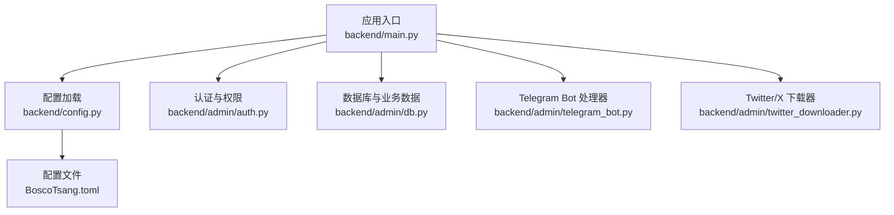
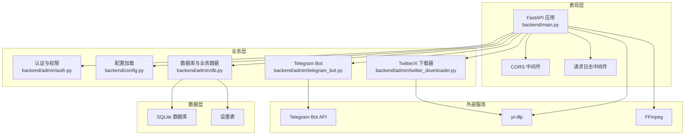
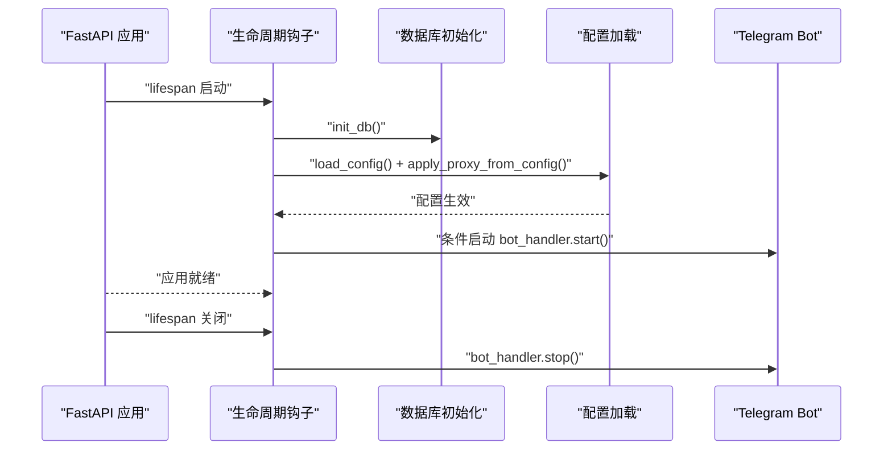
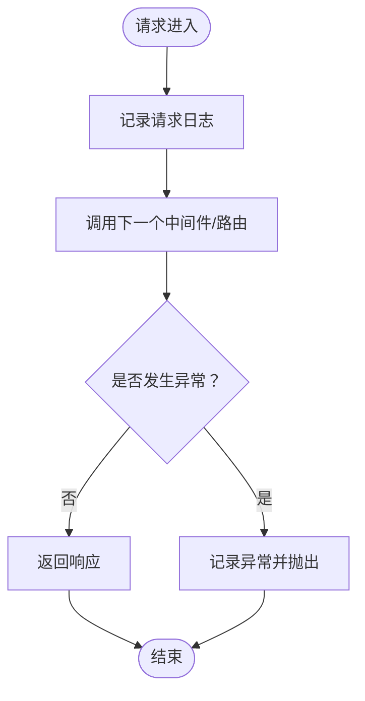
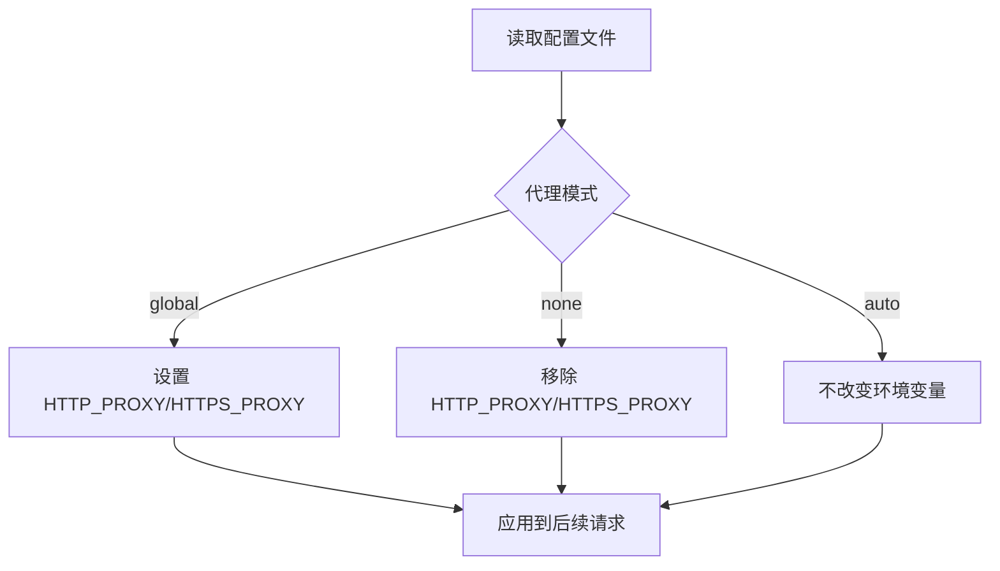
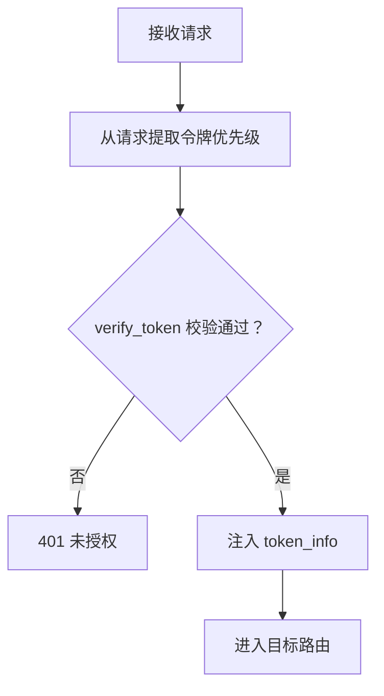
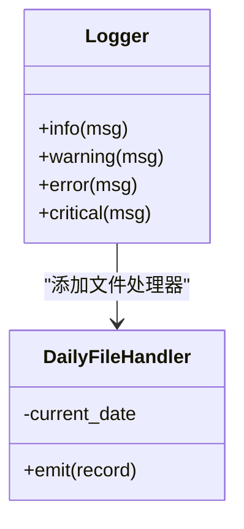
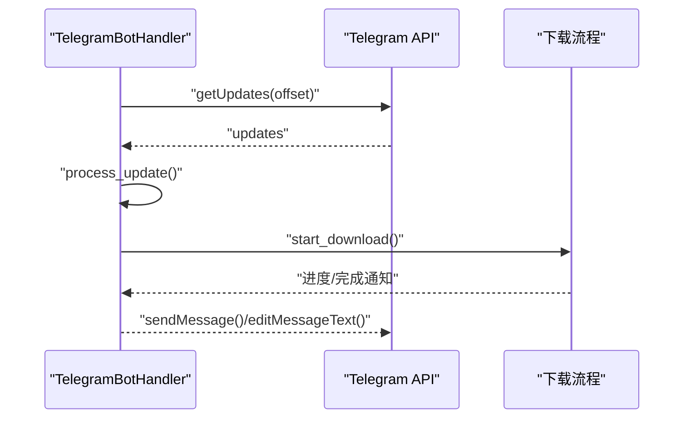
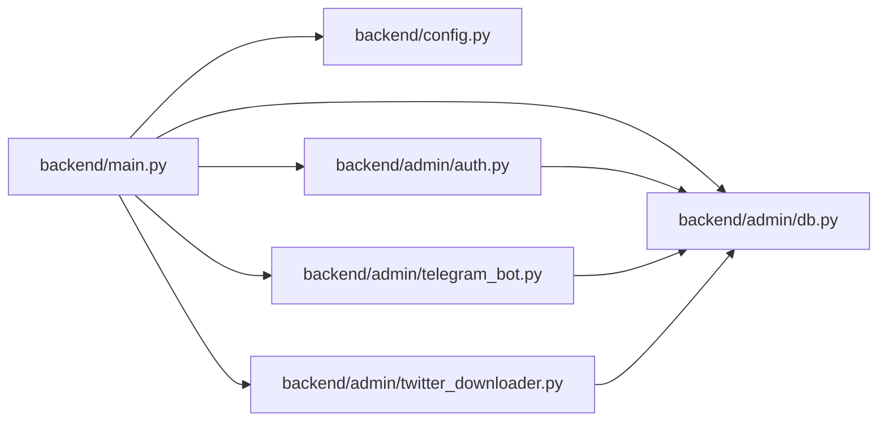

# FastAPI 应用架构

<cite>
**本文档引用的文件**
- [backend/main.py](file://backend/main.py)
- [backend/config.py](file://backend/config.py)
- [backend/admin/auth.py](file://backend/admin/auth.py)
- [backend/admin/db.py](file://backend/admin/db.py)
- [backend/admin/telegram_bot.py](file://backend/admin/telegram_bot.py)
- [backend/admin/twitter_downloader.py](file://backend/admin/twitter_downloader.py)
- [BoscoTsang.toml](file://BoscoTsang.toml)
</cite>

## 目录
1. [引言](#引言)
2. [项目结构](#项目结构)
3. [核心组件](#核心组件)
4. [架构总览](#架构总览)
5. [详细组件分析](#详细组件分析)
6. [依赖关系分析](#依赖关系分析)
7. [性能考虑](#性能考虑)
8. [故障排除指南](#故障排除指南)
9. [结论](#结论)
10. [附录](#附录)

## 引言
本文件面向 BoscoTsang FastAPI 应用的架构与实现，围绕应用初始化、生命周期管理、中间件与 CORS 配置、配置加载机制、日志系统与环境变量处理、路由组织与依赖注入模式、异常处理策略展开，并提供扩展新 API 端点、中间件与配置行为的最佳实践与图示说明。目标是帮助开发者在理解现有实现的基础上，安全高效地进行功能扩展与维护。

## 项目结构
后端采用 FastAPI 主入口集中定义路由与中间件，按功能域拆分模块：
- 应用入口与路由：backend/main.py
- 配置加载与代理策略：backend/config.py
- 认证与权限控制：backend/admin/auth.py
- 数据持久化与业务数据：backend/admin/db.py
- Telegram Bot 处理器：backend/admin/telegram_bot.py
- Twitter/X 专用下载器：backend/admin/twitter_downloader.py
- 应用配置文件：BoscoTsang.toml

图表来源
- [backend/main.py:133-146](file://backend/main.py#L133-L146)
- [backend/config.py:29-34](file://backend/config.py#L29-L34)
- [backend/admin/auth.py:16-61](file://backend/admin/auth.py#L16-L61)
- [backend/admin/db.py:29-213](file://backend/admin/db.py#L29-L213)
- [backend/admin/telegram_bot.py:43-86](file://backend/admin/telegram_bot.py#L43-L86)
- [backend/admin/twitter_downloader.py:23-54](file://backend/admin/twitter_downloader.py#L23-L54)
- [BoscoTsang.toml:1-28](file://BoscoTsang.toml#L1-L28)

章节来源
- [backend/main.py:133-146](file://backend/main.py#L133-L146)
- [backend/config.py:29-34](file://backend/config.py#L29-L34)
- [BoscoTsang.toml:1-28](file://BoscoTsang.toml#L1-L28)

## 核心组件
- 应用初始化与生命周期
  - 使用 lifespan 钩子在启动时初始化数据库、读取配置并按设置启动 Telegram Bot，在关闭时优雅停止。
  - 参考路径：[backend/main.py:108-130](file://backend/main.py#L108-L130)
- 中间件与 CORS
  - 注册 CORSMiddleware，允许任意来源、凭证、方法与头部，便于前端跨域访问。
  - 参考路径：[backend/main.py:140-146](file://backend/main.py#L140-L146)
- 日志系统
  - 自定义每日滚动文件处理器，结合控制台输出，统一格式化日志。
  - 参考路径：[backend/main.py:67-94](file://backend/main.py#L67-L94)
- 配置加载与代理策略
  - 从 BoscoTsang.toml 加载配置，支持全局/禁用/自动三种模式，按需设置环境变量。
  - 参考路径：[backend/config.py:29-34](file://backend/config.py#L29-L34)、[backend/config.py:111-132](file://backend/config.py#L111-L132)
- 认证与权限控制
  - 支持 Bearer Token 与 X-API-Key，提供 require_auth 与 require_admin 装饰器。
  - 参考路径：[backend/admin/auth.py:16-61](file://backend/admin/auth.py#L16-L61)、[backend/admin/auth.py:110-139](file://backend/admin/auth.py#L110-L139)、[backend/admin/auth.py:142-168](file://backend/admin/auth.py#L142-L168)
- 数据层与业务数据
  - SQLite 初始化与表结构，用户、任务、历史、订阅、API Key、设置、Telegram 用户绑定等。
  - 参考路径：[backend/admin/db.py:29-213](file://backend/admin/db.py#L29-L213)
- Telegram Bot 与 Twitter/X 下载
  - 异步轮询 Telegram 消息并触发下载；Twitter/X 专用下载器支持视频/GIF/图片。
  - 参考路径：[backend/admin/telegram_bot.py:43-86](file://backend/admin/telegram_bot.py#L43-L86)、[backend/admin/twitter_downloader.py:23-54](file://backend/admin/twitter_downloader.py#L23-L54)

章节来源
- [backend/main.py:67-94](file://backend/main.py#L67-L94)
- [backend/main.py:108-130](file://backend/main.py#L108-L130)
- [backend/main.py:140-146](file://backend/main.py#L140-L146)
- [backend/config.py:29-34](file://backend/config.py#L29-L34)
- [backend/config.py:111-132](file://backend/config.py#L111-L132)
- [backend/admin/auth.py:16-61](file://backend/admin/auth.py#L16-L61)
- [backend/admin/auth.py:110-139](file://backend/admin/auth.py#L110-L139)
- [backend/admin/auth.py:142-168](file://backend/admin/auth.py#L142-L168)
- [backend/admin/db.py:29-213](file://backend/admin/db.py#L29-L213)
- [backend/admin/telegram_bot.py:43-86](file://backend/admin/telegram_bot.py#L43-L86)
- [backend/admin/twitter_downloader.py:23-54](file://backend/admin/twitter_downloader.py#L23-L54)

## 架构总览
应用采用模块化分层：
- 表现层：FastAPI 路由与中间件
- 业务层：认证、下载、文件管理、订阅、设置等
- 数据层：SQLite 存储与设置表
- 外部集成：Telegram Bot API、yt-dlp、FFmpeg

图表来源
- [backend/main.py:133-146](file://backend/main.py#L133-L146)
- [backend/admin/auth.py:16-61](file://backend/admin/auth.py#L16-L61)
- [backend/admin/db.py:29-213](file://backend/admin/db.py#L29-L213)
- [backend/admin/telegram_bot.py:43-86](file://backend/admin/telegram_bot.py#L43-L86)
- [backend/admin/twitter_downloader.py:23-54](file://backend/admin/twitter_downloader.py#L23-L54)

## 详细组件分析

### 应用初始化与生命周期
- 启动阶段
  - 初始化数据库表结构
  - 读取并应用配置（代理模式、HTTP/HTTPS 代理）
  - 按设置条件启动 Telegram Bot
- 关闭阶段
  - 优雅停止 Telegram Bot

图表来源
- [backend/main.py:108-130](file://backend/main.py#L108-L130)
- [backend/config.py:29-34](file://backend/config.py#L29-L34)
- [backend/config.py:111-132](file://backend/config.py#L111-L132)
- [backend/admin/telegram_bot.py:56-78](file://backend/admin/telegram_bot.py#L56-L78)

章节来源
- [backend/main.py:108-130](file://backend/main.py#L108-L130)
- [backend/config.py:29-34](file://backend/config.py#L29-L34)
- [backend/config.py:111-132](file://backend/config.py#L111-L132)
- [backend/admin/telegram_bot.py:56-78](file://backend/admin/telegram_bot.py#L56-L78)

### 中间件与 CORS
- 注册 CORSMiddleware，允许任意来源、凭证、方法与头部，满足前端跨域访问需求。
- 自定义 HTTP 中间件记录请求与响应状态，捕获未处理异常并记录。

图表来源
- [backend/main.py:140-146](file://backend/main.py#L140-L146)
- [backend/main.py:148-157](file://backend/main.py#L148-L157)

章节来源
- [backend/main.py:140-146](file://backend/main.py#L140-L146)
- [backend/main.py:148-157](file://backend/main.py#L148-L157)

### 配置加载机制与环境变量处理
- 配置文件：BoscoTsang.toml
  - proxy.enabled、proxy.mode、proxy.http、proxy.https、proxy.bypass_cidrs
  - download.download_dir
  - logging.level
- 加载逻辑：优先从 APP_BASE_DIR 指定目录加载，否则回退到项目根目录
- 代理模式：
  - global：设置 HTTP_PROXY/HTTPS_PROXY 环境变量
  - none：移除上述环境变量
  - auto：不在这里全局设置，交由请求逻辑判断直连/代理

图表来源
- [BoscoTsang.toml:4-19](file://BoscoTsang.toml#L4-L19)
- [backend/config.py:29-34](file://backend/config.py#L29-L34)
- [backend/config.py:111-132](file://backend/config.py#L111-L132)

章节来源
- [BoscoTsang.toml:1-28](file://BoscoTsang.toml#L1-L28)
- [backend/config.py:29-34](file://backend/config.py#L29-L34)
- [backend/config.py:111-132](file://backend/config.py#L111-L132)

### 认证与权限控制
- 支持来源优先级：X-API-Key 头 > Authorization 头 > 查询参数 token
- require_auth：校验令牌或 API Key，注入 token_info
- require_admin：在 require_auth 基础上校验角色为 admin

图表来源
- [backend/admin/auth.py:70-107](file://backend/admin/auth.py#L70-L107)
- [backend/admin/auth.py:110-139](file://backend/admin/auth.py#L110-L139)
- [backend/admin/auth.py:142-168](file://backend/admin/auth.py#L142-L168)

章节来源
- [backend/admin/auth.py:70-107](file://backend/admin/auth.py#L70-L107)
- [backend/admin/auth.py:110-139](file://backend/admin/auth.py#L110-L139)
- [backend/admin/auth.py:142-168](file://backend/admin/auth.py#L142-L168)

### 日志系统设计
- 控制台与每日滚动文件双重输出
- 格式化器统一时间与级别
- write_log 包装器按级别写入

图表来源
- [backend/main.py:67-94](file://backend/main.py#L67-L94)
- [backend/main.py:237-251](file://backend/main.py#L237-L251)

章节来源
- [backend/main.py:67-94](file://backend/main.py#L67-L94)
- [backend/main.py:237-251](file://backend/main.py#L237-L251)

### 路由组织与依赖注入模式
- 路由集中在 backend/main.py，按功能域划分（认证、Telegram 登录、用户管理、API Key、下载、文件管理、订阅、设置、统计、日志）
- 依赖注入：
  - Header/Query/Body 参数直接注入
  - require_auth 装饰器注入 authorization 参数
  - 通过 get_token_info 获取用户上下文

章节来源
- [backend/main.py:336-1599](file://backend/main.py#L336-L1599)
- [backend/admin/auth.py:110-139](file://backend/admin/auth.py#L110-L139)

### 异常处理策略
- 路由层：使用 HTTPException 返回标准错误码与消息
- 中间件层：捕获未处理异常并记录，确保错误不会泄漏
- 下载流程：yt-dlp 回退策略与错误聚合，更新任务状态与统计

章节来源
- [backend/main.py:336-361](file://backend/main.py#L336-L361)
- [backend/main.py:148-157](file://backend/main.py#L148-L157)
- [backend/main.py:892-980](file://backend/main.py#L892-L980)

### Telegram Bot 集成
- 异步轮询 Telegram 更新，支持命令与普通消息
- 根据设置限制允许用户、处理下载任务并反馈进度

图表来源
- [backend/admin/telegram_bot.py:88-153](file://backend/admin/telegram_bot.py#L88-L153)
- [backend/admin/telegram_bot.py:260-332](file://backend/admin/telegram_bot.py#L260-L332)

章节来源
- [backend/admin/telegram_bot.py:88-153](file://backend/admin/telegram_bot.py#L88-L153)
- [backend/admin/telegram_bot.py:260-332](file://backend/admin/telegram_bot.py#L260-L332)

### Twitter/X 下载器
- 支持视频、图片下载，可配置是否下载视频/图片、最佳质量与分辨率
- 从设置或 cookies 目录读取 cookies，必要时写入临时文件

章节来源
- [backend/admin/twitter_downloader.py:23-54](file://backend/admin/twitter_downloader.py#L23-L54)
- [backend/admin/twitter_downloader.py:75-108](file://backend/admin/twitter_downloader.py#L75-L108)
- [backend/admin/twitter_downloader.py:110-155](file://backend/admin/twitter_downloader.py#L110-L155)

## 依赖关系分析
- 模块耦合
  - main.py 依赖 config、auth、db、telegram_bot、twitter_downloader
  - config 与 db 作为基础设施被上层路由与业务模块使用
  - telegram_bot 与 twitter_downloader 通过 db 读写设置与任务
- 外部依赖
  - yt-dlp、FFmpeg、SQLite、httpx、psutil

图表来源
- [backend/main.py:30-52](file://backend/main.py#L30-L52)
- [backend/admin/auth.py:11](file://backend/admin/auth.py#L11)
- [backend/admin/db.py:15-21](file://backend/admin/db.py#L15-L21)
- [backend/admin/telegram_bot.py:14-20](file://backend/admin/telegram_bot.py#L14-L20)
- [backend/admin/twitter_downloader.py:10](file://backend/admin/twitter_downloader.py#L10)

章节来源
- [backend/main.py:30-52](file://backend/main.py#L30-L52)
- [backend/admin/auth.py:11](file://backend/admin/auth.py#L11)
- [backend/admin/db.py:15-21](file://backend/admin/db.py#L15-L21)
- [backend/admin/telegram_bot.py:14-20](file://backend/admin/telegram_bot.py#L14-L20)
- [backend/admin/twitter_downloader.py:10](file://backend/admin/twitter_downloader.py#L10)

## 性能考虑
- 下载并发与回退策略
  - 首次尝试失败后进行探测与多种格式回退，提升成功率
  - 参考路径：[backend/main.py:892-980](file://backend/main.py#L892-L980)
- 代理与网络
  - auto 模式下按域名/IP/CIDR 判断直连/代理，减少不必要的代理开销
  - 参考路径：[backend/config.py:49-97](file://backend/config.py#L49-L97)
- 文件流式传输
  - 视频转码采用 FFmpeg 实时转码并 StreamingResponse 输出，降低内存占用
  - 参考路径：[backend/main.py:1285-1326](file://backend/main.py#L1285-L1326)
- 资源监控
  - 统计接口采集 CPU、内存、磁盘、网络 IO，辅助性能分析
  - 参考路径：[backend/main.py:1534-1578](file://backend/main.py#L1534-L1578)

## 故障排除指南
- 代理相关
  - 使用 /api/settings/test-proxy 接口测试代理连通性
  - 参考路径：[backend/main.py:1500-1531](file://backend/main.py#L1500-L1531)
- Telegram Bot
  - 检查 telegram_bot_token 与 telegram_login_enabled 设置
  - 参考路径：[backend/admin/telegram_bot.py:63-69](file://backend/admin/telegram_bot.py#L63-L69)
- 下载失败
  - 查看日志文件（按日期分隔），确认 yt-dlp 回退错误集合
  - 参考路径：[backend/main.py:966-980](file://backend/main.py#L966-L980)
- 权限与认证
  - 确认 X-API-Key 或 Bearer Token 有效，且 API Key 未过期/未受限
  - 参考路径：[backend/admin/auth.py:690-751](file://backend/admin/auth.py#L690-L751)

章节来源
- [backend/main.py:1500-1531](file://backend/main.py#L1500-L1531)
- [backend/admin/telegram_bot.py:63-69](file://backend/admin/telegram_bot.py#L63-L69)
- [backend/main.py:966-980](file://backend/main.py#L966-L980)
- [backend/admin/auth.py:690-751](file://backend/admin/auth.py#L690-L751)

## 结论
该应用以 FastAPI 为核心，结合模块化设计与清晰的生命周期管理，实现了认证、下载、文件管理、订阅与外部集成等功能。通过配置驱动的代理策略、完善的日志体系与异常处理，保证了运行稳定性与可维护性。建议在扩展新功能时遵循现有中间件、认证与配置加载模式，确保一致性和安全性。

## 附录

### 扩展新 API 端点示例（步骤指引）
- 在 backend/main.py 中新增路由
  - 参考现有路由风格：[backend/main.py:336-361](file://backend/main.py#L336-L361)
- 如需认证，使用 require_auth 或 require_admin 装饰器
  - 参考装饰器实现：[backend/admin/auth.py:110-139](file://backend/admin/auth.py#L110-L139)、[backend/admin/auth.py:142-168](file://backend/admin/auth.py#L142-L168)
- 如需访问设置或数据库，调用 backend/admin/db.py 中的方法
  - 参考设置读写：[backend/admin/db.py:630-647](file://backend/admin/db.py#L630-L647)
- 如需应用配置，调用 backend/config.py 中的工具函数
  - 参考配置加载：[backend/config.py:29-34](file://backend/config.py#L29-L34)

### 添加中间件示例（步骤指引）
- 在 backend/main.py 中 app.add_middleware(...) 注册新中间件
  - 参考现有中间件注册：[backend/main.py:140-146](file://backend/main.py#L140-L146)
- 如需自定义请求/响应处理，可仿照日志中间件实现
  - 参考日志中间件：[backend/main.py:148-157](file://backend/main.py#L148-L157)

### 配置应用行为示例（步骤指引）
- 修改 BoscoTsang.toml 中的 proxy、download、logging 等段落
  - 参考配置文件：[BoscoTsang.toml:1-28](file://BoscoTsang.toml#L1-L28)
- 在启动时加载配置并应用代理策略
  - 参考加载与应用：[backend/main.py:96-101](file://backend/main.py#L96-L101)、[backend/config.py:111-132](file://backend/config.py#L111-L132)