# 后端开发指南

<cite>
**本文档引用的文件**
- [backend/main.py](file://backend/main.py)
- [backend/config.py](file://backend/config.py)
- [backend/admin/auth.py](file://backend/admin/auth.py)
- [backend/admin/db.py](file://backend/admin/db.py)
- [backend/admin/telegram_bot.py](file://backend/admin/telegram_bot.py)
- [backend/admin/twitter_downloader.py](file://backend/admin/twitter_downloader.py)
- [Dockerfile](file://Dockerfile)
- [docker-compose.yml](file://docker-compose.yml)
- [BoscoTsang.toml](file://BoscoTsang.toml)
- [scripts/create_test_data.py](file://scripts/create_test_data.py)
- [scripts/check_db.py](file://scripts/check_db.py)
- [QUICK_REFERENCE.md](file://QUICK_REFERENCE.md)
- [docs/IOS_SHORTCUTS_INTEGRATION_REPORT.md](file://docs/IOS_SHORTCUTS_INTEGRATION_REPORT.md)
</cite>

## 目录
1. [简介](#简介)
2. [项目结构](#项目结构)
3. [核心组件](#核心组件)
4. [架构总览](#架构总览)
5. [详细组件分析](#详细组件分析)
6. [依赖关系分析](#依赖关系分析)
7. [性能考虑](#性能考虑)
8. [故障排除指南](#故障排除指南)
9. [结论](#结论)
10. [附录](#附录)

## 简介
本指南面向 BoscoTsang 后端开发，围绕 FastAPI 应用架构、API 接口设计与实现、数据库设计（SQLite）、认证授权机制（JWT 与 API Key）、下载引擎集成（yt-dlp）等核心技术进行深入讲解。文档同时提供开发环境搭建、调试技巧、性能优化建议，以及扩展功能开发、插件机制与自定义下载处理器的实现方法。

## 项目结构
后端采用模块化组织，核心入口位于 backend/main.py，认证与数据库逻辑分别封装在 backend/admin/auth.py 与 backend/admin/db.py，配置加载与代理策略在 backend/config.py，下载引擎集成通过 yt-dlp 实现，Telegram Bot 与 X/Twitter 专用下载器分别在 backend/admin/telegram_bot.py 与 backend/admin/twitter_downloader.py。

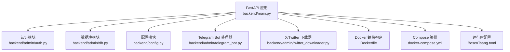

**图表来源**
- [backend/main.py:133-138](file://backend/main.py#L133-L138)
- [backend/admin/auth.py:1-169](file://backend/admin/auth.py#L1-L169)
- [backend/admin/db.py:1-214](file://backend/admin/db.py#L1-L214)
- [backend/config.py:1-135](file://backend/config.py#L1-L135)
- [backend/admin/telegram_bot.py:1-436](file://backend/admin/telegram_bot.py#L1-L436)
- [backend/admin/twitter_downloader.py:1-240](file://backend/admin/twitter_downloader.py#L1-L240)
- [Dockerfile:1-74](file://Dockerfile#L1-L74)
- [docker-compose.yml:1-60](file://docker-compose.yml#L1-L60)
- [BoscoTsang.toml:1-28](file://BoscoTsang.toml#L1-L28)

**章节来源**
- [backend/main.py:133-138](file://backend/main.py#L133-L138)
- [backend/admin/auth.py:1-169](file://backend/admin/auth.py#L1-L169)
- [backend/admin/db.py:1-214](file://backend/admin/db.py#L1-L214)
- [backend/config.py:1-135](file://backend/config.py#L1-L135)
- [backend/admin/telegram_bot.py:1-436](file://backend/admin/telegram_bot.py#L1-L436)
- [backend/admin/twitter_downloader.py:1-240](file://backend/admin/twitter_downloader.py#L1-L240)
- [Dockerfile:1-74](file://Dockerfile#L1-L74)
- [docker-compose.yml:1-60](file://docker-compose.yml#L1-L60)
- [BoscoTsang.toml:1-28](file://BoscoTsang.toml#L1-L28)

## 核心组件
- FastAPI 应用与中间件：统一 CORS、请求日志中间件、生命周期管理（启动/关闭时初始化数据库、启动 Telegram Bot）。
- 认证与授权：支持 Bearer Token 与 X-API-Key，装饰器 require_auth / require_admin 实现权限控制。
- 数据库与模型：SQLite 存储用户、下载任务/历史、订阅、API Key、统计、设置、Telegram 用户绑定等。
- 配置系统：BoscoTsang.toml 加载与代理策略（全局/禁用/自动），并可应用到环境变量。
- 下载引擎：yt-dlp 集成，支持多种质量与格式；X/Twitter 专用下载器；Telegram Bot 自动拉起下载。
- 静态文件与文档：根路径返回前端 index.html 或基础信息；/docs/{doc_name} 提供文档服务。

**章节来源**
- [backend/main.py:108-138](file://backend/main.py#L108-L138)
- [backend/admin/auth.py:110-169](file://backend/admin/auth.py#L110-L169)
- [backend/admin/db.py:29-214](file://backend/admin/db.py#L29-L214)
- [backend/config.py:29-135](file://backend/config.py#L29-L135)
- [backend/main.py:667-800](file://backend/main.py#L667-L800)

## 架构总览
后端采用分层架构：入口层（FastAPI 路由与中间件）、业务层（认证、下载、订阅、设置等）、数据层（SQLite）与外部集成（yt-dlp、Telegram API）。应用通过生命周期钩子在启动时初始化数据库与 Telegram Bot，在关闭时优雅退出。

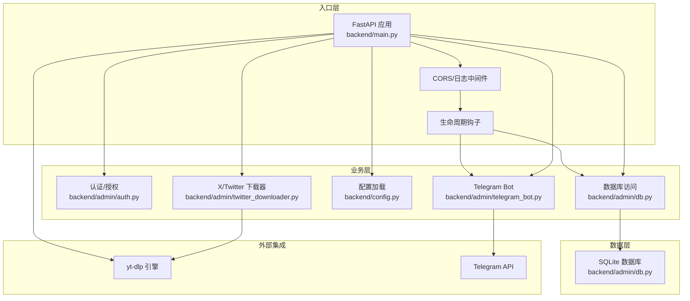

**图表来源**
- [backend/main.py:133-138](file://backend/main.py#L133-L138)
- [backend/admin/auth.py:1-169](file://backend/admin/auth.py#L1-L169)
- [backend/admin/db.py:1-214](file://backend/admin/db.py#L1-L214)
- [backend/admin/telegram_bot.py:1-436](file://backend/admin/telegram_bot.py#L1-L436)
- [backend/admin/twitter_downloader.py:1-240](file://backend/admin/twitter_downloader.py#L1-L240)

## 详细组件分析

### FastAPI 应用与路由设计
- 应用初始化：设置标题、版本、描述，注册 CORS，注入日志中间件。
- 生命周期：启动时初始化数据库、按设置启动 Telegram Bot；关闭时停止 Bot。
- 数据模型：LoginRequest/RegisterRequest/DownloadRequest/ApiKeyRequest 等 Pydantic 模型定义请求体。
- 静态文件与文档：根路径返回前端 index.html；/docs/{doc_name} 提供文档服务。

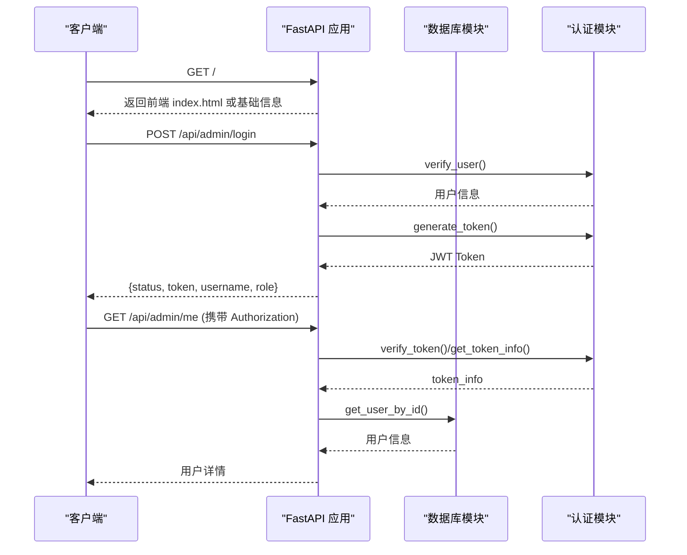

**图表来源**
- [backend/main.py:336-371](file://backend/main.py#L336-L371)
- [backend/admin/auth.py:27-61](file://backend/admin/auth.py#L27-L61)
- [backend/admin/db.py:251-283](file://backend/admin/db.py#L251-L283)

**章节来源**
- [backend/main.py:133-138](file://backend/main.py#L133-L138)
- [backend/main.py:148-158](file://backend/main.py#L148-L158)
- [backend/main.py:161-234](file://backend/main.py#L161-L234)
- [backend/main.py:336-371](file://backend/main.py#L336-L371)
- [backend/main.py:1681-1690](file://backend/main.py#L1681-L1690)

### 认证与授权机制
- Token 生成与校验：generate_token() 生成内存令牌；verify_token() 支持 Bearer 与 API Key；get_token_info() 返回用户信息。
- 权限装饰器：require_auth 与 require_admin 自动从多个来源提取令牌（Header、查询参数等），并注入 token_info。
- API Key 管理：创建、验证、列表、更新状态与设置、删除；支持过期时间、速率限制、作用域。

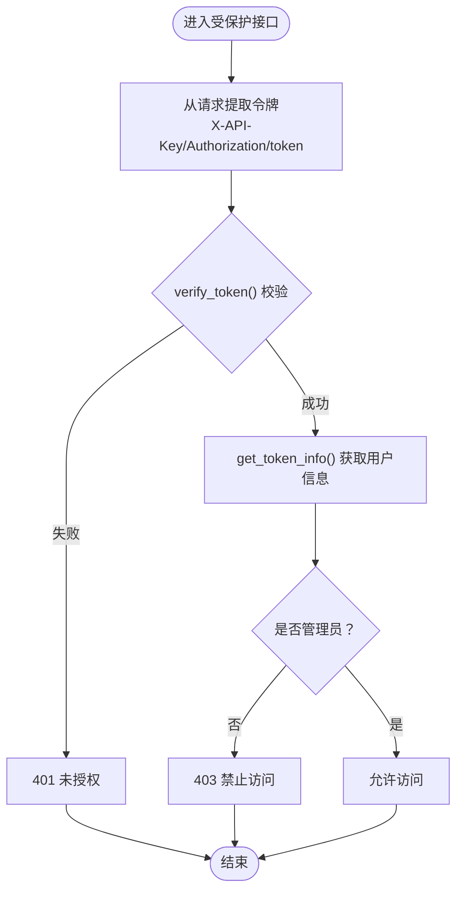

**图表来源**
- [backend/admin/auth.py:70-108](file://backend/admin/auth.py#L70-L108)
- [backend/admin/auth.py:110-169](file://backend/admin/auth.py#L110-L169)

**章节来源**
- [backend/admin/auth.py:16-69](file://backend/admin/auth.py#L16-L69)
- [backend/admin/auth.py:110-169](file://backend/admin/auth.py#L110-L169)
- [backend/admin/db.py:649-791](file://backend/admin/db.py#L649-L791)

### 数据库设计（SQLite）
- 表结构概览：users、download_tasks、download_history、subscriptions、api_keys、invite_codes、statistics、settings、telegram_users。
- 初始化流程：创建表、默认管理员与邀请码、字段迁移（为 api_keys 表添加 scopes、expires_at、rate_limit 等）。
- 事务与一致性：用户 CRUD、下载任务/历史同步更新、订阅管理、API Key 验证与使用统计。

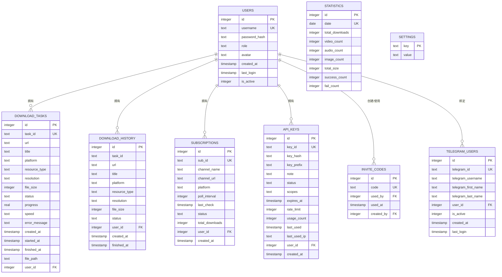

**图表来源**
- [backend/admin/db.py:34-181](file://backend/admin/db.py#L34-L181)

**章节来源**
- [backend/admin/db.py:29-214](file://backend/admin/db.py#L29-L214)
- [backend/admin/db.py:217-356](file://backend/admin/db.py#L217-L356)
- [backend/admin/db.py:359-484](file://backend/admin/db.py#L359-L484)
- [backend/admin/db.py:544-627](file://backend/admin/db.py#L544-L627)
- [backend/admin/db.py:629-648](file://backend/admin/db.py#L629-L648)
- [backend/admin/db.py:649-791](file://backend/admin/db.py#L649-L791)

### 配置系统与代理策略
- 配置加载：优先从 APP_BASE_DIR 下的 BoscoTsang.toml 加载，否则回退到项目根目录。
- 代理策略：支持 enabled/mode/global/none/auto；当 mode=auto 时，基于 is_local_address 判断是否绕过代理。
- 环境变量应用：apply_proxy_from_config() 在 global/none 模式下设置/清除 HTTP_PROXY/HTTPS_PROXY。

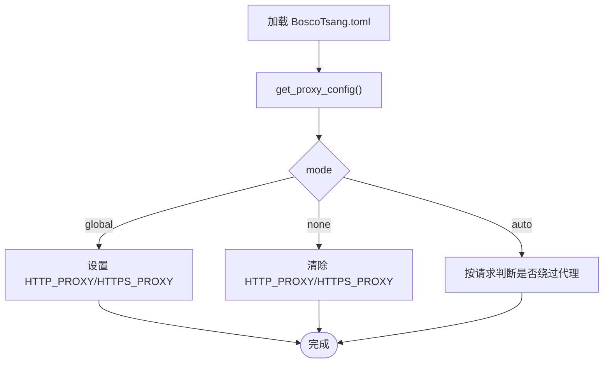

**图表来源**
- [backend/config.py:29-135](file://backend/config.py#L29-L135)

**章节来源**
- [backend/config.py:29-135](file://backend/config.py#L29-L135)
- [BoscoTsang.toml:4-28](file://BoscoTsang.toml#L4-L28)

### 下载引擎集成（yt-dlp）
- 进度回调：ytdl_progress_hook() 解析进度、速度、ETA，更新 DOWNLOAD_PROGRESS 与数据库任务状态。
- 下载执行：run_download() 根据质量参数选择 format/merge_output_format/postprocessors；自动处理代理与 Cookies。
- 文件夹组织：按平台独立目录保存，支持 mp4/webm/audio 等格式与质量选择。

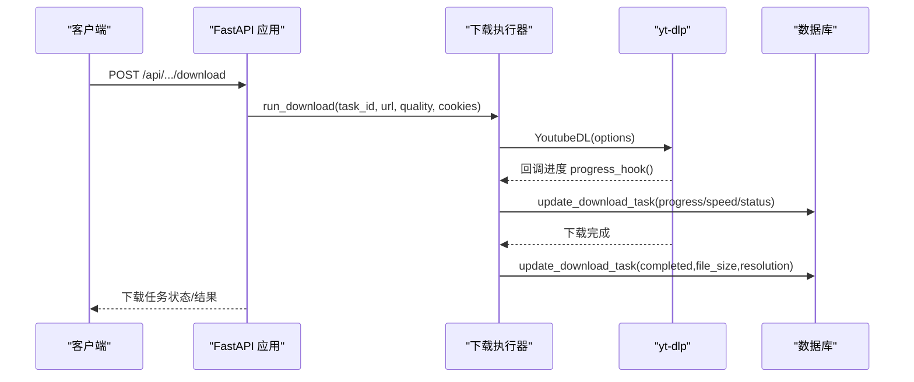

**图表来源**
- [backend/main.py:669-732](file://backend/main.py#L669-L732)
- [backend/main.py:733-800](file://backend/main.py#L733-L800)

**章节来源**
- [backend/main.py:669-732](file://backend/main.py#L669-L732)
- [backend/main.py:733-800](file://backend/main.py#L733-L800)

### Telegram Bot 集成
- 轮询与处理：TelegramBotHandler.start() 长轮询获取更新，处理命令与消息，解析 URL 并创建下载任务。
- 下载流程：后台线程执行 yt-dlp 下载，周期性发送进度消息，完成后通知文件保存位置。
- 错误处理：对 Telegram API 常见错误（401/404/409/429）进行分类处理与日志记录。

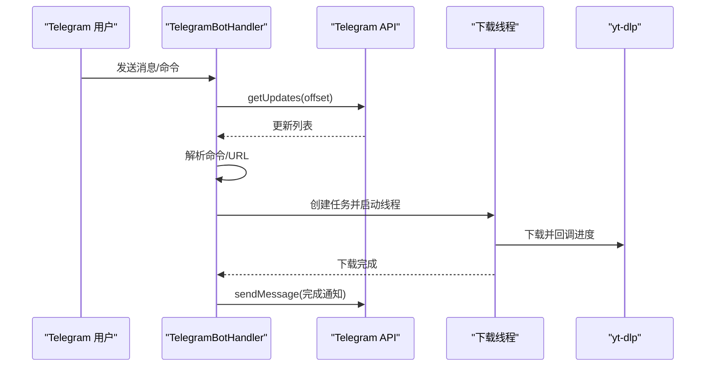

**图表来源**
- [backend/admin/telegram_bot.py:56-153](file://backend/admin/telegram_bot.py#L56-L153)
- [backend/admin/telegram_bot.py:260-333](file://backend/admin/telegram_bot.py#L260-L333)
- [backend/admin/telegram_bot.py:334-369](file://backend/admin/telegram_bot.py#L334-L369)

**章节来源**
- [backend/admin/telegram_bot.py:43-436](file://backend/admin/telegram_bot.py#L43-L436)

### X/Twitter 专用下载器
- Cookies 管理：优先从设置读取，其次从 cookies 目录；支持临时文件写入。
- 下载选项：视频/图片开关、最佳质量、质量限制；支持进度回调。
- 图片提取：从 thumbnails/description/extended_entities 等位置提取图片 URL 并下载。

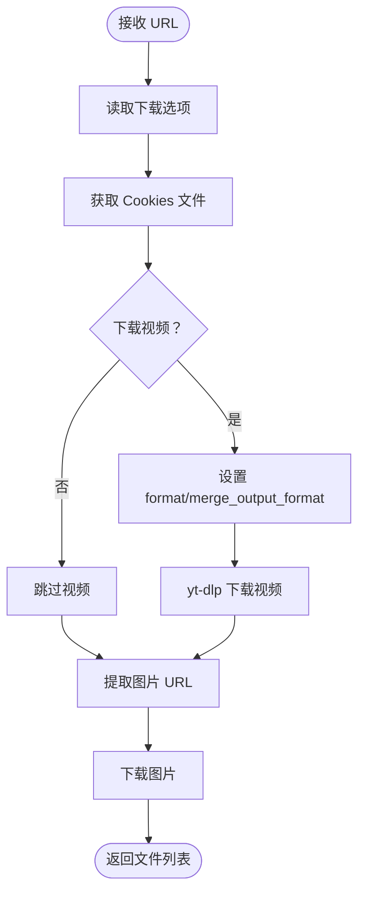

**图表来源**
- [backend/admin/twitter_downloader.py:47-156](file://backend/admin/twitter_downloader.py#L47-L156)

**章节来源**
- [backend/admin/twitter_downloader.py:23-240](file://backend/admin/twitter_downloader.py#L23-L240)

### 插件与扩展机制
- 浏览器插件打包：后端提供插件安装包下载接口，压缩扩展目录并返回 ZIP。
- iOS 快捷指令：新增快捷指令安装页面、配置文件下载与专用下载 API，配合前端插件管理页面展示。

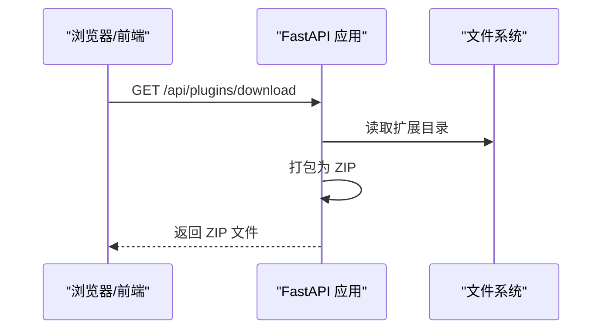

**图表来源**
- [backend/main.py:1657-1678](file://backend/main.py#L1657-L1678)

**章节来源**
- [backend/main.py:1657-1678](file://backend/main.py#L1657-L1678)
- [docs/IOS_SHORTCUTS_INTEGRATION_REPORT.md:1-91](file://docs/IOS_SHORTCUTS_INTEGRATION_REPORT.md#L1-L91)

## 依赖关系分析
- 组件耦合：FastAPI 应用依赖认证、数据库、配置模块；下载器依赖 yt-dlp；Telegram Bot 依赖 Telegram API；X/Twitter 下载器依赖 yt-dlp 与 cookies 设置。
- 外部依赖：FastAPI、Uvicorn、yt-dlp、psutil、python-multipart、tomli、httpx、markdown。
- Docker 集成：Dockerfile 分阶段构建前端与后端，暴露 8000 端口，挂载 downloads/cookies/data/logs。

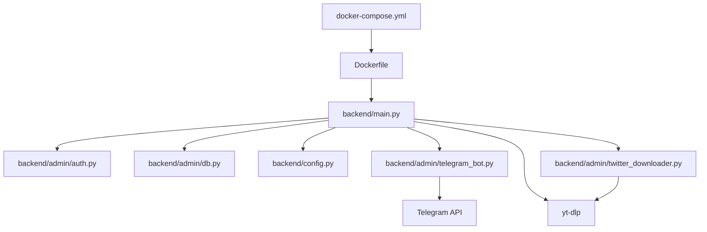

**图表来源**
- [backend/main.py:1-52](file://backend/main.py#L1-L52)
- [Dockerfile:1-74](file://Dockerfile#L1-L74)
- [docker-compose.yml:1-60](file://docker-compose.yml#L1-L60)

**章节来源**
- [Dockerfile:1-74](file://Dockerfile#L1-L74)
- [docker-compose.yml:1-60](file://docker-compose.yml#L1-L60)

## 性能考虑
- 代理策略：auto 模式下按 is_local_address 判断绕过代理，减少不必要的代理开销。
- 下载并发：下载任务在后台线程执行，避免阻塞主事件循环；建议结合队列与速率限制（API Key rate_limit）控制并发。
- 日志轮转：每日日志文件，避免单文件过大；生产环境建议结合系统日志收集。
- 静态资源：前端构建产物复制至 /app/static，减少容器内构建成本。

[本节为通用指导，无需特定文件引用]

## 故障排除指南
- 服务启动与健康检查：docker-compose 提供健康检查，确认 8000 端口可用。
- 日志定位：查看容器日志，关注 Telegram API 返回状态码与异常堆栈。
- 数据库检查：使用 scripts/check_db.py 检查表结构与数据量。
- 测试数据：使用 scripts/create_test_data.py 快速填充测试数据。
- 常见问题：端口冲突（修改 docker-compose.yml 的 host port）、Telegram 409 冲突（等待重试）、代理配置错误（检查 BoscoTsang.toml 与环境变量）。

**章节来源**
- [docker-compose.yml:54-60](file://docker-compose.yml#L54-L60)
- [backend/admin/telegram_bot.py:109-119](file://backend/admin/telegram_bot.py#L109-L119)
- [scripts/check_db.py:1-61](file://scripts/check_db.py#L1-L61)
- [scripts/create_test_data.py:12-84](file://scripts/create_test_data.py#L12-L84)
- [QUICK_REFERENCE.md:142-179](file://QUICK_REFERENCE.md#L142-L179)

## 结论
本指南系统梳理了 BoscoTsang 后端的架构与实现要点，覆盖 FastAPI 应用、认证授权、数据库设计、配置与代理、下载引擎集成、Telegram Bot 与 X/Twitter 专用下载器，以及插件与扩展机制。建议在生产环境中结合 API Key 速率限制、代理策略与日志监控，持续优化并发与稳定性。

[本节为总结，无需特定文件引用]

## 附录
- 开发环境：使用 docker-compose 一键启动，端口映射 8080:8000；默认账号 admin/admin123。
- 配置文件：BoscoTsang.toml 支持 proxy 与 download/logging 等配置项。
- 快速参考：包含常用命令、目录结构、配置指南与故障排查。

**章节来源**
- [docker-compose.yml:18-30](file://docker-compose.yml#L18-L30)
- [BoscoTsang.toml:1-28](file://BoscoTsang.toml#L1-L28)
- [QUICK_REFERENCE.md:3-61](file://QUICK_REFERENCE.md#L3-L61)