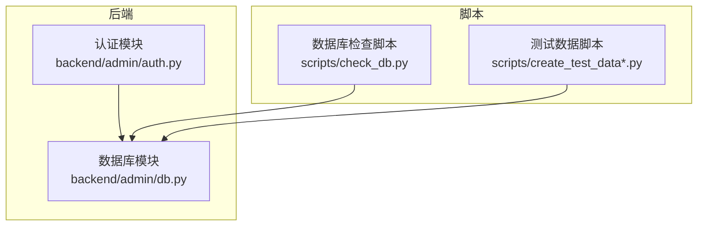
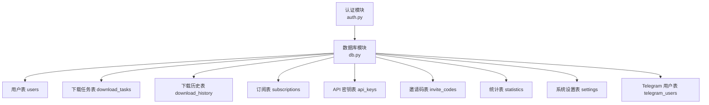
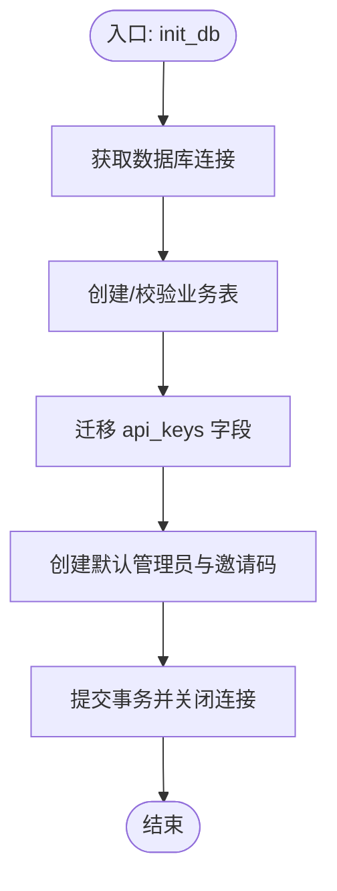
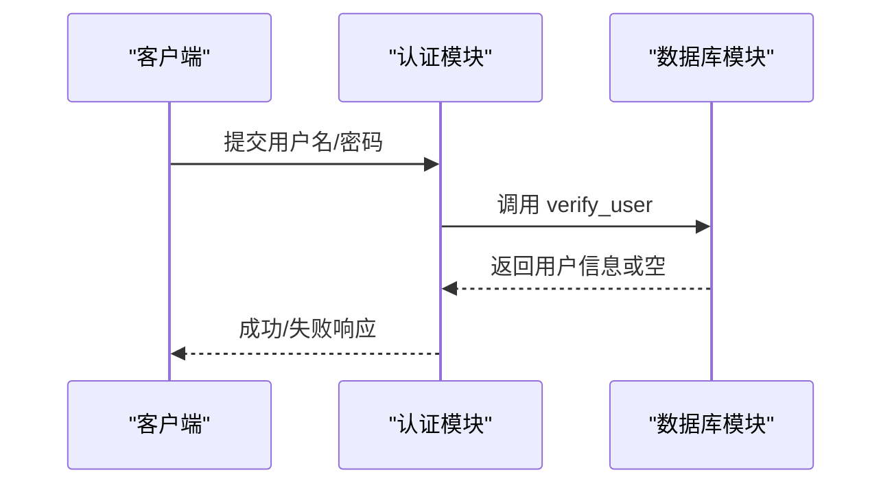
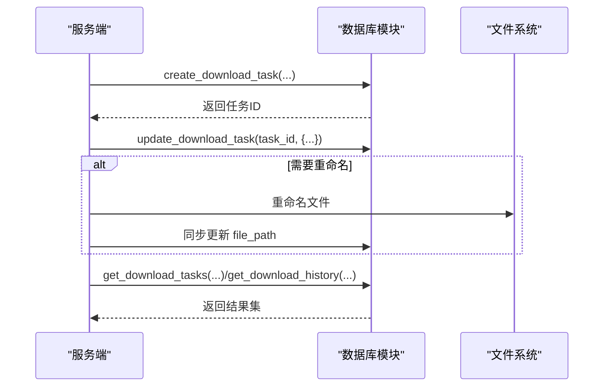
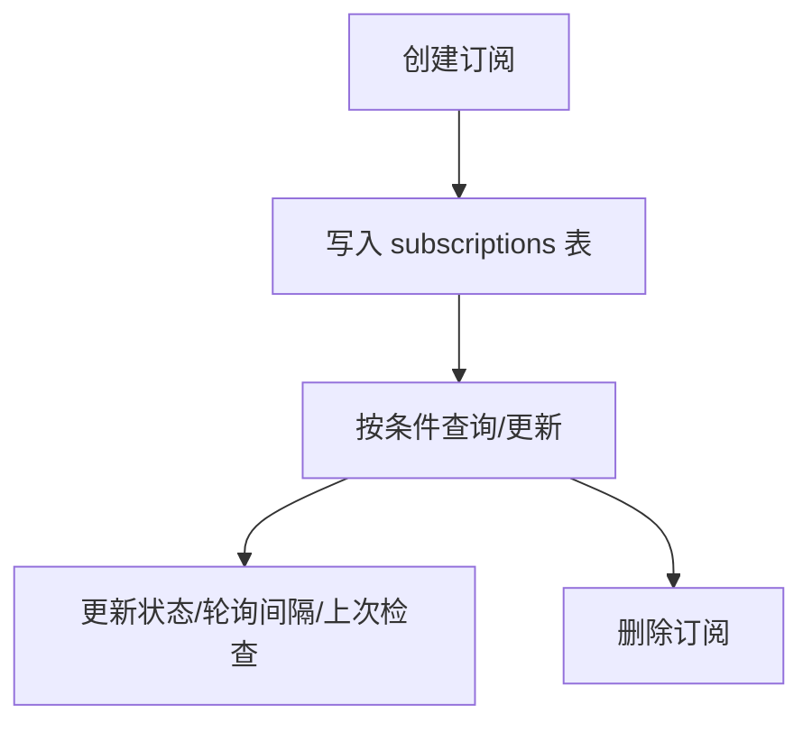
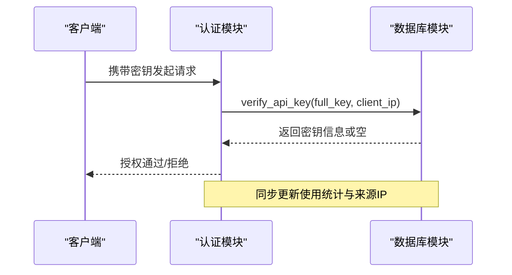
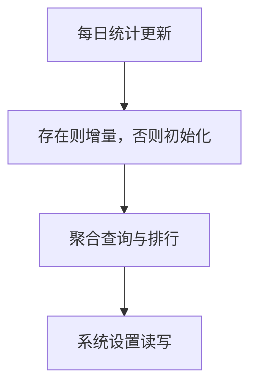
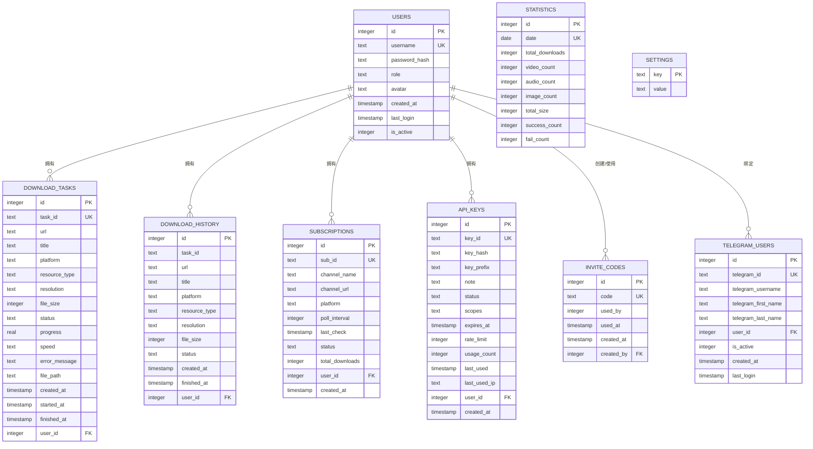

# 数据库管理

<cite>
**本文引用的文件**
- [backend/admin/db.py](file://backend/admin/db.py)
- [backend/admin/auth.py](file://backend/admin/auth.py)
- [scripts/check_db.py](file://scripts/check_db.py)
- [scripts/create_test_data.py](file://scripts/create_test_data.py)
- [scripts/create_test_data_simple.py](file://scripts/create_test_data_simple.py)
</cite>

## 目录
1. [简介](#简介)
2. [项目结构](#项目结构)
3. [核心组件](#核心组件)
4. [架构总览](#架构总览)
5. [详细组件分析](#详细组件分析)
6. [依赖分析](#依赖分析)
7. [性能考虑](#性能考虑)
8. [故障排查指南](#故障排查指南)
9. [结论](#结论)
10. [附录](#附录)

## 简介
本指南围绕 BoscoTsang 的数据库管理进行系统化说明，重点覆盖以下方面：
- SQLite 数据库设计与表结构定义、关系映射
- 数据库连接管理、事务处理与并发控制策略
- 用户管理、下载任务、订阅系统、API 密钥等核心数据模型的设计原理
- CRUD 操作实现、查询优化与索引策略
- 数据迁移、备份恢复与性能调优方案
- 实际代码示例与常见问题解决方案

## 项目结构
数据库相关的核心实现集中在后端模块中，采用“按功能域分层”的组织方式：
- 数据库初始化与连接：backend/admin/db.py
- 认证与授权：backend/admin/auth.py
- 数据校验与测试：scripts/*.py

图表来源
- [backend/admin/db.py:1-214](file://backend/admin/db.py#L1-L214)
- [backend/admin/auth.py:1-169](file://backend/admin/auth.py#L1-L169)
- [scripts/check_db.py:1-61](file://scripts/check_db.py#L1-L61)
- [scripts/create_test_data.py:1-84](file://scripts/create_test_data.py#L1-L84)
- [scripts/create_test_data_simple.py:1-76](file://scripts/create_test_data_simple.py#L1-L76)

章节来源
- [backend/admin/db.py:1-214](file://backend/admin/db.py#L1-L214)
- [backend/admin/auth.py:1-169](file://backend/admin/auth.py#L1-L169)
- [scripts/check_db.py:1-61](file://scripts/check_db.py#L1-L61)
- [scripts/create_test_data.py:1-84](file://scripts/create_test_data.py#L1-L84)
- [scripts/create_test_data_simple.py:1-76](file://scripts/create_test_data_simple.py#L1-L76)

## 核心组件
- 数据库连接与初始化：统一通过连接工厂获取连接，使用行工厂便于字典式访问；初始化时创建所有业务表并执行必要的迁移逻辑。
- 用户管理：提供注册、登录验证、角色与状态变更、头像更新、密码修改等能力。
- 下载任务与历史：支持任务创建、状态进度更新、历史归档、批量清理与搜索过滤。
- 订阅管理：支持订阅创建、状态与轮询间隔更新、按平台/状态筛选。
- API 密钥管理：支持密钥生成、权限范围、过期时间、速率限制、使用统计与状态维护。
- 统计与设置：提供每日统计更新、聚合查询与系统设置键值对管理。
- 邀请码与 Telegram 绑定：支持邀请码生成与使用追踪，以及 Telegram 用户绑定。

章节来源
- [backend/admin/db.py:23-214](file://backend/admin/db.py#L23-L214)
- [backend/admin/db.py:217-356](file://backend/admin/db.py#L217-L356)
- [backend/admin/db.py:359-541](file://backend/admin/db.py#L359-L541)
- [backend/admin/db.py:544-627](file://backend/admin/db.py#L544-L627)
- [backend/admin/db.py:651-862](file://backend/admin/db.py#L651-L862)
- [backend/admin/db.py:866-967](file://backend/admin/db.py#L866-L967)
- [backend/admin/db.py:971-1072](file://backend/admin/db.py#L971-L1072)

## 架构总览
下图展示数据库模块与认证模块之间的交互关系，以及主要数据模型的职责边界。

图表来源
- [backend/admin/auth.py:1-169](file://backend/admin/auth.py#L1-L169)
- [backend/admin/db.py:29-182](file://backend/admin/db.py#L29-L182)

## 详细组件分析

### 数据库连接与初始化
- 连接管理
  - 使用连接工厂统一创建连接，并启用行工厂以便以字典形式访问列。
  - 数据库存放在 APP_BASE_DIR/data/bosco.db，若不存在会自动创建目录。
- 初始化流程
  - 创建用户、下载任务、下载历史、订阅、API 密钥、邀请码、统计、系统设置、Telegram 用户等表。
  - 默认创建管理员账户与初始邀请码。
  - 迁移逻辑：为 api_keys 表动态添加 scopes、expires_at、rate_limit、usage_count、last_used_ip 等字段，确保向后兼容。

图表来源
- [backend/admin/db.py:29-214](file://backend/admin/db.py#L29-L214)

章节来源
- [backend/admin/db.py:18-27](file://backend/admin/db.py#L18-L27)
- [backend/admin/db.py:29-214](file://backend/admin/db.py#L29-L214)

### 用户管理
- 关键能力
  - 创建用户：可选邀请码校验、密码哈希、角色与激活状态设置。
  - 登录验证：用户名+密码哈希匹配，同时更新最后登录时间。
  - 用户信息查询与列表：支持按条件筛选与下载次数统计。
  - 更新与删除：支持角色与激活状态更新、密码修改、头像更新。
- 设计要点
  - 密码采用哈希存储，避免明文泄露。
  - 邀请码使用一次有效机制，防止滥用。
  - 用户与下载历史建立外键关联，保证数据一致性。

图表来源
- [backend/admin/auth.py:27-61](file://backend/admin/auth.py#L27-L61)
- [backend/admin/db.py:251-271](file://backend/admin/db.py#L251-L271)

章节来源
- [backend/admin/db.py:217-356](file://backend/admin/db.py#L217-L356)

### 下载任务与历史
- 任务生命周期
  - 创建：插入任务与历史两条记录，状态初始为 pending。
  - 更新：支持状态、进度、速度、标题、平台、资源类型、分辨率、文件大小、错误信息、文件路径、开始/结束时间等字段。
  - 查询：支持按用户、状态、平台、资源类型、关键词搜索与分页。
  - 删除：同时删除任务与历史记录。
  - 重命名：同步更新文件系统中的文件名与数据库记录。
- 设计要点
  - 任务与历史双写，便于审计与回溯。
  - 文件路径变更时同步更新文件系统与数据库，保持一致性。

图表来源
- [backend/admin/db.py:359-483](file://backend/admin/db.py#L359-L483)
- [backend/admin/db.py:486-541](file://backend/admin/db.py#L486-L541)

章节来源
- [backend/admin/db.py:359-541](file://backend/admin/db.py#L359-L541)

### 订阅管理
- 关键能力
  - 创建订阅：指定频道标识、名称、URL、平台、轮询间隔与用户。
  - 查询与更新：支持按用户、平台、状态筛选；可更新状态、上次检查时间、总下载数、轮询间隔。
  - 删除订阅。
- 设计要点
  - 订阅与用户建立外键关联，便于按用户维度管理。
  - 轮询间隔与上次检查时间用于调度与去重。

图表来源
- [backend/admin/db.py:544-627](file://backend/admin/db.py#L544-L627)

章节来源
- [backend/admin/db.py:544-627](file://backend/admin/db.py#L544-L627)

### API 密钥管理
- 关键能力
  - 生成密钥：随机生成 key_id 与 full_key，计算 key_hash 存储；支持备注、所属用户、权限范围、过期时间、速率限制。
  - 验证密钥：基于哈希查找、状态校验、过期检查、速率限制（每分钟），并更新使用统计与来源 IP。
  - 列表与更新：支持按用户与状态筛选；可更新备注、权限范围、过期时间、速率限制与状态。
  - 删除密钥。
- 设计要点
  - 密钥前缀用于显示，完整密钥仅在创建时返回一次，后续通过哈希验证。
  - 速率限制与过期时间结合，提升安全性与稳定性。
  - 权限范围以 JSON 存储，便于扩展。

图表来源
- [backend/admin/auth.py:63-107](file://backend/admin/auth.py#L63-L107)
- [backend/admin/db.py:690-751](file://backend/admin/db.py#L690-L751)

章节来源
- [backend/admin/db.py:651-862](file://backend/admin/db.py#L651-L862)
- [backend/admin/auth.py:1-169](file://backend/admin/auth.py#L1-L169)

### 统计与设置
- 统计更新
  - 每日统计：按日期聚合下载总数、成功/失败计数、资源类型分布、总大小等，支持增量更新。
  - 聚合查询：提供概览、今日统计、近 N 日趋势、平台分布、用户排行等。
- 系统设置
  - 键值对存储，支持冲突更新，便于运行时配置。

图表来源
- [backend/admin/db.py:866-967](file://backend/admin/db.py#L866-L967)
- [backend/admin/db.py:628-647](file://backend/admin/db.py#L628-L647)

章节来源
- [backend/admin/db.py:866-967](file://backend/admin/db.py#L866-L967)
- [backend/admin/db.py:628-647](file://backend/admin/db.py#L628-L647)

### 邀请码与 Telegram 用户绑定
- 邀请码
  - 生成唯一邀请码，记录创建者；使用后标记为已使用。
- Telegram 用户绑定
  - 支持创建绑定、更新信息、将 Telegram 账号与系统用户关联并记录最后登录时间。

章节来源
- [backend/admin/db.py:971-1072](file://backend/admin/db.py#L971-L1072)

## 依赖分析
- 模块耦合
  - 认证模块依赖数据库模块进行密钥与用户信息验证。
  - 数据库模块内部通过统一连接工厂与初始化流程解耦具体业务。
- 外部依赖
  - 使用标准库 sqlite3、hashlib、json、datetime、pathlib 等，无需额外第三方依赖。
- 潜在风险
  - 当前内存中存储 Bearer Token，生产环境建议替换为持久化存储（如 Redis）以支持多实例部署与高可用。

图表来源
- [backend/admin/auth.py:1-169](file://backend/admin/auth.py#L1-L169)
- [backend/admin/db.py:1-214](file://backend/admin/db.py#L1-L214)

章节来源
- [backend/admin/auth.py:1-169](file://backend/admin/auth.py#L1-L169)
- [backend/admin/db.py:1-214](file://backend/admin/db.py#L1-L214)

## 性能考虑
- 连接与事务
  - 每次操作独立获取/释放连接，避免长事务占用；在异常时显式回滚，确保一致性。
- 查询优化
  - 建议为高频查询字段添加索引：users(username)、download_tasks(user_id/status/platform/resource_type/search)、download_history(user_id/status/platform/resource_type/search)、subscriptions(user_id/platform/status)、api_keys(key_hash/user_id)、statistics(date)。
  - 使用 LIMIT/OFFSET 分页，避免一次性加载大量数据。
- 缓存与速率限制
  - API 密钥的速率限制与过期检查在数据库层实现，减少重复计算；生产环境可引入缓存层进一步降低压力。
- 文件系统同步
  - 重命名文件时需确保文件系统与数据库一致，建议在事务中协调两者操作。

章节来源
- [backend/admin/db.py:390-417](file://backend/admin/db.py#L390-L417)
- [backend/admin/db.py:690-751](file://backend/admin/db.py#L690-L751)

## 故障排查指南
- 数据库文件不存在
  - 检查 data/bosco.db 是否存在；如不存在，运行初始化流程或使用脚本创建测试数据。
- 表结构不一致
  - 使用检查脚本列出表与记录数，确认缺失或异常表。
- 密钥验证失败
  - 确认密钥是否过期、速率限制是否触发、状态是否为 active；核对哈希匹配与来源 IP 记录。
- 用户登录失败
  - 检查用户名与密码哈希是否正确，用户是否激活；确认最后登录时间是否更新。
- 下载任务状态异常
  - 核对任务与历史表的状态同步情况，检查文件路径与文件系统一致性。

章节来源
- [scripts/check_db.py:1-61](file://scripts/check_db.py#L1-L61)
- [backend/admin/db.py:690-751](file://backend/admin/db.py#L690-L751)
- [backend/admin/db.py:251-271](file://backend/admin/db.py#L251-L271)
- [backend/admin/db.py:390-417](file://backend/admin/db.py#L390-L417)

## 结论
该数据库管理方案以 SQLite 为核心，围绕用户、下载任务、订阅、API 密钥等核心模型构建了清晰的表结构与关系映射；通过统一连接工厂与初始化流程实现了良好的可维护性；配合认证模块与统计功能，满足了日常运营与安全控制需求。建议在生产环境中补充索引、持久化 Token 存储与缓存策略，并完善备份与监控体系。

## 附录

### 表结构与关系速览

图表来源
- [backend/admin/db.py:34-182](file://backend/admin/db.py#L34-L182)

### CRUD 示例与最佳实践
- 创建用户
  - 路径参考：[backend/admin/db.py:217-249](file://backend/admin/db.py#L217-L249)
- 登录验证
  - 路径参考：[backend/admin/db.py:251-271](file://backend/admin/db.py#L251-L271)
- 创建下载任务
  - 路径参考：[backend/admin/db.py:359-378](file://backend/admin/db.py#L359-L378)
- 更新任务状态
  - 路径参考：[backend/admin/db.py:390-417](file://backend/admin/db.py#L390-L417)
- 创建订阅
  - 路径参考：[backend/admin/db.py:544-556](file://backend/admin/db.py#L544-L556)
- 生成 API 密钥
  - 路径参考：[backend/admin/db.py:651-688](file://backend/admin/db.py#L651-L688)
- 验证 API 密钥
  - 路径参考：[backend/admin/db.py:690-751](file://backend/admin/db.py#L690-L751)
- 获取统计
  - 路径参考：[backend/admin/db.py:903-967](file://backend/admin/db.py#L903-L967)

### 数据迁移与备份恢复
- 迁移
  - 在初始化阶段对 api_keys 表新增字段，确保现有数据平滑升级。
  - 路径参考：[backend/admin/db.py:197-213](file://backend/admin/db.py#L197-L213)
- 备份
  - 建议定期复制 data/bosco.db 文件；生产环境可结合 SQLite WAL/快照机制实现热备。
- 恢复
  - 停止服务后替换数据库文件，启动后验证表结构与关键数据完整性。

章节来源
- [backend/admin/db.py:197-213](file://backend/admin/db.py#L197-L213)

### 测试数据与验证
- 创建测试数据
  - 路径参考：[scripts/create_test_data.py:12-84](file://scripts/create_test_data.py#L12-L84)
  - 路径参考：[scripts/create_test_data_simple.py:39-76](file://scripts/create_test_data_simple.py#L39-L76)
- 数据库检查
  - 路径参考：[scripts/check_db.py:1-61](file://scripts/check_db.py#L1-L61)