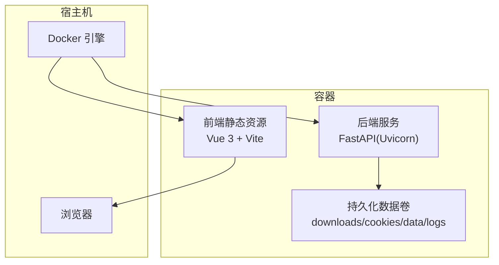
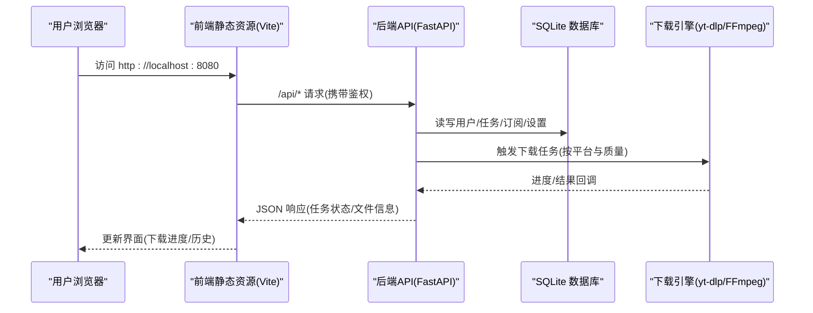
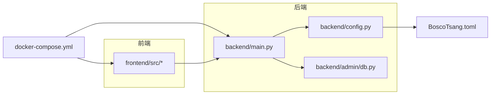

# 快速开始

<cite>
**本文引用的文件**
- [Dockerfile](file://Dockerfile)
- [docker-compose.yml](file://docker-compose.yml)
- [BoscoTsang.toml](file://BoscoTsang.toml)
- [backend/main.py](file://backend/main.py)
- [backend/config.py](file://backend/config.py)
- [backend/admin/db.py](file://backend/admin/db.py)
- [frontend/vite.config.js](file://frontend/vite.config.js)
- [docs/DEPLOYMENT.md](file://docs/DEPLOYMENT.md)
- [QUICK_REFERENCE.md](file://QUICK_REFERENCE.md)
- [USAGE_MANUAL.md](file://USAGE_MANUAL.md)
- [start_backend.bat](file://start_backend.bat)
- [start_frontend.bat](file://start_frontend.bat)
</cite>

## 目录
1. [简介](#简介)
2. [项目结构](#项目结构)
3. [核心组件](#核心组件)
4. [架构总览](#架构总览)
5. [详细组件分析](#详细组件分析)
6. [依赖关系分析](#依赖关系分析)
7. [性能注意事项](#性能注意事项)
8. [故障排除指南](#故障排除指南)
9. [结论](#结论)
10. [附录](#附录)

## 简介
本指南面向首次接触 BoscoTsang 的用户，帮助你在最短时间内完成安装与部署，启动容器并访问 Web 管理界面，完成初始配置与基础使用。内容涵盖环境准备、Docker 容器化部署、本地开发环境搭建、默认管理员账号、端口配置、基本使用示例以及常见问题排查。

## 项目结构
BoscoTsang 采用前后端分离架构，后端基于 FastAPI + SQLite，前端基于 Vue 3 + Vite，整体通过 Docker 与 docker-compose 进行编排与部署。项目还提供了本地开发脚本与一键启动批处理文件，便于快速验证。

**图表来源**
- [Dockerfile:6-64](file://Dockerfile#L6-L64)
- [docker-compose.yml:9-30](file://docker-compose.yml#L9-L30)

**章节来源**
- [Dockerfile:1-74](file://Dockerfile#L1-L74)
- [docker-compose.yml:1-60](file://docker-compose.yml#L1-L60)

## 核心组件
- 容器化编排：使用 docker-compose 管理后端服务与持久化卷，暴露 8080:8000 端口映射。
- 后端服务：基于 FastAPI 的 API 服务，内置认证、下载任务、订阅、统计、Telegram 集成等能力。
- 前端界面：Vue 3 + Vite 构建的管理后台，提供登录、下载、文件管理、监控、设置等功能。
- 配置中心：BoscoTsang.toml 提供代理与日志等运行时配置；后端通过环境变量控制目录与时区。
- 数据存储：SQLite 存储用户、任务、历史、订阅、API 密钥、统计与系统设置等。

**章节来源**
- [backend/main.py:56-104](file://backend/main.py#L56-L104)
- [backend/config.py:29-34](file://backend/config.py#L29-L34)
- [BoscoTsang.toml:1-28](file://BoscoTsang.toml#L1-L28)
- [docker-compose.yml:23-29](file://docker-compose.yml#L23-L29)

## 架构总览
下图展示了从浏览器访问到后端处理与数据持久化的整体流程。

**图表来源**
- [backend/main.py:336-353](file://backend/main.py#L336-L353)
- [backend/admin/db.py:29-213](file://backend/admin/db.py#L29-L213)
- [backend/main.py:733-800](file://backend/main.py#L733-L800)

## 详细组件分析

### 1) Docker 容器化部署
- 构建与启动
  - 使用 docker-compose 一键启动，容器名为 bosco-tsang，端口映射 8080:8000。
  - 持久化卷映射：downloads、cookies、data、logs，避免容器重建导致数据丢失。
  - 环境变量：APP_BASE_DIR、DOWNLOAD_DIR、COOKIES_DIR、LOGS_DIR、HTTP_PROXY、HTTPS_PROXY、YTDLP_JS_RUNTIME、TZ 等。
- 健康检查：通过 Python socket 检查 8000 端口连通性，确保服务可用。
- 端口与代理：默认 8080 映射至容器 8000；如需代理，可在环境变量中配置 HTTP_PROXY/HTTPS_PROXY。

**章节来源**
- [docker-compose.yml:9-60](file://docker-compose.yml#L9-L60)
- [Dockerfile:67-74](file://Dockerfile#L67-L74)

### 2) 默认管理员账号与初始配置
- 默认管理员账号
  - 用户名：admin
  - 密码：admin123
  - 首次登录后务必修改密码。
- 初始配置
  - 代理配置：BoscoTsang.toml 提供 proxy.enabled、mode、http/https、bypass_cidrs 等。
  - 日志级别：BoscoTsang.toml 中 logging.level 控制日志输出。
  - 系统设置：通过管理后台设置 Telegram Bot Token、启用 Telegram 登录、X/Twitter Cookies 等。

**章节来源**
- [backend/admin/db.py:183-196](file://backend/admin/db.py#L183-L196)
- [BoscoTsang.toml:4-28](file://BoscoTsang.toml#L4-L28)
- [USAGE_MANUAL.md:266-292](file://USAGE_MANUAL.md#L266-L292)

### 3) 端口与访问
- 容器内服务端口：8000
- 宿主机映射端口：默认 8080（可修改）
- 访问地址：http://localhost:8080
- 若端口被占用，可在 docker-compose.yml 中修改映射端口并重启。

**章节来源**
- [docker-compose.yml:18-21](file://docker-compose.yml#L18-L21)
- [USAGE_MANUAL.md:445-459](file://USAGE_MANUAL.md#L445-L459)

### 4) 本地开发环境搭建
- 后端
  - 安装依赖：fastapi、uvicorn、yt-dlp、psutil、python-multipart、tomli、httpx、markdown。
  - 启动命令：uvicorn backend.main:app --reload --port 8000。
  - Windows 批处理：start_backend.bat。
- 前端
  - 安装依赖：npm install。
  - 启动命令：npm run dev（默认 3000 端口），Vite 配置中对 /api 的代理指向 8001（开发联调）。
  - Windows 批处理：start_frontend.bat。
- 注意：本地开发时，前端需代理到后端 8000 端口；生产环境由 docker-compose 统一编排。

**章节来源**
- [docs/DEPLOYMENT.md:66-91](file://docs/DEPLOYMENT.md#L66-L91)
- [start_backend.bat:1-5](file://start_backend.bat#L1-L5)
- [start_frontend.bat:1-5](file://start_frontend.bat#L1-L5)
- [frontend/vite.config.js:12-20](file://frontend/vite.config.js#L12-L20)

### 5) 基本使用示例
- 登录与首页
  - 使用默认管理员账号登录，进入仪表盘与导航菜单。
- 下载任务
  - 在“下载”页面粘贴链接，选择质量（如 best、1080p、720p、audio 等），点击开始下载。
  - 下载完成后可在“文件管理”中浏览、重命名、删除与下载文件。
- 订阅管理
  - 在“订阅”页面添加频道链接，设置轮询间隔，系统将自动监控并下载新内容。
- 统计与监控
  - “监控”页面展示 CPU、内存、磁盘与实时带宽等系统资源使用情况。
- API 密钥
  - 在“设置”中生成 API 密钥，用于第三方工具集成与自动化调用。

**章节来源**
- [USAGE_MANUAL.md:182-255](file://USAGE_MANUAL.md#L182-L255)
- [backend/main.py:667-732](file://backend/main.py#L667-L732)

### 6) 配置文件与运行参数
- BoscoTsang.toml
  - proxy.enabled：是否启用代理
  - proxy.mode：global/none/auto
  - proxy.http/https：代理服务器地址
  - proxy.bypass_cidrs：国内网段白名单
  - download.download_dir：默认下载目录（可空）
  - logging.level：日志级别
- 环境变量（docker-compose）
  - APP_BASE_DIR：应用根目录（/app）
  - DOWNLOAD_DIR/COOKIES_DIR/LOGS_DIR：各目录路径映射
  - HTTP_PROXY/HTTPS_PROXY：全局代理
  - YTDLP_JS_RUNTIME：yt-dlp JS 运行时选择
  - TZ：时区

**章节来源**
- [BoscoTsang.toml:4-28](file://BoscoTsang.toml#L4-L28)
- [docker-compose.yml:31-49](file://docker-compose.yml#L31-L49)

## 依赖关系分析

**图表来源**
- [backend/main.py:44-49](file://backend/main.py#L44-L49)
- [backend/config.py:29-34](file://backend/config.py#L29-L34)
- [backend/admin/db.py:15-21](file://backend/admin/db.py#L15-L21)
- [docker-compose.yml:9-16](file://docker-compose.yml#L9-L16)

**章节来源**
- [backend/main.py:44-49](file://backend/main.py#L44-L49)
- [backend/config.py:29-34](file://backend/config.py#L29-L34)
- [backend/admin/db.py:15-21](file://backend/admin/db.py#L15-L21)

## 性能注意事项
- 端口与代理
  - 默认 8080:8000 映射，如需修改请同步调整 docker-compose.yml。
  - 代理仅在需要时启用，auto 模式下对国内域名自动绕过。
- 资源与并发
  - 建议至少 8GB 内存与 4 核 CPU，SSD 磁盘与稳定宽带。
  - 可通过系统监控页面观察 CPU、内存、磁盘与带宽使用情况。
- 日志与备份
  - 日志按日切分，位于 logs/ 目录。
  - 定期备份 downloads/、data/、cookies/、logs/ 四个目录。

**章节来源**
- [USAGE_MANUAL.md:484-496](file://USAGE_MANUAL.md#L484-L496)
- [docker-compose.yml:23-29](file://docker-compose.yml#L23-L29)

## 故障排除指南
- 服务无法访问
  - 检查容器状态与健康检查：docker ps、docker-compose logs -f。
  - 确认端口 8080 未被占用；如占用，修改 docker-compose.yml 中的映射端口。
- 下载失败
  - 检查 Cookies 是否正确配置（特别是 X/Twitter 需要 Cookies）。
  - 查看应用日志：docker logs bosco-tsang --tail 50。
  - 确认磁盘空间充足，必要时清理旧文件。
- Telegram 无响应
  - 确认 Bot Token 已配置且启用 Telegram 登录。
  - 检查系统日志中 Telegram 相关条目，使用 curl 测试外网连通性。
- 代理问题
  - 在管理后台设置中启用代理，并填写 HTTP/HTTPS 代理地址。
  - auto 模式下，国内域名将自动绕过代理。
- 重启与重建
  - 重启服务：docker-compose restart。
  - 清理并重建：docker-compose down 后再 up -d --build。

**章节来源**
- [QUICK_REFERENCE.md:142-180](file://QUICK_REFERENCE.md#L142-L180)
- [docs/DEPLOYMENT.md:361-393](file://docs/DEPLOYMENT.md#L361-L393)
- [USAGE_MANUAL.md:378-460](file://USAGE_MANUAL.md#L378-L460)

## 结论
通过本快速开始指南，你可以在几分钟内完成 BoscoTsang 的安装与部署，访问 Web 管理界面，使用默认管理员账号登录并进行基础配置。遇到问题时，可依据故障排除指南逐步定位与解决。随着业务增长，建议进一步完善代理、备份与监控策略，并结合 API 密钥实现自动化集成。

## 附录

### A. 快速命令清单
- 启动服务：docker-compose up -d --build
- 查看日志：docker logs -f bosco-tsang
- 重启服务：docker-compose restart
- 停止服务：docker-compose down
- 更新镜像：docker-compose pull && docker-compose up -d

**章节来源**
- [QUICK_REFERENCE.md:16-35](file://QUICK_REFERENCE.md#L16-L35)

### B. 环境变量与端口对照
- 容器内端口：8000
- 宿主机映射：8080（可修改）
- 关键环境变量：APP_BASE_DIR、DOWNLOAD_DIR、COOKIES_DIR、LOGS_DIR、HTTP_PROXY、HTTPS_PROXY、YTDLP_JS_RUNTIME、TZ

**章节来源**
- [docker-compose.yml:18-49](file://docker-compose.yml#L18-L49)
- [USAGE_MANUAL.md:501-515](file://USAGE_MANUAL.md#L501-L515)

### C. 默认管理员账号
- 用户名：admin
- 密码：admin123
- 首次登录后请立即修改密码

**章节来源**
- [backend/admin/db.py:183-196](file://backend/admin/db.py#L183-L196)
- [USAGE_MANUAL.md:516-522](file://USAGE_MANUAL.md#L516-L522)