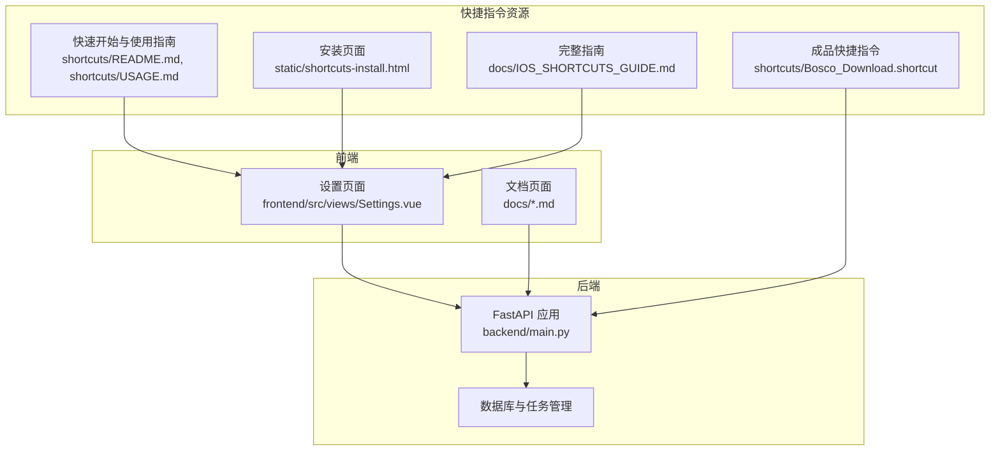
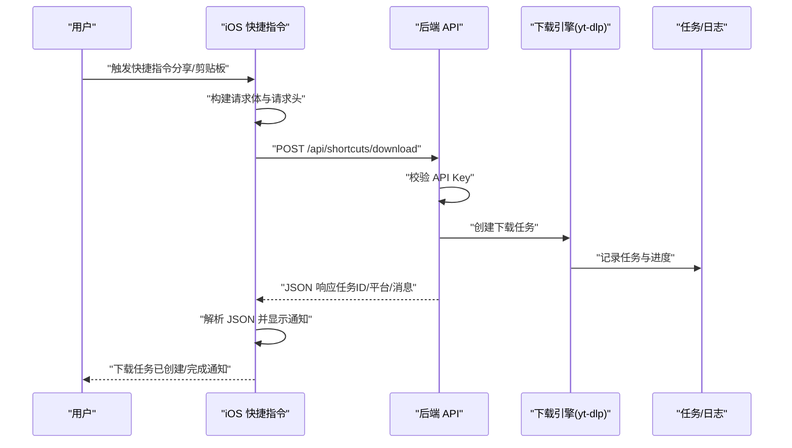
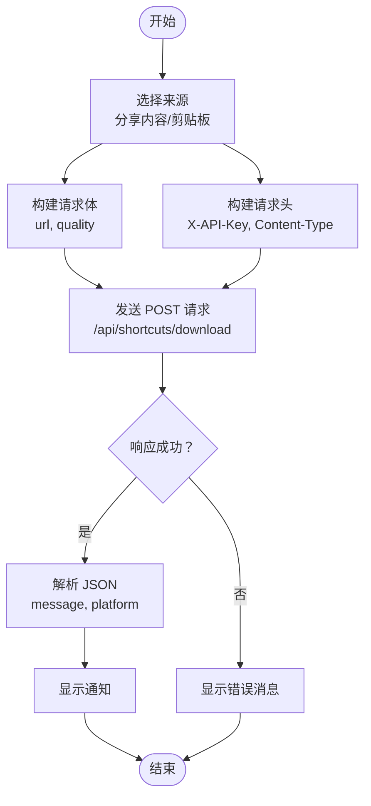
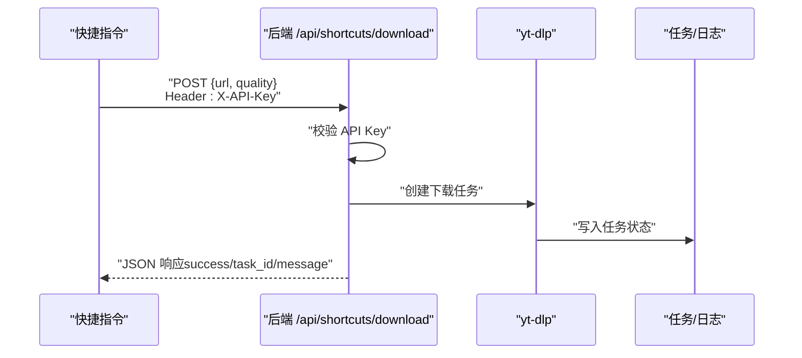
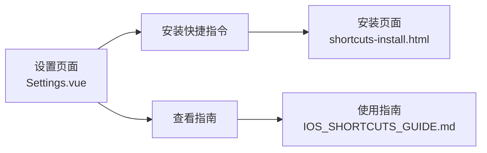
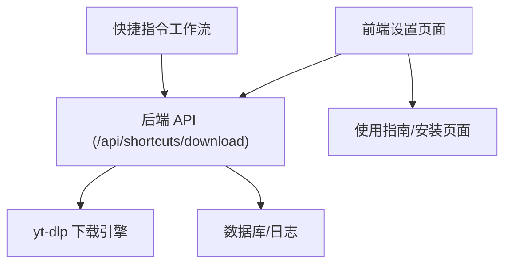

# iOS 快捷指令集成

<cite>
**本文引用的文件**
- [Bosco_Download.shortcut](file://shortcuts/Bosco_Download.shortcut)
- [快捷指令使用指南](file://shortcuts/USAGE.md)
- [快捷指令快速开始](file://shortcuts/README.md)
- [iOS 快捷指令完整指南](file://docs/IOS_SHORTCUTS_GUIDE.md)
- [iOS 快捷指令集成完成报告](file://docs/IOS_SHORTCUTS_INTEGRATION_REPORT.md)
- [后端主程序](file://backend/main.py)
- [设置页面](file://frontend/src/views/Settings.vue)
- [快捷指令安装页面](file://static/shortcuts-install.html)
</cite>

## 目录
1. [简介](#简介)
2. [项目结构](#项目结构)
3. [核心组件](#核心组件)
4. [架构总览](#架构总览)
5. [详细组件分析](#详细组件分析)
6. [依赖关系分析](#依赖关系分析)
7. [性能考虑](#性能考虑)
8. [故障排除指南](#故障排除指南)
9. [结论](#结论)
10. [附录](#附录)

## 简介
本指南面向希望在 iOS 快捷指令中集成 Bosco Tsang 下载系统的开发者与运维人员。文档覆盖快捷指令工作流的设计原理、输入参数处理、URL 解析、API 调用流程，以及与后端下载系统的集成机制（网络请求、错误处理、结果反馈）。同时提供快捷指令的创建、配置与自定义方法，并给出自动化场景应用（批量下载、定时任务）及调试与故障排除建议。

## 项目结构
该项目采用前后端分离架构，快捷指令相关资源位于 shortcuts/ 与 static/ 目录，后端服务由 FastAPI 提供，前端管理界面集成快捷指令安装入口。

**图表来源**
- [设置页面](file://frontend/src/views/Settings.vue)
- [后端主程序](file://backend/main.py)
- [快捷指令使用指南](file://shortcuts/USAGE.md)
- [快捷指令安装页面](file://static/shortcuts-install.html)

**章节来源**
- [设置页面](file://frontend/src/views/Settings.vue)
- [后端主程序](file://backend/main.py)
- [快捷指令使用指南](file://shortcuts/USAGE.md)
- [快捷指令安装页面](file://static/shortcuts-install.html)

## 核心组件
- 快捷指令工作流：接收输入（分享内容/剪贴板）、构建请求体与请求头、调用后端下载接口、解析响应并显示通知。
- 后端 API：提供快捷指令专用下载接口，进行 API Key 校验、URL 平台识别、下载任务创建与进度维护。
- 前端集成：在设置页面提供快捷指令卡片、安装按钮与指南入口，便于用户一键安装与配置。
- 安装页面：提供在线配置与说明，辅助用户生成快捷指令配置。

**章节来源**
- [Bosco_Download.shortcut](file://shortcuts/Bosco_Download.shortcut)
- [后端主程序](file://backend/main.py)
- [设置页面](file://frontend/src/views/Settings.vue)
- [快捷指令安装页面](file://static/shortcuts-install.html)

## 架构总览
快捷指令通过 HTTP 请求向后端发送下载任务，后端基于 yt-dlp 执行下载，进度与结果通过 JSON 响应返回，快捷指令解析响应并在设备上显示通知。

**图表来源**
- [Bosco_Download.shortcut](file://shortcuts/Bosco_Download.shortcut)
- [后端主程序](file://backend/main.py)

## 详细组件分析

### 快捷指令工作流设计与实现
- 输入参数处理
  - 支持来源选择：分享内容或剪贴板；当选择“分享的内容”时，通过“接收输入”动作获取 URL；当选择“剪贴板”时，通过“获取剪贴板”动作读取链接。
  - 变量管理：保存服务器地址与 API Key，便于后续请求复用。
- URL 解析与平台识别
  - 快捷指令内部不进行复杂解析，主要传递 URL 至后端；后端根据 URL 内容识别平台并选择对应下载策略。
- API 调用流程
  - 构建请求体：包含 url 与 quality 字段。
  - 构建请求头：包含 X-API-Key 与 Content-Type。
  - 发送请求：POST 到 http://{ServerURL}/api/shortcuts/download。
- 结果反馈
  - 获取响应体并解析 JSON，提取 message 与 platform 字段，最终以通知形式呈现。

**图表来源**
- [Bosco_Download.shortcut](file://shortcuts/Bosco_Download.shortcut)

**章节来源**
- [Bosco_Download.shortcut](file://shortcuts/Bosco_Download.shortcut)

### 后端下载接口与集成机制
- 接口定义
  - 端点：POST /api/shortcuts/download
  - 请求头：X-API-Key、Content-Type: application/json
  - 请求体：包含 url 与 quality
  - 响应：success、task_id、platform、message、progress_url 等字段
- 认证与安全
  - 通过 API Key 进行认证，避免暴露用户凭证。
  - 建议生产环境使用 HTTPS。
- 平台识别与下载
  - 后端根据 URL 识别平台，调用 yt-dlp 执行下载，支持多种画质与格式。
  - 下载进度通过全局字典与数据库任务表维护，便于查询与通知。
- 错误处理
  - 对无效 API Key、网络异常、平台不支持等情况返回结构化错误响应，便于前端/快捷指令显示。

**图表来源**
- [后端主程序](file://backend/main.py)

**章节来源**
- [后端主程序](file://backend/main.py)

### 前端集成与用户入口
- 设置页面集成快捷指令卡片，提供“安装快捷指令”“查看指南”按钮，引导用户完成安装与配置。
- 通过 openShortcutInstall/openShortcutGuide 方法跳转至安装页面与使用指南。
- 安装页面提供服务器地址与 API Key 的在线配置，生成快捷指令配置说明并复制到剪贴板。

**图表来源**
- [设置页面](file://frontend/src/views/Settings.vue)
- [快捷指令安装页面](file://static/shortcuts-install.html)
- [iOS 快捷指令完整指南](file://docs/IOS_SHORTCUTS_GUIDE.md)

**章节来源**
- [设置页面](file://frontend/src/views/Settings.vue)
- [快捷指令安装页面](file://static/shortcuts-install.html)
- [iOS 快捷指令完整指南](file://docs/IOS_SHORTCUTS_GUIDE.md)

### 快捷指令创建、配置与自定义
- 一键安装：通过设置页面的“安装快捷指令”按钮，打开安装页面，按提示完成安装。
- 手动创建：在快捷指令 App 中新建工作流，按指南添加“接收共享内容”“下载 URL”“显示通知”等操作，配置服务器地址与 API Key。
- 高级配置：
  - 修改画质：quality 字段支持 best、1080p、720p、audio、mp3、m4a 等。
  - 修改服务器地址：替换 ServerURL 变量为实际服务地址。
  - 保存 API Key：可将“显示提示”改为“设定变量”，直接填入 API Key（注意明文保存风险）。

**章节来源**
- [快捷指令使用指南](file://shortcuts/USAGE.md)
- [快捷指令快速开始](file://shortcuts/README.md)
- [iOS 快捷指令完整指南](file://docs/IOS_SHORTCUTS_GUIDE.md)

### 自动化场景应用
- 批量下载：将链接列表复制到备忘录，通过循环快捷指令逐个发送到 Bosco 下载。
- 定时任务：结合 iOS 自动化，在特定时间或满足条件时触发下载任务。
- 剪贴板自动读取：在快捷指令中加入“获取剪贴板”动作，实现自动识别与下载。

**章节来源**
- [iOS 快捷指令完整指南](file://docs/IOS_SHORTCUTS_GUIDE.md)

## 依赖关系分析
- 快捷指令依赖后端提供的 /api/shortcuts/download 接口，通过 HTTP 请求与 JSON 交互。
- 后端依赖 yt-dlp 执行下载，依赖数据库维护任务状态与日志。
- 前端设置页面依赖后端 API 获取配置与生成安装链接。

**图表来源**
- [后端主程序](file://backend/main.py)
- [设置页面](file://frontend/src/views/Settings.vue)
- [快捷指令使用指南](file://shortcuts/USAGE.md)

**章节来源**
- [后端主程序](file://backend/main.py)
- [设置页面](file://frontend/src/views/Settings.vue)
- [快捷指令使用指南](file://shortcuts/USAGE.md)

## 性能考虑
- 网络与代理：后端支持代理配置，可根据需求启用/禁用代理，自动模式下对国内地址不使用代理，减少不必要的延迟。
- 下载并发：后端通过任务队列与进度回调维护下载状态，建议合理设置并发与速率限制，避免对系统造成过大压力。
- 日志与监控：后端提供每日轮转日志，便于排查问题与性能分析。

[本节为通用指导，不涉及具体文件分析]

## 故障排除指南
- 找不到“Bosco 下载”选项：确保已在快捷指令 App 中开启“在共享表中显示”，并重启 Safari。
- 无效的 API Key：检查 API Key 是否正确、是否过期；必要时重新生成并在快捷指令中更新。
- 下载失败：检查网络连接与服务器状态；查看后端日志（可通过 docker logs bosco-tsang | grep “快捷指令” 过滤）。
- 文档无法查看：现已修复，所有文档均可通过 Web 直接访问，无需进入根目录。

**章节来源**
- [快捷指令使用指南](file://shortcuts/USAGE.md)
- [iOS 快捷指令完整指南](file://docs/IOS_SHORTCUTS_GUIDE.md)

## 结论
本指南系统阐述了 iOS 快捷指令与 Bosco Tsang 下载系统的集成方案，涵盖工作流设计、API 调用、错误处理与结果反馈，并提供了创建、配置、自定义与自动化应用的实践方法。通过前端集成与后端接口协同，用户可在 iPhone 上便捷地实现跨平台视频下载，并借助自动化场景提升效率。

[本节为总结性内容，不涉及具体文件分析]

## 附录

### API 接口规范（快捷指令专用）
- 端点：POST /api/shortcuts/download
- 请求头：
  - X-API-Key: your-api-key-here
  - Content-Type: application/json
- 请求体：
  - url: 目标视频链接
  - quality: 画质（best/1080p/720p/audio/mp3/m4a）
- 成功响应示例：
  - success: true
  - task_id: 任务ID
  - platform: 平台名称
  - message: 提示消息
  - progress_url: 进度查询路径
- 错误响应示例：
  - success: false
  - detail: 错误详情（如无效 API Key）

**章节来源**
- [iOS 快捷指令完整指南](file://docs/IOS_SHORTCUTS_GUIDE.md)

### 快捷指令文件与安装页面
- 成品快捷指令文件：shortcuts/Bosco_Download.shortcut
- 安装页面：static/shortcuts-install.html，提供在线配置与说明
- 使用指南：docs/IOS_SHORTCUTS_GUIDE.md 与 shortcuts/USAGE.md

**章节来源**
- [Bosco_Download.shortcut](file://shortcuts/Bosco_Download.shortcut)
- [快捷指令安装页面](file://static/shortcuts-install.html)
- [iOS 快捷指令完整指南](file://docs/IOS_SHORTCUTS_GUIDE.md)
- [快捷指令使用指南](file://shortcuts/USAGE.md)