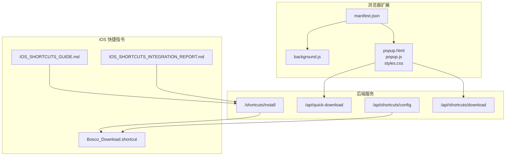
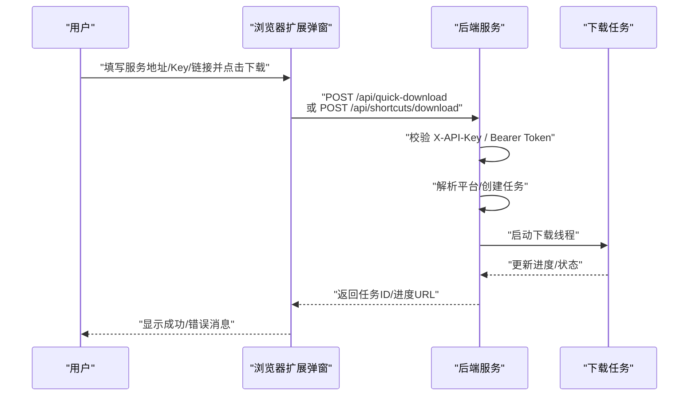
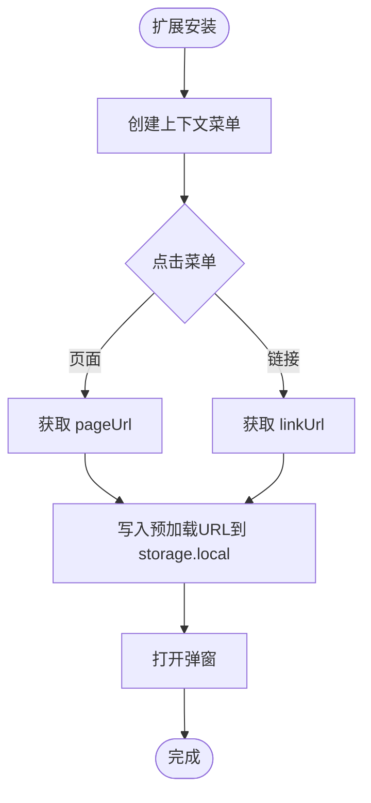
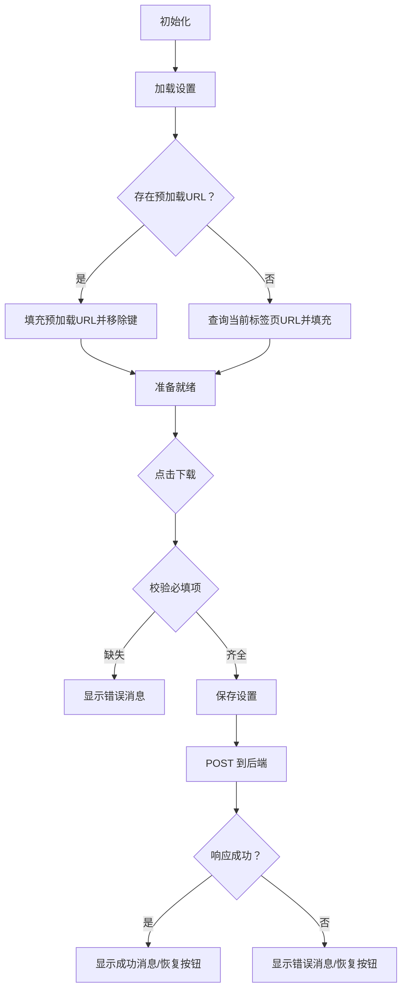
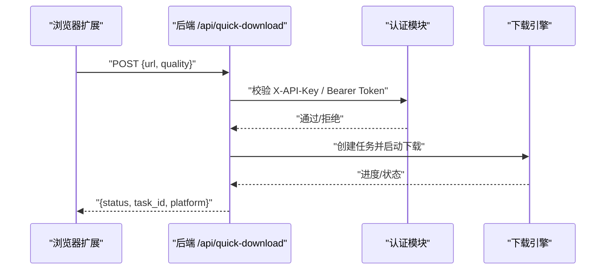
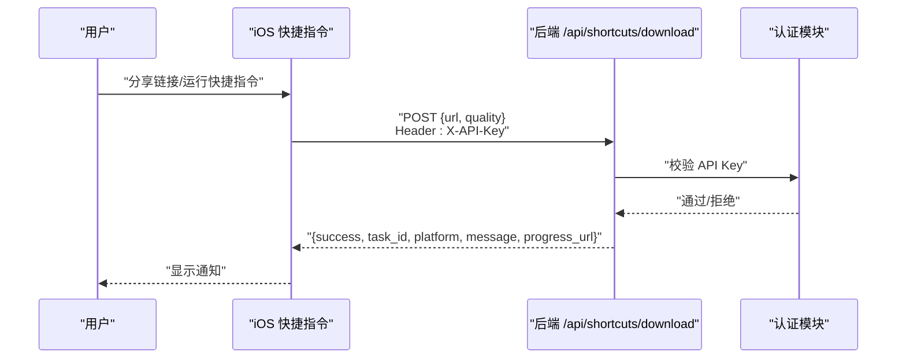
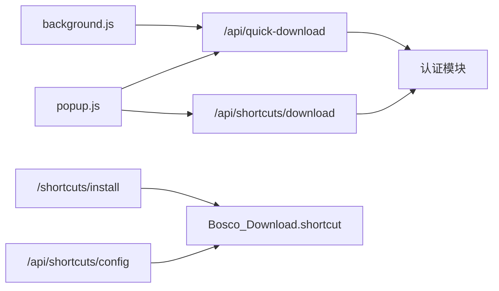

# 扩展功能开发

<cite>
**本文引用的文件**
- [manifest.json](file://extensions/quick-download/manifest.json)
- [background.js](file://extensions/quick-download/background.js)
- [popup.html](file://extensions/quick-download/popup.html)
- [popup.js](file://extensions/quick-download/popup.js)
- [styles.css](file://extensions/quick-download/styles.css)
- [main.py](file://backend/main.py)
- [IOS_SHORTCUTS_GUIDE.md](file://docs/IOS_SHORTCUTS_GUIDE.md)
- [IOS_SHORTCUTS_INTEGRATION_REPORT.md](file://docs/IOS_SHORTCUTS_INTEGRATION_REPORT.md)
- [Bosco_Download.shortcut](file://shortcuts/Bosco_Download.shortcut)
- [README.md](file://shortcuts/README.md)
</cite>

## 目录
1. [引言](#引言)
2. [项目结构](#项目结构)
3. [核心组件](#核心组件)
4. [架构总览](#架构总览)
5. [组件详解](#组件详解)
6. [依赖关系分析](#依赖关系分析)
7. [性能考量](#性能考量)
8. [故障排查指南](#故障排查指南)
9. [结论](#结论)
10. [附录](#附录)

## 引言
本指南面向希望基于现有浏览器扩展与 iOS 快捷指令实现“跨平台下载入口”的开发者，系统讲解如何复用仓库中的浏览器扩展示例（manifest.json、background.js、popup.*）与后端 API，完成扩展开发、安装、配置与调试，并给出 iOS 快捷指令集成方案与 API 扩展机制。同时提供插件开发模板、接口规范与集成方法，覆盖跨平台兼容性与安全最佳实践。

## 项目结构
该仓库将扩展与后端 API 集成在一个统一的系统中：
- 浏览器扩展位于 extensions/quick-download，包含 manifest、后台脚本与弹窗 UI。
- 后端服务位于 backend/main.py，提供扩展与快捷指令共用的下载 API。
- iOS 快捷指令位于 shortcuts/ 与 docs/，提供完整安装与使用指南。
- 前端管理后台用于集成快捷指令卡片与引导安装。

图示来源
- [manifest.json:1-22](file://extensions/quick-download/manifest.json#L1-L22)
- [background.js:1-26](file://extensions/quick-download/background.js#L1-L26)
- [popup.html:1-90](file://extensions/quick-download/popup.html#L1-L90)
- [popup.js:1-265](file://extensions/quick-download/popup.js#L1-L265)
- [main.py:1009-1075](file://backend/main.py#L1009-L1075)
- [main.py:1848-1871](file://backend/main.py#L1848-L1871)
- [Bosco_Download.shortcut:1-140](file://shortcuts/Bosco_Download.shortcut#L1-L140)
- [IOS_SHORTCUTS_GUIDE.md:1-332](file://docs/IOS_SHORTCUTS_GUIDE.md#L1-L332)
- [IOS_SHORTCUTS_INTEGRATION_REPORT.md:1-320](file://docs/IOS_SHORTCUTS_INTEGRATION_REPORT.md#L1-L320)

章节来源
- [manifest.json:1-22](file://extensions/quick-download/manifest.json#L1-L22)
- [background.js:1-26](file://extensions/quick-download/background.js#L1-L26)
- [popup.html:1-90](file://extensions/quick-download/popup.html#L1-L90)
- [popup.js:1-265](file://extensions/quick-download/popup.js#L1-L265)
- [main.py:1009-1075](file://backend/main.py#L1009-L1075)
- [main.py:1848-1871](file://backend/main.py#L1848-L1871)
- [Bosco_Download.shortcut:1-140](file://shortcuts/Bosco_Download.shortcut#L1-L140)
- [IOS_SHORTCUTS_GUIDE.md:1-332](file://docs/IOS_SHORTCUTS_GUIDE.md#L1-L332)
- [IOS_SHORTCUTS_INTEGRATION_REPORT.md:1-320](file://docs/IOS_SHORTCUTS_INTEGRATION_REPORT.md#L1-L320)

## 核心组件
- 浏览器扩展（Manifest V3）
  - 权限声明：storage、activeTab、contextMenus、tabs；主机权限：<all_urls>。
  - 后台脚本：注册上下文菜单项，点击后写入预加载 URL 并打开弹窗。
  - 弹窗 UI：表单收集服务地址、API Key、下载链接与画质，提交至后端。
- 后端 API
  - /api/quick-download：浏览器扩展调用（支持 Bearer Token 或 X-API-Key）。
  - /api/shortcuts/download：iOS 快捷指令专用接口（仅 X-API-Key）。
  - /api/shortcuts/config：下载快捷指令配置文件。
  - /shortcuts/install：移动端优化的一键安装页面。
- iOS 快捷指令
  - 配置文件 Bosco_Download.shortcut：包含获取输入、变量设置、请求构建与通知显示等动作。
  - 完整使用指南与安装流程文档。

章节来源
- [manifest.json:6-22](file://extensions/quick-download/manifest.json#L6-L22)
- [background.js:1-26](file://extensions/quick-download/background.js#L1-L26)
- [popup.html:24-86](file://extensions/quick-download/popup.html#L24-L86)
- [popup.js:55-182](file://extensions/quick-download/popup.js#L55-L182)
- [main.py:1009-1075](file://backend/main.py#L1009-L1075)
- [main.py:1848-1871](file://backend/main.py#L1848-L1871)
- [Bosco_Download.shortcut:1-140](file://shortcuts/Bosco_Download.shortcut#L1-L140)

## 架构总览
浏览器扩展与 iOS 快捷指令均通过后端 API 发起下载任务，后端负责校验 API Key、解析平台、创建任务并异步执行下载。

图示来源
- [popup.js:129-182](file://extensions/quick-download/popup.js#L129-L182)
- [main.py:1009-1075](file://backend/main.py#L1009-L1075)

## 组件详解

### 浏览器扩展：manifest.json 配置
- 清单版本：V3
- 权限：storage、activeTab、contextMenus、tabs；主机权限：<all_urls>
- 后台：service_worker 指向 background.js
- 行动入口：default_popup 指向 popup.html，默认标题“快速下载”

章节来源
- [manifest.json:1-22](file://extensions/quick-download/manifest.json#L1-L22)

### 浏览器扩展：background.js 后台脚本
- 安装时创建两个上下文菜单项：当前页面与链接。
- 点击菜单时：
  - 从点击上下文中提取 pageUrl/linkUrl；
  - 写入 chrome.storage.local 的预加载键；
  - 调用 chrome.action.openPopup 打开弹窗。

图示来源
- [background.js:1-26](file://extensions/quick-download/background.js#L1-L26)

章节来源
- [background.js:1-26](file://extensions/quick-download/background.js#L1-L26)

### 浏览器扩展：popup.html 与 popup.js 交互逻辑
- UI 结构：品牌栏、表单区（服务地址、API Key、下载链接、画质）、操作区（下载按钮与消息）、底部操作（保存配置、打开管理后台）。
- 交互要点：
  - 存储抽象：统一使用 chrome.storage.local。
  - 设置持久化：加载/保存设置，带时间戳与状态提示。
  - 密钥显示/隐藏：切换 input 类型与按钮图标。
  - 打开管理后台：拼接去除末尾斜杠的服务地址并新建标签页。
  - 快速下载：校验必填项，提交到后端，处理响应与错误，更新按钮状态与消息。
  - 填充当前 URL：优先使用 storage.preload，否则查询当前活动标签页 URL。
  - 事件绑定：输入去抖保存、按钮点击、填充当前页等。

图示来源
- [popup.html:24-86](file://extensions/quick-download/popup.html#L24-L86)
- [popup.js:55-182](file://extensions/quick-download/popup.js#L55-L182)

章节来源
- [popup.html:1-90](file://extensions/quick-download/popup.html#L1-L90)
- [popup.js:1-265](file://extensions/quick-download/popup.js#L1-L265)
- [styles.css:1-391](file://extensions/quick-download/styles.css#L1-L391)

### 后端 API：扩展与快捷指令接口
- /api/quick-download
  - 方法：POST
  - 认证：支持 Bearer Token 或 X-API-Key
  - 参数：url、quality（可选）
  - 行为：校验 URL、识别平台、创建任务并异步下载，返回任务ID与平台
- /api/shortcuts/download
  - 方法：POST
  - 认证：X-API-Key
  - 参数：url、quality（可选）
  - 行为：校验 URL、识别平台、创建任务并异步下载，返回 success、task_id、platform、message、progress_url
- /api/shortcuts/config
  - 方法：GET
  - 行为：返回 Bosco_Download.shortcut 配置文件
- /shortcuts/install
  - 方法：GET
  - 行为：提供移动端优化的安装页面，引导用户一键安装快捷指令

图示来源
- [main.py:1009-1039](file://backend/main.py#L1009-L1039)

章节来源
- [main.py:1009-1075](file://backend/main.py#L1009-L1075)
- [main.py:1848-1871](file://backend/main.py#L1848-L1871)

### iOS 快捷指令集成方案
- 安装方式
  - 一键安装：访问 http://your-server:8080/shortcuts/install，点击“安装快捷指令”，在弹窗中点击“添加快捷指令”。
  - 手动创建：在快捷指令 App 中添加“接收共享内容”“显示提示”“设定变量”“发送下载请求”“显示通知”等操作。
  - 下载配置：访问 http://your-server:8080/api/shortcuts/config 下载 Bosco_Download.shortcut 并导入。
- 使用场景
  - 从 Safari 或任意 App 分享菜单选择“Bosco 下载”，自动识别链接并发起下载。
  - 首次使用时输入 API Key，后续可保存在快捷指令中（注意明文风险）。
- 高级配置
  - 修改默认画质：quality 字段支持 best、1080p、720p、audio、mp3、m4a 等。
  - 修改服务器地址：编辑快捷指令中的 ServerURL 变量。
- API 接口
  - 端点：POST /api/shortcuts/download
  - 请求头：X-API-Key、Content-Type
  - 请求体：{ url, quality }
  - 响应：success、task_id、platform、message、progress_url

图示来源
- [IOS_SHORTCUTS_GUIDE.md:215-252](file://docs/IOS_SHORTCUTS_GUIDE.md#L215-L252)
- [Bosco_Download.shortcut:1-140](file://shortcuts/Bosco_Download.shortcut#L1-L140)
- [main.py:1040-1075](file://backend/main.py#L1040-L1075)

章节来源
- [IOS_SHORTCUTS_GUIDE.md:1-332](file://docs/IOS_SHORTCUTS_GUIDE.md#L1-L332)
- [IOS_SHORTCUTS_INTEGRATION_REPORT.md:1-320](file://docs/IOS_SHORTCUTS_INTEGRATION_REPORT.md#L1-L320)
- [Bosco_Download.shortcut:1-140](file://shortcuts/Bosco_Download.shortcut#L1-L140)
- [README.md:1-85](file://shortcuts/README.md#L1-L85)

## 依赖关系分析
- 浏览器扩展依赖后端 API：
  - /api/quick-download（扩展调用）
  - /api/shortcuts/download（快捷指令调用）
- iOS 快捷指令依赖后端 API：
  - /api/shortcuts/download
  - /api/shortcuts/config
  - /shortcuts/install
- 后端依赖认证模块与下载引擎，负责任务调度与进度维护。

图示来源
- [background.js:1-26](file://extensions/quick-download/background.js#L1-L26)
- [popup.js:129-182](file://extensions/quick-download/popup.js#L129-L182)
- [main.py:1009-1075](file://backend/main.py#L1009-L1075)
- [main.py:1848-1871](file://backend/main.py#L1848-L1871)
- [Bosco_Download.shortcut:1-140](file://shortcuts/Bosco_Download.shortcut#L1-L140)

章节来源
- [background.js:1-26](file://extensions/quick-download/background.js#L1-L26)
- [popup.js:129-182](file://extensions/quick-download/popup.js#L129-L182)
- [main.py:1009-1075](file://backend/main.py#L1009-L1075)
- [main.py:1848-1871](file://backend/main.py#L1848-L1871)
- [Bosco_Download.shortcut:1-140](file://shortcuts/Bosco_Download.shortcut#L1-L140)

## 性能考量
- 浏览器扩展
  - 使用 chrome.storage.local 替代 localStorage，提升可靠性。
  - 表单输入采用去抖保存策略，降低频繁写入。
  - 弹窗按钮在提交时禁用并闪烁反馈，避免重复提交。
- 后端服务
  - 下载任务在独立线程中执行，不影响请求响应。
  - 日志按天轮转，便于长期运行与问题定位。
- iOS 快捷指令
  - 首次运行时提示输入 API Key，后续可通过变量保存（需权衡安全性）。

章节来源
- [popup.js:244-247](file://extensions/quick-download/popup.js#L244-L247)
- [popup.js:148-181](file://extensions/quick-download/popup.js#L148-L181)
- [main.py:67-94](file://backend/main.py#L67-L94)
- [main.py:1035-1036](file://backend/main.py#L1035-L1036)

## 故障排查指南
- 浏览器扩展常见问题
  - 无法获取当前标签页 URL：检查 activeTab 权限与 chrome.tabs.query 调用。
  - 弹窗未打开：确认 action.default_popup 配置与 chrome.action.openPopup 调用。
  - 提交失败：查看消息提示与网络面板，确认服务地址、API Key 与后端响应。
- iOS 快捷指令常见问题
  - 找不到“Bosco 下载”选项：确保已在快捷指令详情中开启“在共享表中显示”，并重启相关 App。
  - 提示“无效的 API Key”：重新生成并在快捷指令中更新。
  - 下载失败：检查网络连通性、服务器状态与后端日志。
- 后端 API 常见问题
  - 401 未授权：确认请求头携带正确的 X-API-Key 或 Bearer Token。
  - 400 无效 URL：确认传入的 url 符合 http(s):// 格式。
  - 404 配置文件缺失：确认 shortcuts/Bosco_Download.shortcut 存在于后端工作目录。

章节来源
- [popup.js:186-217](file://extensions/quick-download/popup.js#L186-L217)
- [IOS_SHORTCUTS_GUIDE.md:177-212](file://docs/IOS_SHORTCUTS_GUIDE.md#L177-L212)
- [main.py:1014-1024](file://backend/main.py#L1014-L1024)
- [main.py:1051-1054](file://backend/main.py#L1051-L1054)
- [main.py:1848-1860](file://backend/main.py#L1848-L1860)

## 结论
通过复用浏览器扩展示例与后端 API，开发者可以快速搭建跨平台下载入口。浏览器扩展提供便捷的弹窗交互与上下文菜单触发，iOS 快捷指令则通过分享菜单实现无缝下载体验。结合统一的认证与下载流程，可满足多场景、多平台的下载需求。

## 附录

### 插件开发模板与接口规范
- 浏览器扩展清单
  - 权限：storage、activeTab、contextMenus、tabs、<all_urls>
  - 后台：service_worker 指向 background.js
  - 行动入口：default_popup 指向 popup.html
- 弹窗交互规范
  - 存储：统一使用 chrome.storage.local
  - 表单：服务地址、API Key、下载链接、画质
  - 提交：POST /api/quick-download 或 /api/shortcuts/download
- iOS 快捷指令规范
  - 安装：/shortcuts/install 或 /api/shortcuts/config
  - 请求：POST /api/shortcuts/download，Header: X-API-Key
  - 响应：success、task_id、platform、message、progress_url

章节来源
- [manifest.json:6-22](file://extensions/quick-download/manifest.json#L6-L22)
- [popup.html:24-86](file://extensions/quick-download/popup.html#L24-L86)
- [popup.js:129-182](file://extensions/quick-download/popup.js#L129-L182)
- [IOS_SHORTCUTS_GUIDE.md:215-252](file://docs/IOS_SHORTCUTS_GUIDE.md#L215-L252)
- [main.py:1009-1075](file://backend/main.py#L1009-L1075)

### 安装、配置与调试技巧
- 浏览器扩展
  - 开发模式加载：在扩展管理页启用“开发者模式”，加载解压的扩展目录。
  - 调试：使用 DevTools 检查后台脚本与弹窗 JS 控制台输出。
  - 上下文菜单：确认菜单项出现在页面/链接上下文中。
- iOS 快捷指令
  - 一键安装：在 iPhone Safari 打开 /shortcuts/install，点击“安装快捷指令”。
  - 手动导入：下载 .shortcut 配置文件，在快捷指令 App 中导入。
  - 调试：在快捷指令中使用“运行此流程”查看每一步的变量与响应。
- 后端服务
  - 部署：使用 docker-compose 启动，确保 /shortcuts/install 与 /api/shortcuts/config 可访问。
  - 日志：查看后端日志定位认证与下载异常。

章节来源
- [IOS_SHORTCUTS_INTEGRATION_REPORT.md:231-262](file://docs/IOS_SHORTCUTS_INTEGRATION_REPORT.md#L231-L262)
- [README.md:1-85](file://shortcuts/README.md#L1-L85)
- [main.py:1862-1871](file://backend/main.py#L1862-L1871)

### 跨平台兼容性与安全最佳实践
- 兼容性
  - 浏览器扩展：Manifest V3，支持 Chrome/Edge 等现代浏览器。
  - iOS 快捷指令：iOS 13+，Safari/Chrome 分享菜单可用。
- 安全
  - 使用 X-API-Key 认证，避免暴露用户名密码。
  - 建议生产环境启用 HTTPS，限制 API Key 权限范围。
  - 定期轮换 API Key，监控异常使用行为。
  - iOS 快捷指令中保存 API Key 为明文，需谨慎使用。

章节来源
- [IOS_SHORTCUTS_GUIDE.md:298-305](file://docs/IOS_SHORTCUTS_GUIDE.md#L298-L305)
- [IOS_SHORTCUTS_INTEGRATION_REPORT.md:180-187](file://docs/IOS_SHORTCUTS_INTEGRATION_REPORT.md#L180-L187)