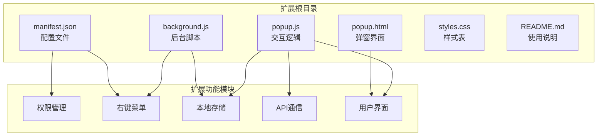
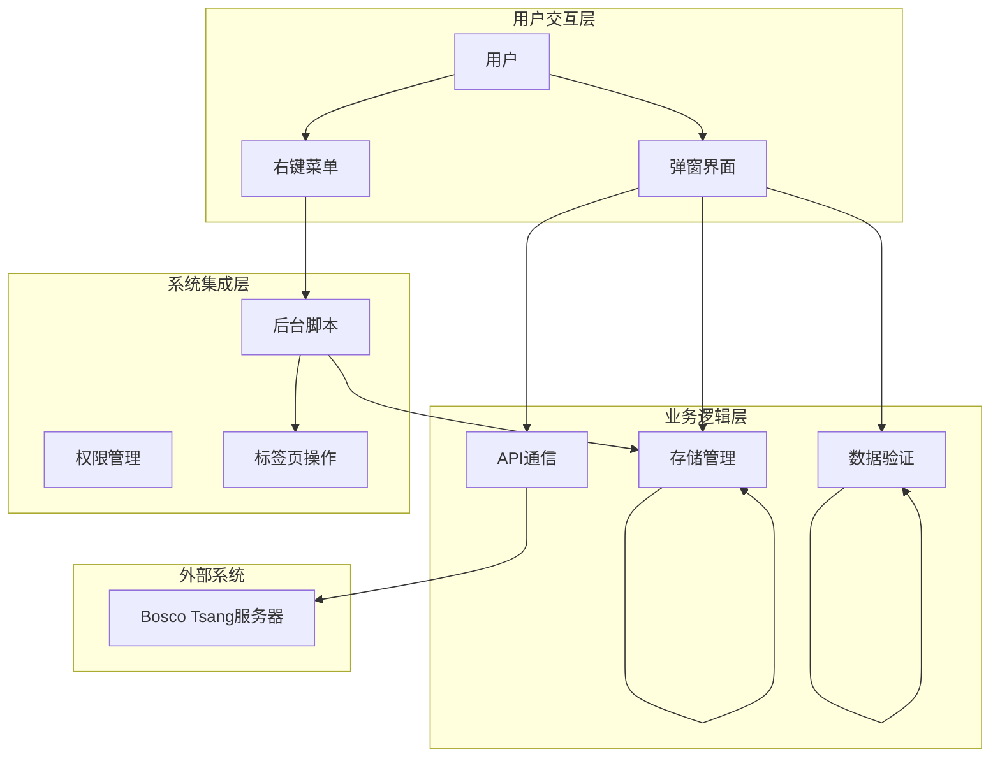
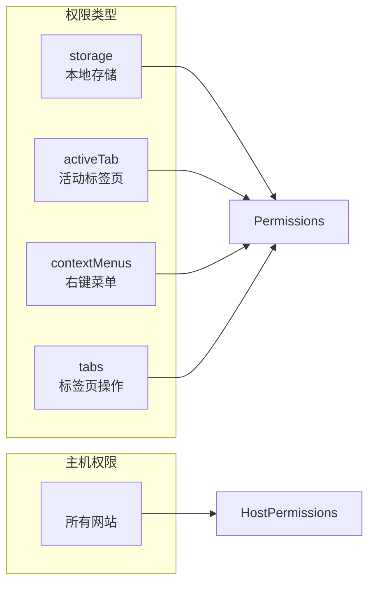
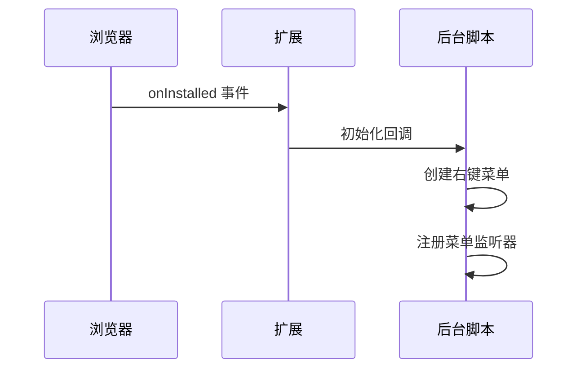
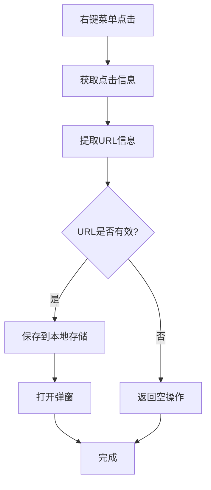
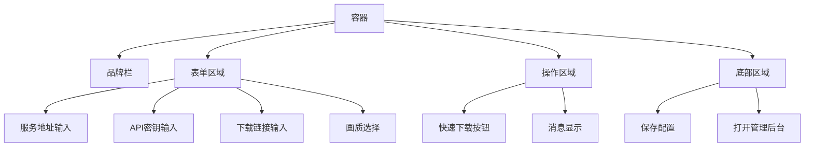
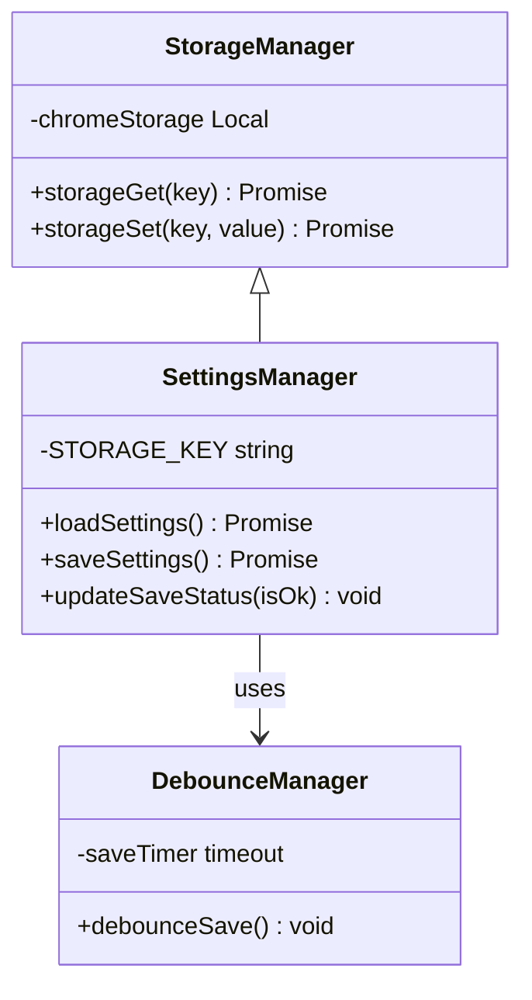
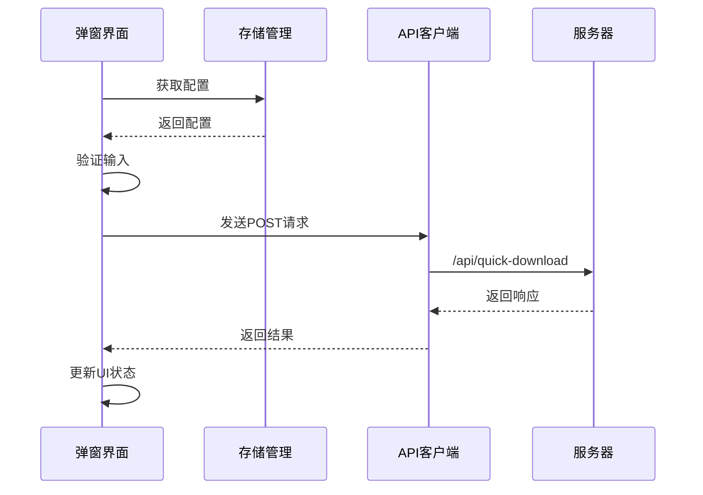
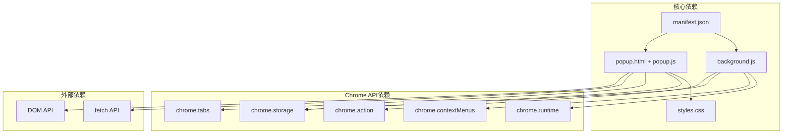

# 浏览器扩展示例

<cite>
**本文档引用的文件**
- [manifest.json](file://extensions/quick-download/manifest.json)
- [background.js](file://extensions/quick-download/background.js)
- [popup.html](file://extensions/quick-download/popup.html)
- [popup.js](file://extensions/quick-download/popup.js)
- [styles.css](file://extensions/quick-download/styles.css)
- [README.md](file://extensions/quick-download/README.md)
</cite>

## 目录
1. [简介](#简介)
2. [项目结构](#项目结构)
3. [核心组件](#核心组件)
4. [架构概览](#架构概览)
5. [详细组件分析](#详细组件分析)
6. [依赖关系分析](#依赖关系分析)
7. [性能考虑](#性能考虑)
8. [故障排除指南](#故障排除指南)
9. [结论](#结论)
10. [附录](#附录)

## 简介

这是一个基于 Manifest V3 的浏览器扩展示例，实现了快速下载功能。该扩展允许用户通过浏览器弹窗界面将当前页面链接或选中的链接发送到 Bosco Tsang 下载系统，支持右键菜单快捷操作和配置持久化存储。

该扩展示例展示了现代浏览器扩展开发的核心概念，包括权限声明、后台脚本、弹出界面设计、消息通信和跨浏览器兼容性处理。

## 项目结构

扩展项目采用简洁的文件组织结构，主要包含以下核心文件：



**图表来源**
- [manifest.json:1-23](file://extensions/quick-download/manifest.json#L1-L23)
- [background.js:1-26](file://extensions/quick-download/background.js#L1-L26)
- [popup.html:1-90](file://extensions/quick-download/popup.html#L1-L90)
- [popup.js:1-265](file://extensions/quick-download/popup.js#L1-L265)

**章节来源**
- [manifest.json:1-23](file://extensions/quick-download/manifest.json#L1-L23)
- [README.md:1-50](file://extensions/quick-download/README.md#L1-L50)

## 核心组件

### 权限管理系统

扩展声明了四个核心权限：
- **storage**: 允许持久化存储用户配置
- **activeTab**: 访问当前活动标签页信息
- **contextMenus**: 创建和管理右键菜单
- **tabs**: 查询和操作标签页

这些权限为扩展提供了完整的功能基础，确保能够正确执行下载任务和用户交互。

### 后台脚本架构

后台脚本负责扩展的初始化和系统级功能：
- 扩展安装时创建右键菜单项
- 处理菜单点击事件
- 管理数据预加载和弹窗打开

### 弹出界面设计

弹窗界面采用现代化的设计语言，包含：
- 品牌标识区域
- 配置表单区域
- 操作按钮区域
- 底部控制面板

**章节来源**
- [manifest.json:6-11](file://extensions/quick-download/manifest.json#L6-L11)
- [manifest.json:15-21](file://extensions/quick-download/manifest.json#L15-L21)
- [background.js:1-26](file://extensions/quick-download/background.js#L1-L26)
- [popup.html:10-86](file://extensions/quick-download/popup.html#L10-L86)

## 架构概览

扩展采用分层架构设计，清晰分离了不同职责的功能模块：



**图表来源**
- [background.js:15-25](file://extensions/quick-download/background.js#L15-L25)
- [popup.js:129-182](file://extensions/quick-download/popup.js#L129-L182)
- [popup.js:55-84](file://extensions/quick-download/popup.js#L55-L84)

## 详细组件分析

### Manifest 配置文件详解

Manifest V3 配置文件定义了扩展的基本属性和功能要求：

#### 基础信息配置
- **manifest_version**: 指定使用 Manifest V3 规范
- **name**: 扩展名称 "Bosco Tsang 快速下载"
- **description**: 功能描述
- **version**: 版本号 "1.2.0"

#### 权限声明


**图表来源**
- [manifest.json:6-14](file://extensions/quick-download/manifest.json#L6-L14)

#### 后台脚本配置
- **service_worker**: 指定后台脚本文件路径
- 支持 Manifest V3 的 service worker 模型

#### 用户界面配置
- **default_popup**: 指定弹窗 HTML 文件
- **default_title**: 工具栏按钮的提示文本

**章节来源**
- [manifest.json:1-23](file://extensions/quick-download/manifest.json#L1-L23)

### 后台脚本实现原理

后台脚本采用事件驱动的异步编程模式：

#### 扩展生命周期管理


**图表来源**
- [background.js:1-13](file://extensions/quick-download/background.js#L1-L13)

#### 右键菜单处理流程


**图表来源**
- [background.js:15-25](file://extensions/quick-download/background.js#L15-L25)

**章节来源**
- [background.js:1-26](file://extensions/quick-download/background.js#L1-L26)

### 弹窗界面设计与交互

弹窗界面采用响应式设计，支持不同屏幕尺寸：

#### 界面布局结构


**图表来源**
- [popup.html:10-86](file://extensions/quick-download/popup.html#L10-L86)

#### 用户交互流程
```mermaid
stateDiagram-v2
[*] --> 初始化
初始化 --> 加载配置
加载配置 --> 填充URL
填充URL --> 等待用户操作
state 等待用户操作 {
[*] --> 输入配置
输入配置 --> 点击保存
点击保存 --> 验证配置
验证配置 --> 保存成功
验证配置 --> 保存失败
保存成功 --> 等待用户操作
保存失败 --> 显示错误
显示错误 --> 等待用户操作
[*] --> 点击下载
点击下载 --> 验证输入
验证输入 --> 提交任务
提交任务 --> 等待响应
等待响应 --> 成功响应
等待响应 --> 失败响应
成功响应 --> 显示成功
失败响应 --> 显示错误
显示成功 --> 等待用户操作
显示错误 --> 等待用户操作
}
等待用户操作 --> [*]
```

**图表来源**
- [popup.js:129-182](file://extensions/quick-download/popup.js#L129-L182)
- [popup.js:55-84](file://extensions/quick-download/popup.js#L55-L84)

**章节来源**
- [popup.html:1-90](file://extensions/quick-download/popup.html#L1-L90)
- [popup.js:1-265](file://extensions/quick-download/popup.js#L1-L265)

### 数据存储与持久化

扩展采用 Chrome Extension Storage API 实现数据持久化：

#### 存储策略


**图表来源**
- [popup.js:8-20](file://extensions/quick-download/popup.js#L8-L20)
- [popup.js:55-101](file://extensions/quick-download/popup.js#L55-L101)
- [popup.js:243-247](file://extensions/quick-download/popup.js#L243-L247)

#### 配置数据结构
- **serverUrl**: 服务器地址
- **apiKey**: API 密钥
- **quality**: 下载质量偏好
- **savedAt**: 保存时间戳

**章节来源**
- [popup.js:68-84](file://extensions/quick-download/popup.js#L68-L84)
- [popup.js:3-4](file://extensions/quick-download/popup.js#L3-L4)

### API 通信机制

扩展通过标准 HTTP 请求与后端服务器通信：

#### 请求流程


**图表来源**
- [popup.js:148-182](file://extensions/quick-download/popup.js#L148-L182)

#### 请求规范
- **方法**: POST
- **端点**: `/api/quick-download`
- **头部**:
  - `Content-Type: application/json`
  - `x-api-key: <API密钥>`
- **负载**: `{ url, quality }`

**章节来源**
- [popup.js:148-156](file://extensions/quick-download/popup.js#L148-L156)
- [README.md:26-49](file://extensions/quick-download/README.md#L26-L49)

## 依赖关系分析

扩展各组件之间的依赖关系清晰明确：



**图表来源**
- [manifest.json:15-21](file://extensions/quick-download/manifest.json#L15-L21)
- [background.js:1-26](file://extensions/quick-download/background.js#L1-L26)
- [popup.js:1-265](file://extensions/quick-download/popup.js#L1-L265)

**章节来源**
- [manifest.json:1-23](file://extensions/quick-download/manifest.json#L1-L23)
- [background.js:1-26](file://extensions/quick-download/background.js#L1-L26)
- [popup.js:1-265](file://extensions/quick-download/popup.js#L1-L265)

## 性能考虑

### 内存管理
- 使用 Promise 替代回调函数，避免回调地狱
- 合理使用定时器，及时清理超时器
- 避免内存泄漏，及时移除事件监听器

### 网络优化
- 实现请求去抖动（debounce），减少不必要的网络请求
- 使用缓存策略，避免重复的数据获取
- 实现重试机制，提高网络请求成功率

### UI 响应性
- 异步处理长耗时操作
- 提供进度反馈和状态指示
- 优化 DOM 操作，减少重排重绘

## 故障排除指南

### 常见问题诊断

#### 权限相关问题
- **问题**: 右键菜单不显示
  - **原因**: 缺少 `contextMenus` 权限
  - **解决方案**: 检查 manifest.json 中的权限声明

- **问题**: 无法访问当前标签页
  - **原因**: 缺少 `activeTab` 或 `tabs` 权限
  - **解决方案**: 确认权限配置正确

#### 网络通信问题
- **问题**: API 请求失败
  - **检查**: 服务器地址格式、API 密钥有效性
  - **日志**: 查看浏览器开发者工具的网络面板

#### 存储相关问题
- **问题**: 配置无法保存
  - **检查**: Chrome Storage API 可用性
  - **解决方案**: 清理浏览器缓存和扩展数据

### 调试技巧

#### 开发者工具使用
1. 打开扩展页面 (`chrome://extensions`)
2. 启用"开发者模式"
3. 点击"详细信息"查看扩展 ID
4. 使用控制台检查 JavaScript 错误
5. 查看网络面板确认 API 调用

#### 日志记录
- 使用 `console.log()` 记录关键操作
- 实现错误捕获和异常处理
- 提供用户友好的错误提示

**章节来源**
- [popup.js:36-51](file://extensions/quick-download/popup.js#L36-L51)
- [popup.js:177-182](file://extensions/quick-download/popup.js#L177-L182)

## 结论

这个浏览器扩展示例展示了现代扩展开发的最佳实践，包括：

### 技术亮点
- **架构清晰**: 分层设计，职责分离
- **用户体验**: 响应式界面，直观操作
- **可靠性**: 完善的错误处理和状态管理
- **可维护性**: 模块化代码，易于扩展

### 安全实践
- **最小权限原则**: 仅声明必要权限
- **数据加密**: API 密钥使用 HTTPS 传输
- **输入验证**: 严格的参数校验
- **错误隔离**: 独立的错误处理机制

### 扩展性考虑
- **模块化设计**: 易于添加新功能
- **配置管理**: 支持动态配置更新
- **跨浏览器兼容**: 基于标准 API 开发

该扩展示例为浏览器扩展开发提供了完整的参考模板，涵盖了从基础配置到高级功能的各个方面。

## 附录

### 安装和部署流程

#### 开发环境搭建
1. 克隆项目到本地
2. 在浏览器扩展页面启用开发者模式
3. 加载已解压的扩展目录
4. 确认扩展正常显示在工具栏中

#### 生产环境打包
1. 清理构建产物
2. 生成压缩版本
3. 验证所有功能正常
4. 准备发布文档

### 跨浏览器兼容性

#### 支持的浏览器
- Google Chrome
- Microsoft Edge
- 其他 Chromium 内核浏览器

#### 兼容性注意事项
- 使用标准的 Web API
- 避免特定浏览器的私有特性
- 测试不同浏览器版本的行为差异

### 安全最佳实践

#### 代码安全
- 避免内联脚本
- 使用 CSP（内容安全策略）
- 验证和清理用户输入

#### 数据安全
- 使用 HTTPS 传输敏感数据
- 最小化数据收集范围
- 实现数据加密存储