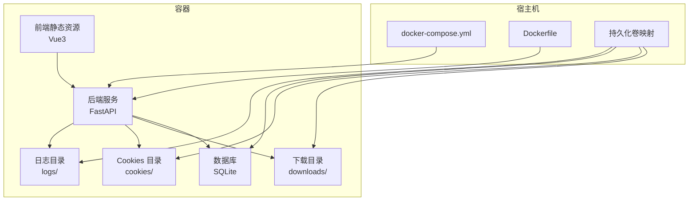
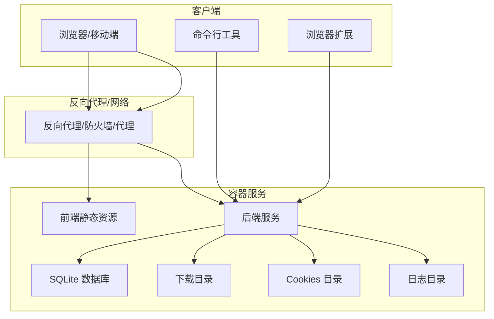
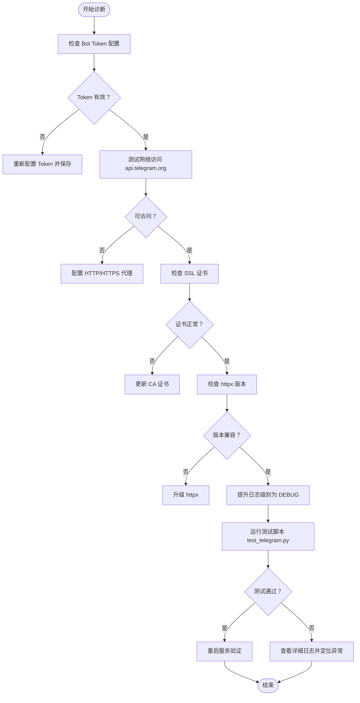
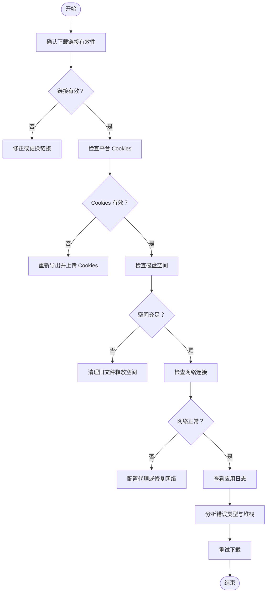
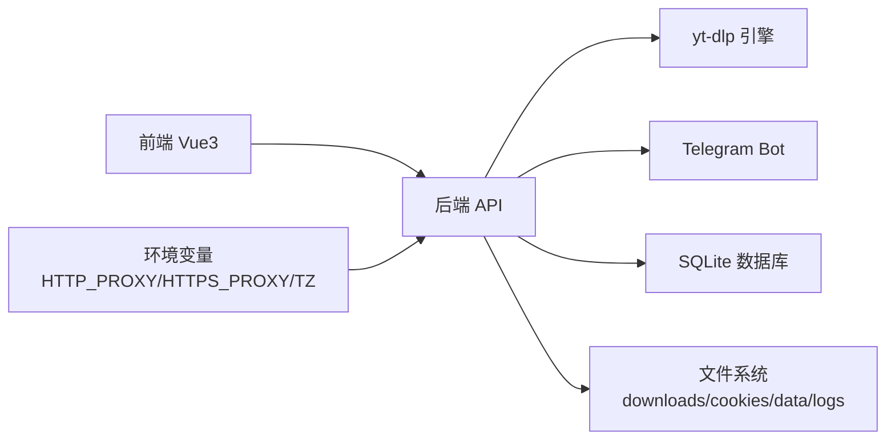

# 故障排除与常见问题

<cite>
**本文引用的文件**
- [README.md](file://README.md)
- [USAGE_MANUAL.md](file://USAGE_MANUAL.md)
- [QUICK_REFERENCE.md](file://QUICK_REFERENCE.md)
- [DEPLOYMENT.md](file://releases/DEPLOYMENT.md)
- [TELEGRAM_DIAGNOSIS.md](file://releases/TELEGRAM_DIAGNOSIS.md)
- [LOCAL_TEST_PORTS.md](file://releases/LOCAL_TEST_PORTS.md)
- [docker-compose.yml](file://docker-compose.yml)
- [Dockerfile](file://Dockerfile)
- [backend/main.py](file://backend/main.py)
- [backend/admin/telegram_bot.py](file://backend/admin/telegram_bot.py)
- [scripts/test_telegram.py](file://scripts/test_telegram.py)
- [scripts/check_telegram_config.py](file://scripts/check_telegram_config.py)
- [scripts/clean-before-push.sh](file://scripts/clean-before-push.sh)
- [scripts/clean-before-push.ps1](file://scripts/clean-before-push.ps1)
- [scripts/update-version.sh](file://scripts/update-version.sh)
- [scripts/update-version.ps1](file://scripts/update-version.ps1)
- [frontend/src/views/Login.vue](file://frontend/src/views/Login.vue)
</cite>

## 目录
1. [简介](#简介)
2. [项目结构](#项目结构)
3. [核心组件](#核心组件)
4. [架构总览](#架构总览)
5. [详细组件分析](#详细组件分析)
6. [依赖关系分析](#依赖关系分析)
7. [性能考虑](#性能考虑)
8. [故障排除指南](#故障排除指南)
9. [结论](#结论)
10. [附录](#附录)

## 简介
本文件面向 BoscoTsang 用户与运维人员，提供系统化的故障排除与常见问题解答。内容覆盖部署问题、下载失败、认证问题、性能问题、平台兼容性、网络连接、配置错误排查，以及日志分析、错误代码解释与修复步骤。同时给出社区支持渠道与问题反馈流程，帮助快速定位与解决问题。

## 项目结构
BoscoTsang 采用前后端分离架构，后端基于 FastAPI，前端基于 Vue3，通过 Docker Compose 统一编排。核心目录与职责如下：
- backend：后端服务与管理模块
- frontend：Vue3 单页应用
- cli：命令行工具
- extensions：浏览器扩展示例
- releases：发布与诊断文档
- scripts：辅助脚本（版本更新、清理、测试）
- docker-compose.yml / Dockerfile：容器化部署配置
- docs：技术文档与使用手册

图表来源
- [docker-compose.yml](file://docker-compose.yml)
- [Dockerfile](file://Dockerfile)

章节来源
- [README.md:48-122](file://README.md#L48-L122)
- [USAGE_MANUAL.md:135-178](file://USAGE_MANUAL.md#L135-L178)

## 核心组件
- 后端服务（FastAPI）：提供管理后台、下载队列、订阅管理、设置与日志接口
- 前端管理面板（Vue3）：用户登录、下载、历史、订阅、设置、日志查看
- Telegram 集成：Bot 登录、远程下载、进度推送、权限控制
- CLI 工具：登录、下载、历史查询、订阅管理、统计查看
- 浏览器扩展：快速下载当前页面资源
- Docker 编排：统一构建、持久化、端口映射与健康检查

章节来源
- [README.md:17-46](file://README.md#L17-L46)
- [USAGE_MANUAL.md:182-329](file://USAGE_MANUAL.md#L182-L329)

## 架构总览
系统通过 Docker Compose 将前端静态资源与后端服务整合，持久化关键目录（下载、Cookies、数据、日志），并通过环境变量与代理配置适配不同网络环境。

图表来源
- [docker-compose.yml](file://docker-compose.yml)
- [USAGE_MANUAL.md:135-178](file://USAGE_MANUAL.md#L135-L178)

## 详细组件分析

### Telegram Bot 诊断与修复
常见症状：Bot 无响应、错误日志为空、无法获取更新。诊断要点包括 Bot Token 配置、网络可达性、SSL 证书、依赖版本与日志级别。

图表来源
- [TELEGRAM_DIAGNOSIS.md:53-245](file://releases/TELEGRAM_DIAGNOSIS.md#L53-L245)
- [scripts/test_telegram.py](file://scripts/test_telegram.py)

章节来源
- [TELEGRAM_DIAGNOSIS.md:1-309](file://releases/TELEGRAM_DIAGNOSIS.md#L1-L309)
- [backend/admin/telegram_bot.py](file://backend/admin/telegram_bot.py)

### 下载失败排查流程
常见原因：链接无效、Cookies 失效、磁盘空间不足、网络异常、平台限制。建议按顺序检查并修复。

图表来源
- [USAGE_MANUAL.md:380-430](file://USAGE_MANUAL.md#L380-L430)
- [QUICK_REFERENCE.md:144-179](file://QUICK_REFERENCE.md#L144-L179)

章节来源
- [USAGE_MANUAL.md:378-482](file://USAGE_MANUAL.md#L378-L482)
- [QUICK_REFERENCE.md:142-179](file://QUICK_REFERENCE.md#L142-L179)

### 认证与权限问题
- 默认管理员账号：首次登录后务必修改默认密码
- Telegram 登录：确保 Bot Token 正确、启用登录功能、用户 ID 在允许列表
- API Key：通过后台生成并妥善保管，避免泄露
- 前端配置：Login.vue 中的 data-telegram-login 需与 Bot Username 一致

章节来源
- [README.md:86-91](file://README.md#L86-L91)
- [USAGE_MANUAL.md:266-292](file://USAGE_MANUAL.md#L266-L292)
- [frontend/src/views/Login.vue](file://frontend/src/views/Login.vue)

### 端口与网络连接问题
- 默认端口：8080（宿主机）:8000（容器）
- 端口冲突：修改 docker-compose.yml 中的端口映射并重启
- 外部访问：配置防火墙放行、路由器端口转发
- 本地测试：使用 curl 验证服务、登录、设置接口可用性

章节来源
- [LOCAL_TEST_PORTS.md:1-327](file://releases/LOCAL_TEST_PORTS.md#L1-L327)
- [docker-compose.yml](file://docker-compose.yml)

### 性能与资源问题
- 建议配置：内存 8GB+、CPU 4 核+、SSD 磁盘、稳定宽带
- 优化建议：定期清理旧文件、限制并发下载、使用代理加速（如需要）

章节来源
- [USAGE_MANUAL.md:484-496](file://USAGE_MANUAL.md#L484-L496)

## 依赖关系分析
后端服务依赖 yt-dlp 引擎进行多平台下载；Telegram 功能依赖 httpx 与 Telegram API；前端通过 API 与后端交互；Docker 环境通过环境变量与持久化卷提供配置与数据隔离。

图表来源
- [USAGE_MANUAL.md:171](file://USAGE_MANUAL.md#L171)
- [docker-compose.yml](file://docker-compose.yml)

## 性能考虑
- 并发控制：合理设置下载并发数，避免带宽与磁盘瓶颈
- 存储策略：定期清理缓存与旧文件，保持磁盘空间充足
- 网络优化：在受限网络环境下配置代理，减少超时与失败
- 资源监控：关注 CPU、内存、磁盘 IO 使用情况，必要时扩容

## 故障排除指南

### 通用诊断步骤
- 查看容器状态与日志：确认服务是否正常运行
- 检查持久化卷：确认 downloads、cookies、data、logs 目录存在且可写
- 验证端口映射：确认宿主机端口映射正确且未被占用
- 检查环境变量：核对 APP_BASE_DIR、HTTP_PROXY、HTTPS_PROXY、TZ 等

章节来源
- [LOCAL_TEST_PORTS.md:283-313](file://releases/LOCAL_TEST_PORTS.md#L283-L313)
- [docker-compose.yml](file://docker-compose.yml)

### 部署与发布问题
- 构建失败：清理 Docker 缓存后重新构建
- 版本冲突：手动同步版本号（后端、前端、文档）
- 推送被拒：检查并移除历史中的大文件

章节来源
- [DEPLOYMENT.md:221-254](file://releases/DEPLOYMENT.md#L221-L254)

### 下载失败
- 检查链接、Cookies、磁盘空间与网络
- 查看应用日志定位具体错误
- 重试下载或调整平台设置

章节来源
- [USAGE_MANUAL.md:380-430](file://USAGE_MANUAL.md#L380-L430)

### Telegram Bot 无响应
- 确认 Bot Token 配置与格式正确
- 检查网络可达性与代理配置
- 更新 SSL 证书，确保 httpx 版本兼容
- 使用测试脚本与诊断报告定位问题

章节来源
- [TELEGRAM_DIAGNOSIS.md:109-246](file://releases/TELEGRAM_DIAGNOSIS.md#L109-L246)

### 端口冲突与访问异常
- 停止占用端口的进程或修改映射端口
- 配置防火墙与路由器端口转发
- 使用 curl 测试服务可用性

章节来源
- [LOCAL_TEST_PORTS.md:285-313](file://releases/LOCAL_TEST_PORTS.md#L285-L313)

### 日志分析与错误代码解释
- 实时查看日志：docker logs -f 容器名
- 应用日志：进入容器查看 /app/logs 下的日志文件
- 导出日志：docker cp 容器:/app/logs/ 本地目录
- Telegram 诊断：查看包含 Telegram 的错误日志段落，结合测试脚本输出定位

章节来源
- [USAGE_MANUAL.md:471-482](file://USAGE_MANUAL.md#L471-L482)
- [TELEGRAM_DIAGNOSIS.md:269-273](file://releases/TELEGRAM_DIAGNOSIS.md#L269-L273)

### 配置错误排查
- 环境变量：核对 APP_BASE_DIR、DOWNLOAD_DIR、COOKIES_DIR、LOGS_DIR、TZ
- 代理设置：在系统设置中启用并填写 HTTP/HTTPS 代理
- 前端配置：Login.vue 中的 data-telegram-login 与 Bot Username 一致
- 版本更新：使用脚本更新版本号并同步文档

章节来源
- [QUICK_REFERENCE.md:501-510](file://QUICK_REFERENCE.md#L501-L510)
- [USAGE_MANUAL.md:84-97](file://USAGE_MANUAL.md#L84-L97)
- [frontend/src/views/Login.vue](file://frontend/src/views/Login.vue)

### 社区支持与问题反馈
- 查看使用说明书与更新日志
- 提交 Issue 描述问题与复现步骤
- 提供测试脚本输出、网络测试结果、配置信息与完整日志

章节来源
- [USAGE_MANUAL.md:463-470](file://USAGE_MANUAL.md#L463-L470)
- [TELEGRAM_DIAGNOSIS.md:249-273](file://releases/TELEGRAM_DIAGNOSIS.md#L249-L273)

## 结论
通过系统化的诊断流程与完善的日志分析，大多数部署与运行问题均可快速定位与修复。建议在生产环境中启用 HTTPS、配置防火墙、定期备份数据，并遵循版本更新与推送前检查清单，确保系统的稳定性与安全性。

## 附录

### 常用命令速查
- 启动/停止/重启服务
- 查看日志与容器状态
- 备份与清理数据
- 更新版本号与推送流程

章节来源
- [QUICK_REFERENCE.md:16-59](file://QUICK_REFERENCE.md#L16-L59)
- [DEPLOYMENT.md:57-127](file://releases/DEPLOYMENT.md#L57-L127)

### 目录结构与持久化
- downloads：下载文件输出目录
- cookies：平台 Cookies 存放目录
- data：SQLite 数据库与应用数据
- logs：运行日志文件

章节来源
- [README.md:105-113](file://README.md#L105-L113)
- [USAGE_MANUAL.md:135-156](file://USAGE_MANUAL.md#L135-L156)