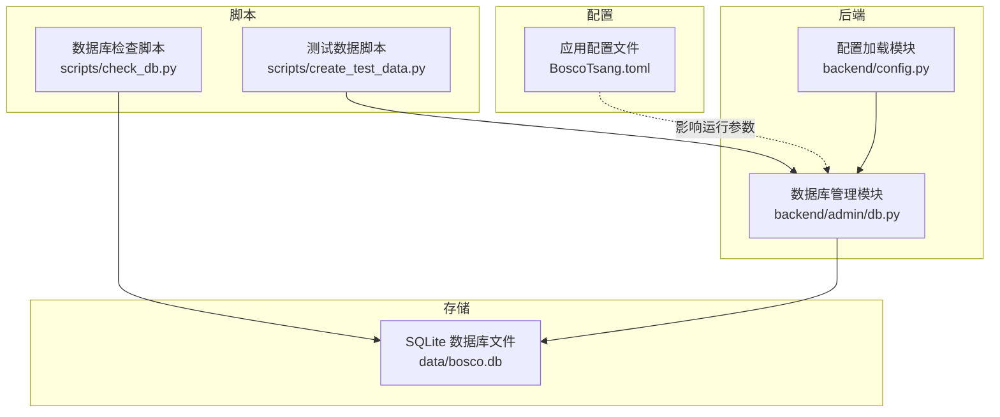
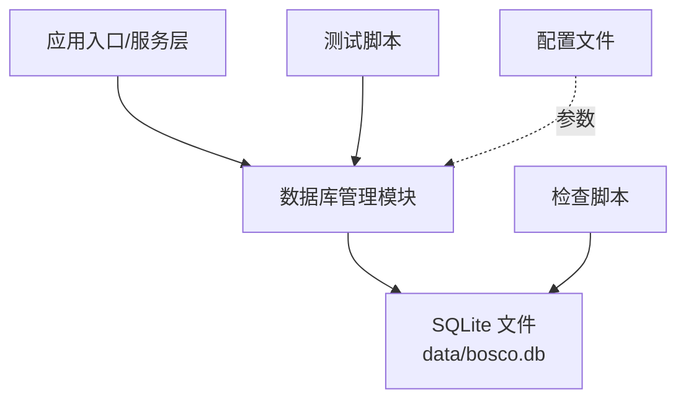
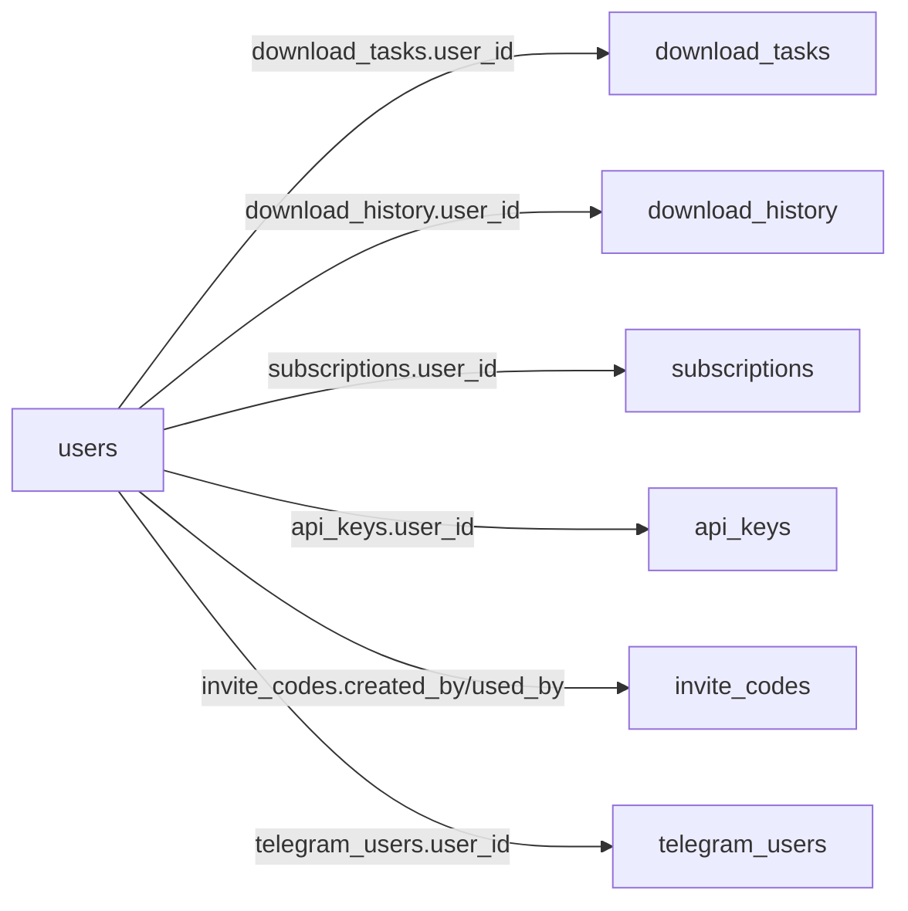

# 数据库设计

<cite>
**本文引用的文件**
- [backend/admin/db.py](file://backend/admin/db.py)
- [scripts/check_db.py](file://scripts/check_db.py)
- [scripts/create_test_data.py](file://scripts/create_test_data.py)
- [BoscoTsang.toml](file://BoscoTsang.toml)
</cite>

## 目录
1. [简介](#简介)
2. [项目结构](#项目结构)
3. [核心组件](#核心组件)
4. [架构总览](#架构总览)
5. [详细组件分析](#详细组件分析)
6. [依赖分析](#依赖分析)
7. [性能考虑](#性能考虑)
8. [故障排查指南](#故障排查指南)
9. [结论](#结论)
10. [附录](#附录)

## 简介
本文件面向 BoscoTsang 的 SQLite 数据库设计，系统性阐述数据库架构、表结构设计与数据模型关系，重点覆盖用户表、下载任务表、下载历史表、订阅表等核心数据表的设计原理，明确字段定义、索引策略与约束规则；同时给出数据访问模式、缓存策略与性能优化建议，并提供数据迁移路径、版本管理与备份恢复方案。

## 项目结构
数据库相关的核心实现集中在后端模块中，采用集中式数据库管理模块统一负责建表、迁移与数据访问；配套脚本用于数据库健康检查与测试数据注入；配置文件提供运行时参数（如下载目录、日志级别等），间接影响数据库相关行为。

图表来源
- [backend/admin/db.py:15-21](file://backend/admin/db.py#L15-L21)
- [scripts/check_db.py:5](file://scripts/check_db.py#L5)
- [scripts/create_test_data.py:8](file://scripts/create_test_data.py#L8)
- [BoscoTsang.toml:1-28](file://BoscoTsang.toml#L1-L28)

章节来源
- [backend/admin/db.py:15-21](file://backend/admin/db.py#L15-L21)
- [scripts/check_db.py:5](file://scripts/check_db.py#L5)
- [scripts/create_test_data.py:8](file://scripts/create_test_data.py#L8)
- [BoscoTsang.toml:1-28](file://BoscoTsang.toml#L1-L28)

## 核心组件
- 数据库管理模块：负责数据库初始化、表结构创建与迁移、各类数据访问接口（用户、下载任务、下载历史、订阅、API 密钥、统计、邀请码、Telegram 用户绑定等）。
- 数据库检查脚本：用于列出表、统计行数、预览关键记录与用户列表，辅助运维与问题定位。
- 测试数据脚本：在数据库为空时批量插入示例数据，便于前端与后端联调验证。
- 应用配置文件：提供下载目录、日志级别等运行参数，间接影响数据落盘与日志记录。

章节来源
- [backend/admin/db.py:29-214](file://backend/admin/db.py#L29-L214)
- [scripts/check_db.py:1-61](file://scripts/check_db.py#L1-L61)
- [scripts/create_test_data.py:12-84](file://scripts/create_test_data.py#L12-L84)
- [BoscoTsang.toml:21-28](file://BoscoTsang.toml#L21-L28)

## 架构总览
数据库层采用 SQLite 文件型数据库，位于应用数据目录下；后端通过统一的数据库管理模块进行连接、建表与数据操作；脚本工具独立于业务逻辑之外，提供运维与测试能力；配置文件为运行期参数来源，不直接参与数据库结构定义。

图表来源
- [backend/admin/db.py:15-21](file://backend/admin/db.py#L15-L21)
- [scripts/check_db.py:5](file://scripts/check_db.py#L5)
- [scripts/create_test_data.py:8](file://scripts/create_test_data.py#L8)
- [BoscoTsang.toml:21-28](file://BoscoTsang.toml#L21-L28)

## 详细组件分析

### 数据库初始化与迁移
- 初始化流程：模块启动时创建用户、下载任务、下载历史、订阅、API 密钥、邀请码、统计、系统设置、Telegram 用户绑定等表；若不存在默认管理员与默认邀请码则创建。
- 迁移策略：通过查询表元信息判断字段是否存在，按需新增字段（如 API 密钥表新增权限范围、过期时间、速率限制、使用次数、最后使用 IP 等）。

章节来源
- [backend/admin/db.py:29-214](file://backend/admin/db.py#L29-L214)
- [backend/admin/db.py:197-211](file://backend/admin/db.py#L197-L211)

### 用户表（users）
- 设计要点：自增主键、用户名唯一、角色（默认普通用户）、头像、创建时间、最近登录时间、启用状态。
- 约束与索引：用户名唯一；可考虑对常用查询字段建立索引（如启用状态、角色）。
- 典型操作：创建用户（可选邀请码校验）、登录验证（密码哈希比对、更新最近登录时间）、查询用户、更新角色/状态、删除用户、改密、更新头像。

章节来源
- [backend/admin/db.py:34-46](file://backend/admin/db.py#L34-L46)
- [backend/admin/db.py:217-355](file://backend/admin/db.py#L217-L355)

### 下载任务表（download_tasks）
- 设计要点：自增主键、任务 ID 唯一、URL、标题、平台、资源类型、分辨率、文件大小、状态（默认待处理）、进度、速度、错误信息、关联用户、时间戳（创建/开始/结束/文件路径）。
- 约束与索引：任务 ID 唯一；建议对状态、平台、资源类型、用户 ID、创建时间建立索引以提升查询效率。
- 典型操作：创建任务并同步写入历史、按条件查询任务列表、更新任务状态/进度/标题/文件路径等、重命名任务并同步更新文件系统与历史记录、删除任务（级联删除历史）。

章节来源
- [backend/admin/db.py:48-70](file://backend/admin/db.py#L48-L70)
- [backend/admin/db.py:359-483](file://backend/admin/db.py#L359-L483)

### 下载历史表（download_history）
- 设计要点：自增主键、任务 ID、URL、标题、平台、资源类型、分辨率、文件大小、状态、关联用户、时间戳（创建/结束）。
- 约束与索引：与任务表通过任务 ID 关联；建议对状态、平台、资源类型、用户 ID、创建时间建立索引。
- 典型操作：查询历史列表（支持多维过滤与分页）、删除指定历史、清空全部或按用户清空、统计分析。

章节来源
- [backend/admin/db.py:72-89](file://backend/admin/db.py#L72-L89)
- [backend/admin/db.py:486-540](file://backend/admin/db.py#L486-L540)

### 订阅表（subscriptions）
- 设计要点：自增主键、订阅 ID 唯一、频道名称、频道 URL、平台、轮询间隔（秒，默认 1 小时）、上次检查时间、状态（默认启用）、累计下载数、关联用户、创建时间。
- 约束与索引：订阅 ID 唯一；建议对平台、状态、用户 ID 建立索引。
- 典型操作：创建订阅、查询订阅列表（支持按用户/平台/状态过滤）、按订阅 ID 查询、更新状态/上次检查/累计下载/轮询间隔、删除订阅。

章节来源
- [backend/admin/db.py:91-107](file://backend/admin/db.py#L91-L107)
- [backend/admin/db.py:544-627](file://backend/admin/db.py#L544-L627)

### API 密钥表（api_keys）
- 设计要点：自增主键、密钥 ID 唯一、密钥哈希、密钥前缀、备注、状态（默认启用）、权限范围（JSON 数组，默认读写）、过期时间、每分钟速率限制、使用次数、最后使用时间、最后使用 IP、关联用户、创建时间。
- 约束与索引：密钥 ID 唯一；建议对状态、用户 ID、过期时间建立索引。
- 典型操作：创建密钥（生成 ID/哈希/前缀，计算过期时间与权限范围）、验证密钥（哈希匹配、状态有效、未过期、未超速）、查询密钥列表、更新密钥信息（含权限范围 JSON 序列化）、更新状态、删除密钥。

章节来源
- [backend/admin/db.py:109-128](file://backend/admin/db.py#L109-L128)
- [backend/admin/db.py:649-862](file://backend/admin/db.py#L649-L862)

### 邀请码表（invite_codes）
- 设计要点：自增主键、邀请码唯一、使用人、使用时间、创建时间、创建人。
- 约束与索引：邀请码唯一；建议对使用状态、创建人建立索引。
- 典型操作：创建邀请码、查询邀请码列表（含创建人用户名）、标记使用（更新使用人与时间）。

章节来源
- [backend/admin/db.py:130-142](file://backend/admin/db.py#L130-L142)
- [backend/admin/db.py:969-994](file://backend/admin/db.py#L969-L994)

### 统计表（statistics）
- 设计要点：自增主键、日期唯一、当日统计项（总下载数、视频/音频/图片数量、总大小、成功/失败数）。
- 约束与索引：日期唯一；建议对日期建立索引。
- 典型操作：按日增量更新统计项、查询总览与近 N 天趋势、平台分布、用户排行。

章节来源
- [backend/admin/db.py:144-157](file://backend/admin/db.py#L144-L157)
- [backend/admin/db.py:864-967](file://backend/admin/db.py#L864-L967)

### 系统设置表（settings）
- 设计要点：键值对设置，键唯一。
- 约束与索引：键唯一；建议对常用键建立索引。
- 典型操作：读取设置项、写入设置项（冲突时更新）。

章节来源
- [backend/admin/db.py:159-165](file://backend/admin/db.py#L159-L165)
- [backend/admin/db.py:628-647](file://backend/admin/db.py#L628-L647)

### Telegram 用户绑定表（telegram_users）
- 设计要点：自增主键、Telegram ID 唯一、用户名、昵称、用户 ID、启用状态、创建时间、最后登录时间。
- 约束与索引：Telegram ID 唯一；建议对启用状态、用户 ID 建立索引。
- 典型操作：按 Telegram ID 查询、创建绑定、更新信息、绑定系统用户并更新登录时间。

章节来源
- [backend/admin/db.py:167-181](file://backend/admin/db.py#L167-L181)
- [backend/admin/db.py:995-1072](file://backend/admin/db.py#L995-L1072)

### 数据访问模式与缓存策略
- 访问模式
  - 单表 CRUD：用户、订阅、API 密钥、邀请码、Telegram 用户绑定等均提供标准的增删改查接口。
  - 关联一致性：下载任务与历史表通过任务 ID 保持状态与元数据同步；更新任务时同步更新历史对应字段。
  - 聚合查询：统计模块提供总览、趋势、分布与排行等聚合视图。
- 缓存策略
  - 适用场景：高频只读配置（settings）、近期热门订阅、用户基本信息等可引入进程内缓存或 LRU 缓存。
  - 注意事项：写操作必须保证数据库持久化与缓存失效/更新的一致性，避免脏读。

章节来源
- [backend/admin/db.py:390-417](file://backend/admin/db.py#L390-L417)
- [backend/admin/db.py:864-967](file://backend/admin/db.py#L864-L967)

### 性能优化建议
- 索引优化
  - 在高频过滤字段上建立索引：download_tasks/status、download_tasks/platform、download_tasks/resource_type、download_tasks/user_id、download_tasks/created_at；download_history 同上；subscriptions/platform、subscriptions/status、subscriptions/user_id；api_keys/status、api_keys/user_id、api_keys/expires_at；telegram_users/is_active、telegram_users/user_id。
- 分页与排序
  - 列表查询普遍支持 limit/offset 与按创建时间倒序，确保索引命中以降低排序成本。
- 写入优化
  - 批量写入：导入测试数据时一次性提交，减少事务开销。
  - 原子更新：使用 ON CONFLICT 或事务包裹，保证并发安全。
- IO 优化
  - SQLite 文件位于应用数据目录，建议部署在高性能磁盘；避免频繁重命名文件导致的跨盘移动。

章节来源
- [backend/admin/db.py:419-450](file://backend/admin/db.py#L419-L450)
- [backend/admin/db.py:486-518](file://backend/admin/db.py#L486-L518)
- [backend/admin/db.py:558-580](file://backend/admin/db.py#L558-L580)
- [backend/admin/db.py:649-688](file://backend/admin/db.py#L649-L688)
- [scripts/create_test_data.py:12-84](file://scripts/create_test_data.py#L12-L84)

### 数据迁移路径与版本管理
- 迁移机制
  - 启动时检测表结构变化，动态添加缺失字段（如 API 密钥表新增权限范围、过期时间、速率限制、使用次数、最后使用 IP）。
- 版本管理
  - 通过数据库初始化函数集中维护迁移步骤，避免分散的 SQL 脚本；每次新增字段或表变更时在该函数中补充相应逻辑。
- 回滚策略
  - 当前实现为单向迁移（新增字段），不提供回滚；如需回滚，建议在迁移函数中增加逆向逻辑或引入版本号字段。

章节来源
- [backend/admin/db.py:197-211](file://backend/admin/db.py#L197-L211)
- [backend/admin/db.py:29-214](file://backend/admin/db.py#L29-L214)

### 备份与恢复方案
- 备份
  - 文件级备份：直接复制 data/bosco.db 文件；建议在停止服务或锁定写入后进行。
  - 命令行备份：使用 sqlite3 命令导出 SQL 或使用 .backup 命令。
- 恢复
  - 恢复到新环境：将备份文件放回原路径；如需迁移至不同路径，需调整应用配置与脚本中的路径常量。
  - 验证：使用检查脚本核对表清单、行数与关键记录，确认恢复成功。

章节来源
- [scripts/check_db.py:13-58](file://scripts/check_db.py#L13-L58)

## 依赖分析
数据库层依赖关系清晰，主要围绕外键约束形成弱耦合的实体关系；脚本工具与配置文件作为外部输入，不改变数据库结构定义。

图表来源
- [backend/admin/db.py:34-46](file://backend/admin/db.py#L34-L46)
- [backend/admin/db.py:48-70](file://backend/admin/db.py#L48-L70)
- [backend/admin/db.py:72-89](file://backend/admin/db.py#L72-L89)
- [backend/admin/db.py:91-107](file://backend/admin/db.py#L91-L107)
- [backend/admin/db.py:109-128](file://backend/admin/db.py#L109-L128)
- [backend/admin/db.py:130-142](file://backend/admin/db.py#L130-L142)
- [backend/admin/db.py:167-181](file://backend/admin/db.py#L167-L181)

## 性能考虑
- 查询性能
  - 对高频过滤字段建立索引，避免全表扫描。
  - 列表查询使用 limit/offset 并配合合适索引，控制响应时间。
- 写入性能
  - 批量写入与事务合并，减少磁盘刷写次数。
  - 避免大事务长时间持有锁，拆分热点写入。
- 存储布局
  - SQLite 文件置于 SSD 或高性能存储介质；定期检查文件碎片与空间使用情况。
- 并发控制
  - 使用连接池与合理的超时设置；避免长事务阻塞其他会话。

## 故障排查指南
- 数据库不可达
  - 检查 data/bosco.db 是否存在；确认应用数据目录权限正确。
- 表结构异常
  - 使用检查脚本列出表与行数，定位缺失表或字段；必要时重新初始化数据库。
- 数据不一致
  - 核对下载任务与历史表的同步逻辑；确认更新任务时同步更新历史字段。
- API 密钥验证失败
  - 检查密钥状态、过期时间与速率限制；确认客户端 IP 与最后使用 IP 记录。
- 统计数据异常
  - 核对每日统计更新逻辑与日期唯一约束；检查聚合查询的条件与排序。

章节来源
- [scripts/check_db.py:13-58](file://scripts/check_db.py#L13-L58)
- [backend/admin/db.py:390-417](file://backend/admin/db.py#L390-L417)
- [backend/admin/db.py:690-751](file://backend/admin/db.py#L690-L751)
- [backend/admin/db.py:866-901](file://backend/admin/db.py#L866-L901)

## 结论
本设计以 SQLite 为核心存储，围绕用户、下载任务/历史、订阅、API 密钥、统计、邀请码与 Telegram 绑定等实体构建了清晰的数据模型；通过统一的数据库管理模块实现初始化、迁移与访问；配合脚本工具与配置文件，形成可运维、可扩展的数据库体系。建议在生产环境中完善索引、监控与备份策略，持续优化查询与写入性能。

## 附录
- 数据库路径与连接
  - 数据库文件路径：data/bosco.db
  - 连接方式：通过 get_connection 获取连接，row_factory 设置为 sqlite3.Row
- 配置参数
  - 下载目录：download.download_dir（为空时使用 APP_BASE_DIR 下的 downloads）
  - 日志级别：logging.level（INFO）

章节来源
- [backend/admin/db.py:15-27](file://backend/admin/db.py#L15-L27)
- [BoscoTsang.toml:21-28](file://BoscoTsang.toml#L21-L28)