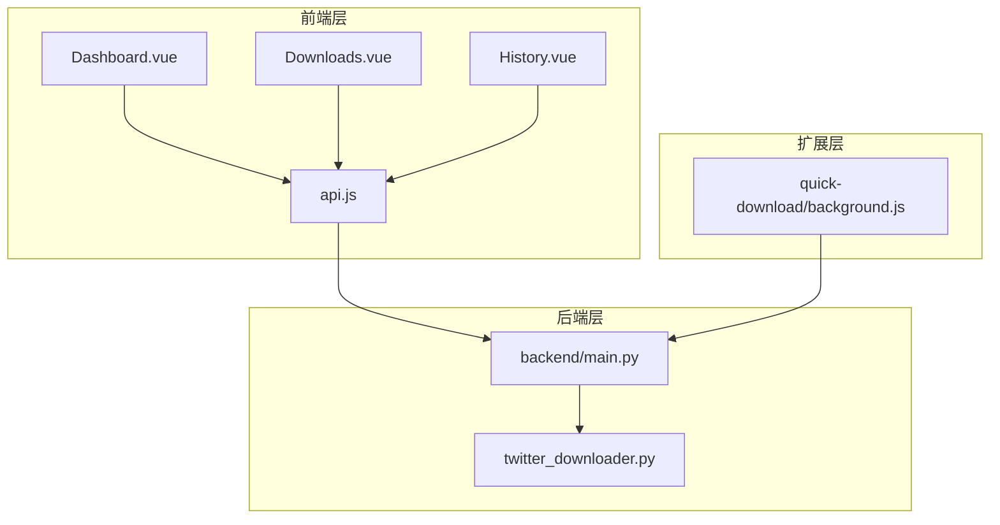
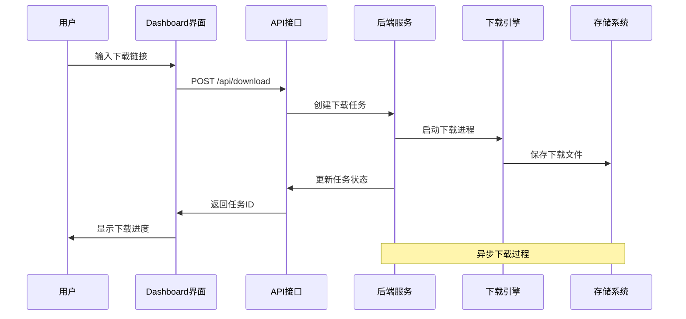
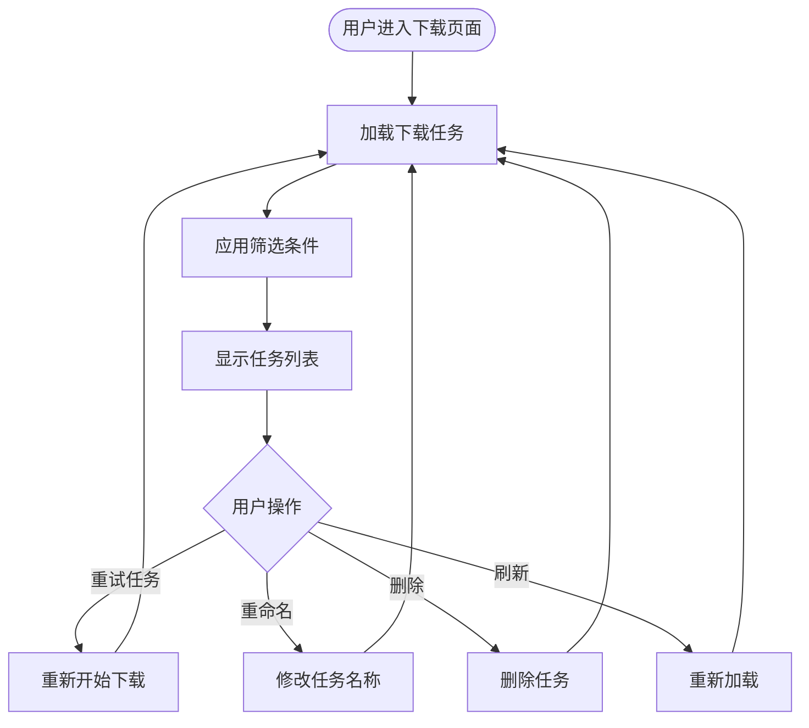
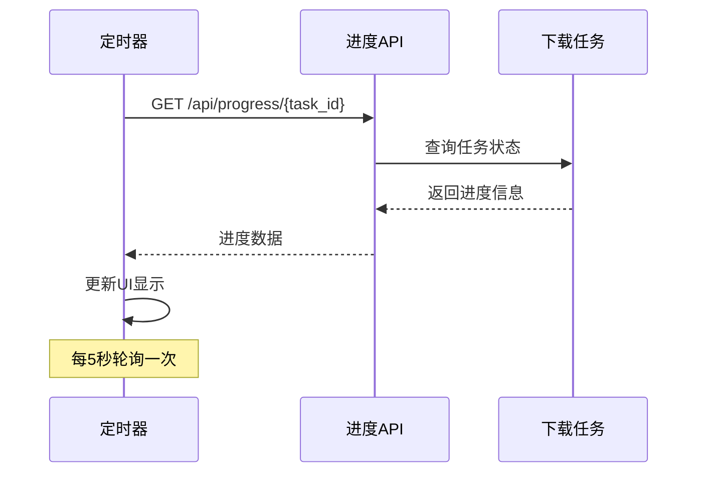
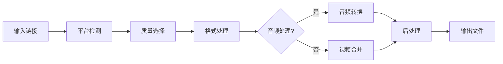
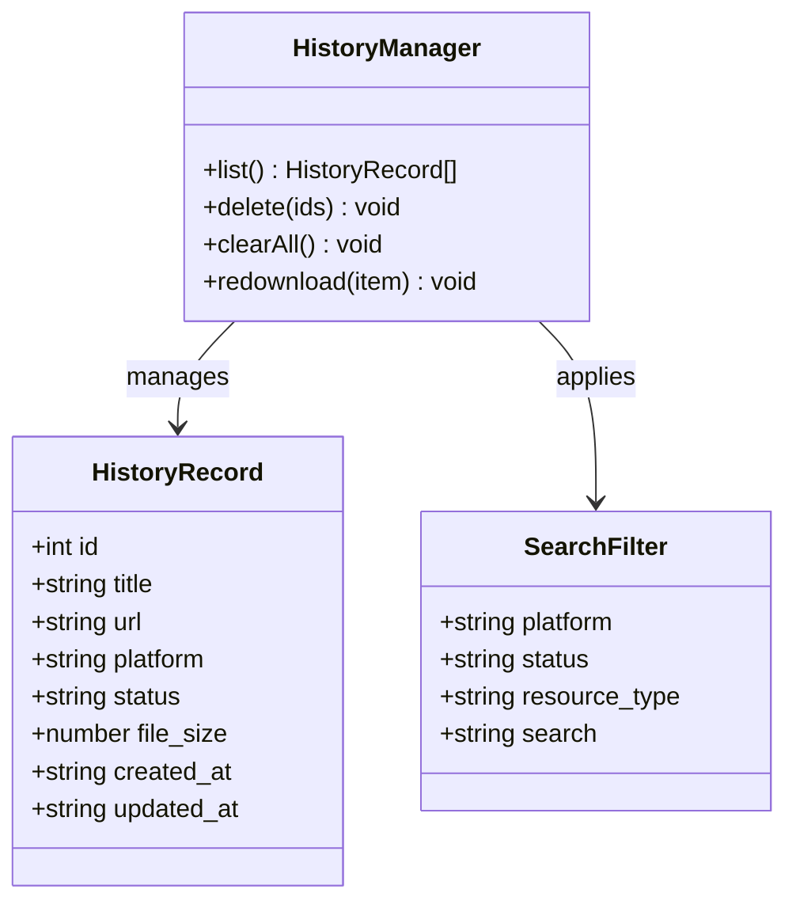
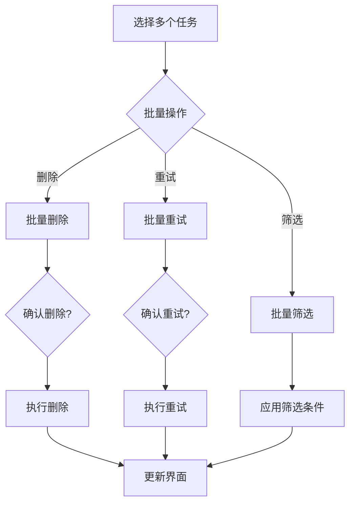
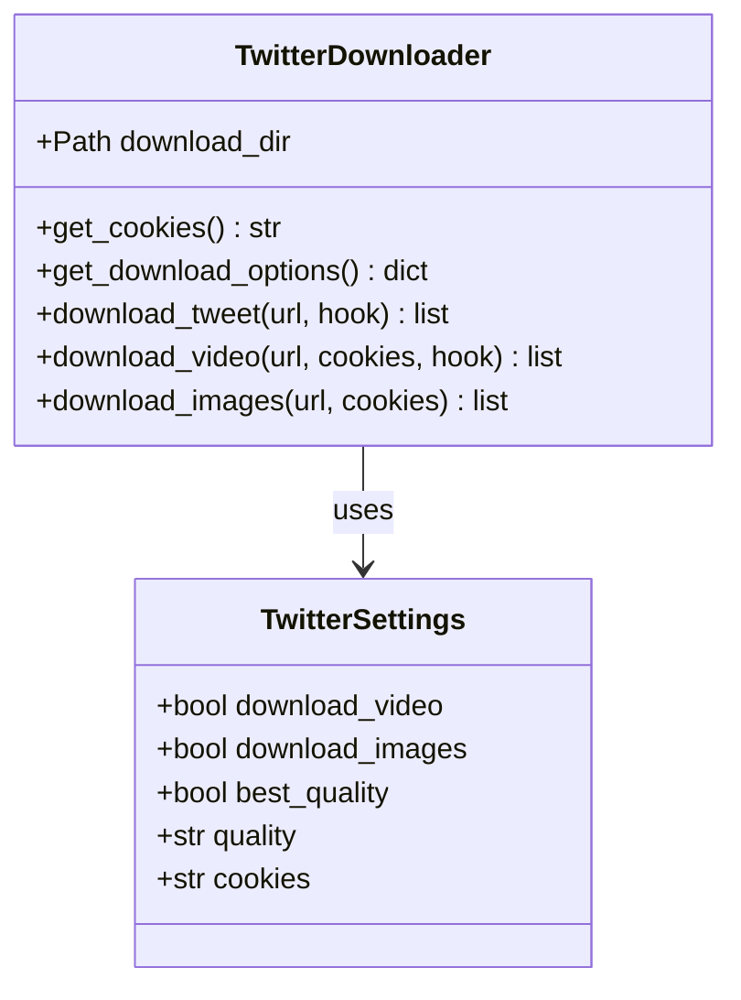
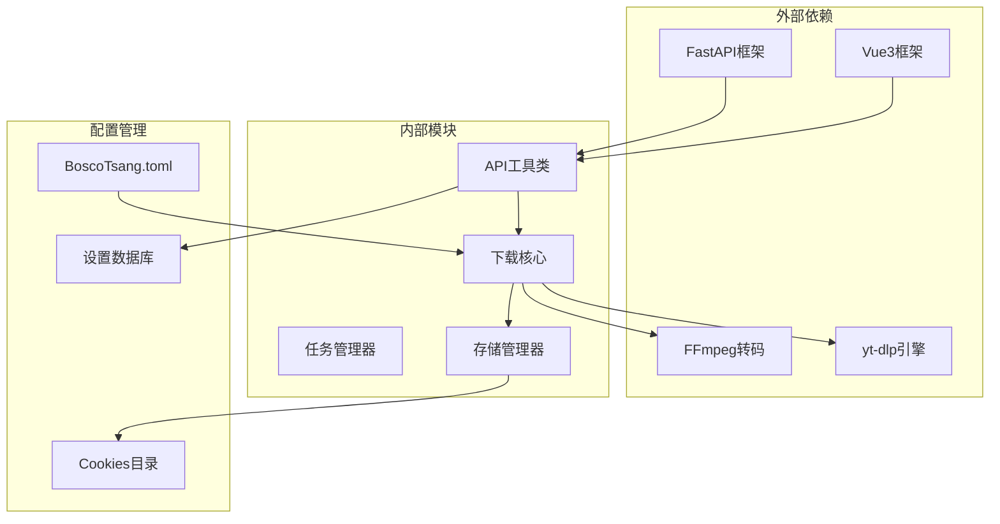

# 下载管理

<cite>
**本文档引用的文件**
- [frontend/src/views/Downloads.vue](file://frontend/src/views/Downloads.vue)
- [frontend/src/views/History.vue](file://frontend/src/views/History.vue)
- [frontend/src/views/Dashboard.vue](file://frontend/src/views/Dashboard.vue)
- [frontend/src/utils/api.js](file://frontend/src/utils/api.js)
- [backend/main.py](file://backend/main.py)
- [backend/admin/twitter_downloader.py](file://backend/admin/twitter_downloader.py)
- [extensions/quick-download/background.js](file://extensions/quick-download/background.js)
- [README.md](file://README.md)
- [USAGE_MANUAL.md](file://USAGE_MANUAL.md)
- [BoscoTsang.toml](file://BoscoTsang.toml)
</cite>

## 目录
1. [简介](#简介)
2. [项目结构](#项目结构)
3. [核心组件](#核心组件)
4. [架构概览](#架构概览)
5. [详细组件分析](#详细组件分析)
6. [依赖关系分析](#依赖关系分析)
7. [性能考虑](#性能考虑)
8. [故障排除指南](#故障排除指南)
9. [结论](#结论)
10. [附录](#附录)

## 简介

Bosco Tsang 是一个基于 Docker 的全平台视频/音乐/图片下载系统，集成了前端 Vue3 管理面板、FastAPI 后端服务、yt-dlp 下载引擎的完整下载平台。系统支持多平台抓取、订阅管理、代理配置、用户权限、API Key 与下载统计。

### 核心功能
- ✅ 多平台下载：YouTube、Bilibili、抖音、快手、Instagram、QQ音乐、网易云音乐、Apple Music、Twitter/X、微信视频号等
- ✅ 视频/音频/图片下载与提取
- ✅ 下载任务管理与进度查看
- ✅ 订阅管理：自动监控频道更新并自动下载
- ✅ 浏览器扩展：快速下载当前页面资源

## 项目结构

**图表来源**
- [frontend/src/views/Dashboard.vue:1-599](file://frontend/src/views/Dashboard.vue#L1-L599)
- [frontend/src/views/Downloads.vue:1-355](file://frontend/src/views/Downloads.vue#L1-L355)
- [frontend/src/views/History.vue:1-340](file://frontend/src/views/History.vue#L1-L340)
- [frontend/src/utils/api.js:1-274](file://frontend/src/utils/api.js#L1-L274)
- [backend/main.py:1-1912](file://backend/main.py#L1-L1912)
- [backend/admin/twitter_downloader.py:1-240](file://backend/admin/twitter_downloader.py#L1-L240)
- [extensions/quick-download/background.js:1-26](file://extensions/quick-download/background.js#L1-L26)

**章节来源**
- [README.md:48-65](file://README.md#L48-L65)

## 核心组件

### 下载管理界面
下载管理界面提供了完整的下载任务控制功能，包括任务列表、筛选、进度查看和操作控制。

### 历史记录管理
历史记录界面展示了已完成和失败的下载任务，支持重新下载、删除和批量操作。

### 快速下载功能
Dashboard 提供了快速下载入口，支持多种质量选项和平台选择。

### API 接口层
统一的 API 接口封装了所有下载相关的操作，包括任务创建、进度查询、重命名和删除。

**章节来源**
- [frontend/src/views/Downloads.vue:1-355](file://frontend/src/views/Downloads.vue#L1-L355)
- [frontend/src/views/History.vue:1-340](file://frontend/src/views/History.vue#L1-L340)
- [frontend/src/views/Dashboard.vue:1-599](file://frontend/src/views/Dashboard.vue#L1-L599)
- [frontend/src/utils/api.js:67-91](file://frontend/src/utils/api.js#L67-L91)

## 架构概览

**图表来源**
- [frontend/src/utils/api.js:68-91](file://frontend/src/utils/api.js#L68-L91)
- [backend/main.py:982-1008](file://backend/main.py#L982-L1008)
- [backend/main.py:733-981](file://backend/main.py#L733-L981)

系统采用前后端分离架构，前端负责用户界面和交互，后端提供 RESTful API 和业务逻辑处理。

**章节来源**
- [backend/main.py:132-138](file://backend/main.py#L132-L138)

## 详细组件分析

### 下载任务管理组件

#### 任务列表与筛选
下载任务列表提供了完整的任务管理功能：

**图表来源**
- [frontend/src/views/Downloads.vue:202-249](file://frontend/src/views/Downloads.vue#L202-L249)

#### 进度监控机制
系统实现了定时轮询机制来监控下载进度：

**图表来源**
- [frontend/src/views/Downloads.vue:251-258](file://frontend/src/views/Downloads.vue#L251-L258)
- [frontend/src/views/History.vue:247-254](file://frontend/src/views/History.vue#L247-L254)

#### 支持的平台列表
系统支持的主要平台包括：
- YouTube / YouTube Music
- Bilibili
- 抖音 / TikTok
- 快手
- 小红书
- 微博
- Twitter / X
- Instagram
- QQ音乐
- 网易云音乐
- Apple Music
- Telegram
- 微信视频号

**章节来源**
- [frontend/src/views/Downloads.vue:32-42](file://frontend/src/views/Downloads.vue#L32-L42)
- [README.md:153-171](file://README.md#L153-L171)

### 下载质量选择系统

#### 质量选项配置
系统提供了丰富的下载质量选项：

| 质量选项 | 说明 | 适用场景 |
|---------|------|----------|
| best | 最佳质量 | 通用下载，自动选择最优质量 |
| 1080p | 1080p高清 | 高清视频需求 |
| 720p | 720p标准 | 标准清晰度需求 |
| audio | 仅音频 | 音乐下载 |
| mp3 | MP3格式 | 音频压缩格式 |
| m4a | M4A格式 | 高质量音频 |
| mp4 | MP4容器 | 视频格式 |
| webm | WEBM格式 | 开源视频格式 |
| image | 图片 | 图片下载 |
| jpg | JPG格式 | 图片压缩格式 |
| png | PNG格式 | 高质量图片 |

#### 格式转换机制
系统支持多种格式转换和后处理：

**图表来源**
- [backend/main.py:765-805](file://backend/main.py#L765-L805)
- [backend/main.py:778-787](file://backend/main.py#L778-L787)

**章节来源**
- [frontend/src/views/Dashboard.vue:12-24](file://frontend/src/views/Dashboard.vue#L12-L24)
- [frontend/src/views/Downloads.vue:10-24](file://frontend/src/views/Downloads.vue#L10-L24)

### 历史记录管理系统

#### 历史记录功能
历史记录界面提供了完整的下载历史管理：

**图表来源**
- [frontend/src/views/History.vue:120-245](file://frontend/src/views/History.vue#L120-L245)

#### 历史记录操作
- **重新下载**：对已完成的任务重新创建下载任务
- **删除记录**：删除单个或多个历史记录
- **清空历史**：删除所有历史记录
- **分享链接**：复制下载链接到剪贴板

**章节来源**
- [frontend/src/views/History.vue:194-245](file://frontend/src/views/History.vue#L194-L245)

### 批量操作功能

#### 批量管理能力
系统支持多种批量操作：

**图表来源**
- [frontend/src/views/Downloads.vue:202-249](file://frontend/src/views/Downloads.vue#L202-L249)

**章节来源**
- [frontend/src/views/Downloads.vue:132-141](file://frontend/src/views/Downloads.vue#L132-L141)

### X/Twitter 专用下载器

#### Twitter 下载功能
系统提供了专门的 X/Twitter 下载器：

**图表来源**
- [backend/admin/twitter_downloader.py:23-240](file://backend/admin/twitter_downloader.py#L23-L240)

#### 下载选项配置
- **视频下载**：支持推文中的视频和 GIF
- **图片下载**：支持多图片推文，原始尺寸下载
- **画质控制**：360p-1080p 多档可选
- **Cookies 配置**：支持 Netscape HTTP Cookie 格式

**章节来源**
- [backend/admin/twitter_downloader.py:47-54](file://backend/admin/twitter_downloader.py#L47-L54)
- [backend/admin/twitter_downloader.py:56-73](file://backend/admin/twitter_downloader.py#L56-L73)

## 依赖关系分析

**图表来源**
- [backend/main.py:12-28](file://backend/main.py#L12-L28)
- [frontend/src/utils/api.js:1-35](file://frontend/src/utils/api.js#L1-L35)
- [BoscoTsang.toml:1-28](file://BoscoTsang.toml#L1-L28)

**章节来源**
- [backend/main.py:30-42](file://backend/main.py#L30-L42)

## 性能考虑

### 下载性能优化
- **并发控制**：系统支持多任务并发下载，但需要合理配置避免资源争用
- **代理优化**：支持 HTTP/HTTPS 代理配置，可提升特定平台的下载速度
- **格式选择**：合理的质量选择可以平衡下载速度和文件大小
- **存储优化**：支持 SSD 存储，提升文件读写性能

### 内存和CPU使用
- **进程管理**：每个下载任务作为独立进程运行，避免相互影响
- **资源监控**：系统提供实时的 CPU、内存、磁盘使用情况监控
- **垃圾回收**：定期清理临时文件和缓存数据

### 网络性能
- **代理配置**：支持智能代理切换，国内网站直连，国外网站代理
- **超时设置**：合理的超时和重试机制确保下载稳定性
- **带宽控制**：可根据网络状况调整下载并发数

## 故障排除指南

### 常见问题及解决方案

#### 下载失败排查
1. **检查链接有效性**
   - 确认下载链接格式正确
   - 验证目标平台是否在支持列表中

2. **Cookies 配置**
   - 对于需要登录的平台，确保 Cookies 配置正确
   - 定期更新失效的 Cookies

3. **网络连接**
   - 检查代理设置是否正确
   - 验证防火墙和安全软件设置

4. **磁盘空间**
   - 确保有足够的磁盘空间
   - 定期清理临时文件

#### 任务状态异常
- **任务卡住**：检查任务日志，重启下载进程
- **进度不更新**：确认 WebSocket 连接正常
- **重复任务**：清理重复的任务记录

#### 性能问题
- **下载速度慢**：调整质量设置，检查网络状况
- **内存占用高**：减少并发下载任务数量
- **CPU 使用率高**：优化转码设置，升级硬件配置

**章节来源**
- [USAGE_MANUAL.md:380-443](file://USAGE_MANUAL.md#L380-L443)

### 日志分析
系统提供详细的日志记录功能：
- **应用日志**：记录系统运行状态和错误信息
- **下载日志**：跟踪每个下载任务的详细过程
- **访问日志**：记录 API 调用和用户操作

**章节来源**
- [backend/main.py:84-95](file://backend/main.py#L84-L95)

## 结论

Bosco Tsang 下载管理系统提供了完整的下载解决方案，具有以下优势：

### 技术优势
- **多平台支持**：支持 3000+ 平台的资源下载
- **高质量实现**：基于成熟的 yt-dlp 引擎
- **用户友好**：直观的 Web 界面和丰富的功能
- **可扩展性**：模块化设计便于功能扩展

### 使用价值
- **高效下载**：支持批量下载和多任务并发
- **灵活配置**：丰富的质量选项和格式转换
- **可靠稳定**：完善的错误处理和重试机制
- **易于维护**：清晰的日志记录和监控功能

### 发展前景
系统具备良好的扩展基础，可以根据用户需求添加新的平台支持、优化下载算法、增强用户界面等功能。

## 附录

### 快速开始指南

#### 基本使用步骤
1. **登录系统**：使用管理员账号登录后台
2. **创建下载任务**：在下载页面粘贴视频链接
3. **选择质量**：根据需求选择合适的下载质量
4. **开始下载**：点击开始下载按钮
5. **监控进度**：在任务列表中查看下载进度
6. **管理历史**：在历史记录中查看已完成的下载

#### 高级功能
- **订阅管理**：设置自动监控和下载
- **批量操作**：同时管理多个下载任务
- **格式转换**：支持多种音频和视频格式
- **代理配置**：优化网络下载性能

**章节来源**
- [USAGE_MANUAL.md:182-292](file://USAGE_MANUAL.md#L182-L292)

### 支持平台完整列表

#### 视频平台
- YouTube / YouTube Music
- Bilibili
- 抖音 / TikTok
- 快手
- Instagram
- 微信视频号

#### 音乐平台
- QQ音乐
- 网易云音乐
- Apple Music
- Spotify
- SoundCloud

#### 社交媒体
- Twitter / X
- 小红书
- 微博
- Pinterest

#### 其他平台
- Telegram
- 3000+ 其他平台（基于 yt-dlp 支持）

**章节来源**
- [README.md:153-171](file://README.md#L153-L171)