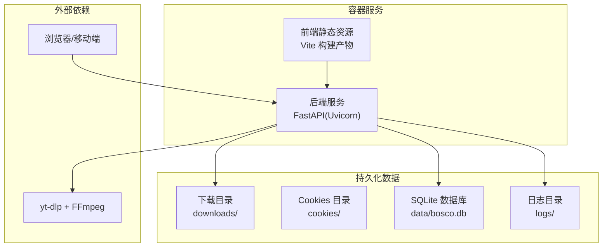
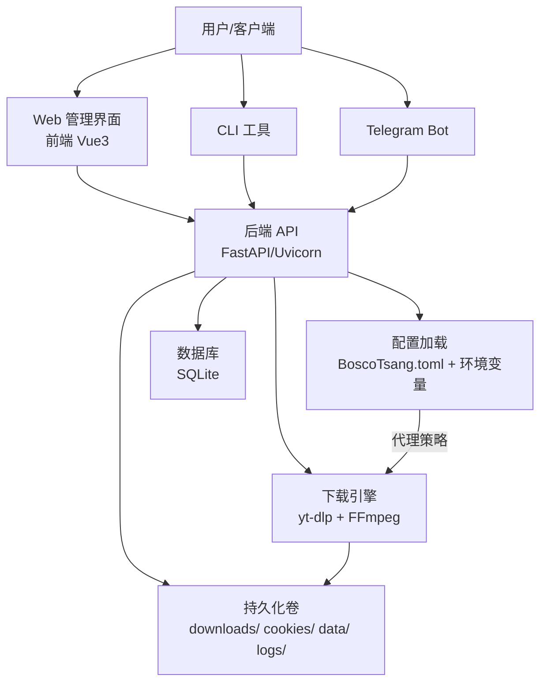
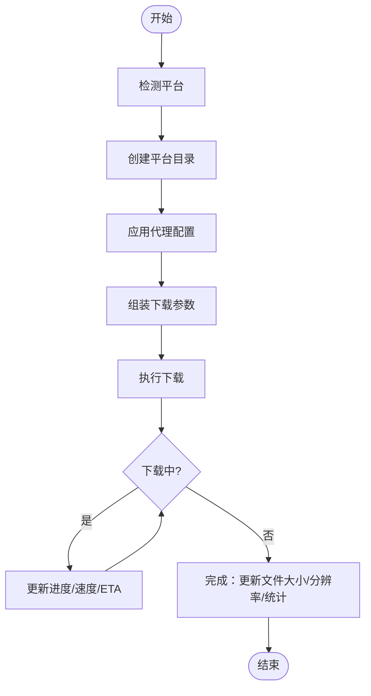
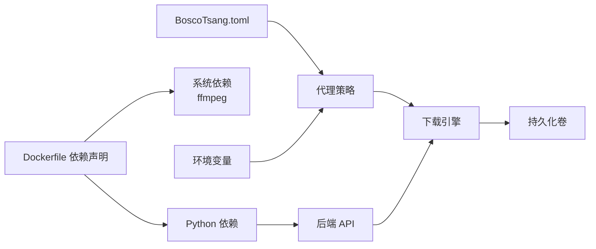

# 快速开始

<cite>
**本文引用的文件**
- [Dockerfile](file://Dockerfile)
- [docker-compose.yml](file://docker-compose.yml)
- [backend/main.py](file://backend/main.py)
- [backend/config.py](file://backend/config.py)
- [backend/admin/db.py](file://backend/admin/db.py)
- [BoscoTsang.toml](file://BoscoTsang.toml)
- [docs/DEPLOYMENT.md](file://docs/DEPLOYMENT.md)
- [README.md](file://README.md)
- [QUICK_REFERENCE.md](file://QUICK_REFERENCE.md)
- [USAGE_MANUAL.md](file://USAGE_MANUAL.md)
- [cli/bosco.py](file://cli/bosco.py)
- [frontend/vite.config.js](file://frontend/vite.config.js)
- [start_backend.bat](file://start_backend.bat)
- [start_frontend.bat](file://start_frontend.bat)
</cite>

## 目录
1. [简介](#简介)
2. [项目结构](#项目结构)
3. [核心组件](#核心组件)
4. [架构总览](#架构总览)
5. [详细组件分析](#详细组件分析)
6. [依赖关系分析](#依赖关系分析)
7. [性能注意事项](#性能注意事项)
8. [故障排查指南](#故障排查指南)
9. [结论](#结论)
10. [附录](#附录)

## 简介
本指南面向首次使用者，帮助你在最短时间内完成系统部署与基础配置，快速体验下载与管理功能。系统采用前后端分离架构，后端基于 FastAPI + SQLite，前端基于 Vue3，容器化部署通过 Docker Compose 实现，支持代理、订阅、Telegram 登录与 Bot 下载等能力。

## 项目结构
- 后端：FastAPI 应用入口、配置加载、数据库初始化与管理、下载调度与进度跟踪
- 前端：Vue3 单页应用，提供仪表盘、下载、历史、订阅、设置、日志等视图
- 配置：BoscoTsang.toml 提供代理与下载相关静态配置；docker-compose.yml 提供运行时环境变量与持久化卷
- CLI：命令行工具，便于自动化与运维
- 文档：部署、使用与故障排查指南

图表来源
- [Dockerfile:6-64](file://Dockerfile#L6-L64)
- [docker-compose.yml:9-29](file://docker-compose.yml#L9-L29)
- [backend/main.py:56-65](file://backend/main.py#L56-L65)

章节来源
- [README.md:48-65](file://README.md#L48-L65)
- [docs/DEPLOYMENT.md:395-412](file://docs/DEPLOYMENT.md#L395-L412)

## 核心组件
- 容器编排与持久化
  - docker-compose.yml 定义服务、端口映射、环境变量与卷挂载，确保数据持久化与代理配置可注入
- 配置系统
  - BoscoTsang.toml 提供代理模式、HTTP/HTTPS 代理地址、CIDR 白名单与日志级别等静态配置
  - backend/config.py 加载并应用配置，支持全局/非代理/自动模式
- 后端服务
  - backend/main.py 初始化日志、数据库、生命周期钩子（含 Telegram Bot），提供认证、下载、订阅、API Key 等接口
  - backend/admin/db.py 管理 SQLite 表结构与数据，内置默认管理员与邀请码
- 前端与开发
  - frontend/vite.config.js 提供开发代理与别名，便于联调后端
  - start_backend.bat/start_frontend.bat 提供本地开发启动脚本
- CLI 工具
  - cli/bosco.py 提供登录、下载、历史、订阅、统计、日志等命令行操作

章节来源
- [docker-compose.yml:9-59](file://docker-compose.yml#L9-L59)
- [BoscoTsang.toml:1-28](file://BoscoTsang.toml#L1-L28)
- [backend/config.py:29-135](file://backend/config.py#L29-L135)
- [backend/main.py:56-130](file://backend/main.py#L56-L130)
- [backend/admin/db.py:29-213](file://backend/admin/db.py#L29-L213)
- [frontend/vite.config.js:1-22](file://frontend/vite.config.js#L1-L22)
- [start_backend.bat:1-5](file://start_backend.bat#L1-L5)
- [start_frontend.bat:1-5](file://start_frontend.bat#L1-L5)
- [cli/bosco.py:1-331](file://cli/bosco.py#L1-L331)

## 架构总览
系统采用“容器内统一服务 + 外部平台抓取”的架构。容器内运行后端服务与前端静态资源，下载引擎通过 yt-dlp + FFmpeg 与代理配置协作，数据持久化于宿主机卷。

图表来源
- [backend/main.py:96-104](file://backend/main.py#L96-L104)
- [backend/config.py:100-132](file://backend/config.py#L100-L132)
- [docker-compose.yml:31-49](file://docker-compose.yml#L31-L49)
- [Dockerfile:31-39](file://Dockerfile#L31-L39)

## 详细组件分析

### 容器与持久化
- 服务与端口
  - 容器内监听 8000 端口，宿主机默认映射 8080 端口，可通过 docker-compose.yml 修改
- 持久化卷
  - downloads/、cookies/、data/、logs/ 分别映射到容器内的 /app/downloads、/app/cookies、/app/data、/app/logs
- 环境变量
  - APP_BASE_DIR、DOWNLOAD_DIR、COOKIES_DIR、LOGS_DIR、HTTP_PROXY、HTTPS_PROXY、YTDLP_JS_RUNTIME、TZ 等

章节来源
- [docker-compose.yml:18-49](file://docker-compose.yml#L18-L49)
- [Dockerfile:67-70](file://Dockerfile#L67-L70)

### 配置系统（BoscoTsang.toml）
- 代理配置
  - enabled、mode（global/none/auto）、http、https、bypass_cidrs
- 下载配置
  - download_dir（为空则使用 APP_BASE_DIR 下的 downloads）
- 日志配置
  - level（INFO/DEBUG/WARNING/ERROR）

章节来源
- [BoscoTsang.toml:4-28](file://BoscoTsang.toml#L4-L28)
- [backend/config.py:100-132](file://backend/config.py#L100-L132)

### 后端初始化与生命周期
- 目录创建
  - 基于 APP_BASE_DIR 创建 downloads、cookies、logs、data、static 目录
- 数据库初始化
  - 初始化用户、下载任务/历史、订阅、API Key、邀请码、统计、设置、Telegram 用户绑定等表，并创建默认管理员与邀请码
- 生命周期钩子
  - 应用启动时按设置决定是否启动 Telegram Bot 处理器；关闭时安全停止

章节来源
- [backend/main.py:56-104](file://backend/main.py#L56-L104)
- [backend/admin/db.py:29-213](file://backend/admin/db.py#L29-L213)

### 下载流程（后端）
- 平台检测与目录组织
  - 根据 URL 检测平台，按平台创建独立下载子目录
- 代理策略
  - 依据设置与配置决定是否启用代理、HTTP/HTTPS 优先级、自动模式下对国内域名绕过代理
- 下载参数
  - 支持质量选择（best/audio/mp3/m4a/1080p/720p/mp4/webm/image 等），合并音视频、提取音频等
- 进度与统计
  - 回调更新下载任务进度、速度、ETA，完成后更新文件大小、分辨率与统计

图表来源
- [backend/main.py:733-800](file://backend/main.py#L733-L800)
- [backend/main.py:669-732](file://backend/main.py#L669-L732)

章节来源
- [backend/main.py:253-286](file://backend/main.py#L253-L286)
- [backend/main.py:742-763](file://backend/main.py#L742-L763)

### 前端开发与联调
- 开发服务器
  - Vite 默认端口 3000，通过代理将 /api 前缀转发至后端 8000 端口
- 启动脚本
  - 提供 Windows 批处理脚本分别启动后端与前端

章节来源
- [frontend/vite.config.js:12-20](file://frontend/vite.config.js#L12-L20)
- [start_backend.bat:1-5](file://start_backend.bat#L1-L5)
- [start_frontend.bat:1-5](file://start_frontend.bat#L1-L5)

### CLI 工具
- 功能
  - 登录/登出、查看当前用户、提交下载任务、列出下载/历史/订阅、查看统计、查看日志
- 配置
  - 本地保存 token 与用户名，后续请求自动携带 Authorization

章节来源
- [cli/bosco.py:43-100](file://cli/bosco.py#L43-L100)
- [cli/bosco.py:101-132](file://cli/bosco.py#L101-L132)
- [cli/bosco.py:134-190](file://cli/bosco.py#L134-L190)
- [cli/bosco.py:192-224](file://cli/bosco.py#L192-L224)
- [cli/bosco.py:226-256](file://cli/bosco.py#L226-L256)

## 依赖关系分析
- 容器层
  - 前端静态资源由后端容器提供；后端容器依赖 yt-dlp 与 FFmpeg
- 运行时依赖
  - Python 依赖：FastAPI、Uvicorn、yt-dlp、psutil、python-multipart、tomli、httpx、markdown
- 配置依赖
  - 代理配置来自 BoscoTsang.toml 与环境变量；下载目录与日志目录来自环境变量或默认值

图表来源
- [Dockerfile:31-39](file://Dockerfile#L31-L39)
- [Dockerfile:24-26](file://Dockerfile#L24-L26)
- [backend/config.py:111-132](file://backend/config.py#L111-L132)
- [docker-compose.yml:31-49](file://docker-compose.yml#L31-L49)

章节来源
- [Dockerfile:31-39](file://Dockerfile#L31-L39)
- [backend/config.py:111-132](file://backend/config.py#L111-L132)
- [docker-compose.yml:31-49](file://docker-compose.yml#L31-L49)

## 性能注意事项
- 代理模式
  - auto 模式下对国内域名绕过代理，减少不必要的代理开销
- 并发与资源
  - 建议为系统分配 8GB+ 内存与 SSD 存储，避免磁盘 I/O 成为瓶颈
- 日志轮转
  - 应用按日切分日志文件，避免单文件过大影响性能

章节来源
- [backend/config.py:49-97](file://backend/config.py#L49-L97)
- [backend/main.py:67-94](file://backend/main.py#L67-L94)

## 故障排查指南
- 服务启动与端口
  - 确认端口映射（默认 8080:8000），如冲突修改 docker-compose.yml
- 日志定位
  - 查看容器日志与应用日志文件，定位异常
- Cookies 与下载失败
  - 部分平台（如 X/Twitter）需要 Cookies；确认文件命名与内容格式
- 数据备份与恢复
  - 备份 downloads/、data/、cookies/、logs/ 目录；恢复时保持目录结构一致

章节来源
- [QUICK_REFERENCE.md:142-179](file://QUICK_REFERENCE.md#L142-L179)
- [docs/DEPLOYMENT.md:361-393](file://docs/DEPLOYMENT.md#L361-L393)
- [USAGE_MANUAL.md:378-460](file://USAGE_MANUAL.md#L378-L460)

## 结论
通过本快速开始指南，你可以在本地或 NAS 上使用 Docker Compose 一键部署系统，完成默认管理员登录、基础代理与平台配置，并使用 Web 界面或 CLI 工具进行下载与管理。遇到问题时，可借助日志与常见问题排查清单快速定位与解决。

## 附录

### 环境准备与安装
- 环境要求
  - Docker 20.10+ 与 Docker Compose 2.0+
- 一键部署
  - 克隆仓库后执行 docker-compose up -d --build
  - 访问 http://localhost:8080，默认账号 admin/admin123

章节来源
- [docs/DEPLOYMENT.md:61-91](file://docs/DEPLOYMENT.md#L61-L91)
- [README.md:67-91](file://README.md#L67-L91)

### 基本设置
- 代理配置
  - 在 BoscoTsang.toml 中设置 proxy.enabled、mode、http/https、bypass_cidrs
  - 或通过环境变量 HTTP_PROXY/HTTPS_PROXY 注入
- 下载目录与日志
  - 通过环境变量 DOWNLOAD_DIR、COOKIES_DIR、LOGS_DIR 指定
- Telegram 登录与 Bot
  - 在设置中填写 Bot Token，启用 Telegram 登录与下载功能

章节来源
- [BoscoTsang.toml:4-28](file://BoscoTsang.toml#L4-L28)
- [docker-compose.yml:31-49](file://docker-compose.yml#L31-L49)
- [QUICK_REFERENCE.md:85-101](file://QUICK_REFERENCE.md#L85-L101)

### 启动应用与基本操作
- 启动服务
  - docker-compose up -d --build
- 访问系统
  - 浏览器打开 http://localhost:8080
- 默认管理员
  - 用户名：admin，密码：admin123（首次登录后请立即修改）

章节来源
- [QUICK_REFERENCE.md:5-13](file://QUICK_REFERENCE.md#L5-L13)
- [README.md:82-91](file://README.md#L82-L91)

### 常见初始化问题与解决方案
- 端口被占用
  - 修改 docker-compose.yml 中的端口映射，如将 8080 改为 8888
- 下载失败（需要登录）
  - 配置对应平台 Cookies 文件（如 youtube.txt、x.txt），放置于 cookies/ 目录
- 群晖/极空间拉取镜像慢
  - 配置 Docker 镜像加速或使用本地镜像
- 数据丢失
  - 确认持久化卷映射与目录权限，定期备份 downloads/、data/、cookies/、logs/

章节来源
- [docs/DEPLOYMENT.md:380-393](file://docs/DEPLOYMENT.md#L380-L393)
- [docs/DEPLOYMENT.md:363-369](file://docs/DEPLOYMENT.md#L363-L369)
- [docs/DEPLOYMENT.md:375-378](file://docs/DEPLOYMENT.md#L375-L378)