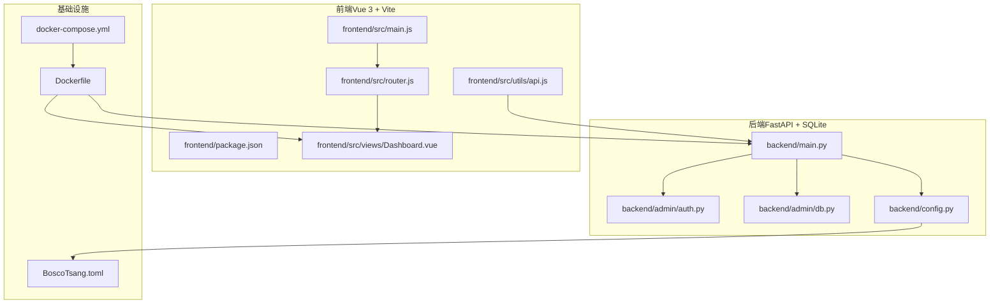
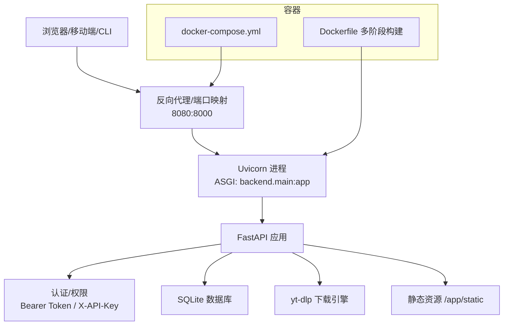
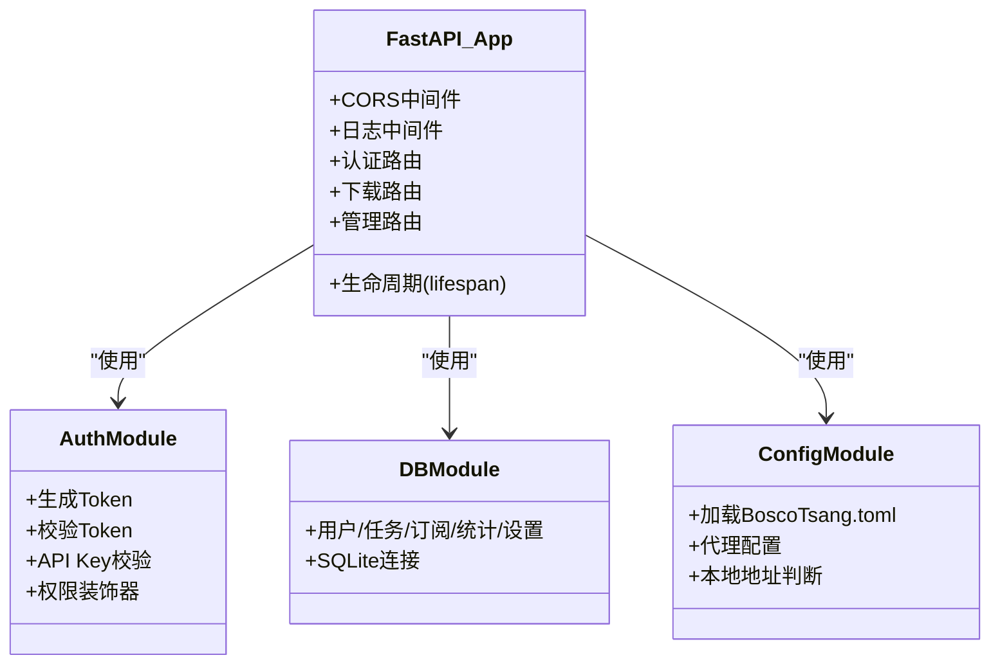
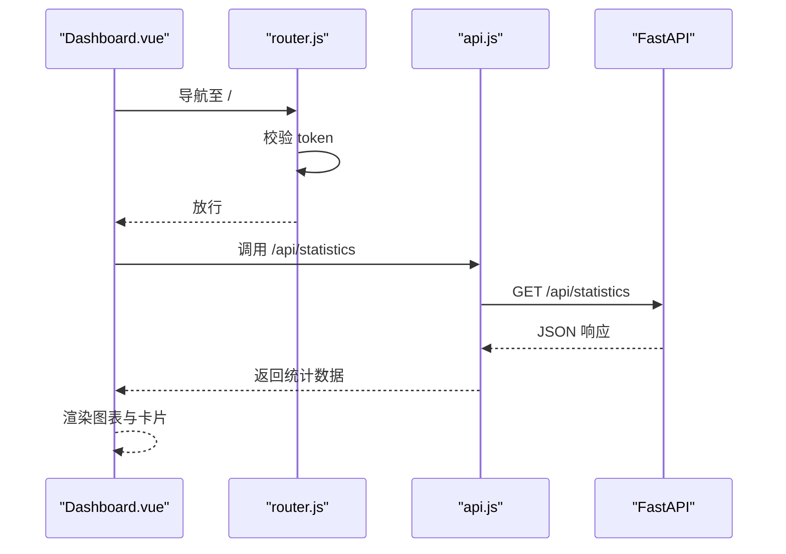
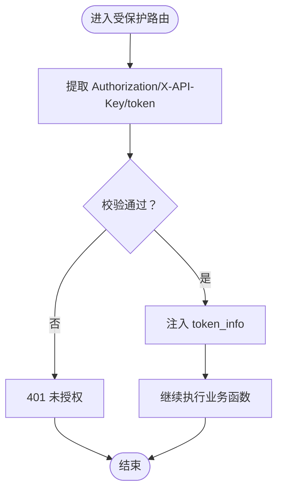
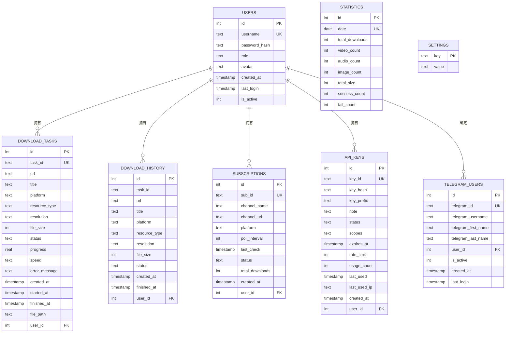
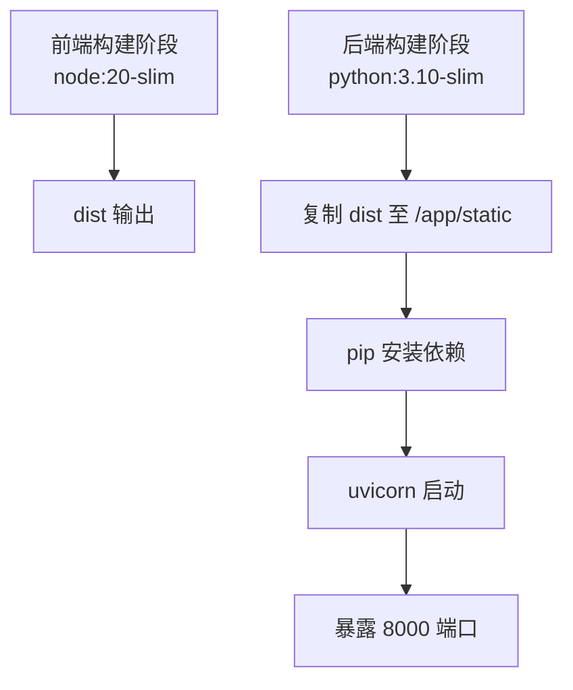
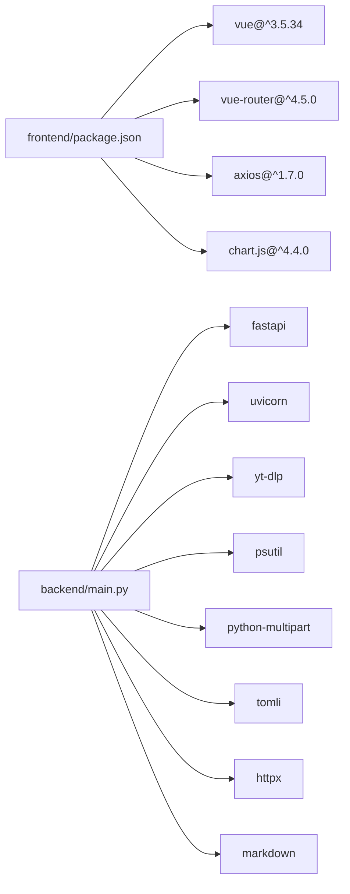

# 技术栈详解

<cite>
**本文引用的文件**
- [backend/main.py](file://backend/main.py)
- [backend/config.py](file://backend/config.py)
- [backend/admin/auth.py](file://backend/admin/auth.py)
- [backend/admin/db.py](file://backend/admin/db.py)
- [frontend/package.json](file://frontend/package.json)
- [frontend/vite.config.js](file://frontend/vite.config.js)
- [frontend/src/utils/api.js](file://frontend/src/utils/api.js)
- [frontend/src/router.js](file://frontend/src/router.js)
- [frontend/src/main.js](file://frontend/src/main.js)
- [frontend/src/App.vue](file://frontend/src/App.vue)
- [frontend/src/views/Dashboard.vue](file://frontend/src/views/Dashboard.vue)
- [Dockerfile](file://Dockerfile)
- [docker-compose.yml](file://docker-compose.yml)
- [BoscoTsang.toml](file://BoscoTsang.toml)
- [README.md](file://README.md)
- [USAGE_MANUAL.md](file://USAGE_MANUAL.md)
</cite>

## 目录
1. [引言](#引言)
2. [项目结构](#项目结构)
3. [核心组件](#核心组件)
4. [架构总览](#架构总览)
5. [详细组件分析](#详细组件分析)
6. [依赖关系分析](#依赖关系分析)
7. [性能考虑](#性能考虑)
8. [故障排查指南](#故障排查指南)
9. [结论](#结论)
10. [附录](#附录)

## 引言
本文件面向希望深入理解 BoscoTsang 技术栈的开发者与运维人员，系统性阐述项目采用的核心技术与框架选择、版本与配置要点、前后端协同机制、认证与权限体系、容器化部署与可观测性，并给出最佳实践与性能优化建议。文档以仓库现有实现为依据，结合架构图与流程图，帮助读者快速掌握系统的整体设计与落地细节。

## 项目结构
项目采用前后端分离架构，后端基于 FastAPI，前端基于 Vue 3，通过 Vite 构建与开发；后端使用 SQLite 存储元数据，yt-dlp 作为下载引擎；Dockerfile 与 docker-compose 实现统一的容器化交付。

**图表来源**
- [frontend/src/main.js:1-7](file://frontend/src/main.js#L1-L7)
- [frontend/src/router.js:1-48](file://frontend/src/router.js#L1-L48)
- [frontend/src/utils/api.js:1-274](file://frontend/src/utils/api.js#L1-L274)
- [frontend/src/views/Dashboard.vue:1-200](file://frontend/src/views/Dashboard.vue#L1-L200)
- [backend/main.py:1-1912](file://backend/main.py#L1-L1912)
- [backend/admin/auth.py:1-169](file://backend/admin/auth.py#L1-L169)
- [backend/admin/db.py:1-1072](file://backend/admin/db.py#L1-L1072)
- [backend/config.py:1-135](file://backend/config.py#L1-L135)
- [Dockerfile:1-74](file://Dockerfile#L1-L74)
- [docker-compose.yml:1-60](file://docker-compose.yml#L1-L60)
- [BoscoTsang.toml:1-28](file://BoscoTsang.toml#L1-L28)

**章节来源**
- [README.md:48-65](file://README.md#L48-L65)
- [USAGE_MANUAL.md:135-155](file://USAGE_MANUAL.md#L135-L155)

## 核心组件
- 后端框架：FastAPI（Python），提供高性能异步 API、自动 OpenAPI 文档、中间件与依赖注入能力。
- 前端框架：Vue 3（组合式 API），搭配路由与状态管理，构建现代化单页应用。
- 构建工具：Vite，提供快速热更新与生产构建。
- 容器化：Docker 多阶段构建，Node 作为前端构建镜像，Python 作为后端运行时，Uvicorn 承载 ASGI 服务。
- 数据持久化：SQLite（嵌入式数据库），存储用户、任务、订阅、API Key、统计与系统设置。
- 下载引擎：yt-dlp，支持 3000+ 平台的视频/音频/图片下载与格式处理。
- 认证与权限：支持 Bearer Token 与 X-API-Key，内置管理员校验与 API Key 有效期/配额控制。
- 配置与代理：BoscoTsang.toml 提供代理模式与绕行网段；运行时通过环境变量与配置动态应用代理。

**章节来源**
- [backend/main.py:6-28](file://backend/main.py#L6-L28)
- [frontend/package.json:11-21](file://frontend/package.json#L11-L21)
- [Dockerfile:21-40](file://Dockerfile#L21-L40)
- [backend/admin/db.py:34-181](file://backend/admin/db.py#L34-L181)
- [backend/admin/auth.py:16-61](file://backend/admin/auth.py#L16-L61)
- [backend/config.py:100-132](file://backend/config.py#L100-L132)
- [BoscoTsang.toml:4-28](file://BoscoTsang.toml#L4-L28)

## 架构总览
系统采用“容器化 + 反向代理/端口映射”的部署形态，前端静态资源由后端容器提供，后端通过 /api 前缀暴露 REST 接口。认证采用 Bearer Token 或 API Key，权限通过装饰器控制。代理策略由配置文件与环境变量共同决定，下载任务通过 yt-dlp 异步执行并回写数据库状态。

**图表来源**
- [docker-compose.yml:18-21](file://docker-compose.yml#L18-L21)
- [Dockerfile:70-74](file://Dockerfile#L70-L74)
- [backend/main.py:133-146](file://backend/main.py#L133-L146)
- [backend/admin/auth.py:110-139](file://backend/admin/auth.py#L110-L139)
- [backend/admin/db.py:23-27](file://backend/admin/db.py#L23-L27)
- [backend/config.py:111-132](file://backend/config.py#L111-L132)

## 详细组件分析

### 后端（FastAPI）组件
- 应用入口与生命周期：定义 CORS 中间件、请求日志中间件、应用生命周期钩子（启动/关闭时初始化 Telegram Bot）。
- 数据模型与路由：定义登录、注册、用户管理、API Key、下载、订阅、设置等接口的数据模型与路由。
- 下载执行：yt-dlp 进度回调写入内存进度表与数据库，支持多种质量与后处理（如音频提取）。
- 代理与平台适配：根据配置与环境变量动态设置代理，按平台选择 Cookies 文件，自动判断本地/国际域名绕行代理。

**图表来源**
- [backend/main.py:133-146](file://backend/main.py#L133-L146)
- [backend/admin/auth.py:16-61](file://backend/admin/auth.py#L16-L61)
- [backend/admin/db.py:29-181](file://backend/admin/db.py#L29-L181)
- [backend/config.py:29-132](file://backend/config.py#L29-L132)

**章节来源**
- [backend/main.py:108-130](file://backend/main.py#L108-L130)
- [backend/main.py:669-732](file://backend/main.py#L669-L732)
- [backend/main.py:733-800](file://backend/main.py#L733-L800)
- [backend/config.py:49-97](file://backend/config.py#L49-L97)

### 前端（Vue 3 + Vite）组件
- 应用入口：创建 Vue 应用实例，挂载路由。
- 路由与导航：基于 vue-router 的历史模式，全局前置守卫校验登录态。
- API 工具：封装 /api 前缀请求，自动注入 Authorization 头，处理 403 与错误响应。
- 视图组件：Dashboard 展示下载入口、统计与资源使用情况，支持图表与平台分布。

**图表来源**
- [frontend/src/views/Dashboard.vue:1-200](file://frontend/src/views/Dashboard.vue#L1-L200)
- [frontend/src/router.js:36-45](file://frontend/src/router.js#L36-L45)
- [frontend/src/utils/api.js:15-35](file://frontend/src/utils/api.js#L15-L35)
- [backend/main.py:170-204](file://backend/main.py#L170-L204)

**章节来源**
- [frontend/src/main.js:1-7](file://frontend/src/main.js#L1-L7)
- [frontend/src/router.js:1-48](file://frontend/src/router.js#L1-L48)
- [frontend/src/utils/api.js:1-274](file://frontend/src/utils/api.js#L1-L274)

### 认证与权限组件
- Token 生成与校验：内存存储 Token，支持 Bearer 与 API Key 两种方式。
- 权限装饰器：require_auth 与 require_admin，统一注入 token_info。
- API Key 管理：创建、启用/禁用、删除、过期与速率限制。

**图表来源**
- [backend/admin/auth.py:70-107](file://backend/admin/auth.py#L70-L107)
- [backend/admin/auth.py:110-139](file://backend/admin/auth.py#L110-L139)
- [backend/admin/auth.py:142-168](file://backend/admin/auth.py#L142-L168)

**章节来源**
- [backend/admin/auth.py:16-61](file://backend/admin/auth.py#L16-L61)
- [backend/admin/auth.py:110-168](file://backend/admin/auth.py#L110-L168)

### 数据层（SQLite）
- 表结构覆盖用户、下载任务/历史、订阅、API Key、统计、设置、Telegram 用户绑定等。
- 初始化默认管理员与邀请码，支持后续迁移扩展。

**图表来源**
- [backend/admin/db.py:34-181](file://backend/admin/db.py#L34-L181)

**章节来源**
- [backend/admin/db.py:29-200](file://backend/admin/db.py#L29-L200)

### 容器化与部署
- Dockerfile 多阶段构建：前端使用 node:20-slim 构建，后端使用 python:3.10-slim，安装 ffmpeg 与 Python 依赖，复制前端产物到 /app/static。
- docker-compose 映射端口 8080:8000，持久化 downloads/cookies/data/logs，支持健康检查与重启策略。
- 环境变量：APP_BASE_DIR、HTTP_PROXY/HTTPS_PROXY、YTDLP_JS_RUNTIME/YTDLP_PROXY、TZ 等。

**图表来源**
- [Dockerfile:6-18](file://Dockerfile#L6-L18)
- [Dockerfile:20-40](file://Dockerfile#L20-L40)
- [Dockerfile:63-74](file://Dockerfile#L63-L74)
- [docker-compose.yml:18-21](file://docker-compose.yml#L18-L21)

**章节来源**
- [Dockerfile:1-74](file://Dockerfile#L1-L74)
- [docker-compose.yml:1-60](file://docker-compose.yml#L1-L60)

## 依赖关系分析
- 前端依赖：Vue 3、vue-router、axios、Chart.js 与 Vite 构建工具。
- 后端依赖：FastAPI、Uvicorn、yt-dlp、psutil、python-multipart、tomli、httpx、markdown。
- 前端与后端通过 /api 前缀通信，前端通过 axios 与 fetch 调用后端接口，后端通过 CORS 中间件允许跨域。

**图表来源**
- [frontend/package.json:11-21](file://frontend/package.json#L11-L21)
- [backend/main.py:6-28](file://backend/main.py#L6-L28)

**章节来源**
- [frontend/package.json:1-23](file://frontend/package.json#L1-L23)
- [backend/main.py:6-28](file://backend/main.py#L6-L28)

## 性能考虑
- 并发与资源：下载任务由 yt-dlp 异步执行，进度写入内存与数据库，建议限制并发数以平衡磁盘与网络压力。
- 代理策略：auto 模式下按本地/国际网段绕行代理，减少不必要的代理转发开销。
- 静态资源：前端构建产物统一放置 /app/static，由后端容器提供，减少额外 CDN 成本。
- 容器资源：建议为容器分配足够内存与 CPU，使用 SSD 存储以提升 I/O 性能。
- 日志轮转：每日日志文件自动轮转，避免单文件过大影响性能。

**章节来源**
- [backend/main.py:669-732](file://backend/main.py#L669-L732)
- [backend/config.py:100-132](file://backend/config.py#L100-L132)
- [backend/main.py:67-94](file://backend/main.py#L67-L94)

## 故障排查指南
- 认证失败（401/403）：检查 Authorization 头或 X-API-Key 是否正确，确认 token 未过期，API Key 状态为 active。
- 下载失败：检查链接有效性、Cookies 是否正确、磁盘空间、网络与代理配置；查看容器日志定位异常。
- Telegram 登录：确认 Bot Token 配置、登录开关、用户绑定状态；检查时间戳有效性。
- 健康检查：compose 健康检查测试 8000 端口连通性，失败时查看日志并重启容器。
- 代理问题：确认 BoscoTsang.toml 与环境变量设置，必要时切换 none/global/auto 模式验证。

**章节来源**
- [frontend/src/utils/api.js:24-34](file://frontend/src/utils/api.js#L24-L34)
- [backend/admin/auth.py:130-131](file://backend/admin/auth.py#L130-L131)
- [backend/main.py:458-461](file://backend/main.py#L458-L461)
- [docker-compose.yml:54-59](file://docker-compose.yml#L54-L59)
- [BoscoTsang.toml:4-28](file://BoscoTsang.toml#L4-L28)

## 结论
BoscoTsang 以 FastAPI + Vue 3 + Vite 为核心，结合 Docker 多阶段构建与 SQLite，形成轻量、可移植且易于扩展的下载平台。通过统一的认证与权限体系、灵活的代理策略与完善的日志体系，系统在易用性与可运维性之间取得良好平衡。建议在生产环境中配合反向代理、定期备份与监控告警，持续优化并发与资源利用率。

## 附录
- 版本与配置要点
  - Python 3.10（后端运行时）
  - Node 20（前端构建）
  - FastAPI + Uvicorn（ASGI 服务）
  - yt-dlp（下载引擎）
  - SQLite（嵌入式数据库）
  - Vite（开发与构建）
- 端口与持久化
  - 容器内 8000，宿主机默认 8080
  - 持久化目录：downloads、cookies、data、logs
- 配置文件
  - BoscoTsang.toml：代理模式、绕行网段、日志级别等
  - docker-compose.yml：环境变量、健康检查、重启策略

**章节来源**
- [Dockerfile:21-26](file://Dockerfile#L21-L26)
- [Dockerfile:7-18](file://Dockerfile#L7-L18)
- [backend/main.py:133-146](file://backend/main.py#L133-L146)
- [docker-compose.yml:18-29](file://docker-compose.yml#L18-L29)
- [BoscoTsang.toml:4-28](file://BoscoTsang.toml#L4-L28)