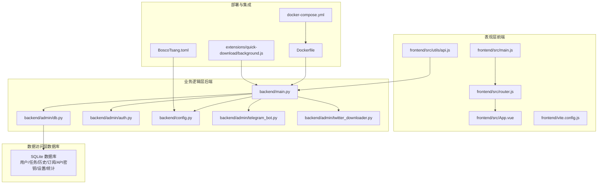
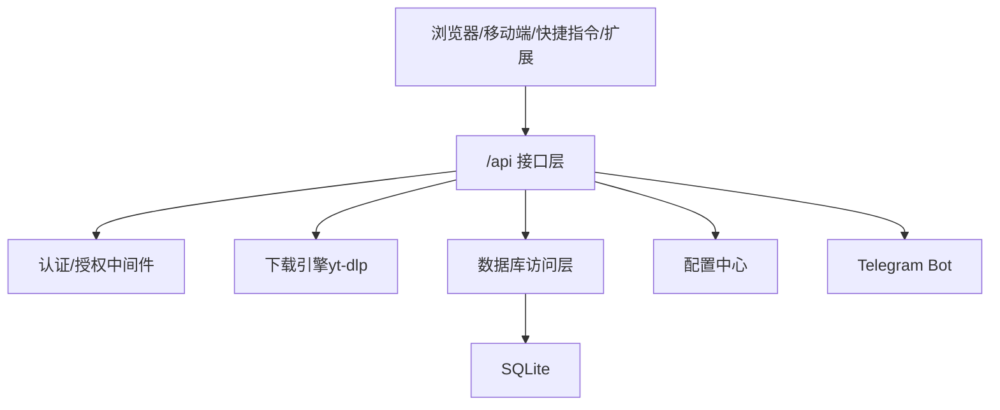
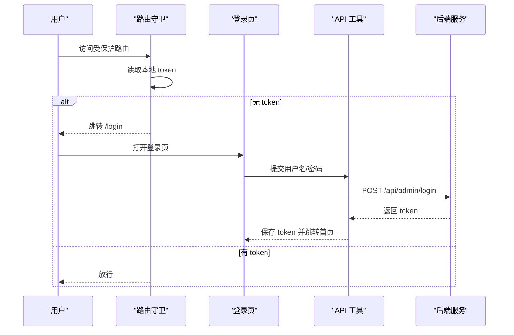
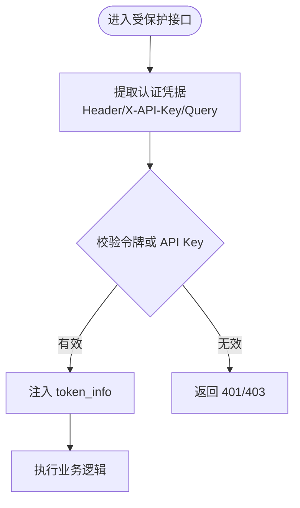
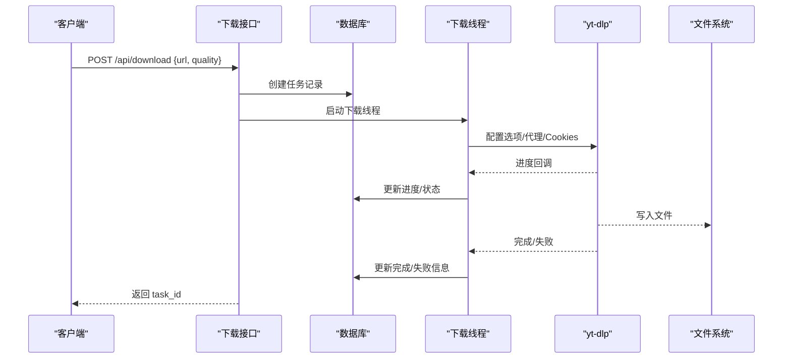
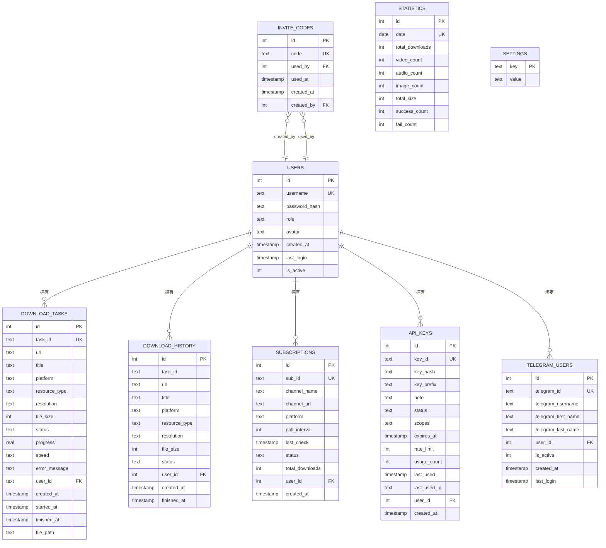
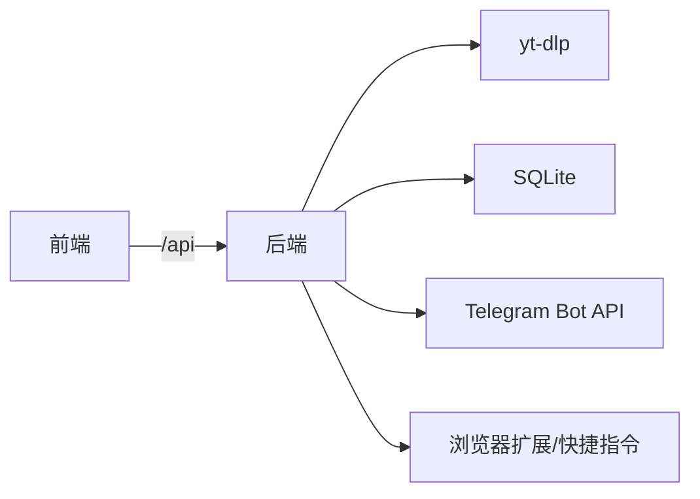

# 整体架构设计

<cite>
**本文引用的文件**
- [backend/main.py](file://backend/main.py)
- [backend/admin/db.py](file://backend/admin/db.py)
- [backend/admin/auth.py](file://backend/admin/auth.py)
- [backend/admin/telegram_bot.py](file://backend/admin/telegram_bot.py)
- [backend/admin/twitter_downloader.py](file://backend/admin/twitter_downloader.py)
- [backend/config.py](file://backend/config.py)
- [frontend/src/main.js](file://frontend/src/main.js)
- [frontend/src/App.vue](file://frontend/src/App.vue)
- [frontend/src/router.js](file://frontend/src/router.js)
- [frontend/src/utils/api.js](file://frontend/src/utils/api.js)
- [frontend/vite.config.js](file://frontend/vite.config.js)
- [Dockerfile](file://Dockerfile)
- [docker-compose.yml](file://docker-compose.yml)
- [BoscoTsang.toml](file://BoscoTsang.toml)
- [extensions/quick-download/background.js](file://extensions/quick-download/background.js)
</cite>

## 目录
1. [引言](#引言)
2. [项目结构](#项目结构)
3. [核心组件](#核心组件)
4. [架构总览](#架构总览)
5. [详细组件分析](#详细组件分析)
6. [依赖分析](#依赖分析)
7. [性能考量](#性能考量)
8. [故障排查指南](#故障排查指南)
9. [结论](#结论)
10. [附录](#附录)

## 引言
本设计文档面向 BoscoTsang 系统的整体架构，围绕表现层（Vue.js 前端）、业务逻辑层（FastAPI 后端）、数据访问层（SQLite 数据库）展开，阐明前后端分离架构的优势与实现方式，并结合系统中“下载引擎”的实际实现，体现微服务思想在单一进程内的模块化组织与职责划分。文档同时给出系统边界、模块化设计原则、组件职责、架构决策的技术考量与权衡，帮助开发者理解系统设计思路与扩展性考虑。

## 项目结构
系统采用前后端分离与容器化部署的工程组织方式：
- 前端：基于 Vue 3 + Vue Router，通过 Vite 构建，开发时通过本地代理转发 /api 到后端服务。
- 后端：基于 FastAPI，提供 REST 接口与后台任务处理；内置下载引擎（yt-dlp），并集成 Telegram Bot、订阅扫描、统计等能力。
- 数据层：SQLite 存储用户、任务、历史、订阅、API 密钥、设置、统计等数据。
- 部署：Docker 多阶段构建，统一打包前后端产物与后端依赖，docker-compose 提供一键编排与持久化卷挂载。

**图示来源**
- [frontend/src/main.js:1-7](file://frontend/src/main.js#L1-L7)
- [frontend/src/App.vue:1-7](file://frontend/src/App.vue#L1-L7)
- [frontend/src/router.js:1-48](file://frontend/src/router.js#L1-L48)
- [frontend/src/utils/api.js:1-274](file://frontend/src/utils/api.js#L1-L274)
- [frontend/vite.config.js:1-22](file://frontend/vite.config.js#L1-L22)
- [backend/main.py:1-1200](file://backend/main.py#L1-L1200)
- [backend/admin/db.py:1-200](file://backend/admin/db.py#L1-L200)
- [backend/admin/auth.py:1-169](file://backend/admin/auth.py#L1-L169)
- [backend/config.py:1-135](file://backend/config.py#L1-L135)
- [backend/admin/telegram_bot.py:1-200](file://backend/admin/telegram_bot.py#L1-L200)
- [backend/admin/twitter_downloader.py:1-200](file://backend/admin/twitter_downloader.py#L1-L200)
- [Dockerfile:1-74](file://Dockerfile#L1-L74)
- [docker-compose.yml:1-60](file://docker-compose.yml#L1-L60)
- [BoscoTsang.toml:1-28](file://BoscoTsang.toml#L1-L28)
- [extensions/quick-download/background.js:1-26](file://extensions/quick-download/background.js#L1-L26)

**章节来源**
- [Dockerfile:1-74](file://Dockerfile#L1-L74)
- [docker-compose.yml:1-60](file://docker-compose.yml#L1-L60)
- [frontend/vite.config.js:1-22](file://frontend/vite.config.js#L1-L22)

## 核心组件
- 前端应用（Vue 3）
  - 入口与路由：应用入口负责挂载路由；路由定义了登录、仪表盘、下载、历史、订阅、日志、监控、设置、文件管理等视图。
  - API 工具：封装 /api 前缀请求，自动注入 Bearer Token，处理 403 未授权跳转。
- 后端服务（FastAPI）
  - 应用生命周期：启动时加载配置、初始化数据库、按设置启动 Telegram Bot；关闭时优雅停止 Bot。
  - 认证与授权：支持 Bearer Token 与 X-API-Key，提供 require_auth 与 require_admin 装饰器。
  - 下载引擎：统一调度下载任务，整合 yt-dlp，支持多种平台与质量策略，具备回退机制与进度回调。
  - 数据访问：SQLite 表结构覆盖用户、任务、历史、订阅、API 密钥、邀请码、统计、设置、Telegram 绑定。
  - 配置中心：支持 BoscoTsang.toml 加载与代理模式（全局/禁用/自动）。
  - 扩展与插件：提供浏览器扩展与 iOS 快捷指令的专用接口。
- 数据层（SQLite）
  - 表结构清晰，涵盖用户、任务、历史、订阅、API 密钥、统计、设置、Telegram 绑定等，便于扩展与审计。
- 部署与运行
  - Docker 多阶段构建，统一打包；docker-compose 提供端口映射、卷挂载、健康检查与环境变量注入。

**章节来源**
- [frontend/src/main.js:1-7](file://frontend/src/main.js#L1-L7)
- [frontend/src/router.js:1-48](file://frontend/src/router.js#L1-L48)
- [frontend/src/utils/api.js:1-274](file://frontend/src/utils/api.js#L1-L274)
- [backend/main.py:108-138](file://backend/main.py#L108-L138)
- [backend/admin/auth.py:110-169](file://backend/admin/auth.py#L110-L169)
- [backend/admin/db.py:29-200](file://backend/admin/db.py#L29-L200)
- [backend/config.py:29-135](file://backend/config.py#L29-L135)
- [Dockerfile:6-74](file://Dockerfile#L6-L74)
- [docker-compose.yml:9-60](file://docker-compose.yml#L9-L60)

## 架构总览
系统采用典型的三层架构：
- 表现层（前端）：Vue SPA，通过 /api 与后端交互，路由守卫控制访问权限。
- 业务逻辑层（后端）：FastAPI 提供 REST 接口，内部以模块化方式组织认证、数据库、下载引擎、配置、Telegram Bot 等。
- 数据访问层（数据库）：SQLite，集中存储结构化数据，配合后端 ORM 风格的 CRUD 封装。

系统边界与职责：
- 系统边界：对外暴露 /api 接口，内部通过模块解耦；下载引擎与第三方库（yt-dlp）隔离在业务逻辑层。
- 模块化设计：后端按功能域拆分（认证、数据库、下载、配置、Telegram Bot、Twitter 下载器），前端按视图与工具拆分（路由、API 工具、样式）。
- 组件职责：前端负责 UI 与交互；后端负责业务编排、数据持久化、外部服务对接；数据库负责数据存储与一致性。

**图示来源**
- [backend/main.py:133-146](file://backend/main.py#L133-L146)
- [backend/admin/auth.py:110-169](file://backend/admin/auth.py#L110-L169)
- [backend/admin/db.py:23-27](file://backend/admin/db.py#L23-L27)
- [backend/config.py:29-135](file://backend/config.py#L29-L135)
- [backend/admin/telegram_bot.py:43-87](file://backend/admin/telegram_bot.py#L43-L87)

## 详细组件分析

### 前端组件分析（Vue SPA）
- 入口与挂载：创建应用实例，挂载路由，启动渲染。
- 路由与导航：定义登录页与布局下的多视图路由，前置守卫校验本地 token，未登录跳转登录页。
- API 工具：统一的请求封装，自动注入 Authorization 头，处理 403 未授权并跳转登录，统一错误抛出。

**图示来源**
- [frontend/src/router.js:36-45](file://frontend/src/router.js#L36-L45)
- [frontend/src/utils/api.js:38-65](file://frontend/src/utils/api.js#L38-L65)
- [backend/main.py:336-353](file://backend/main.py#L336-L353)

**章节来源**
- [frontend/src/main.js:1-7](file://frontend/src/main.js#L1-L7)
- [frontend/src/router.js:1-48](file://frontend/src/router.js#L1-L48)
- [frontend/src/utils/api.js:1-274](file://frontend/src/utils/api.js#L1-L274)

### 后端组件分析（FastAPI）

#### 认证与授权
- 支持 Bearer Token 与 X-API-Key 两种认证方式，装饰器 require_auth 与 require_admin 实现细粒度权限控制。
- 令牌存储采用内存字典，适合开发与小规模场景；生产建议替换为 Redis 等持久化存储。

**图示来源**
- [backend/admin/auth.py:70-107](file://backend/admin/auth.py#L70-L107)
- [backend/admin/auth.py:110-169](file://backend/admin/auth.py#L110-L169)

**章节来源**
- [backend/admin/auth.py:1-169](file://backend/admin/auth.py#L1-L169)

#### 下载引擎与任务调度
- 统一入口：/api/download、/api/quick-download、/api/shortcuts/download，均创建任务并启动下载线程。
- 平台检测与 Cookies：根据 URL 检测平台，按平台选择对应 cookies 文件，部分平台（如 Bilibili、X/Twitter）有特殊处理。
- 代理策略：支持全局/禁用/自动三种模式，自动模式下对国内域名直连，其余走代理。
- 回退机制：首次下载失败时，探测可用格式并按策略回退，提升成功率。
- 进度回调：yt-dlp 回调更新任务状态与进度，数据库持久化。

**图示来源**
- [backend/main.py:982-1008](file://backend/main.py#L982-L1008)
- [backend/main.py:733-981](file://backend/main.py#L733-L981)
- [backend/admin/db.py:48-89](file://backend/admin/db.py#L48-L89)

**章节来源**
- [backend/main.py:667-1200](file://backend/main.py#L667-L1200)

#### 数据访问层（SQLite）
- 表结构覆盖用户、任务、历史、订阅、API 密钥、邀请码、统计、设置、Telegram 绑定等。
- 初始化默认管理员与邀请码，保证首次部署可用。
- 提供 CRUD 与查询封装，支持分页、过滤、搜索等。

**图示来源**
- [backend/admin/db.py:34-181](file://backend/admin/db.py#L34-L181)

**章节来源**
- [backend/admin/db.py:1-200](file://backend/admin/db.py#L1-L200)

#### 配置与代理
- 配置文件 BoscoTsang.toml 支持代理开关、模式、HTTP/HTTPS 代理地址与绕行网段。
- 运行时加载配置并应用环境变量，支持全局/禁用/自动三种模式。

**章节来源**
- [backend/config.py:29-135](file://backend/config.py#L29-L135)
- [BoscoTsang.toml:1-28](file://BoscoTsang.toml#L1-L28)

#### Telegram Bot 与扩展集成
- Telegram Bot：长轮询拉取消息，校验权限与命令，触发下载任务。
- 浏览器扩展：右键菜单触发快速下载，向后端发送请求。
- iOS 快捷指令：通过 X-API-Key 直接调用下载接口。

**章节来源**
- [backend/admin/telegram_bot.py:43-200](file://backend/admin/telegram_bot.py#L43-L200)
- [extensions/quick-download/background.js:1-26](file://extensions/quick-download/background.js#L1-L26)
- [backend/main.py:1040-1075](file://backend/main.py#L1040-L1075)

## 依赖分析
- 前端依赖：Vue 3、Vue Router、Chart.js、axios；Vite 开发服务器与代理配置将 /api 转发至后端。
- 后端依赖：FastAPI、uvicorn、yt-dlp、psutil、python-multipart、tomli、httpx、markdown；Dockerfile 中统一安装系统依赖（ffmpeg）与 Python 包。
- 外部集成：yt-dlp 作为下载引擎核心；Telegram Bot API；浏览器扩展与 iOS 快捷指令通过 API Key 或 Bearer Token 访问。

**图示来源**
- [frontend/vite.config.js:14-19](file://frontend/vite.config.js#L14-L19)
- [Dockerfile:24-39](file://Dockerfile#L24-L39)
- [backend/main.py:12-28](file://backend/main.py#L12-L28)

**章节来源**
- [frontend/package.json:11-22](file://frontend/package.json#L11-L22)
- [Dockerfile:24-39](file://Dockerfile#L24-L39)

## 性能考量
- 下载并发与回退：下载线程独立执行，yt-dlp 回退策略提升成功率；代理按需设置，减少不必要的网络往返。
- 进度与统计：通过回调实时更新任务状态与统计数据，降低前端轮询压力。
- 前端性能：Vue 3 组件化与按需路由，减少初始包体积；Chart.js 用于可视化统计。
- 部署性能：Docker 多阶段构建减少镜像体积；卷挂载保证数据持久化与热更新便利。

[本节为通用指导，无需具体文件引用]

## 故障排查指南
- 认证失败（401/403）
  - 检查前端是否正确携带 Authorization 头；确认后端 require_auth 装饰器生效。
  - 若使用 X-API-Key，确保请求头大小写一致（代码中支持任意大小写变体）。
- 下载失败
  - 查看后端日志与任务状态；关注代理配置与平台特殊处理（如 Bilibili、X/Twitter）。
  - 使用回退策略：后端会尝试探测可用格式并按顺序回退。
- Telegram Bot 问题
  - 检查 Bot Token 与启用开关；关注 409 冲突与限流；确认允许用户列表。
- 前端跨域与代理
  - 开发时确认 Vite 代理配置将 /api 转发至后端端口；生产环境由 Nginx 或反向代理处理。

**章节来源**
- [frontend/src/utils/api.js:24-35](file://frontend/src/utils/api.js#L24-L35)
- [backend/admin/auth.py:70-107](file://backend/admin/auth.py#L70-L107)
- [backend/main.py:892-981](file://backend/main.py#L892-L981)
- [backend/admin/telegram_bot.py:109-152](file://backend/admin/telegram_bot.py#L109-L152)
- [frontend/vite.config.js:14-19](file://frontend/vite.config.js#L14-L19)

## 结论
BoscoTsang 采用前后端分离与容器化部署，后端以 FastAPI 为核心，结合 SQLite 数据存储与模块化设计，实现了下载引擎的高扩展性与易维护性。通过认证中间件、配置中心、代理策略与 Telegram Bot 等能力，系统在功能完整性与用户体验之间取得平衡。未来可在生产环境引入 Redis 缓存、分布式任务队列与更完善的监控告警体系，进一步增强可靠性与可观测性。

[本节为总结性内容，无需具体文件引用]

## 附录
- 部署要点
  - Dockerfile 多阶段构建，安装 ffmpeg 与 Python 依赖；暴露 8000 端口。
  - docker-compose 映射端口与卷，设置健康检查与环境变量。
- 配置要点
  - BoscoTsang.toml 控制代理模式与下载目录；运行时通过配置模块加载并应用。

**章节来源**
- [Dockerfile:67-74](file://Dockerfile#L67-L74)
- [docker-compose.yml:18-60](file://docker-compose.yml#L18-L60)
- [BoscoTsang.toml:1-28](file://BoscoTsang.toml#L1-L28)