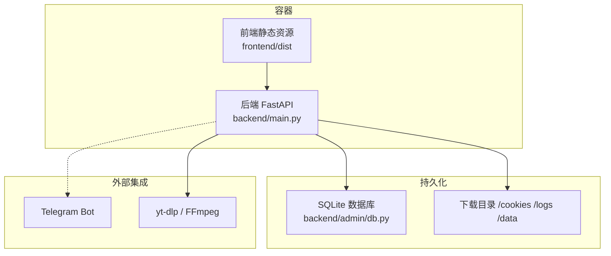
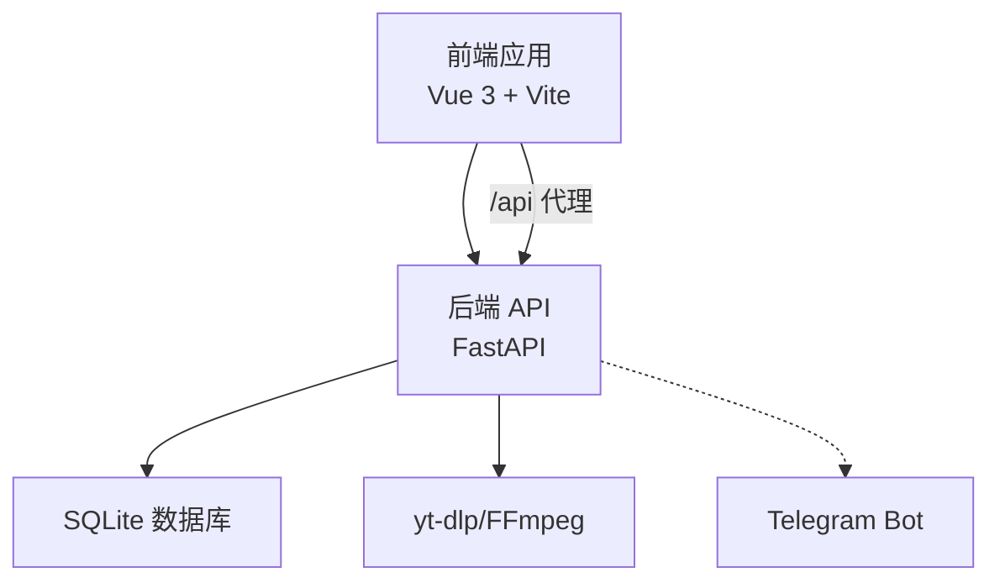
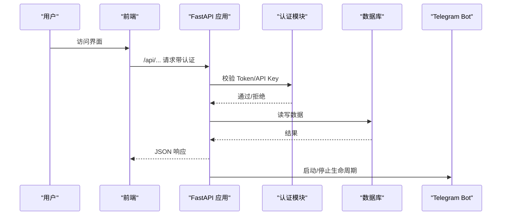
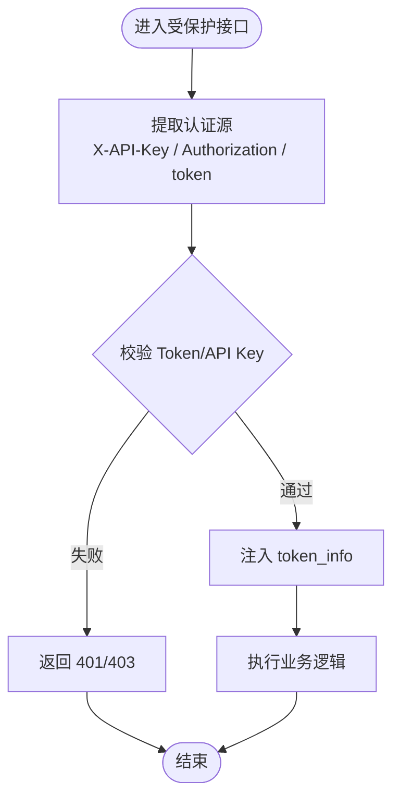
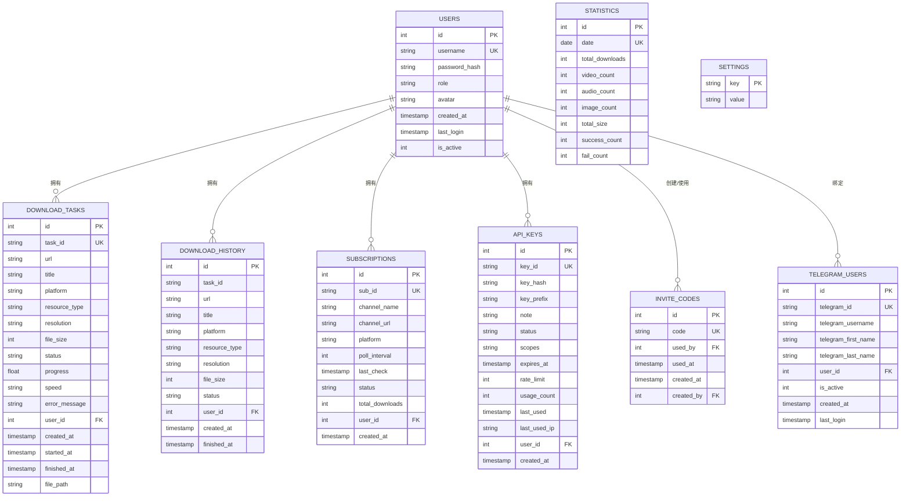
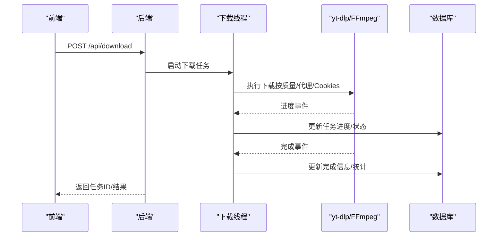
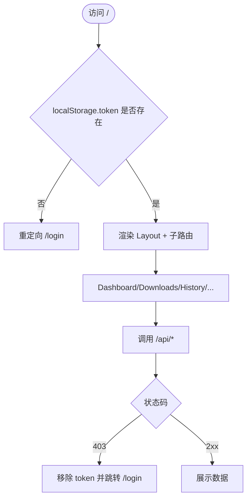
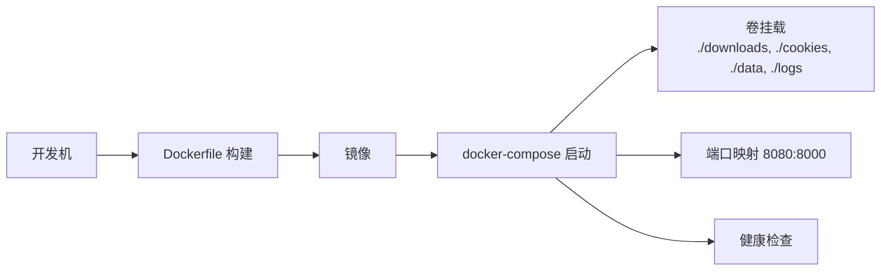
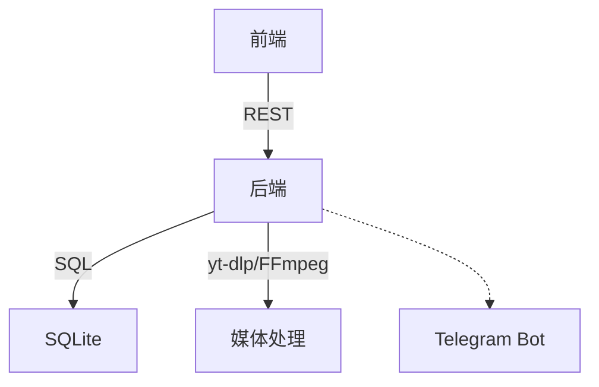

# 系统架构

<cite>
**本文引用的文件**
- [backend/main.py](file://backend/main.py)
- [backend/config.py](file://backend/config.py)
- [backend/admin/db.py](file://backend/admin/db.py)
- [backend/admin/auth.py](file://backend/admin/auth.py)
- [frontend/src/main.js](file://frontend/src/main.js)
- [frontend/src/App.vue](file://frontend/src/App.vue)
- [frontend/src/router.js](file://frontend/src/router.js)
- [frontend/src/utils/api.js](file://frontend/src/utils/api.js)
- [frontend/vite.config.js](file://frontend/vite.config.js)
- [frontend/package.json](file://frontend/package.json)
- [Dockerfile](file://Dockerfile)
- [docker-compose.yml](file://docker-compose.yml)
- [BoscoTsang.toml](file://BoscoTsang.toml)
</cite>

## 目录
1. [引言](#引言)
2. [项目结构](#项目结构)
3. [核心组件](#核心组件)
4. [架构总览](#架构总览)
5. [详细组件分析](#详细组件分析)
6. [依赖分析](#依赖分析)
7. [性能考虑](#性能考虑)
8. [故障排查指南](#故障排查指南)
9. [结论](#结论)
10. [附录](#附录)

## 引言
本文件面向开发者与运维人员，系统性阐述 BoscoTsang 的整体架构设计与实现细节。系统采用前后端分离架构，后端以 Python FastAPI 提供 REST 接口，前端基于 Vue.js 3 构建单页应用，通过 Docker 容器化部署，具备良好的可移植性与可维护性。系统同时引入微服务思想与模块化设计：后端按功能域拆分模块（认证、数据库、配置、下载、订阅、Telegram Bot），前端按页面与路由组织视图与工具层，形成清晰的职责边界与低耦合的交互关系。

## 项目结构
项目采用多模块布局：
- 后端 backend：FastAPI 应用入口、认证与权限、数据库与配置、下载与订阅、Telegram Bot 集成等
- 前端 frontend：Vue 3 应用、路由、UI 视图、API 工具层
- 配置与容器：BoscoTsang.toml、Dockerfile、docker-compose.yml
- CLI 与脚本：命令行工具与辅助脚本
- 扩展与快捷指令：浏览器扩展与 iOS 快捷指令集成

**图表来源**
- [backend/main.py:133-138](file://backend/main.py#L133-L138)
- [backend/admin/db.py:15-21](file://backend/admin/db.py#L15-L21)
- [Dockerfile:64-67](file://Dockerfile#L64-L67)

**章节来源**
- [Dockerfile:6-18](file://Dockerfile#L6-L18)
- [Dockerfile:21-40](file://Dockerfile#L21-L40)
- [docker-compose.yml:9-30](file://docker-compose.yml#L9-L30)

## 核心组件
- 后端应用与中间件
  - FastAPI 应用实例、CORS 中间件、请求日志中间件、生命周期管理（启动/关闭）
  - 参考：[backend/main.py:133-138](file://backend/main.py#L133-L138)，[backend/main.py:140-146](file://backend/main.py#L140-L146)，[backend/main.py:108-130](file://backend/main.py#L108-L130)
- 认证与权限
  - Bearer Token、X-API-Key、查询参数三种认证方式；管理员权限装饰器
  - 参考：[backend/admin/auth.py:16-25](file://backend/admin/auth.py#L16-L25)，[backend/admin/auth.py:110-139](file://backend/admin/auth.py#L110-L139)，[backend/admin/auth.py:142-168](file://backend/admin/auth.py#L142-L168)
- 数据与配置
  - SQLite 数据库初始化与表结构；配置加载与代理策略
  - 参考：[backend/admin/db.py:29-200](file://backend/admin/db.py#L29-L200)，[backend/config.py:29-34](file://backend/config.py#L29-L34)，[backend/config.py:100-108](file://backend/config.py#L100-L108)
- 下载与订阅
  - 平台识别、Cookies 管理、代理策略、yt-dlp 进度回调、下载队列与统计
  - 参考：[backend/main.py:253-286](file://backend/main.py#L253-L286)，[backend/main.py:288-320](file://backend/main.py#L288-L320)，[backend/main.py:733-800](file://backend/main.py#L733-L800)
- 前端应用
  - Vue 3 应用入口、路由与视图、API 工具层
  - 参考：[frontend/src/main.js:1-7](file://frontend/src/main.js#L1-L7)，[frontend/src/router.js:1-48](file://frontend/src/router.js#L1-L48)，[frontend/src/utils/api.js:1-35](file://frontend/src/utils/api.js#L1-L35)
- 容器化与编排
  - 多阶段构建（前端/后端）、系统依赖安装、卷挂载、健康检查
  - 参考：[Dockerfile:6-18](file://Dockerfile#L6-L18)，[Dockerfile:21-40](file://Dockerfile#L21-L40)，[Dockerfile:64-74](file://Dockerfile#L64-L74)，[docker-compose.yml:9-30](file://docker-compose.yml#L9-L30)，[docker-compose.yml:54-60](file://docker-compose.yml#L54-L60)

**章节来源**
- [backend/main.py:108-130](file://backend/main.py#L108-L130)
- [backend/admin/auth.py:110-168](file://backend/admin/auth.py#L110-L168)
- [backend/admin/db.py:29-200](file://backend/admin/db.py#L29-L200)
- [backend/config.py:29-108](file://backend/config.py#L29-L108)
- [frontend/src/main.js:1-7](file://frontend/src/main.js#L1-L7)
- [frontend/src/router.js:1-48](file://frontend/src/router.js#L1-L48)
- [frontend/src/utils/api.js:1-35](file://frontend/src/utils/api.js#L1-L35)
- [Dockerfile:6-74](file://Dockerfile#L6-L74)
- [docker-compose.yml:9-60](file://docker-compose.yml#L9-L60)

## 架构总览
系统采用“容器内统一服务 + 前端静态托管”的部署形态，后端提供 REST API，前端通过代理访问后端接口。认证采用 Token 与 API Key 双通道，数据库与下载/日志/配置等数据通过卷持久化。

**图表来源**
- [frontend/vite.config.js:14-19](file://frontend/vite.config.js#L14-L19)
- [backend/main.py:133-138](file://backend/main.py#L133-L138)
- [backend/admin/db.py:15-21](file://backend/admin/db.py#L15-L21)

**章节来源**
- [frontend/vite.config.js:12-21](file://frontend/vite.config.js#L12-L21)
- [backend/main.py:133-138](file://backend/main.py#L133-L138)

## 详细组件分析

### 后端应用与生命周期
- 应用实例与中间件：CORS 允许跨域；HTTP 中间件统一记录请求与响应状态；生命周期在启动时初始化数据库并按配置启动 Telegram Bot，在关闭时安全停止
- 关键点：日志按天轮转、代理配置动态注入、平台检测与 Cookies 策略

**图表来源**
- [backend/main.py:108-130](file://backend/main.py#L108-L130)
- [backend/admin/auth.py:110-139](file://backend/admin/auth.py#L110-L139)
- [backend/admin/db.py:29-200](file://backend/admin/db.py#L29-L200)

**章节来源**
- [backend/main.py:108-130](file://backend/main.py#L108-L130)
- [backend/main.py:140-146](file://backend/main.py#L140-L146)
- [backend/main.py:84-94](file://backend/main.py#L84-L94)

### 认证与权限模块
- 支持三种认证来源：请求头 X-API-Key、Authorization Bearer、查询参数 token
- 装饰器 require_auth 与 require_admin 实现统一鉴权与权限控制
- Token 存储于内存（生产建议 Redis）

**图表来源**
- [backend/admin/auth.py:70-107](file://backend/admin/auth.py#L70-L107)
- [backend/admin/auth.py:110-139](file://backend/admin/auth.py#L110-L139)
- [backend/admin/auth.py:142-168](file://backend/admin/auth.py#L142-L168)

**章节来源**
- [backend/admin/auth.py:16-25](file://backend/admin/auth.py#L16-L25)
- [backend/admin/auth.py:110-168](file://backend/admin/auth.py#L110-L168)

### 数据与配置模块
- 数据库初始化：用户、下载任务/历史、订阅、API Key、邀请码、统计、设置、Telegram 用户绑定
- 配置加载：BoscoTsang.toml；代理模式（global/none/auto）与绕行网段；按模式注入环境变量

**图表来源**
- [backend/admin/db.py:34-181](file://backend/admin/db.py#L34-L181)

**章节来源**
- [backend/admin/db.py:29-200](file://backend/admin/db.py#L29-L200)
- [backend/config.py:29-34](file://backend/config.py#L29-L34)
- [backend/config.py:100-132](file://backend/config.py#L100-L132)

### 下载与订阅流程
- 平台识别：根据 URL 关键词判定平台，决定 Cookies 与目录结构
- 代理策略：依据配置与自动判断决定是否使用代理
- 进度回调：yt-dlp 回调写入全局进度与数据库，完成后更新统计

**图表来源**
- [backend/main.py:669-732](file://backend/main.py#L669-L732)
- [backend/main.py:733-800](file://backend/main.py#L733-L800)
- [backend/main.py:253-286](file://backend/main.py#L253-L286)

**章节来源**
- [backend/main.py:253-286](file://backend/main.py#L253-L286)
- [backend/main.py:288-320](file://backend/main.py#L288-L320)
- [backend/main.py:669-732](file://backend/main.py#L669-L732)
- [backend/main.py:733-800](file://backend/main.py#L733-L800)

### 前端应用与路由
- 应用入口：创建 Vue 应用并挂载路由
- 路由守卫：未登录跳转登录页，已登录禁止重复进入登录页
- API 工具层：封装 /api 前缀请求、鉴权头、错误处理与文件下载流

**图表来源**
- [frontend/src/router.js:36-45](file://frontend/src/router.js#L36-L45)
- [frontend/src/utils/api.js:15-35](file://frontend/src/utils/api.js#L15-L35)

**章节来源**
- [frontend/src/main.js:1-7](file://frontend/src/main.js#L1-L7)
- [frontend/src/router.js:1-48](file://frontend/src/router.js#L1-L48)
- [frontend/src/utils/api.js:1-35](file://frontend/src/utils/api.js#L1-L35)

### 容器化与部署
- 多阶段构建：前端使用 Node 基础镜像构建，后端使用 Python slim，安装 FFmpeg 与依赖
- 卷挂载：downloads、cookies、data、logs 持久化
- 端口暴露与健康检查：容器内 8000，compose 映射 8080；健康检查探测端口
- 环境变量：APP_BASE_DIR、目录路径、代理、JS Runtime、时区

**图表来源**
- [Dockerfile:6-18](file://Dockerfile#L6-L18)
- [Dockerfile:21-40](file://Dockerfile#L21-L40)
- [Dockerfile:64-74](file://Dockerfile#L64-L74)
- [docker-compose.yml:9-30](file://docker-compose.yml#L9-L30)
- [docker-compose.yml:54-60](file://docker-compose.yml#L54-L60)

**章节来源**
- [Dockerfile:6-74](file://Dockerfile#L6-L74)
- [docker-compose.yml:9-60](file://docker-compose.yml#L9-L60)

## 依赖分析
- 技术栈与优势
  - Python FastAPI：高性能异步框架，自动生成 OpenAPI 文档，类型安全，易于扩展
  - Vue.js 3：组合式 API、响应式系统、生态丰富，适合构建交互式管理界面
  - Docker：多阶段构建、依赖隔离、跨平台一致运行
- 组件耦合与内聚
  - 后端模块内聚：认证、数据库、配置、下载、订阅、Bot 各自职责明确，通过统一入口暴露接口
  - 前后端解耦：通过 /api 代理与鉴权头通信，前端不关心后端实现
- 外部依赖
  - yt-dlp/FFmpeg：下载与音视频处理
  - SQLite：轻量持久化
  - Telegram Bot：消息与登录集成

**图表来源**
- [backend/main.py:133-138](file://backend/main.py#L133-L138)
- [backend/admin/db.py:15-21](file://backend/admin/db.py#L15-L21)
- [Dockerfile:24-26](file://Dockerfile#L24-L26)

**章节来源**
- [backend/main.py:133-138](file://backend/main.py#L133-L138)
- [Dockerfile:24-26](file://Dockerfile#L24-L26)

## 性能考虑
- 异步与并发
  - FastAPI 异步特性与线程池结合，适合 I/O 密集型下载任务
- 进度与统计
  - 通过回调实时更新任务状态，降低轮询开销
- 代理与网络
  - auto 模式减少不必要的代理开销，提升国内站点访问速度
- 前端体验
  - 路由懒加载与按需组件可进一步优化首屏加载

## 故障排查指南
- 认证失败
  - 检查请求头是否包含正确的 X-API-Key 或 Authorization Bearer
  - 确认 token 未过期，必要时重新登录
  - 参考：[backend/admin/auth.py:110-139](file://backend/admin/auth.py#L110-L139)
- 下载异常
  - 检查平台 Cookies 是否存在且有效
  - 确认代理配置与目标域名匹配
  - 查看日志文件定位错误
  - 参考：[backend/main.py:288-320](file://backend/main.py#L288-L320)，[backend/config.py:100-132](file://backend/config.py#L100-L132)
- 前端无法访问后端
  - 确认 Vite 开发服务器代理指向后端地址
  - 参考：[frontend/vite.config.js:14-19](file://frontend/vite.config.js#L14-L19)
- 容器启动失败
  - 检查卷挂载目录权限与磁盘空间
  - 查看健康检查与端口占用
  - 参考：[docker-compose.yml:54-60](file://docker-compose.yml#L54-L60)

**章节来源**
- [backend/admin/auth.py:110-139](file://backend/admin/auth.py#L110-L139)
- [backend/main.py:288-320](file://backend/main.py#L288-L320)
- [backend/config.py:100-132](file://backend/config.py#L100-L132)
- [frontend/vite.config.js:14-19](file://frontend/vite.config.js#L14-L19)
- [docker-compose.yml:54-60](file://docker-compose.yml#L54-L60)

## 结论
BoscoTsang 通过前后端分离与容器化实现了高内聚、低耦合的系统架构。后端以模块化设计承载认证、数据、下载与订阅等能力，前端以路由与 API 工具层提供良好用户体验。配合 Docker 多阶段构建与卷持久化，系统具备良好的可移植性与可维护性。建议在生产环境中引入 Redis 缓存 Token、完善监控与日志聚合，并持续优化下载链路与前端性能。

## 附录
- 配置文件示例与说明
  - 参考：[BoscoTsang.toml:4-28](file://BoscoTsang.toml#L4-L28)
- 前端依赖与脚本
  - 参考：[frontend/package.json:1-23](file://frontend/package.json#L1-L23)