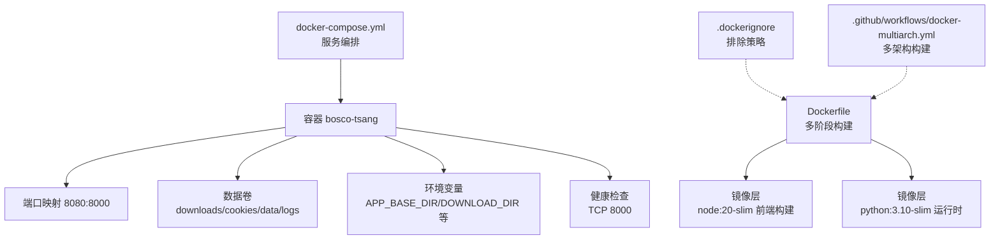
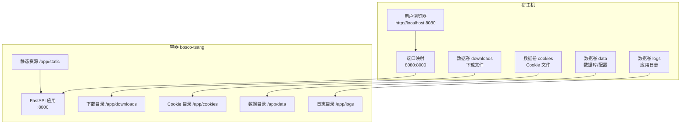
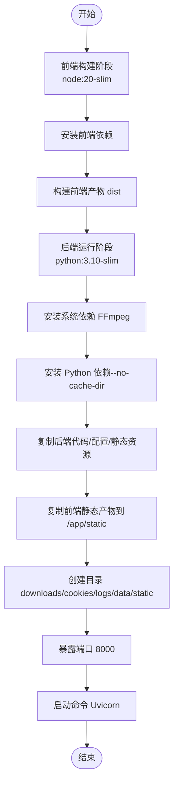
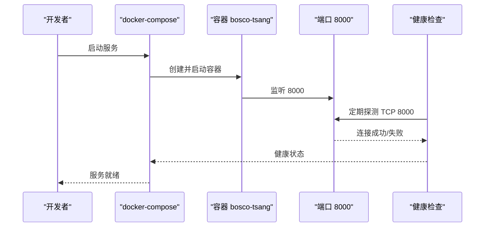
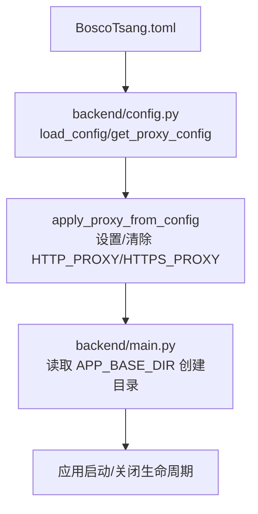
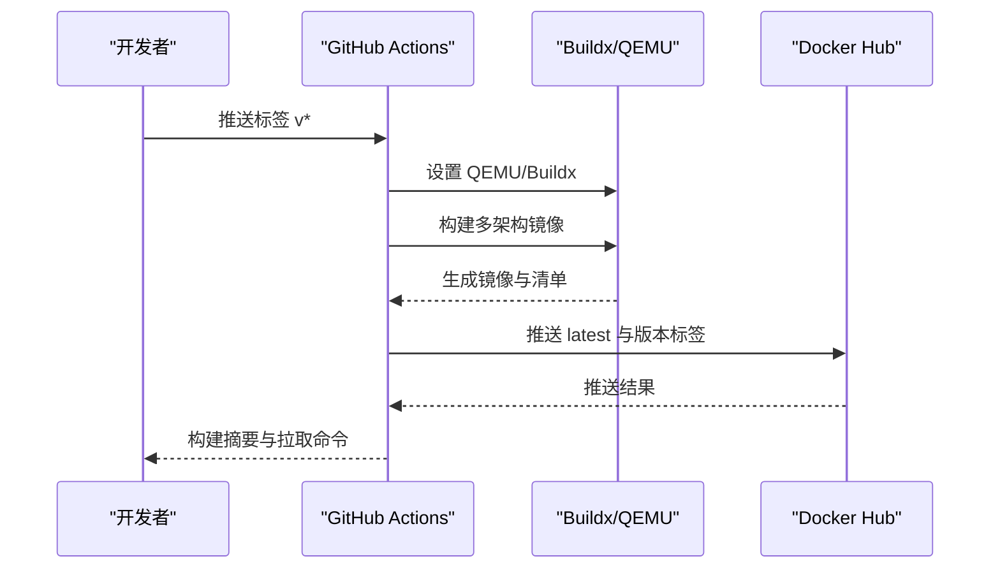
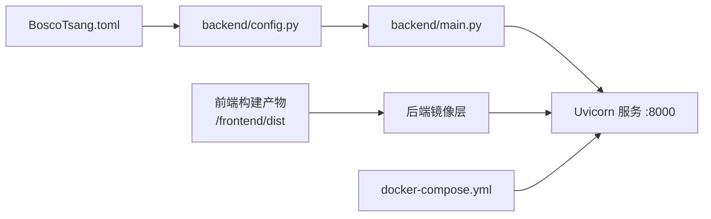

# Docker 容器化

<cite>
**本文引用的文件**
- [Dockerfile](file://Dockerfile)
- [docker-compose.yml](file://docker-compose.yml)
- [.dockerignore](file://.dockerignore)
- [.github/workflows/docker-multiarch.yml](file://.github/workflows/docker-multiarch.yml)
- [backend/main.py](file://backend/main.py)
- [backend/config.py](file://backend/config.py)
- [BoscoTsang.toml](file://BoscoTsang.toml)
- [docs/DEPLOYMENT.md](file://docs/DEPLOYMENT.md)
- [releases/DOCKER_PUSH_REPORT.md](file://releases/DOCKER_PUSH_REPORT.md)
- [scripts/clean-before-push.ps1](file://scripts/clean-before-push.ps1)
- [scripts/update-version.ps1](file://scripts/update-version.ps1)
</cite>

## 目录
1. [简介](#简介)
2. [项目结构](#项目结构)
3. [核心组件](#核心组件)
4. [架构总览](#架构总览)
5. [组件详解](#组件详解)
6. [依赖关系分析](#依赖关系分析)
7. [性能与资源优化](#性能与资源优化)
8. [故障排查指南](#故障排查指南)
9. [结论](#结论)
10. [附录](#附录)

## 简介
本指南面向 BoscoTsang 项目的 Docker 容器化部署，覆盖 Dockerfile 多阶段构建、镜像优化策略、docker-compose 编排、服务依赖与网络、容器启动参数与环境变量、数据卷挂载、健康检查、资源限制与安全配置，以及镜像推送、版本管理与标签策略。文档基于仓库现有配置与脚本进行整理，帮助开发者与运维人员快速、安全地完成部署与发布。

## 项目结构
围绕容器化的核心文件与目录如下：
- Dockerfile：定义多阶段构建流程（前端构建阶段 + 后端运行阶段）
- docker-compose.yml：服务编排、端口映射、数据卷、环境变量与健康检查
- .dockerignore：排除敏感与无关文件，减少镜像体积与泄露风险
- .github/workflows/docker-multiarch.yml：GitHub Actions 多架构镜像构建与推送
- backend/main.py：后端应用入口，读取环境变量与配置，创建日志/数据目录
- backend/config.py：加载与应用配置（如代理），并根据配置设置环境变量
- BoscoTsang.toml：应用配置文件（代理、下载、日志等）
- docs/DEPLOYMENT.md：官方部署文档（包含 Docker 部署、端口与数据卷说明）
- releases/DOCKER_PUSH_REPORT.md：镜像推送报告（包含构建细节、标签策略与使用示例）
- scripts/clean-before-push.ps1：推送前清理敏感信息脚本
- scripts/update-version.ps1：版本号自动更新脚本（PowerShell）

图表来源
- [Dockerfile:1-74](file://Dockerfile#L1-L74)
- [docker-compose.yml:9-60](file://docker-compose.yml#L9-L60)
- [.dockerignore:1-109](file://.dockerignore#L1-L109)
- [.github/workflows/docker-multiarch.yml:1-80](file://.github/workflows/docker-multiarch.yml#L1-L80)

章节来源
- [Dockerfile:1-74](file://Dockerfile#L1-L74)
- [docker-compose.yml:9-60](file://docker-compose.yml#L9-L60)
- [.dockerignore:1-109](file://.dockerignore#L1-L109)
- [.github/workflows/docker-multiarch.yml:1-80](file://.github/workflows/docker-multiarch.yml#L1-L80)
- [docs/DEPLOYMENT.md:95-141](file://docs/DEPLOYMENT.md#L95-L141)

## 核心组件
- 多阶段 Dockerfile：前端在 node:20-slim 中构建，产物复制到后端运行镜像；后端基于 python:3.10-slim，安装 FastAPI、Uvicorn、yt-dlp、FFmpeg 等依赖，并复制后端代码、配置与静态资源。
- docker-compose：定义服务 bosco-tsang，暴露 8080:8000 端口映射，挂载 downloads、cookies、data、logs 四个数据卷，设置环境变量（APP_BASE_DIR、DOWNLOAD_DIR、COOKIES_DIR、LOGS_DIR、HTTP_PROXY、HTTPS_PROXY、YTDLP_JS_RUNTIME、YTDLP_PROXY、TZ），配置健康检查。
- 配置体系：BoscoTsang.toml 提供代理与下载、日志等配置；backend/config.py 加载 TOML 并根据配置动态设置 HTTP_PROXY/HTTPS_PROXY 环境变量；backend/main.py 读取环境变量并创建必要的目录（downloads、cookies、logs、data、static）。
- 推送与版本：GitHub Actions 多架构构建（linux/amd64, linux/arm64），推送 latest 与具体版本标签；提供推送报告与使用示例；推送前清理脚本过滤敏感信息；版本更新脚本按语义化版本更新。

章节来源
- [Dockerfile:6-74](file://Dockerfile#L6-L74)
- [docker-compose.yml:10-60](file://docker-compose.yml#L10-L60)
- [backend/config.py:29-135](file://backend/config.py#L29-L135)
- [backend/main.py:56-66](file://backend/main.py#L56-L66)
- [BoscoTsang.toml:1-28](file://BoscoTsang.toml#L1-L28)
- [.github/workflows/docker-multiarch.yml:14-54](file://.github/workflows/docker-multiarch.yml#L14-L54)
- [releases/DOCKER_PUSH_REPORT.md:47-61](file://releases/DOCKER_PUSH_REPORT.md#L47-L61)
- [scripts/clean-before-push.ps1:20-36](file://scripts/clean-before-push.ps1#L20-L36)
- [scripts/update-version.ps1:46-68](file://scripts/update-version.ps1#L46-L68)

## 架构总览
下图展示了容器化部署的整体架构：前端静态资源由 node 阶段构建并复制到后端镜像；后端服务监听 8000 端口并通过 docker-compose 暴露到宿主机 8080；数据通过数据卷持久化；健康检查确保服务可用。

图表来源
- [docker-compose.yml:18-30](file://docker-compose.yml#L18-L30)
- [Dockerfile:64-67](file://Dockerfile#L64-L67)
- [backend/main.py:56-66](file://backend/main.py#L56-L66)

章节来源
- [docker-compose.yml:18-30](file://docker-compose.yml#L18-L30)
- [Dockerfile:64-67](file://Dockerfile#L64-L67)
- [backend/main.py:56-66](file://backend/main.py#L56-L66)

## 组件详解

### Dockerfile 多阶段构建与镜像优化
- 构建阶段划分
  - 前端构建阶段：基于 node:20-slim，安装前端依赖并执行构建，产出静态资源 dist。
  - 后端运行阶段：基于 python:3.10-slim，安装系统依赖（如 FFmpeg）、Python 依赖（FastAPI、Uvicorn、yt-dlp、psutil、httpx、markdown 等），复制后端代码、配置文件、静态资源与浏览器扩展等，将前端构建产物复制到 /app/static。
- 目录与端口
  - 创建下载、Cookie、日志、数据与静态目录，暴露 8000 端口，使用 Uvicorn 启动应用。
- 优化策略
  - 分离前端构建与后端运行镜像，减小最终镜像体积。
  - 使用 --no-cache-dir 安装 Python 依赖，避免缓存进入镜像。
  - apt-get 安装后清理包缓存，降低镜像大小。
  - 仅复制必要文件，配合 .dockerignore 进一步瘦身。

图表来源
- [Dockerfile:6-74](file://Dockerfile#L6-L74)

章节来源
- [Dockerfile:6-74](file://Dockerfile#L6-L74)
- [.dockerignore:15-39](file://.dockerignore#L15-L39)

### docker-compose 编排与服务配置
- 服务定义
  - 服务名：bosco-tsang；容器名：bosco-tsang。
  - 构建方式：从本地 Dockerfile 构建（开发环境推荐）；生产环境可替换为预构建镜像。
- 端口映射
  - 8080:8000，便于宿主机访问。
- 数据卷
  - ./downloads -> /app/downloads
  - ./cookies -> /app/cookies
  - ./data -> /app/data
  - ./logs -> /app/logs
- 环境变量
  - APP_BASE_DIR=/app
  - DOWNLOAD_DIR=/app/downloads
  - COOKIES_DIR=/app/cookies
  - LOGS_DIR=/app/logs
  - HTTP_PROXY/HTTPS_PROXY（可选）
  - YTDLP_JS_RUNTIME（可选）
  - YTDLP_PROXY（可选）
  - TZ（可选）
- 健康检查
  - 使用 TCP 连接 8000 端口，间隔 30s，超时 10s，重试 3 次，启动期 10s。

图表来源
- [docker-compose.yml:10-60](file://docker-compose.yml#L10-L60)

章节来源
- [docker-compose.yml:10-60](file://docker-compose.yml#L10-L60)

### 配置体系与环境变量
- 配置文件
  - BoscoTsang.toml：包含 proxy、download、logging 等配置项，支持代理模式（global/none/auto）、HTTP/HTTPS 代理地址、CIDR 白名单等。
- 配置加载与应用
  - backend/config.py：读取 TOML 配置，提供 is_local_address 判断与 get_proxy_config；根据配置动态设置 HTTP_PROXY/HTTPS_PROXY 环境变量（global/none 模式）。
- 应用入口
  - backend/main.py：读取 APP_BASE_DIR 环境变量，创建 downloads、cookies、logs、data、static 目录；初始化日志与数据库；应用生命周期中按设置启动 Telegram Bot。

图表来源
- [BoscoTsang.toml:1-28](file://BoscoTsang.toml#L1-L28)
- [backend/config.py:29-135](file://backend/config.py#L29-L135)
- [backend/main.py:56-130](file://backend/main.py#L56-L130)

章节来源
- [BoscoTsang.toml:1-28](file://BoscoTsang.toml#L1-L28)
- [backend/config.py:29-135](file://backend/config.py#L29-L135)
- [backend/main.py:56-130](file://backend/main.py#L56-L130)

### 镜像推送与版本管理
- 多架构构建
  - GitHub Actions 使用 docker/build-push-action，支持 linux/amd64 与 linux/arm64；推送 latest 与具体版本标签。
- 标签策略
  - latest：指向最新稳定版本。
  - 具体版本：如 v0.3.0、v0.4.0 等，遵循语义化版本。
- 推送流程
  - 登录 Docker Hub，构建并推送镜像；校验多架构清单；提供拉取与运行示例。
- 版本更新
  - 使用 scripts/update-version.ps1 按 MAJOR/MINOR/PATCH 更新版本号，并更新 CHANGELOG.md。
- 推送前清理
  - 使用 scripts/clean-before-push.ps1 清理 cookies、logs、测试下载文件、Python/Node 缓存等敏感信息。

图表来源
- [.github/workflows/docker-multiarch.yml:14-54](file://.github/workflows/docker-multiarch.yml#L14-L54)
- [releases/DOCKER_PUSH_REPORT.md:47-61](file://releases/DOCKER_PUSH_REPORT.md#L47-L61)

章节来源
- [.github/workflows/docker-multiarch.yml:14-54](file://.github/workflows/docker-multiarch.yml#L14-L54)
- [releases/DOCKER_PUSH_REPORT.md:47-61](file://releases/DOCKER_PUSH_REPORT.md#L47-L61)
- [scripts/update-version.ps1:46-68](file://scripts/update-version.ps1#L46-L68)
- [scripts/clean-before-push.ps1:20-36](file://scripts/clean-before-push.ps1#L20-L36)

## 依赖关系分析
- 组件耦合
  - Dockerfile 前端产物与后端镜像通过 --from=frontend-builder 复制静态资源，耦合点明确。
  - backend/main.py 依赖 backend/config.py 提供的配置与代理设置。
  - docker-compose.yml 通过环境变量与数据卷将宿主机与容器解耦。
- 外部依赖
  - yt-dlp、FFmpeg 作为下载与转码能力的基础。
  - FastAPI/Uvicorn 提供服务端运行时。
- 潜在循环依赖
  - 未发现循环依赖；配置加载为单向（配置文件 -> 配置模块 -> 应用入口）。

图表来源
- [Dockerfile:64](file://Dockerfile#L64)
- [backend/config.py:29-135](file://backend/config.py#L29-L135)
- [backend/main.py:56-130](file://backend/main.py#L56-L130)
- [docker-compose.yml:10-60](file://docker-compose.yml#L10-L60)

章节来源
- [Dockerfile:64](file://Dockerfile#L64)
- [backend/config.py:29-135](file://backend/config.py#L29-L135)
- [backend/main.py:56-130](file://backend/main.py#L56-L130)
- [docker-compose.yml:10-60](file://docker-compose.yml#L10-L60)

## 性能与资源优化
- 镜像体积优化
  - 使用 slim 基础镜像（node:20-slim、python:3.10-slim）。
  - 安装系统依赖后清理包缓存；Python 依赖使用 --no-cache-dir。
  - 仅复制必要文件，结合 .dockerignore 排除无关目录与文件。
- 启动与运行时
  - 前端静态资源在构建阶段生成并复制到运行镜像，避免运行时重复构建。
  - 使用 Uvicorn 直接启动应用，减少中间层开销。
- 网络与代理
  - 通过配置文件与环境变量灵活控制代理行为，避免不必要的网络延迟。
- 建议
  - 在生产环境启用健康检查与重启策略（unless-stopped）。
  - 对于高并发场景，考虑使用反向代理（如 Nginx）与负载均衡。

[本节为通用性能建议，不直接分析具体文件]

## 故障排查指南
- 健康检查失败
  - 检查容器内部 8000 端口是否正常监听；查看 docker-compose.yml 中的健康检查配置。
- 端口冲突
  - 修改 docker-compose.yml 中的端口映射（如 8090:8000）。
- 权限问题
  - 确保宿主机数据目录具有足够权限（如 777），参考部署文档中的权限设置。
- 代理与网络
  - 若受限网络访问外部资源，可在环境变量中设置 HTTP_PROXY/HTTPS_PROXY；或在 BoscoTsang.toml 中配置代理模式与地址。
- 推送失败
  - 检查 Docker Hub 登录状态与网络连通性；参考推送报告中的多架构清单校验与拉取命令。

章节来源
- [docker-compose.yml:54-60](file://docker-compose.yml#L54-L60)
- [docs/DEPLOYMENT.md:380-386](file://docs/DEPLOYMENT.md#L380-L386)
- [docs/DEPLOYMENT.md:361-393](file://docs/DEPLOYMENT.md#L361-L393)
- [BoscoTsang.toml:4-19](file://BoscoTsang.toml#L4-L19)

## 结论
通过多阶段 Dockerfile、合理的数据卷与环境变量配置、健康检查与多架构推送流水线，BoscoTsang 实现了高效、可维护且可扩展的容器化部署。结合推送前清理与版本更新脚本，能够保障镜像安全与发布流程规范化。建议在生产环境中进一步引入资源限制、网络隔离与密钥管理策略，持续提升安全性与稳定性。

[本节为总结性内容，不直接分析具体文件]

## 附录

### 容器启动参数与环境变量清单
- 端口映射
  - 8080:8000（宿主机:容器）
- 数据卷
  - ./downloads -> /app/downloads
  - ./cookies -> /app/cookies
  - ./data -> /app/data
  - ./logs -> /app/logs
- 环境变量
  - APP_BASE_DIR=/app
  - DOWNLOAD_DIR=/app/downloads
  - COOKIES_DIR=/app/cookies
  - LOGS_DIR=/app/logs
  - HTTP_PROXY（可选）
  - HTTPS_PROXY（可选）
  - YTDLP_JS_RUNTIME（可选）
  - YTDLP_PROXY（可选）
  - TZ（可选）

章节来源
- [docker-compose.yml:18-50](file://docker-compose.yml#L18-L50)

### 健康检查与重启策略
- 健康检查
  - 测试命令：连接 localhost:8000；间隔 30s；超时 10s；重试 3 次；启动期 10s。
- 重启策略
  - unless-stopped

章节来源
- [docker-compose.yml:54-60](file://docker-compose.yml#L54-L60)

### 镜像推送与标签策略
- 推送目标
  - Docker Hub：boscotom/bosco-tsang
- 标签
  - latest
  - 具体版本：如 v0.3.0、v0.4.0 等
- 多架构
  - linux/amd64、linux/arm64（受网络影响可能不完整）

章节来源
- [.github/workflows/docker-multiarch.yml:14-54](file://.github/workflows/docker-multiarch.yml#L14-L54)
- [releases/DOCKER_PUSH_REPORT.md:14-17](file://releases/DOCKER_PUSH_REPORT.md#L14-L17)

### 版本管理与推送清单
- 版本更新
  - 使用 scripts/update-version.ps1 按语义化版本更新。
- 推送前清理
  - 使用 scripts/clean-before-push.ps1 清理敏感信息与缓存。
- 推送清单（示例）
  - 运行清理脚本
  - 更新版本号与 CHANGELOG.md
  - 在 Linux/Mac 服务器上构建多架构镜像
  - 验证推送清单

章节来源
- [scripts/update-version.ps1:46-68](file://scripts/update-version.ps1#L46-L68)
- [scripts/clean-before-push.ps1:20-36](file://scripts/clean-before-push.ps1#L20-L36)
- [releases/DOCKER_PUSH_REPORT.md:239-269](file://releases/DOCKER_PUSH_REPORT.md#L239-L269)