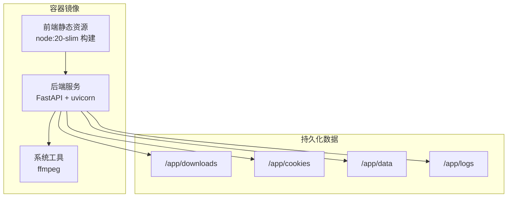
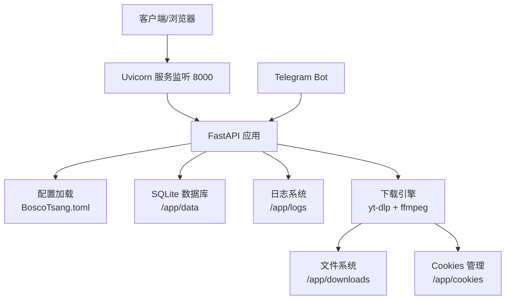
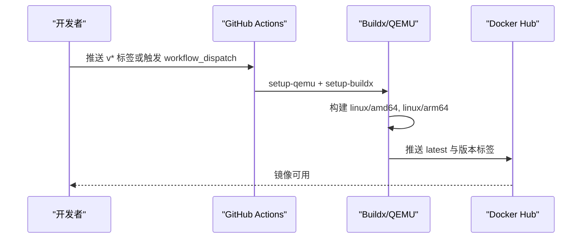
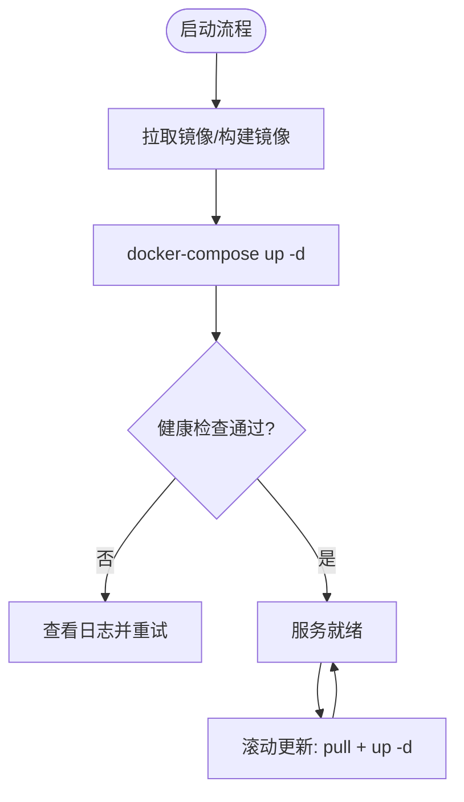
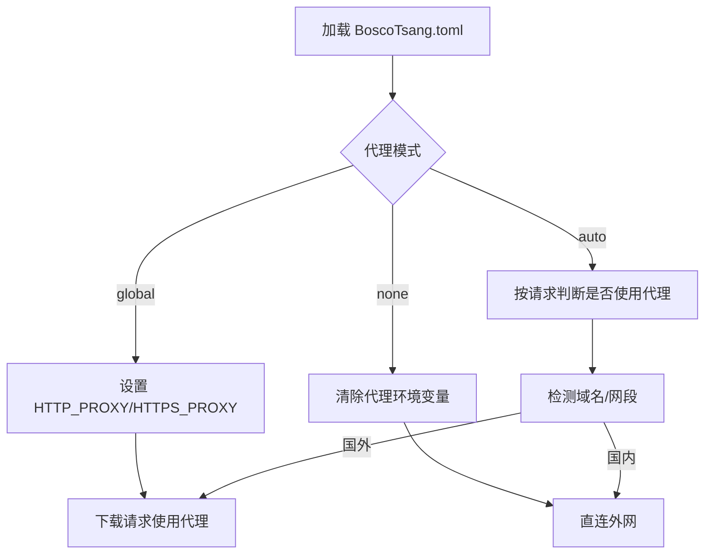
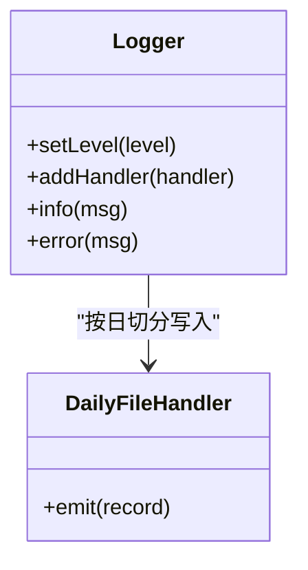
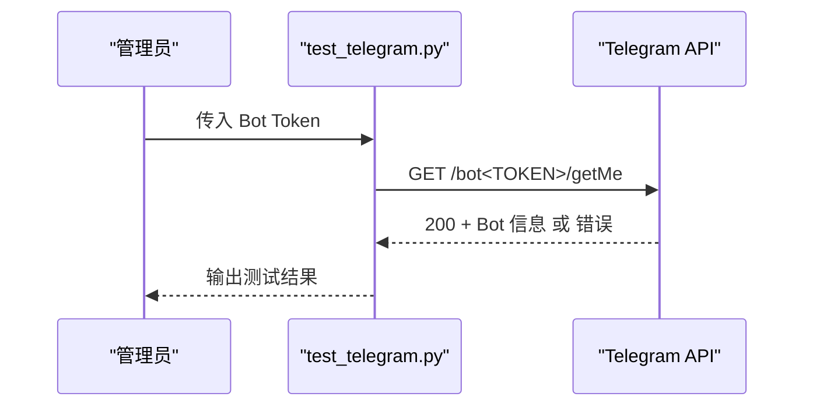
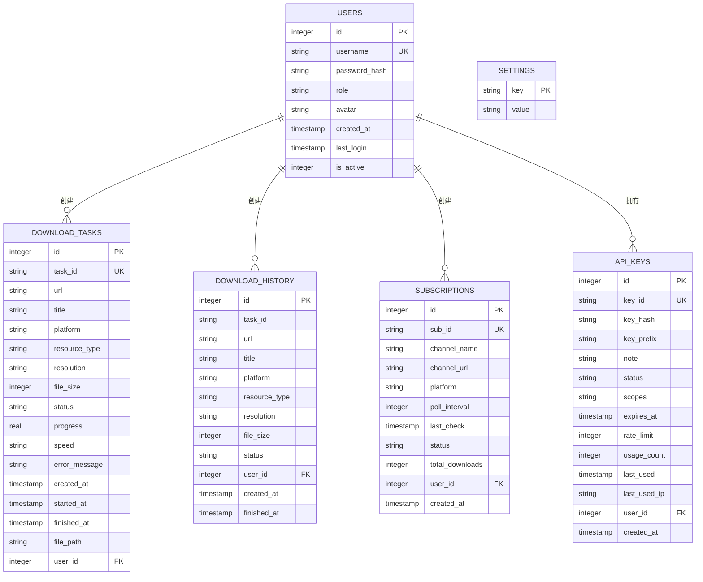
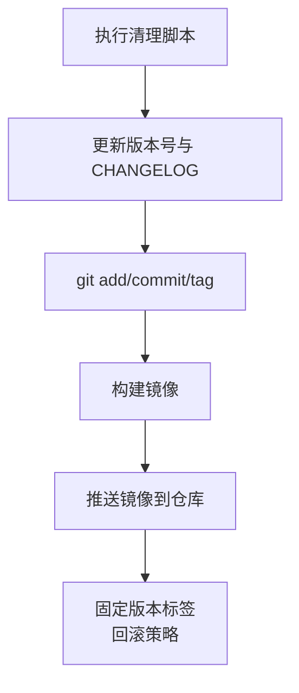
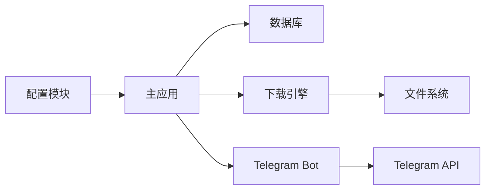

# 部署运维

<cite>
**本文引用的文件**
- [Dockerfile](file://Dockerfile)
- [docker-compose.yml](file://docker-compose.yml)
- [.github/workflows/docker-multiarch.yml](file://.github/workflows/docker-multiarch.yml)
- [docs/DEPLOYMENT.md](file://docs/DEPLOYMENT.md)
- [releases/DEPLOYMENT.md](file://releases/DEPLOYMENT.md)
- [backend/main.py](file://backend/main.py)
- [backend/config.py](file://backend/config.py)
- [backend/admin/db.py](file://backend/admin/db.py)
- [backend/admin/telegram_bot.py](file://backend/admin/telegram_bot.py)
- [scripts/clean-before-push.sh](file://scripts/clean-before-push.sh)
- [scripts/update-version.sh](file://scripts/update-version.sh)
- [scripts/test_telegram.py](file://scripts/test_telegram.py)
- [releases/DOCKER_PUSH_REPORT.md](file://releases/DOCKER_PUSH_REPORT.md)
- [releases/TELEGRAM_DIAGNOSIS.md](file://releases/TELEGRAM_DIAGNOSIS.md)
- [BoscoTsang.toml](file://BoscoTsang.toml)
- [frontend/package.json](file://frontend/package.json)
</cite>

## 目录
1. [简介](#简介)
2. [项目结构](#项目结构)
3. [核心组件](#核心组件)
4. [架构总览](#架构总览)
5. [详细组件分析](#详细组件分析)
6. [依赖关系分析](#依赖关系分析)
7. [性能考量](#性能考量)
8. [故障排查指南](#故障排查指南)
9. [结论](#结论)
10. [附录](#附录)

## 简介
本指南面向 BoscoTsang 的部署与运维，覆盖 Docker 镜像构建、多架构支持与 CI/CD 流程；生产环境部署策略、监控与日志管理；容器编排、负载均衡与高可用配置；性能监控、故障诊断与维护操作；版本发布流程、自动化部署与回滚策略。文档同时提供可视化图示，帮助不同技术背景的读者快速理解与落地。

## 项目结构
项目采用前后端分离与容器化部署架构：
- 前端：Vue 3 + Vite，构建产物作为静态资源嵌入后端镜像
- 后端：Python FastAPI，提供下载、订阅、用户与 API 管理等接口
- 数据：SQLite 存放于 /app/data，配合日志、下载、Cookies 等目录持久化
- 镜像：多阶段构建，前端在 node:20-slim 中构建，后端在 python:3.10-slim 运行
- 编排：docker-compose.yml 提供一键启动与健康检查
- CI/CD：GitHub Actions 支持多架构镜像构建与推送

图表来源
- [Dockerfile:1-74](file://Dockerfile#L1-L74)
- [docker-compose.yml:9-60](file://docker-compose.yml#L9-L60)

章节来源
- [Dockerfile:1-74](file://Dockerfile#L1-L74)
- [docker-compose.yml:1-60](file://docker-compose.yml#L1-L60)

## 核心组件
- 镜像构建
  - 多阶段构建：前端在 node:20-slim 中打包，后端在 python:3.10-slim 中安装依赖并运行
  - 暴露端口 8000，CMD 使用 uvicorn 启动 FastAPI 应用
- 容器编排
  - docker-compose.yml 提供端口映射、数据卷挂载、环境变量与健康检查
- 配置与代理
  - BoscoTsang.toml 提供代理模式、HTTP/HTTPS 代理与本地网段绕过规则
  - 后端加载配置并按模式设置环境变量或按请求判断
- 数据与日志
  - SQLite 数据库位于 /app/data，日志按日期切分写入 /app/logs
- Telegram Bot
  - 异步轮询 Telegram API，支持权限校验、命令与进度通知

章节来源
- [Dockerfile:1-74](file://Dockerfile#L1-L74)
- [docker-compose.yml:9-60](file://docker-compose.yml#L9-L60)
- [BoscoTsang.toml:1-28](file://BoscoTsang.toml#L1-L28)
- [backend/config.py:1-135](file://backend/config.py#L1-L135)
- [backend/main.py:67-95](file://backend/main.py#L67-L95)
- [backend/admin/telegram_bot.py:43-436](file://backend/admin/telegram_bot.py#L43-L436)

## 架构总览
下图展示容器内部组件交互与数据流：

图表来源
- [backend/main.py:133-138](file://backend/main.py#L133-L138)
- [backend/config.py:29-34](file://backend/config.py#L29-L34)
- [backend/admin/db.py:15-21](file://backend/admin/db.py#L15-L21)
- [backend/admin/telegram_bot.py:43-436](file://backend/admin/telegram_bot.py#L43-L436)
- [Dockerfile:64-68](file://Dockerfile#L64-L68)

## 详细组件分析

### Docker 镜像与多架构支持
- 构建流程
  - 前端阶段：node:20-slim 安装依赖并构建，产物拷贝至 /app/static
  - 后端阶段：python:3.10-slim 安装 Python 依赖，复制后端代码与配置，暴露 8000 端口
- 多架构构建
  - GitHub Actions 使用 docker/build-push-action，支持 linux/amd64, linux/arm64
  - 使用 QEMU 模拟 arm64，构建完成后校验镜像清单
- 推送策略
  - 为 latest 与版本标签推送镜像，便于生产环境固定版本或跟随最新

图表来源
- [.github/workflows/docker-multiarch.yml:1-80](file://.github/workflows/docker-multiarch.yml#L1-L80)
- [Dockerfile:1-74](file://Dockerfile#L1-L74)

章节来源
- [.github/workflows/docker-multiarch.yml:1-80](file://.github/workflows/docker-multiarch.yml#L1-L80)
- [Dockerfile:1-74](file://Dockerfile#L1-L74)

### 容器编排与部署策略
- 开发环境
  - 使用 docker-compose 构建并启动，端口映射 8080:8000，挂载 downloads/cookies/data/logs
- 生产环境
  - 使用预构建镜像 boscotom/bosco-tsang:latest 或指定版本
  - 建议固定版本标签，结合 docker-compose pull + up -d 实现滚动更新
- 健康检查
  - 通过 Python 命令探测 8000 端口，确保服务可用
- 数据与日志
  - 持久化目录建议使用独立卷或宿主机目录，避免容器重建导致数据丢失

图表来源
- [docker-compose.yml:9-60](file://docker-compose.yml#L9-L60)
- [releases/DEPLOYMENT.md:19-51](file://releases/DEPLOYMENT.md#L19-L51)

章节来源
- [docker-compose.yml:1-60](file://docker-compose.yml#L1-L60)
- [releases/DEPLOYMENT.md:1-267](file://releases/DEPLOYMENT.md#L1-L267)

### 配置与代理
- 配置文件
  - BoscoTsang.toml 提供 proxy.enabled、mode、http/https、bypass_cidrs 等
- 后端应用
  - 加载配置并按模式设置 HTTP_PROXY/HTTPS_PROXY 环境变量
  - auto 模式下按域名/IP 判断是否绕过代理，减少不必要的代理转发
- 环境变量
  - docker-compose.yml 提供 APP_BASE_DIR、DOWNLOAD_DIR、COOKIES_DIR、LOGS_DIR、HTTP_PROXY、HTTPS_PROXY、TZ 等

图表来源
- [BoscoTsang.toml:1-28](file://BoscoTsang.toml#L1-L28)
- [backend/config.py:111-132](file://backend/config.py#L111-L132)
- [backend/main.py:742-763](file://backend/main.py#L742-L763)

章节来源
- [BoscoTsang.toml:1-28](file://BoscoTsang.toml#L1-L28)
- [backend/config.py:1-135](file://backend/config.py#L1-L135)
- [backend/main.py:742-763](file://backend/main.py#L742-L763)

### 日志与监控
- 日志策略
  - 控制台与文件双通道，按日期切分每日日志文件 app_YYYY-MM-DD.log
  - 日志目录位于 /app/logs，可通过 docker-compose 挂载到宿主机
- 监控建议
  - 结合容器日志采集（如 Fluent Bit/Fluentd）与指标导出（Prometheus），关注 CPU/内存/IO 与下载并发
  - 对 Telegram Bot 与下载任务建立告警阈值（失败率、延迟）

图表来源
- [backend/main.py:67-95](file://backend/main.py#L67-L95)

章节来源
- [backend/main.py:67-95](file://backend/main.py#L67-L95)

### Telegram Bot 诊断与排障
- 诊断要点
  - 检查 Bot Token 是否配置且有效，功能开关是否启用
  - 网络连通性测试，必要时配置代理
  - SSL 证书更新，依赖版本兼容性
- 测试脚本
  - scripts/test_telegram.py 可快速验证 Telegram API 可达性与 Token 有效性
- 日志增强
  - 详细记录异常类型、repr 与堆栈，便于定位 httpx.ConnectError 等问题

图表来源
- [scripts/test_telegram.py:1-76](file://scripts/test_telegram.py#L1-L76)
- [releases/TELEGRAM_DIAGNOSIS.md:1-309](file://releases/TELEGRAM_DIAGNOSIS.md#L1-L309)

章节来源
- [scripts/test_telegram.py:1-76](file://scripts/test_telegram.py#L1-L76)
- [backend/admin/telegram_bot.py:43-436](file://backend/admin/telegram_bot.py#L43-L436)
- [releases/TELEGRAM_DIAGNOSIS.md:1-309](file://releases/TELEGRAM_DIAGNOSIS.md#L1-L309)

### 数据库与持久化
- 数据库
  - SQLite 文件位于 /app/data/bosco.db，首次启动会初始化用户、任务、订阅、API 密钥、统计与设置表
- 目录结构
  - downloads、cookies、data、logs 分别映射到宿主机，便于备份与恢复
- 备份建议
  - 定期归档 data 与 logs，cookies 仅保留必要文件

图表来源
- [backend/admin/db.py:29-214](file://backend/admin/db.py#L29-L214)

章节来源
- [backend/admin/db.py:1-800](file://backend/admin/db.py#L1-L800)

### 版本发布与自动化部署
- 发布流程
  - 推送前清理：清空 cookies、logs、测试下载与缓存
  - 更新版本号：语义化版本，同步更新后端与前端 package.json，并更新 CHANGELOG.md
  - 提交与打标签：git push + git tag
  - 构建与推送：docker build + docker push
- 回滚策略
  - 使用固定版本标签，回滚时切换到上一个稳定版本标签
  - docker-compose.yml 中固定 image 版本，避免自动拉取 latest
- CI/CD
  - GitHub Actions 自动触发多架构构建与推送，支持 workflow_dispatch 指定版本

图表来源
- [scripts/clean-before-push.sh:1-127](file://scripts/clean-before-push.sh#L1-L127)
- [scripts/update-version.sh:1-151](file://scripts/update-version.sh#L1-L151)
- [releases/DEPLOYMENT.md:55-170](file://releases/DEPLOYMENT.md#L55-L170)
- [.github/workflows/docker-multiarch.yml:1-80](file://.github/workflows/docker-multiarch.yml#L1-L80)

章节来源
- [scripts/clean-before-push.sh:1-127](file://scripts/clean-before-push.sh#L1-L127)
- [scripts/update-version.sh:1-151](file://scripts/update-version.sh#L1-L151)
- [releases/DEPLOYMENT.md:1-267](file://releases/DEPLOYMENT.md#L1-L267)
- [.github/workflows/docker-multiarch.yml:1-80](file://.github/workflows/docker-multiarch.yml#L1-L80)

## 依赖关系分析
- 组件耦合
  - 后端依赖配置模块加载代理设置，下载流程依赖 yt-dlp 与 ffmpeg
  - Telegram Bot 依赖 httpx 与 SQLite 数据库
- 外部依赖
  - Docker Hub 镜像、GitHub Actions、Telegram API
- 潜在风险
  - 代理配置不当导致下载失败
  - 证书或网络问题影响 Telegram Bot
  - 多架构构建受网络环境影响

图表来源
- [backend/config.py:1-135](file://backend/config.py#L1-L135)
- [backend/main.py:133-138](file://backend/main.py#L133-L138)
- [backend/admin/telegram_bot.py:43-436](file://backend/admin/telegram_bot.py#L43-L436)

章节来源
- [backend/config.py:1-135](file://backend/config.py#L1-L135)
- [backend/main.py:133-138](file://backend/main.py#L133-L138)
- [backend/admin/telegram_bot.py:43-436](file://backend/admin/telegram_bot.py#L43-L436)

## 性能考量
- 并发与资源
  - 下载并发受 CPU/IO 与网络带宽限制，建议在容器资源配额与节点层面进行限制与扩缩容
- 代理与网络
  - auto 模式减少不必要的代理转发，提升国内站点访问效率
- 日志与磁盘
  - 按日切分日志，定期清理旧日志，避免磁盘占满
- 前端静态资源
  - 前端构建产物已内嵌，减少运行时依赖，提升启动速度

## 故障排查指南
- 常见问题
  - 下载失败需配置 Cookies：将对应平台的 Netscape 格式 Cookies 文件放入 /app/cookies
  - 端口被占用：修改 docker-compose.yml 中的 hostPort:containerPort
  - 群晖/极空间拉取镜像慢：配置 Docker 注册表镜像或加速器
- 构建失败
  - 清理 Docker 缓存并重新构建
- 推送被拒
  - 检查并从历史中移除大文件
- Telegram Bot 诊断
  - 使用 test_telegram.py 验证 Token 与网络可达性
  - 检查日志中异常类型与堆栈，定位具体错误

章节来源
- [docs/DEPLOYMENT.md:361-393](file://docs/DEPLOYMENT.md#L361-L393)
- [releases/DOCKER_PUSH_REPORT.md:223-222](file://releases/DOCKER_PUSH_REPORT.md#L223-L222)
- [releases/TELEGRAM_DIAGNOSIS.md:1-309](file://releases/TELEGRAM_DIAGNOSIS.md#L1-L309)

## 结论
通过多阶段 Docker 构建、多架构 CI/CD 与稳定的 docker-compose 编排，BoscoTsang 可在开发与生产环境中高效部署。结合代理配置、日志与监控体系、完善的发布与回滚流程，能够满足持续交付与高可用需求。建议在生产中固定镜像版本、启用健康检查与数据持久化，并建立完善的故障诊断与应急响应机制。

## 附录
- 快速参考
  - 镜像构建与推送：参见 releases/DOCKER_PUSH_REPORT.md
  - 部署与更新：参见 releases/DEPLOYMENT.md
  - Telegram 诊断：参见 releases/TELEGRAM_DIAGNOSIS.md
- 版本与前端
  - 前端版本号位于 frontend/package.json
  - 后端版本号位于 backend/main.py（FastAPI version 字段）

章节来源
- [releases/DOCKER_PUSH_REPORT.md:1-285](file://releases/DOCKER_PUSH_REPORT.md#L1-L285)
- [releases/DEPLOYMENT.md:1-267](file://releases/DEPLOYMENT.md#L1-L267)
- [releases/TELEGRAM_DIAGNOSIS.md:1-309](file://releases/TELEGRAM_DIAGNOSIS.md#L1-L309)
- [frontend/package.json:1-23](file://frontend/package.json#L1-L23)
- [backend/main.py:133-138](file://backend/main.py#L133-L138)