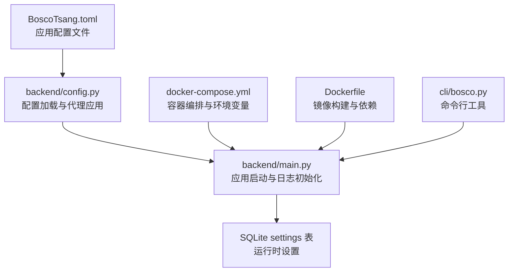
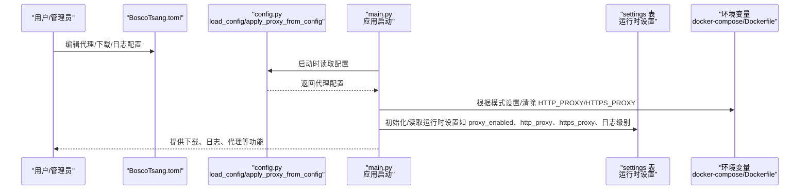
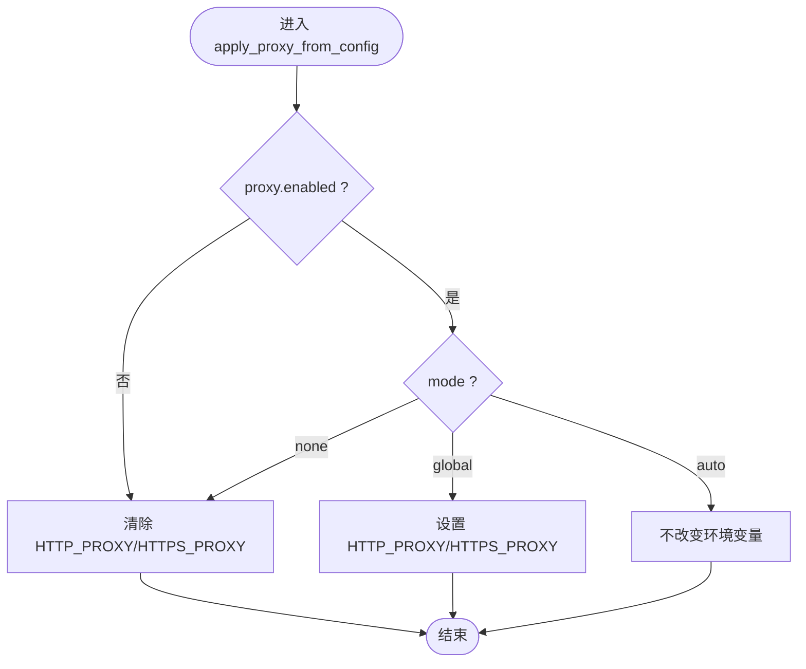
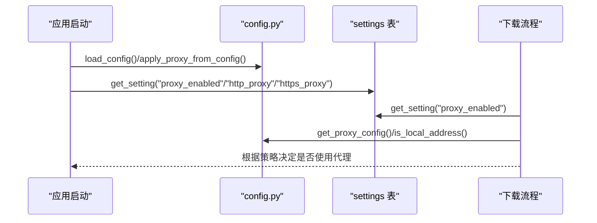
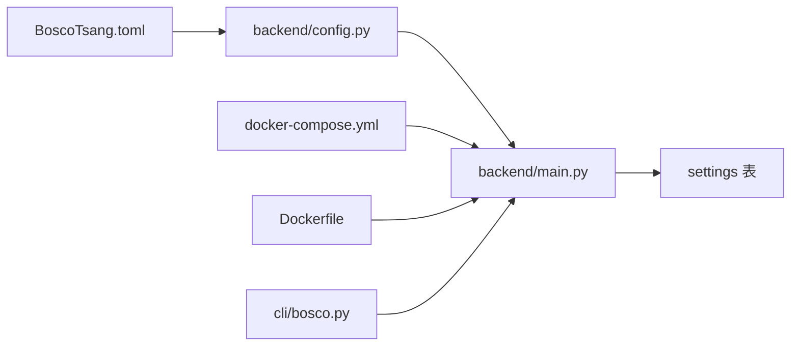

# 配置管理

<cite>
**本文引用的文件**
- [BoscoTsang.toml](file://BoscoTsang.toml)
- [backend/config.py](file://backend/config.py)
- [backend/main.py](file://backend/main.py)
- [backend/admin/db.py](file://backend/admin/db.py)
- [cli/bosco.py](file://cli/bosco.py)
- [docker-compose.yml](file://docker-compose.yml)
- [Dockerfile](file://Dockerfile)
- [README.md](file://README.md)
- [USAGE_MANUAL.md](file://USAGE_MANUAL.md)
</cite>

## 目录
1. [引言](#引言)
2. [项目结构](#项目结构)
3. [核心组件](#核心组件)
4. [架构总览](#架构总览)
5. [详细组件分析](#详细组件分析)
6. [依赖分析](#依赖分析)
7. [性能考虑](#性能考虑)
8. [故障排查指南](#故障排查指南)
9. [结论](#结论)
10. [附录](#附录)

## 引言
本文件系统性梳理 BoscoTsang 的配置管理方案，覆盖配置文件结构、环境变量、代理与平台设置、日志与安全配置、验证规则与最佳实践，并提供热更新、备份与迁移方法及多环境管理策略。目标是帮助运维与开发人员在不同环境下高效、安全地部署与维护系统。

## 项目结构
BoscoTsang 采用前后端分离与容器化部署，配置贯穿于以下层次：
- 应用配置文件：BoscoTsang.toml（TOML）
- 运行时环境变量：docker-compose.yml 与 Dockerfile 中定义
- 后端配置加载：backend/config.py 负责读取与应用配置
- 运行期设置：SQLite settings 表存储运行时可变配置（如代理开关、代理地址、日志级别等）
- 前端与 CLI：通过 API 与后端交互，间接受配置影响

图表来源
- [BoscoTsang.toml](file://BoscoTsang.toml)
- [backend/config.py](file://backend/config.py)
- [backend/main.py](file://backend/main.py)
- [docker-compose.yml](file://docker-compose.yml)
- [Dockerfile](file://Dockerfile)
- [cli/bosco.py](file://cli/bosco.py)

章节来源
- [README.md](file://README.md)
- [USAGE_MANUAL.md](file://USAGE_MANUAL.md)

## 核心组件
- 应用配置文件（BoscoTsang.toml）
  - 位置：应用根目录（优先读取 APP_BASE_DIR 下的 BoscoTsang.toml；否则回退到项目根目录）
  - 结构：包含 [proxy]、[download]、[logging] 等节
  - 作用：定义代理行为、下载根目录、日志级别等基础运行参数
- 配置加载与代理应用（backend/config.py）
  - 加载 TOML 配置
  - 提供 get_proxy_config、apply_proxy_from_config、is_local_address 等能力
  - 支持三种代理模式：global、none、auto
- 运行期设置（SQLite settings 表）
  - 通过 get_setting/set_setting 存取运行时配置（如 proxy_enabled、http_proxy、https_proxy、日志级别等）
- 日志系统（backend/main.py）
  - 控制台与按日切分的文件日志，支持动态日志级别
- 环境变量与容器化（docker-compose.yml、Dockerfile）
  - APP_BASE_DIR、DOWNLOAD_DIR、COOKIES_DIR、LOGS_DIR、HTTP_PROXY、HTTPS_PROXY、TZ 等
  - 持久化卷映射 downloads、cookies、data、logs
- CLI 工具（cli/bosco.py）
  - 通过 API 与后端交互，间接受配置影响

章节来源
- [BoscoTsang.toml](file://BoscoTsang.toml)
- [backend/config.py](file://backend/config.py)
- [backend/main.py](file://backend/main.py)
- [backend/admin/db.py](file://backend/admin/db.py)
- [docker-compose.yml](file://docker-compose.yml)
- [Dockerfile](file://Dockerfile)
- [cli/bosco.py](file://cli/bosco.py)

## 架构总览
下图展示配置在系统中的流转与应用：

图表来源
- [backend/config.py](file://backend/config.py)
- [backend/main.py](file://backend/main.py)
- [backend/admin/db.py](file://backend/admin/db.py)
- [docker-compose.yml](file://docker-compose.yml)
- [Dockerfile](file://Dockerfile)

## 详细组件分析

### 配置文件结构与选项说明（BoscoTsang.toml）
- [proxy] 节
  - enabled：布尔，启用/禁用代理处理
  - mode：字符串，可选 "global"|"none"|"auto"
    - global：全局设置 HTTP_PROXY/HTTPS_PROXY
    - none：移除代理环境变量
    - auto：按域名/IP/CIDR 判断是否绕过代理
  - http/https：字符串，代理服务器地址（为空表示禁用对应协议）
  - bypass_cidrs：字符串数组，本地/国内网段 CIDR 列表（仅做参考）
- [download] 节
  - download_dir：字符串，下载根目录（为空使用 APP_BASE_DIR 下的 downloads）
- [logging] 节
  - level：字符串，日志级别（DEBUG/INFO/WARNING/ERROR）

章节来源
- [BoscoTsang.toml](file://BoscoTsang.toml)

### 配置加载与代理应用（backend/config.py）
- 配置加载
  - load_config：从 APP_BASE_DIR 或项目根目录查找 BoscoTsang.toml
  - _read_toml：兼容 Python 3.11+ 的 tomllib 或第三方 tomli
- 代理配置提取
  - get_proxy_config：标准化代理配置（enabled/mode/http/https/bypass_cidrs）
- 代理环境变量应用
  - apply_proxy_from_config：根据 mode 设置/清除 HTTP_PROXY/HTTPS_PROXY
- 本地地址判断
  - is_local_address：综合 IP 私有/保留/环回、CIDR 白名单、域名后缀、关键词、DNS 解析结果判断

图表来源
- [backend/config.py](file://backend/config.py)

章节来源
- [backend/config.py](file://backend/config.py)

### 运行期设置与日志（backend/main.py）
- 应用启动时加载配置并应用代理
- 日志系统
  - 控制台处理器与每日滚动文件处理器
  - 日志级别默认 INFO，可通过运行时设置调整
- 下载流程中的代理决策
  - 读取运行时设置（proxy_enabled、http_proxy、https_proxy）
  - auto 模式下结合 is_local_address 判断是否绕过代理
  - 优先使用 HTTPS，其次 HTTP

图表来源
- [backend/main.py](file://backend/main.py)
- [backend/config.py](file://backend/config.py)
- [backend/admin/db.py](file://backend/admin/db.py)

章节来源
- [backend/main.py](file://backend/main.py)
- [backend/admin/db.py](file://backend/admin/db.py)

### 环境变量与容器化（docker-compose.yml、Dockerfile）
- docker-compose.yml
  - 端口映射：8080:8000
  - 持久化卷：downloads、cookies、data、logs
  - 环境变量：APP_BASE_DIR、DOWNLOAD_DIR、COOKIES_DIR、LOGS_DIR、HTTP_PROXY、HTTPS_PROXY、YTDLP_JS_RUNTIME、YTDLP_PROXY、TZ
- Dockerfile
  - 分阶段构建：前端构建产物复制至 /app/static
  - 安装系统依赖（ffmpeg）与 Python 依赖（fastapi、uvicorn、yt-dlp、psutil、tomli、httpx、markdown）
  - 暴露 8000 端口，CMD 启动 Uvicorn

章节来源
- [docker-compose.yml](file://docker-compose.yml)
- [Dockerfile](file://Dockerfile)

### CLI 工具（cli/bosco.py）
- 通过 ~/.bosco_cli_config.json 保存登录状态（token、username）
- 通过 API_BASE（默认 http://localhost:8000/api）与后端交互
- 不直接读取应用配置文件，但受后端运行时设置影响

章节来源
- [cli/bosco.py](file://cli/bosco.py)

## 依赖分析
- 配置文件与加载模块
  - backend/config.py 依赖 toml 解析库（优先 tomllib，回退 tomli），并依赖标准库 ipaddress、socket
- 应用启动与配置
  - backend/main.py 在启动时加载配置并应用代理，同时初始化日志与数据库
- 数据持久化
  - backend/admin/db.py 通过 settings 表存储运行时配置键值对
- 容器化与环境变量
  - docker-compose.yml 与 Dockerfile 定义了 APP_BASE_DIR、DOWNLOAD_DIR、COOKIES_DIR、LOGS_DIR、HTTP_PROXY、HTTPS_PROXY、TZ 等

图表来源
- [BoscoTsang.toml](file://BoscoTsang.toml)
- [backend/config.py](file://backend/config.py)
- [backend/main.py](file://backend/main.py)
- [backend/admin/db.py](file://backend/admin/db.py)
- [docker-compose.yml](file://docker-compose.yml)
- [Dockerfile](file://Dockerfile)
- [cli/bosco.py](file://cli/bosco.py)

章节来源
- [backend/config.py](file://backend/config.py)
- [backend/main.py](file://backend/main.py)
- [backend/admin/db.py](file://backend/admin/db.py)
- [docker-compose.yml](file://docker-compose.yml)
- [Dockerfile](file://Dockerfile)
- [cli/bosco.py](file://cli/bosco.py)

## 性能考虑
- 代理模式选择
  - auto 模式在大量请求时需进行域名解析与 CIDR 判断，建议在高并发场景评估 DNS 延迟与解析缓存
- 日志级别
  - 生产环境建议使用 INFO 或更高，避免 DEBUG 产生大量日志
- 并发与资源
  - 建议为容器分配足够内存与 CPU，合理设置下载并发数以平衡吞吐与稳定性

## 故障排查指南
- 代理相关
  - 检查 docker-compose.yml 中 HTTP_PROXY/HTTPS_PROXY 是否正确设置
  - 在 auto 模式下确认 is_local_address 判断是否符合预期（域名后缀、关键词、CIDR）
  - 通过运行时设置切换 proxy_enabled 与 http_proxy/https_proxy 进行对比测试
- 日志定位
  - 使用 docker logs 查看容器日志
  - 进入容器查看 /app/logs 下按日切分的日志文件
- 配置生效验证
  - 通过后端 API 获取运行时设置（如 /api/settings），确认代理与日志级别
- 权限与安全
  - 首次登录后立即修改默认管理员密码
  - 建议配合反向代理与 HTTPS 使用，限制暴露端口范围

章节来源
- [backend/main.py](file://backend/main.py)
- [backend/config.py](file://backend/config.py)
- [USAGE_MANUAL.md](file://USAGE_MANUAL.md)

## 结论
BoscoTsang 的配置体系以 TOML 文件为基础，结合运行时 SQLite settings 表与环境变量，形成“静态配置 + 动态设置 + 容器化环境”的三层配置架构。通过合理的代理模式、日志级别与持久化策略，可在多环境下稳定运行。建议在生产环境遵循最小权限、最小暴露面与定期备份的原则，并通过运行时设置实现非侵入式热调整。

## 附录

### 配置文件示例与参数说明
- [proxy]
  - enabled：true/false
  - mode："global"|"none"|"auto"
  - http/https：代理地址（为空表示禁用对应协议）
  - bypass_cidrs：本地/国内网段 CIDR 列表（仅做参考）
- [download]
  - download_dir：下载根目录（为空使用 APP_BASE_DIR 下的 downloads）
- [logging]
  - level："DEBUG"|"INFO"|"WARNING"|"ERROR"

章节来源
- [BoscoTsang.toml](file://BoscoTsang.toml)

### 验证规则与最佳实践
- 代理
  - global：适用于统一出口代理的内网环境
  - none：适用于直连网络或需要完全绕过代理的场景
  - auto：适用于混合网络（国内直连 + 国外代理），建议完善 bypass_cidrs 与域名白名单
- 平台设置
  - 部分平台（如 X/Twitter）需要 Cookies 才能下载高清内容，建议按平台配置指南准备相应文件
- 日志
  - 生产环境建议 INFO 级别，必要时临时提升至 DEBUG
- 安全
  - 首次登录后修改默认管理员密码
  - 仅在可信网络部署，建议配合反向代理与 HTTPS
  - 定期备份 data、cookies、downloads、logs

章节来源
- [USAGE_MANUAL.md](file://USAGE_MANUAL.md)
- [README.md](file://README.md)

### 配置热更新、备份与迁移
- 热更新
  - 代理模式与代理地址：通过运行时设置（settings 表）即时生效，无需重启
  - 日志级别：通过运行时设置调整，无需重启
  - 注意：BoscoTsang.toml 的某些字段（如 bypass_cidrs）在应用启动时读取并用于判断逻辑，重启后生效
- 备份
  - 使用 tar 对 downloads、data、cookies、logs 进行归档备份
  - 建议纳入自动化脚本，定期执行
- 迁移
  - 从源码构建迁移到预构建镜像：保持相同 volume 映射与环境变量
  - 迁移后验证代理、日志、平台 Cookies 等配置是否一致

章节来源
- [USAGE_MANUAL.md](file://USAGE_MANUAL.md)
- [docker-compose.yml](file://docker-compose.yml)

### 多环境配置管理与生产部署
- 开发环境
  - 使用 docker-compose.yml 的 build 字段从本地 Dockerfile 构建，便于调试与快速迭代
- 生产环境
  - 使用预构建镜像（boscotom/bosco-tsang:latest），减少构建时间与一致性风险
  - 通过环境变量与持久化卷管理配置与数据
- 安全加固
  - 仅暴露必要端口，配合反向代理与 HTTPS
  - 限制容器权限与资源配额，启用健康检查与自动重启

章节来源
- [docker-compose.yml](file://docker-compose.yml)
- [Dockerfile](file://Dockerfile)
- [README.md](file://README.md)