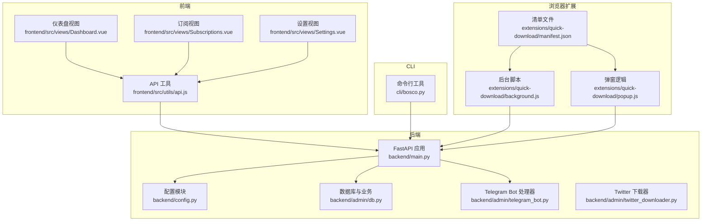
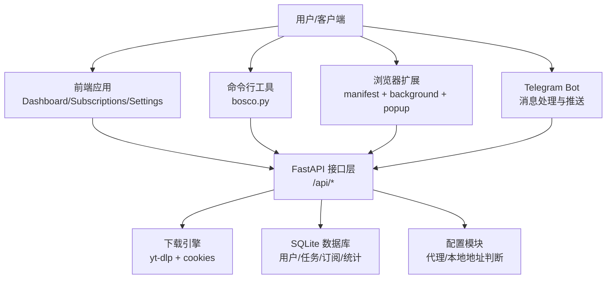
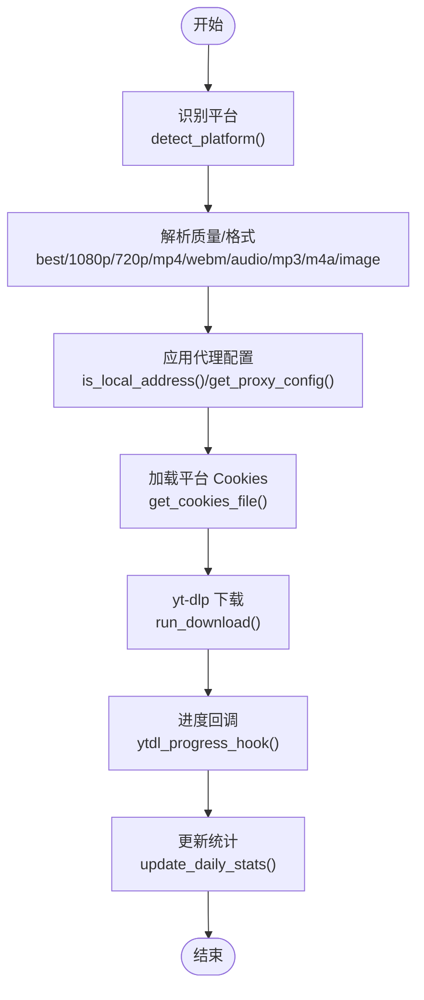
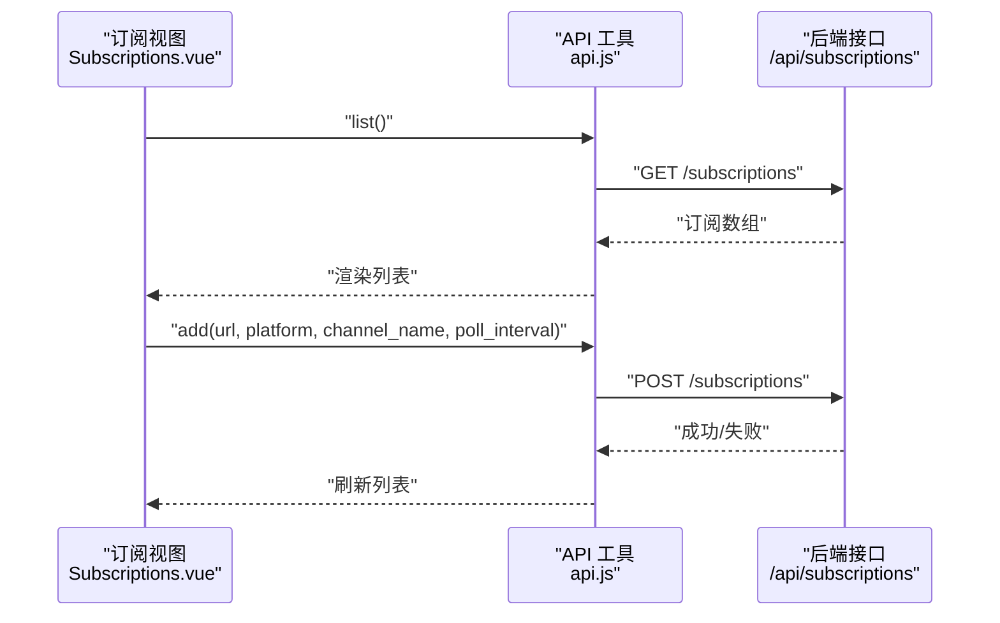
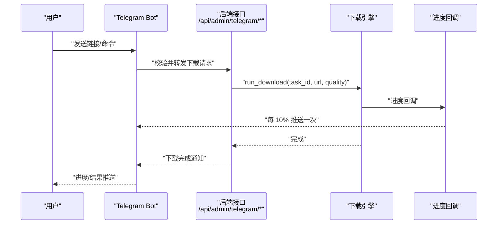
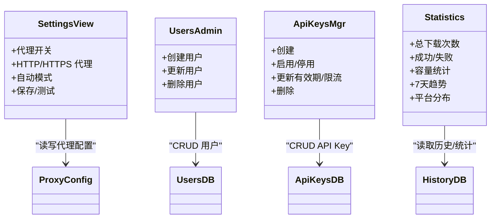
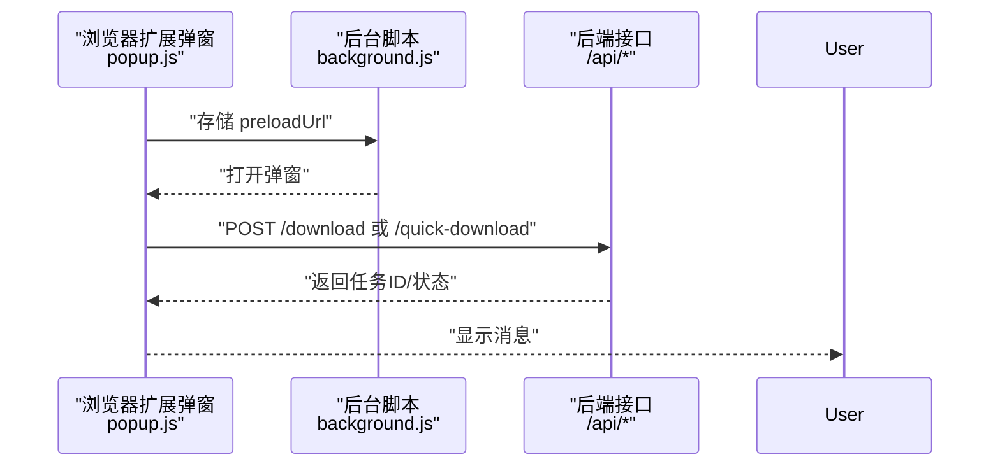
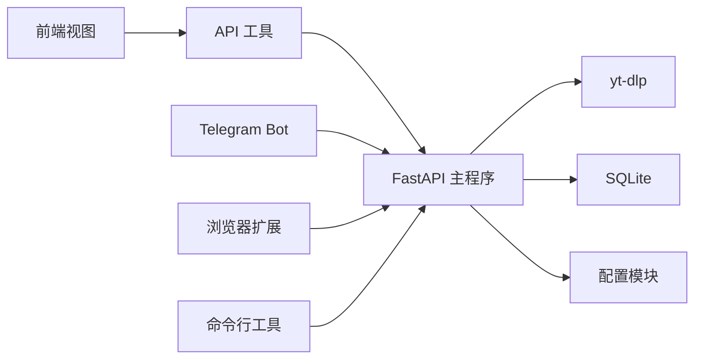

# 核心功能

<cite>
**本文引用的文件**
- [backend/main.py](file://backend/main.py)
- [backend/config.py](file://backend/config.py)
- [backend/admin/db.py](file://backend/admin/db.py)
- [backend/admin/telegram_bot.py](file://backend/admin/telegram_bot.py)
- [backend/admin/twitter_downloader.py](file://backend/admin/twitter_downloader.py)
- [frontend/src/utils/api.js](file://frontend/src/utils/api.js)
- [frontend/src/views/Dashboard.vue](file://frontend/src/views/Dashboard.vue)
- [frontend/src/views/Subscriptions.vue](file://frontend/src/views/Subscriptions.vue)
- [frontend/src/views/Settings.vue](file://frontend/src/views/Settings.vue)
- [cli/bosco.py](file://cli/bosco.py)
- [extensions/quick-download/manifest.json](file://extensions/quick-download/manifest.json)
- [extensions/quick-download/background.js](file://extensions/quick-download/background.js)
- [extensions/quick-download/popup.js](file://extensions/quick-download/popup.js)
- [QUICK_REFERENCE.md](file://QUICK_REFERENCE.md)
- [USAGE_MANUAL.md](file://USAGE_MANUAL.md)
</cite>

## 目录
1. [简介](#简介)
2. [项目结构](#项目结构)
3. [核心组件](#核心组件)
4. [架构总览](#架构总览)
5. [详细组件分析](#详细组件分析)
6. [依赖分析](#依赖分析)
7. [性能考虑](#性能考虑)
8. [故障排查指南](#故障排查指南)
9. [结论](#结论)
10. [附录](#附录)

## 简介
本文件面向 BoscoTsang 的使用者与维护者，系统性梳理其核心功能与实现要点，覆盖以下方面：
- 多平台下载能力：视频、音频、图片的下载与提取（YouTube、Bilibili、抖音、快手、Twitter/X、Instagram、QQ音乐、网易云音乐、Apple Music 等）
- 订阅管理系统：自动监控与下载机制
- Telegram 生态集成：账号登录、Bot 下载与实时进度推送
- 系统管理：用户管理、API Key 管理、代理设置、下载历史统计
- 浏览器扩展与命令行工具：快速下载与运维辅助

## 项目结构
系统采用前后端分离架构，后端基于 FastAPI，前端为 Vue 单页应用，CLI 与浏览器扩展作为外部接入点。

**图表来源**
- [backend/main.py:133-138](file://backend/main.py#L133-L138)
- [backend/config.py:29-34](file://backend/config.py#L29-L34)
- [backend/admin/db.py:29-200](file://backend/admin/db.py#L29-L200)
- [backend/admin/telegram_bot.py:43-382](file://backend/admin/telegram_bot.py#L43-L382)
- [frontend/src/utils/api.js:15-35](file://frontend/src/utils/api.js#L15-L35)
- [frontend/src/views/Dashboard.vue:1-599](file://frontend/src/views/Dashboard.vue#L1-L599)
- [frontend/src/views/Subscriptions.vue:143-233](file://frontend/src/views/Subscriptions.vue#L143-L233)
- [frontend/src/views/Settings.vue:332-859](file://frontend/src/views/Settings.vue#L332-L859)
- [cli/bosco.py:17-331](file://cli/bosco.py#L17-L331)
- [extensions/quick-download/manifest.json:1-23](file://extensions/quick-download/manifest.json#L1-L23)
- [extensions/quick-download/background.js:1-26](file://extensions/quick-download/background.js#L1-L26)
- [extensions/quick-download/popup.js:1-213](file://extensions/quick-download/popup.js#L1-L213)

**章节来源**
- [backend/main.py:133-138](file://backend/main.py#L133-L138)
- [backend/config.py:29-34](file://backend/config.py#L29-L34)
- [frontend/src/utils/api.js:15-35](file://frontend/src/utils/api.js#L15-L35)
- [cli/bosco.py:17-331](file://cli/bosco.py#L17-L331)
- [extensions/quick-download/manifest.json:1-23](file://extensions/quick-download/manifest.json#L1-L23)

## 核心组件
- 下载引擎与路由
  - 平台识别与下载流程由后端统一调度，支持多种质量与格式（音频、MP3、M4A、视频 1080p/720p、MP4/WebM、图片等）
  - 进度回调与统计更新在下载过程中实时进行
- 订阅管理
  - 订阅创建、轮询、状态切换与统计聚合，支持按平台过滤与间隔配置
- Telegram 集成
  - 登录、Bot 下载、进度推送与状态查询
- 系统管理
  - 用户管理、API Key 管理、代理设置、下载历史与统计
- 前端与扩展
  - 仪表盘、订阅、设置等视图；浏览器扩展提供右键菜单与弹窗快速下载；CLI 提供命令行运维能力

**章节来源**
- [backend/main.py:253-286](file://backend/main.py#L253-L286)
- [backend/main.py:667-732](file://backend/main.py#L667-L732)
- [frontend/src/views/Subscriptions.vue:143-233](file://frontend/src/views/Subscriptions.vue#L143-L233)
- [backend/admin/telegram_bot.py:43-382](file://backend/admin/telegram_bot.py#L43-L382)
- [frontend/src/views/Settings.vue:332-859](file://frontend/src/views/Settings.vue#L332-L859)
- [frontend/src/views/Dashboard.vue:1-599](file://frontend/src/views/Dashboard.vue#L1-L599)
- [extensions/quick-download/manifest.json:1-23](file://extensions/quick-download/manifest.json#L1-L23)

## 架构总览
后端以 FastAPI 为核心，统一暴露 REST 接口；前端通过 API 工具封装调用；CLI 与浏览器扩展作为外部客户端，分别满足命令行与浏览器场景的快速下载需求；Telegram Bot 作为生态外的自动化入口，负责接收消息、触发下载并推送进度。

**图表来源**
- [backend/main.py:133-138](file://backend/main.py#L133-L138)
- [backend/admin/db.py:29-200](file://backend/admin/db.py#L29-L200)
- [backend/config.py:100-135](file://backend/config.py#L100-L135)
- [frontend/src/utils/api.js:15-35](file://frontend/src/utils/api.js#L15-L35)
- [cli/bosco.py:17-331](file://cli/bosco.py#L17-L331)
- [extensions/quick-download/manifest.json:1-23](file://extensions/quick-download/manifest.json#L1-L23)

## 详细组件分析

### 多平台下载能力
- 平台识别与质量策略
  - 通过 URL 片段识别平台（YouTube、Bilibili、抖音、快手、Twitter/X、Instagram、QQ音乐、网易云音乐、Apple Music 等）
  - 质量与格式策略：最佳、1080p、720p、MP4/WebM、仅音频、MP3、M4A、图片（JPG/PNG）
- 下载执行与进度
  - 使用 yt-dlp 执行下载，进度通过回调写入全局状态并持久化到任务表
  - 根据代理配置动态决定直连或走代理，支持自动模式按域名/网段判断
- Cookies 管理
  - 按平台映射 cookies 文件，用于需要登录态的站点（如 Twitter/X）

**图表来源**
- [backend/main.py:253-286](file://backend/main.py#L253-L286)
- [backend/main.py:667-732](file://backend/main.py#L667-L732)
- [backend/main.py:733-800](file://backend/main.py#L733-L800)
- [backend/config.py:49-97](file://backend/config.py#L49-L97)
- [backend/config.py:100-135](file://backend/config.py#L100-L135)
- [backend/main.py:288-321](file://backend/main.py#L288-L321)

**章节来源**
- [backend/main.py:253-286](file://backend/main.py#L253-L286)
- [backend/main.py:667-732](file://backend/main.py#L667-L732)
- [backend/main.py:733-800](file://backend/main.py#L733-L800)
- [backend/config.py:49-97](file://backend/config.py#L49-L97)
- [backend/config.py:100-135](file://backend/config.py#L100-L135)
- [backend/main.py:288-321](file://backend/main.py#L288-L321)

### 订阅管理系统
- 功能概览
  - 支持添加订阅（频道 URL、平台、轮询间隔）、暂停/恢复、删除
  - 订阅列表支持按平台过滤与搜索，展示最近检查时间、已下载数量与状态
- 后端支撑
  - 订阅表结构、增删改查与统计字段（轮询间隔、上次检查、状态、总数）
  - 前端通过 API 工具发起请求，后端返回订阅集合

**图表来源**
- [frontend/src/views/Subscriptions.vue:143-233](file://frontend/src/views/Subscriptions.vue#L143-L233)
- [frontend/src/utils/api.js:150-168](file://frontend/src/utils/api.js#L150-L168)
- [backend/admin/db.py:91-107](file://backend/admin/db.py#L91-L107)

**章节来源**
- [frontend/src/views/Subscriptions.vue:143-233](file://frontend/src/views/Subscriptions.vue#L143-L233)
- [frontend/src/utils/api.js:150-168](file://frontend/src/utils/api.js#L150-L168)
- [backend/admin/db.py:91-107](file://backend/admin/db.py#L91-L107)

### Telegram 生态集成
- 登录与绑定
  - 前端通过设置中的 Bot Username 展示登录入口；后端校验 Telegram 数据合法性与时间戳
  - 未绑定用户可直接绑定系统账号，生成 JWT 返回
- Bot 下载与进度推送
  - Bot 监听消息，识别命令与链接，触发下载任务并将进度以消息形式推送
  - 下载完成后通知文件位置与任务标识

**图表来源**
- [backend/main.py:417-497](file://backend/main.py#L417-L497)
- [backend/main.py:499-531](file://backend/main.py#L499-L531)
- [backend/admin/telegram_bot.py:238-368](file://backend/admin/telegram_bot.py#L238-L368)

**章节来源**
- [backend/main.py:417-497](file://backend/main.py#L417-L497)
- [backend/main.py:499-531](file://backend/main.py#L499-L531)
- [backend/admin/telegram_bot.py:238-368](file://backend/admin/telegram_bot.py#L238-L368)

### 系统管理功能
- 用户管理
  - 管理员可创建/更新/删除用户，支持角色与激活状态变更
- API Key 管理
  - 支持创建、启用/停用、更新有效期与限流、删除；按用户维度隔离
- 代理设置
  - 支持代理开关、HTTP/HTTPS 地址、自动模式（按域名/网段直连）
- 下载历史与统计
  - 历史记录查询、清空与删除；系统资源与内容类型统计，支持 7 天趋势与平台分布

**图表来源**
- [frontend/src/views/Settings.vue:332-859](file://frontend/src/views/Settings.vue#L332-L859)
- [frontend/src/views/Dashboard.vue:44-177](file://frontend/src/views/Dashboard.vue#L44-L177)
- [backend/admin/db.py:34-181](file://backend/admin/db.py#L34-L181)

**章节来源**
- [frontend/src/views/Settings.vue:332-859](file://frontend/src/views/Settings.vue#L332-L859)
- [frontend/src/views/Dashboard.vue:44-177](file://frontend/src/views/Dashboard.vue#L44-L177)
- [backend/admin/db.py:34-181](file://backend/admin/db.py#L34-L181)

### 浏览器扩展与命令行工具
- 浏览器扩展
  - 右键菜单“快速下载当前页面/链接”，弹窗预填 URL，支持保存服务地址与 API Key，点击后向后端发起下载请求
- 命令行工具
  - 支持登录、查看当前用户、提交下载、列出下载/历史/订阅、查看统计与日志

**图表来源**
- [extensions/quick-download/background.js:1-26](file://extensions/quick-download/background.js#L1-L26)
- [extensions/quick-download/popup.js:1-213](file://extensions/quick-download/popup.js#L1-L213)
- [frontend/src/utils/api.js:67-91](file://frontend/src/utils/api.js#L67-L91)

**章节来源**
- [extensions/quick-download/background.js:1-26](file://extensions/quick-download/background.js#L1-L26)
- [extensions/quick-download/popup.js:1-213](file://extensions/quick-download/popup.js#L1-L213)
- [frontend/src/utils/api.js:67-91](file://frontend/src/utils/api.js#L67-L91)
- [cli/bosco.py:17-331](file://cli/bosco.py#L17-L331)

## 依赖分析
- 组件耦合
  - 前端通过统一 API 工具访问后端接口，降低各视图对具体路由的耦合
  - Telegram Bot 与后端通过消息与任务接口解耦，便于扩展其他生态入口
- 外部依赖
  - yt-dlp 作为下载核心；SQLite 存储用户、任务、订阅、统计与设置
  - httpx 用于 Bot 与 Telegram API 通信

**图表来源**
- [frontend/src/utils/api.js:15-35](file://frontend/src/utils/api.js#L15-L35)
- [backend/main.py:133-138](file://backend/main.py#L133-L138)
- [backend/admin/telegram_bot.py:370-382](file://backend/admin/telegram_bot.py#L370-L382)

**章节来源**
- [frontend/src/utils/api.js:15-35](file://frontend/src/utils/api.js#L15-L35)
- [backend/main.py:133-138](file://backend/main.py#L133-L138)
- [backend/admin/telegram_bot.py:370-382](file://backend/admin/telegram_bot.py#L370-L382)

## 性能考虑
- 并发与资源
  - 建议限制并发下载数，避免带宽与磁盘 IO 抖动
  - 定期清理旧文件与日志，保障磁盘空间
- 代理与网络
  - 自动模式下按域名/网段直连，减少不必要的代理开销
  - 代理测试与连通性验证，避免无效代理导致失败重试
- 前端体验
  - 30 秒定时刷新统计，避免频繁拉取造成压力

**章节来源**
- [frontend/src/views/Dashboard.vue:297-309](file://frontend/src/views/Dashboard.vue#L297-L309)
- [backend/config.py:49-97](file://backend/config.py#L49-L97)
- [frontend/src/views/Settings.vue:847-859](file://frontend/src/views/Settings.vue#L847-L859)

## 故障排查指南
- 下载失败
  - 检查链接有效性、Cookies 是否过期、磁盘空间与网络连通性
  - 查看应用日志定位错误
- Telegram Bot 无响应
  - 校验 Bot Token、登录开关、用户绑定状态与网络
- 代理问题
  - 使用“连接测试”确认代理可达；必要时切换为直连或调整自动模式规则
- 数据与备份
  - 使用打包脚本备份 downloads/data/cookies/logs；恢复时按目录结构还原

**章节来源**
- [QUICK_REFERENCE.md:142-179](file://QUICK_REFERENCE.md#L142-L179)
- [USAGE_MANUAL.md:378-443](file://USAGE_MANUAL.md#L378-L443)
- [frontend/src/views/Settings.vue:847-859](file://frontend/src/views/Settings.vue#L847-L859)

## 结论
BoscoTsang 通过统一的后端接口与丰富的前端/扩展/CLI 入口，实现了跨平台、可订阅、可生态集成的下载体系。其模块化设计便于扩展更多平台与生态入口，同时提供完善的系统管理与可观测性能力，适合个人与团队长期使用与演进。

## 附录
- 快速参考与部署
  - 一键部署、默认账号、常用命令与目录结构
- 平台支持与配置
  - 平台支持矩阵、Cookies 获取与配置、Bot 与代理设置要点

**章节来源**
- [QUICK_REFERENCE.md:1-221](file://QUICK_REFERENCE.md#L1-L221)
- [USAGE_MANUAL.md:15-545](file://USAGE_MANUAL.md#L15-L545)