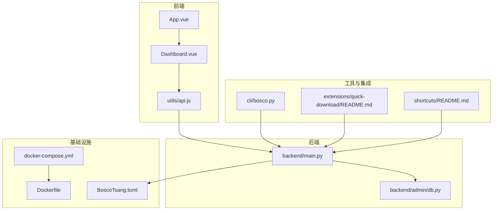
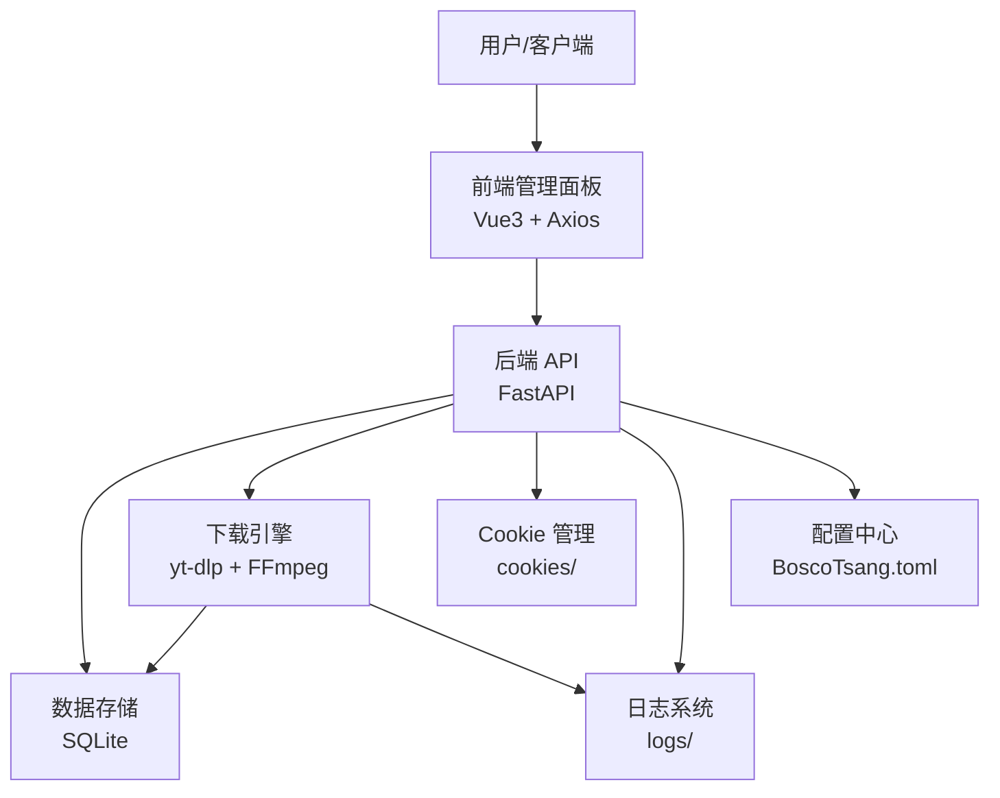
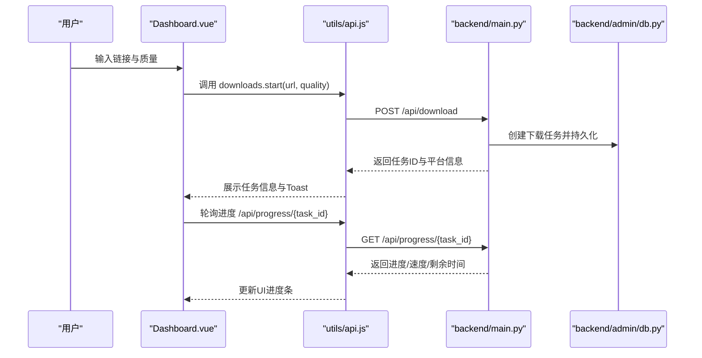
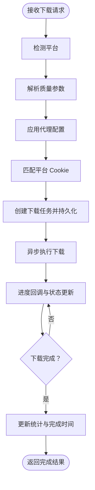
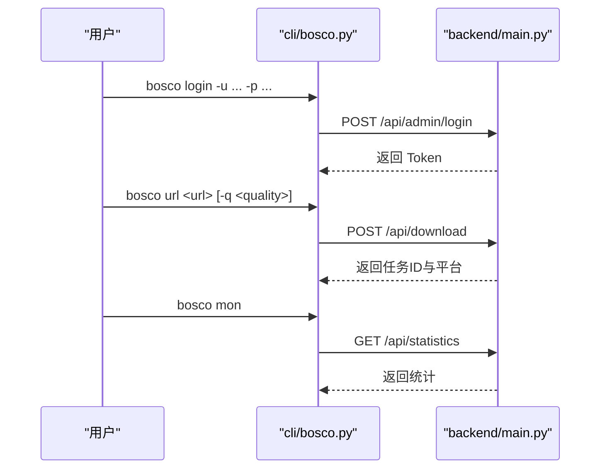
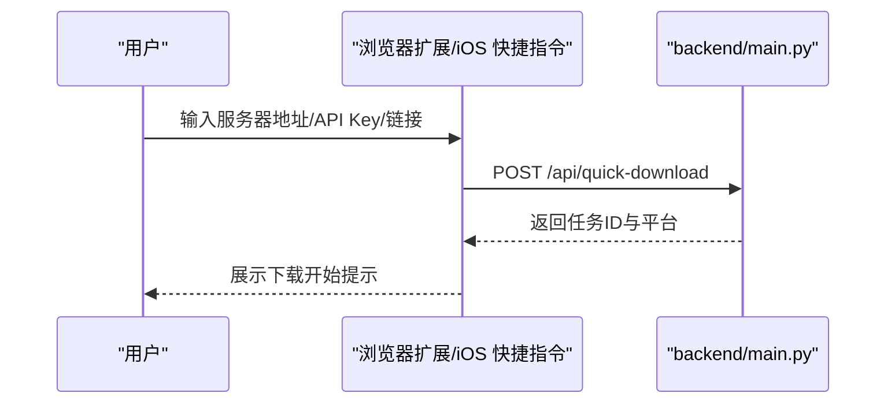
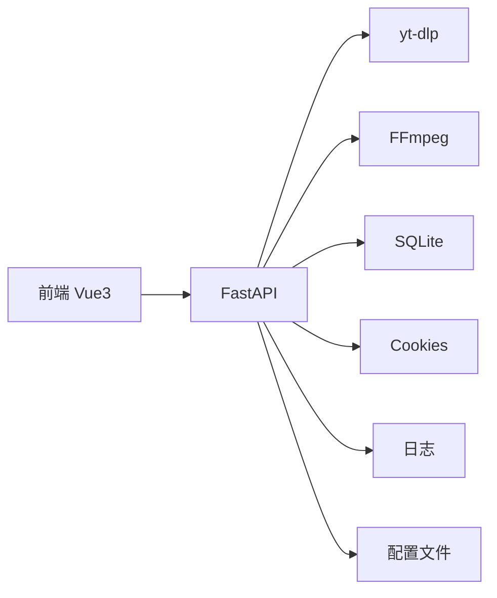

# 项目介绍

<cite>
**本文引用的文件**
- [README.md](file://README.md)
- [backend/main.py](file://backend/main.py)
- [backend/admin/db.py](file://backend/admin/db.py)
- [frontend/src/App.vue](file://frontend/src/App.vue)
- [frontend/src/views/Dashboard.vue](file://frontend/src/views/Dashboard.vue)
- [frontend/src/utils/api.js](file://frontend/src/utils/api.js)
- [cli/bosco.py](file://cli/bosco.py)
- [extensions/quick-download/README.md](file://extensions/quick-download/README.md)
- [shortcuts/README.md](file://shortcuts/README.md)
- [docker-compose.yml](file://docker-compose.yml)
- [Dockerfile](file://Dockerfile)
- [BoscoTsang.toml](file://BoscoTsang.toml)
- [USAGE_MANUAL.md](file://USAGE_MANUAL.md)
- [docs/SYSTEM_ANALYSIS.md](file://docs/SYSTEM_ANALYSIS.md)
- [docs/DEPLOYMENT.md](file://docs/DEPLOYMENT.md)
</cite>

## 目录
1. [简介](#简介)
2. [项目结构](#项目结构)
3. [核心组件](#核心组件)
4. [架构总览](#架构总览)
5. [详细组件分析](#详细组件分析)
6. [依赖关系分析](#依赖关系分析)
7. [性能考量](#性能考量)
8. [故障排查指南](#故障排查指南)
9. [结论](#结论)
10. [附录](#附录)

## 简介
BoscoTsang 是一个基于 Docker 的全平台视频/音乐/图片下载系统，集成了 Vue3 前端管理面板、FastAPI 后端服务与 yt-dlp 下载引擎，提供统一的 Web 管理界面、命令行工具、浏览器扩展与 iOS 快捷指令集成，支持 3000+ 平台的资源下载，并具备订阅管理、代理配置、用户权限、API Key 与下载统计等功能。

- 核心价值主张
  - 一站式多平台下载：覆盖主流视频、音乐、图片平台，支持高质量与格式定制。
  - 低门槛使用：Web 管理界面与命令行工具双入口，适合不同用户群体。
  - 可观测与可治理：完整的下载历史、统计报表、日志与系统资源监控。
  - 易部署与可扩展：Docker 一键部署，支持代理、Cookie、订阅等灵活配置。

- 主要应用场景
  - 内容创作者素材采集与归档
  - 个人/家庭离线观看与备份
  - 小团队批量下载与分发
  - 私有化部署于 NAS/服务器，保障数据安全

- 目标用户群体
  - 需要批量下载多平台内容的个人与团队
  - 对数据隐私与本地化部署有要求的用户
  - 希望通过 Web/CLI/快捷指令等方式简化下载流程的用户

- 解决的问题
  - 多平台下载分散、流程繁琐
  - 缺乏统一的任务管理与进度跟踪
  - 高清/原始内容下载需要平台 Cookie 的复杂配置
  - 订阅更新与自动化下载缺失

- 开源协议与社区
  - 协议：MIT
  - 社区：欢迎提交 Issue、Bug 报告与 Pull Request；提供 GitHub Issues 与 Discussions 通道

- 与其他工具的对比优势
  - 一体化体验：Web 管理 + 下载引擎 + 订阅 + 统计，减少切换成本
  - 本地化部署：数据不出域，便于合规与隐私保护
  - 多入口集成：CLI、浏览器扩展、iOS 快捷指令，满足不同使用习惯
  - 可观测性：实时进度、历史与统计，便于运营与运维

**章节来源**
- [README.md:13-47](file://README.md#L13-L47)
- [docs/SYSTEM_ANALYSIS.md:1-384](file://docs/SYSTEM_ANALYSIS.md#L1-L384)

## 项目结构
项目采用前后端分离与容器化部署的组织方式，核心目录与职责如下：
- backend：FastAPI 后端服务，提供 REST API、认证、下载调度、数据库与配置管理
- frontend：Vue3 单页应用，提供仪表盘、下载、历史、订阅、设置、日志等视图
- cli：命令行工具，支持登录、下载、历史、订阅、统计、日志查看
- extensions/quick-download：Chrome/Edge 浏览器扩展示例，支持快速下载
- shortcuts：iOS 快捷指令集成，支持从任意 App 分享下载
- releases/docs/scripts：发布、部署、脚本与文档维护
- docker-compose.yml 与 Dockerfile：容器化构建与运行配置

**图表来源**
- [frontend/src/App.vue:1-7](file://frontend/src/App.vue#L1-L7)
- [frontend/src/views/Dashboard.vue:1-599](file://frontend/src/views/Dashboard.vue#L1-L599)
- [frontend/src/utils/api.js:1-274](file://frontend/src/utils/api.js#L1-L274)
- [backend/main.py:1-800](file://backend/main.py#L1-L800)
- [backend/admin/db.py:1-200](file://backend/admin/db.py#L1-L200)
- [cli/bosco.py:1-331](file://cli/bosco.py#L1-L331)
- [extensions/quick-download/README.md:1-50](file://extensions/quick-download/README.md#L1-L50)
- [shortcuts/README.md:1-85](file://shortcuts/README.md#L1-L85)
- [docker-compose.yml:1-60](file://docker-compose.yml#L1-L60)
- [Dockerfile:1-74](file://Dockerfile#L1-L74)
- [BoscoTsang.toml:1-28](file://BoscoTsang.toml#L1-L28)

**章节来源**
- [README.md:48-65](file://README.md#L48-L65)
- [docker-compose.yml:9-60](file://docker-compose.yml#L9-L60)
- [Dockerfile:6-74](file://Dockerfile#L6-L74)

## 核心组件
- 前端管理面板（Vue3）
  - 提供仪表盘、下载、历史、订阅、设置、日志等视图
  - 通过 utils/api.js 统一调用后端 API，内置鉴权与错误处理
- 后端服务（FastAPI）
  - 提供认证、下载、历史、订阅、统计、设置、日志等接口
  - 集成 SQLite 数据库与 yt-dlp 下载引擎，支持代理与 Cookie 配置
- 命令行工具（CLI）
  - 支持登录、下载、历史、订阅、统计、日志查看等常用操作
- 浏览器扩展与 iOS 快捷指令
  - 提供快速下载入口，支持 API Key 调用后端接口
- 配置与部署
  - Dockerfile 与 docker-compose.yml 实现一键构建与运行
  - BoscoTsang.toml 提供代理与日志等运行时配置

**章节来源**
- [frontend/src/views/Dashboard.vue:1-599](file://frontend/src/views/Dashboard.vue#L1-L599)
- [frontend/src/utils/api.js:1-274](file://frontend/src/utils/api.js#L1-L274)
- [backend/main.py:133-800](file://backend/main.py#L133-L800)
- [cli/bosco.py:1-331](file://cli/bosco.py#L1-L331)
- [extensions/quick-download/README.md:1-50](file://extensions/quick-download/README.md#L1-L50)
- [shortcuts/README.md:1-85](file://shortcuts/README.md#L1-L85)
- [docker-compose.yml:1-60](file://docker-compose.yml#L1-L60)
- [Dockerfile:1-74](file://Dockerfile#L1-L74)
- [BoscoTsang.toml:1-28](file://BoscoTsang.toml#L1-L28)

## 架构总览
系统采用“前端 Web + 后端 API + 下载引擎 + 数据存储”的分层架构，核心交互如下：

**图表来源**
- [docs/SYSTEM_ANALYSIS.md:23-108](file://docs/SYSTEM_ANALYSIS.md#L23-L108)
- [backend/main.py:667-800](file://backend/main.py#L667-L800)
- [backend/admin/db.py:29-200](file://backend/admin/db.py#L29-L200)
- [BoscoTsang.toml:1-28](file://BoscoTsang.toml#L1-L28)

## 详细组件分析

### 前端组件分析（Vue3）
- 组成与职责
  - App.vue：路由出口，承载各页面视图
  - Dashboard.vue：仪表盘，提供快速下载、平台展示、统计与资源监控
  - utils/api.js：统一 API 调用、鉴权头注入、错误处理与路由拦截
- 数据流
  - 用户在 Dashboard.vue 输入链接与质量，调用 utils/api.js 的 downloads.start 或 downloads.quick
  - 后端返回任务信息，前端轮询进度并更新 UI
- 交互特点
  - 支持多质量选项与平台图标展示
  - 内置 Toast 提示与错误反馈

**图表来源**
- [frontend/src/views/Dashboard.vue:281-309](file://frontend/src/views/Dashboard.vue#L281-L309)
- [frontend/src/utils/api.js:67-91](file://frontend/src/utils/api.js#L67-L91)
- [backend/main.py:667-732](file://backend/main.py#L667-L732)
- [backend/admin/db.py:48-90](file://backend/admin/db.py#L48-L90)

**章节来源**
- [frontend/src/App.vue:1-7](file://frontend/src/App.vue#L1-L7)
- [frontend/src/views/Dashboard.vue:1-599](file://frontend/src/views/Dashboard.vue#L1-L599)
- [frontend/src/utils/api.js:1-274](file://frontend/src/utils/api.js#L1-L274)

### 后端组件分析（FastAPI）
- 核心模块
  - 认证与权限：登录、注册、密码修改、头像上传、管理员管理
  - 下载管理：创建任务、进度回调、完成统计、平台识别与 Cookie 适配
  - 订阅管理：频道订阅、轮询检查、自动下载
  - 设置与配置：代理、平台配置、系统设置
  - 日志与统计：运行日志、下载统计、趋势分析
- 数据模型与持久化
  - users、download_tasks、download_history、subscriptions、api_keys、statistics、settings、telegram_users 等表
- 下载流程
  - 平台检测 → 选择质量与合并策略 → 应用代理与 Cookie → 异步执行下载 → 实时进度回传 → 完成统计更新

**图表来源**
- [backend/main.py:253-327](file://backend/main.py#L253-L327)
- [backend/main.py:667-732](file://backend/main.py#L667-L732)
- [backend/main.py:733-800](file://backend/main.py#L733-L800)
- [backend/admin/db.py:48-90](file://backend/admin/db.py#L48-L90)

**章节来源**
- [backend/main.py:133-800](file://backend/main.py#L133-L800)
- [backend/admin/db.py:1-200](file://backend/admin/db.py#L1-L200)

### CLI 组件分析（命令行工具）
- 功能概览
  - 登录/登出、查看当前用户、下载任务列表、历史记录、订阅管理、统计查看、日志查看
- 使用场景
  - 自动化脚本、批处理下载、远程运维与审计

**图表来源**
- [cli/bosco.py:43-100](file://cli/bosco.py#L43-L100)
- [cli/bosco.py:192-224](file://cli/bosco.py#L192-L224)
- [backend/main.py:667-732](file://backend/main.py#L667-L732)

**章节来源**
- [cli/bosco.py:1-331](file://cli/bosco.py#L1-L331)

### 浏览器扩展与 iOS 快捷指令
- 浏览器扩展
  - 支持在扩展弹窗中输入服务器地址、API Key 与下载链接，调用 /api/quick-download 接口
  - 支持右键菜单快速下载当前页面或链接
- iOS 快捷指令
  - 通过分享菜单触发下载，支持修改质量与平台
  - 首次使用需在后台生成 API Key 并配置服务器地址

**图表来源**
- [extensions/quick-download/README.md:26-50](file://extensions/quick-download/README.md#L26-L50)
- [shortcuts/README.md:28-85](file://shortcuts/README.md#L28-L85)
- [backend/main.py:667-732](file://backend/main.py#L667-L732)

**章节来源**
- [extensions/quick-download/README.md:1-50](file://extensions/quick-download/README.md#L1-L50)
- [shortcuts/README.md:1-85](file://shortcuts/README.md#L1-L85)

## 依赖关系分析
- 技术栈与依赖
  - 前端：Vue3、Vue Router、Chart.js、Axios、Vite
  - 后端：FastAPI、uvicorn、yt-dlp、psutil、python-multipart、tomli、httpx、markdown
  - 基础设施：Docker、Docker Compose、FFmpeg
- 外部依赖与集成
  - yt-dlp：下载引擎，支持 3000+ 平台
  - FFmpeg：音视频格式转换与后处理
  - SQLite：轻量级关系型数据库
  - CORS：跨域支持，便于浏览器扩展与快捷指令调用

**图表来源**
- [docs/SYSTEM_ANALYSIS.md:51-79](file://docs/SYSTEM_ANALYSIS.md#L51-L79)
- [Dockerfile:20-40](file://Dockerfile#L20-L40)
- [backend/main.py:12-28](file://backend/main.py#L12-L28)

**章节来源**
- [docs/SYSTEM_ANALYSIS.md:1-384](file://docs/SYSTEM_ANALYSIS.md#L1-L384)
- [Dockerfile:1-74](file://Dockerfile#L1-L74)

## 性能考量
- 下载并发与资源利用
  - 当前为单任务串行下载，建议后续引入线程池实现多任务并发，提升吞吐
- 缓存与索引
  - 订阅检查与平台信息可引入缓存，减少重复请求
  - 数据库定期清理历史记录与索引优化，降低查询开销
- 前端优化
  - 路由懒加载与组件按需引入，缩短首屏加载时间
- 部署建议
  - 最小部署：1核 CPU、1GB RAM、10GB+ 存储
  - 推荐部署：2核 CPU、4GB RAM、100GB+ 存储
  - 企业部署：4核 CPU、8GB RAM、500GB+ SSD

**章节来源**
- [docs/SYSTEM_ANALYSIS.md:326-343](file://docs/SYSTEM_ANALYSIS.md#L326-L343)

## 故障排查指南
- 下载失败需登录
  - 配置对应平台的 Netscape 格式 Cookies 文件至 cookies/ 目录
- 清晰度不足
  - 确认已登录平台账号并正确配置 Cookies
  - 通过质量参数选择更高分辨率或音频格式
- 群晖/极空间拉取镜像慢
  - 配置 Docker 镜像加速或手动修改 daemon.json
- 端口被占用
  - 修改 docker-compose.yml 中的端口映射
- 备份数据
  - 备份 downloads/、cookies/、data/、logs/ 目录

**章节来源**
- [docs/DEPLOYMENT.md:361-393](file://docs/DEPLOYMENT.md#L361-L393)

## 结论
BoscoTsang 通过“Web 管理 + 多入口集成 + 本地化部署 + 可观测性”的设计，显著简化了多平台内容下载流程，提升了用户体验与可治理能力。其基于 Docker 的部署方式降低了使用门槛，而丰富的扩展与快捷指令进一步增强了实用性。对于追求隐私与可控性的用户而言，BoscoTsang 提供了可靠且易于扩展的解决方案。

## 附录
- 快速开始与部署
  - Docker 一键部署与端口映射、持久化目录、代理配置
- 使用手册与系统分析
  - 功能详述、API 设计、平台支持、安全与性能建议

**章节来源**
- [USAGE_MANUAL.md:1-200](file://USAGE_MANUAL.md#L1-L200)
- [docs/SYSTEM_ANALYSIS.md:1-384](file://docs/SYSTEM_ANALYSIS.md#L1-L384)
- [docs/DEPLOYMENT.md:1-424](file://docs/DEPLOYMENT.md#L1-L424)