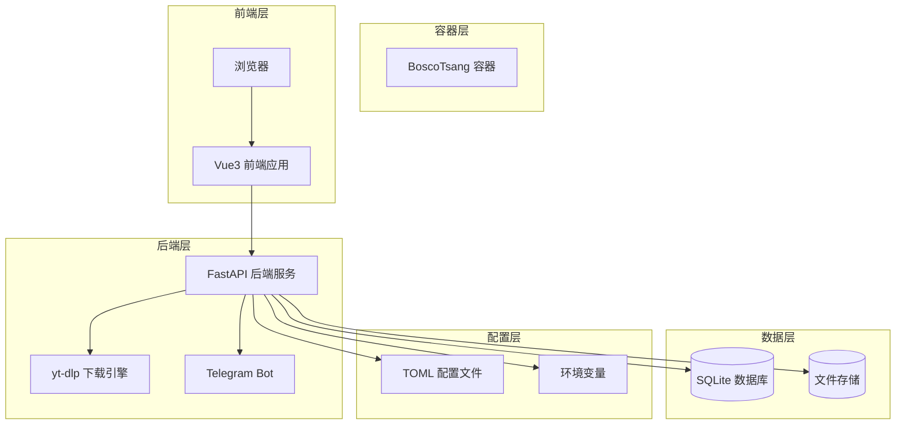
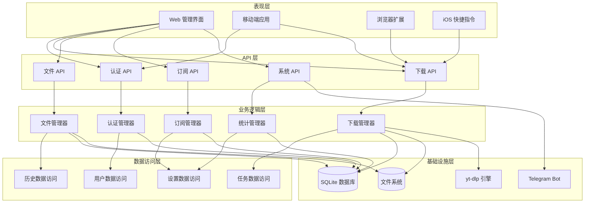
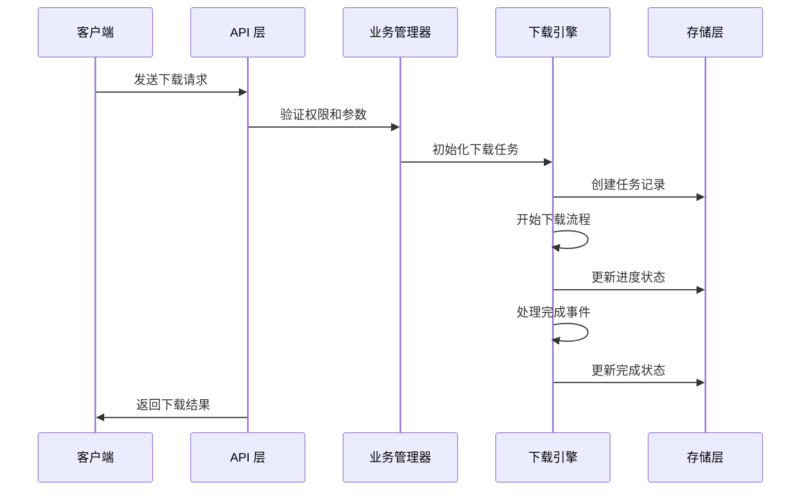
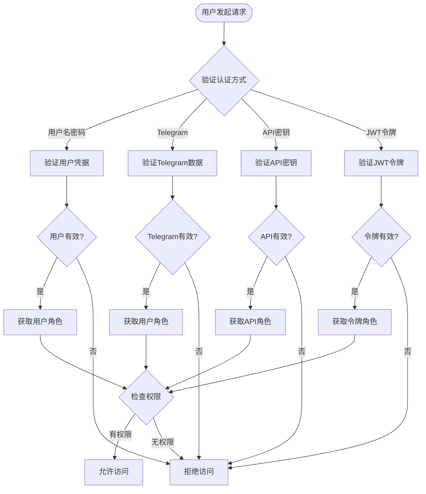
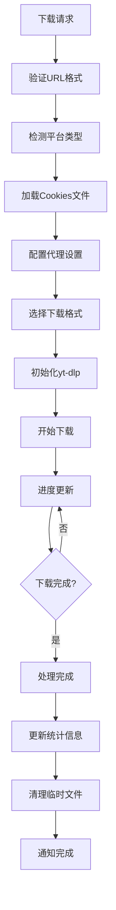
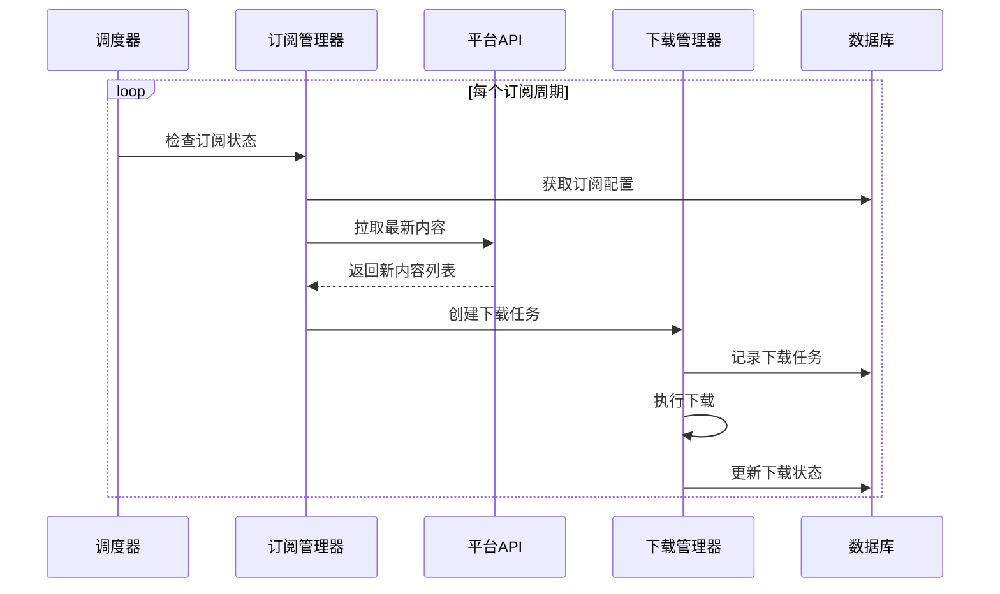
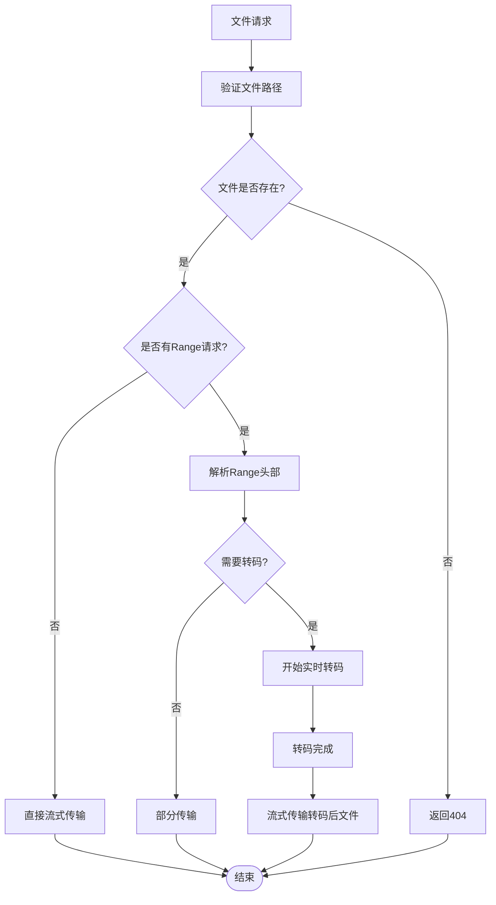
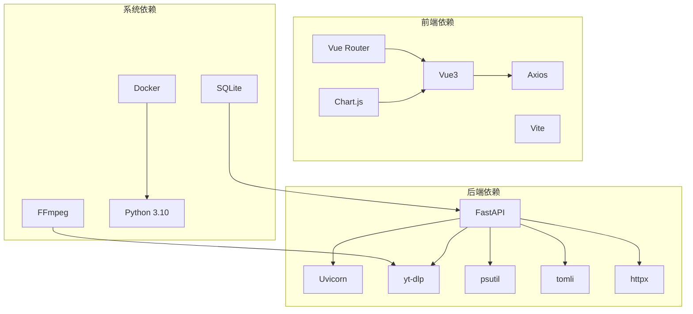

# 项目概述

<cite>
**本文档引用的文件**
- [backend/main.py](file://backend/main.py)
- [backend/config.py](file://backend/config.py)
- [backend/admin/db.py](file://backend/admin/db.py)
- [backend/admin/auth.py](file://backend/admin/auth.py)
- [frontend/src/main.js](file://frontend/src/main.js)
- [frontend/src/router.js](file://frontend/src/router.js)
- [frontend/src/App.vue](file://frontend/src/App.vue)
- [frontend/src/views/Dashboard.vue](file://frontend/src/views/Dashboard.vue)
- [frontend/package.json](file://frontend/package.json)
- [Dockerfile](file://Dockerfile)
- [docker-compose.yml](file://docker-compose.yml)
- [BoscoTsang.toml](file://BoscoTsang.toml)
- [USAGE_MANUAL.md](file://USAGE_MANUAL.md)
</cite>

## 目录
1. [引言](#引言)
2. [项目结构](#项目结构)
3. [核心组件](#核心组件)
4. [架构概览](#架构概览)
5. [详细组件分析](#详细组件分析)
6. [依赖分析](#依赖分析)
7. [性能考虑](#性能考虑)
8. [故障排除指南](#故障排除指南)
9. [结论](#结论)
10. [附录](#附录)

## 引言

BoscoTsang 是一个全平台视频/音乐/图片下载系统，旨在为用户提供统一的跨平台媒体资源下载解决方案。该系统集成了现代化的前端管理界面、高性能的后端服务和强大的下载引擎，支持3000+平台的资源下载。

### 项目背景与设计理念

该项目的设计理念是"一站式媒体下载解决方案"，通过以下核心特性满足不同用户的需求：

- **全平台支持**：覆盖YouTube、Bilibili、抖音、快手、Twitter/X等主流平台
- **多终端接入**：支持Web界面、浏览器插件、iOS快捷指令等多种使用方式
- **生态集成**：深度集成Telegram生态，提供Bot下载和登录功能
- **权限管理**：完善的用户权限体系，支持管理员和普通用户角色
- **订阅管理**：自动监控频道更新，实现批量下载
- **代理支持**：智能代理配置，适配复杂的网络环境

### 适用场景

- 个人媒体收藏和整理
- 内容创作者素材收集
- 教育资源批量下载
- 企业内部资料管理
- 跨平台媒体资源整合

## 项目结构

项目采用前后端分离的架构设计，通过Docker容器化部署，实现了高度的可移植性和易维护性。



**图表来源**
- [Dockerfile:1-74](file://Dockerfile#L1-L74)
- [docker-compose.yml:9-60](file://docker-compose.yml#L9-L60)

### 目录结构说明

项目采用清晰的分层组织结构：

- **backend/**：后端服务代码，包含FastAPI应用、数据库管理、认证模块
- **frontend/**：Vue3前端应用，提供Web管理界面
- **cli/**：命令行工具
- **extensions/**：浏览器扩展插件
- **shortcuts/**：iOS快捷指令配置
- **docs/**：项目文档
- **releases/**：版本发布相关文件

**章节来源**
- [Dockerfile:1-74](file://Dockerfile#L1-L74)
- [docker-compose.yml:1-60](file://docker-compose.yml#L1-L60)

## 核心组件

### 后端服务 (FastAPI)

后端服务基于FastAPI框架构建，提供了RESTful API接口，负责处理所有业务逻辑。

#### 主要功能模块

1. **认证授权模块**：支持多种认证方式，包括JWT令牌、API密钥等
2. **下载管理模块**：协调yt-dlp引擎进行实际的媒体下载
3. **订阅管理模块**：实现定时任务监控和自动下载
4. **文件管理模块**：提供文件浏览、下载、删除等功能
5. **系统设置模块**：管理代理配置、平台设置等

#### 数据模型设计

系统采用SQLite作为数据存储，主要数据表包括：

- 用户表：存储用户基本信息和权限
- 下载任务表：跟踪下载进度和状态
- 下载历史表：记录已完成的下载任务
- 订阅表：管理频道订阅和轮询配置
- API密钥表：存储API访问凭证
- 设置表：系统配置信息

**章节来源**
- [backend/admin/db.py:29-200](file://backend/admin/db.py#L29-L200)
- [backend/admin/auth.py:1-169](file://backend/admin/auth.py#L1-L169)

### 前端管理面板 (Vue3)

前端采用Vue3 + Vite构建，提供直观易用的Web管理界面。

#### 核心页面组件

1. **仪表板**：显示系统统计信息和快速下载入口
2. **下载管理**：查看和管理下载任务
3. **历史记录**：浏览已完成的下载历史
4. **订阅管理**：配置和管理频道订阅
5. **文件管理**：浏览和管理下载的文件
6. **系统设置**：配置系统参数和平台设置

#### 技术栈

- **Vue3**：现代JavaScript框架
- **Vue Router**：客户端路由管理
- **Chart.js**：数据可视化
- **Axios**：HTTP客户端
- **Vite**：构建工具

**章节来源**
- [frontend/src/main.js:1-7](file://frontend/src/main.js#L1-L7)
- [frontend/src/router.js:1-48](file://frontend/src/router.js#L1-L48)
- [frontend/package.json:1-23](file://frontend/package.json#L1-L23)

### 下载引擎 (yt-dlp)

系统集成了yt-dlp作为核心下载引擎，支持3000+平台的媒体资源下载。

#### 支持的平台类型

- **视频平台**：YouTube、Bilibili、抖音、TikTok等
- **音乐平台**：Apple Music、QQ音乐、网易云音乐等
- **社交平台**：Twitter/X、Instagram、微博等
- **图片平台**：小红书、微博图片等

#### 高级特性

- **质量选择**：支持多种分辨率和格式
- **批量下载**：支持播放列表和批量任务
- **进度跟踪**：实时显示下载进度和速度
- **错误恢复**：断点续传和自动重试机制

**章节来源**
- [backend/main.py:253-286](file://backend/main.py#L253-L286)
- [backend/main.py:733-981](file://backend/main.py#L733-L981)

## 架构概览

系统采用微服务化的架构设计，通过清晰的层次分离实现了高内聚低耦合。



**图表来源**
- [backend/main.py:133-138](file://backend/main.py#L133-L138)
- [backend/admin/db.py:15-21](file://backend/admin/db.py#L15-L21)

### 数据流处理

系统的数据流遵循标准的请求-处理-响应模式：



**图表来源**
- [backend/main.py:982-1008](file://backend/main.py#L982-L1008)
- [backend/main.py:669-732](file://backend/main.py#L669-L732)

## 详细组件分析

### 认证与授权系统

系统实现了多层次的安全认证机制，确保只有授权用户才能访问系统功能。

#### 认证方式

1. **传统用户名密码认证**：适用于Web界面登录
2. **Telegram 登录**：支持Telegram账号一键登录
3. **API 密钥认证**：为第三方集成提供安全访问
4. **JWT 令牌**：用于会话管理和状态保持

#### 权限控制

- **普通用户**：只能访问自己的数据和功能
- **管理员用户**：拥有完整的系统管理权限
- **API 密钥**：可配置特定的访问范围和限制



**图表来源**
- [backend/admin/auth.py:27-61](file://backend/admin/auth.py#L27-L61)
- [backend/admin/auth.py:110-139](file://backend/admin/auth.py#L110-L139)

**章节来源**
- [backend/admin/auth.py:1-169](file://backend/admin/auth.py#L1-L169)
- [backend/admin/db.py:34-46](file://backend/admin/db.py#L34-L46)

### 下载管理系统

下载管理是系统的核心功能，负责协调yt-dlp引擎完成各种平台的媒体下载。

#### 下载流程



**图表来源**
- [backend/main.py:733-981](file://backend/main.py#L733-L981)
- [backend/main.py:669-732](file://backend/main.py#L669-L732)

#### 平台特殊处理

不同平台具有不同的访问要求和限制，系统针对特定平台进行了优化：

- **Bilibili**：添加特殊Headers避免412错误
- **Twitter/X**：支持专用Cookies和质量设置
- **代理配置**：智能代理选择，支持自动模式

**章节来源**
- [backend/main.py:811-861](file://backend/main.py#L811-L861)
- [backend/main.py:841-854](file://backend/main.py#L841-L854)

### 订阅管理系统

系统提供了强大的订阅功能，可以自动监控指定频道的更新并进行批量下载。

#### 订阅工作流程



**图表来源**
- [backend/main.py:1371-1434](file://backend/main.py#L1371-L1434)

#### 订阅配置

- **轮询间隔**：可配置的检查频率
- **平台支持**：支持多种内容平台
- **过滤规则**：可设置内容筛选条件
- **自动下载**：新内容自动添加到下载队列

**章节来源**
- [backend/main.py:1389-1404](file://backend/main.py#L1389-L1404)

### 文件管理系统

系统提供了完整的文件管理功能，支持在线浏览、播放和下载。

#### 文件操作流程



**图表来源**
- [backend/main.py:1208-1326](file://backend/main.py#L1208-L1326)

**章节来源**
- [backend/main.py:1180-1370](file://backend/main.py#L1180-L1370)

## 依赖分析

系统采用了现代化的技术栈，各组件之间的依赖关系清晰明确。



**图表来源**
- [frontend/package.json:11-22](file://frontend/package.json#L11-L22)
- [Dockerfile:21-39](file://Dockerfile#L21-L39)

### 外部服务集成

系统集成了多个外部服务来增强功能：

- **Telegram API**：Bot通信和用户认证
- **YouTube API**：视频信息获取
- **各平台API**：内容平台的数据访问

**章节来源**
- [Dockerfile:24-26](file://Dockerfile#L24-L26)
- [backend/config.py:100-135](file://backend/config.py#L100-L135)

## 性能考虑

系统在设计时充分考虑了性能优化，采用了多种策略来提升用户体验。

### 并发处理

- **异步下载**：使用多线程处理并发下载任务
- **非阻塞I/O**：避免长时间阻塞请求处理
- **进度回调**：实时更新下载进度状态

### 资源管理

- **内存优化**：及时释放不再使用的资源
- **磁盘空间**：监控存储空间使用情况
- **网络带宽**：合理控制并发连接数

### 缓存策略

- **配置缓存**：减少重复的配置读取
- **统计缓存**：提高统计数据查询效率
- **文件元数据**：缓存常用文件信息

## 故障排除指南

### 常见问题诊断

#### 下载失败排查

1. **URL格式错误**：检查输入的链接格式是否正确
2. **平台限制**：某些平台可能需要Cookies或登录
3. **网络问题**：检查代理设置和网络连接
4. **格式不支持**：尝试选择不同的下载质量

#### 认证问题

1. **Token过期**：重新登录获取新的Token
2. **API密钥无效**：检查密钥是否正确配置
3. **权限不足**：确认用户角色和权限设置

#### 系统问题

1. **容器启动失败**：检查Docker配置和端口占用
2. **数据持久化**：确认卷挂载和权限设置
3. **日志分析**：查看应用日志定位问题

**章节来源**
- [backend/main.py:965-980](file://backend/main.py#L965-L980)
- [backend/main.py:454-461](file://backend/main.py#L454-L461)

## 结论

BoscoTsang是一个功能完整、架构清晰的全平台下载系统。通过前后端分离的设计、现代化的技术栈和完善的权限管理，为用户提供了便捷高效的媒体下载体验。

### 主要优势

- **功能全面**：支持3000+平台，满足多样化需求
- **易于使用**：直观的Web界面和多终端支持
- **安全可靠**：多层次认证和权限控制
- **可扩展性强**：模块化设计便于功能扩展
- **部署简单**：Docker化部署降低运维成本

### 发展方向

未来可以在以下方面进一步改进：

- **性能优化**：提升并发处理能力和资源利用率
- **功能扩展**：支持更多平台和格式
- **智能化**：引入AI技术优化下载策略
- **生态建设**：构建更丰富的第三方集成

## 附录

### 快速开始

```bash
# 克隆项目
git clone <repository-url>
cd BoscoTsang

# 启动服务
docker-compose up -d --build

# 访问系统
# 浏览器打开: http://localhost:8080
# 默认账号: admin / admin123
```

### 配置说明

系统支持通过BoscoTsang.toml文件进行配置，主要包括代理设置、下载目录和日志级别等。

**章节来源**
- [USAGE_MANUAL.md:32-54](file://USAGE_MANUAL.md#L32-L54)
- [BoscoTsang.toml:1-28](file://BoscoTsang.toml#L1-L28)